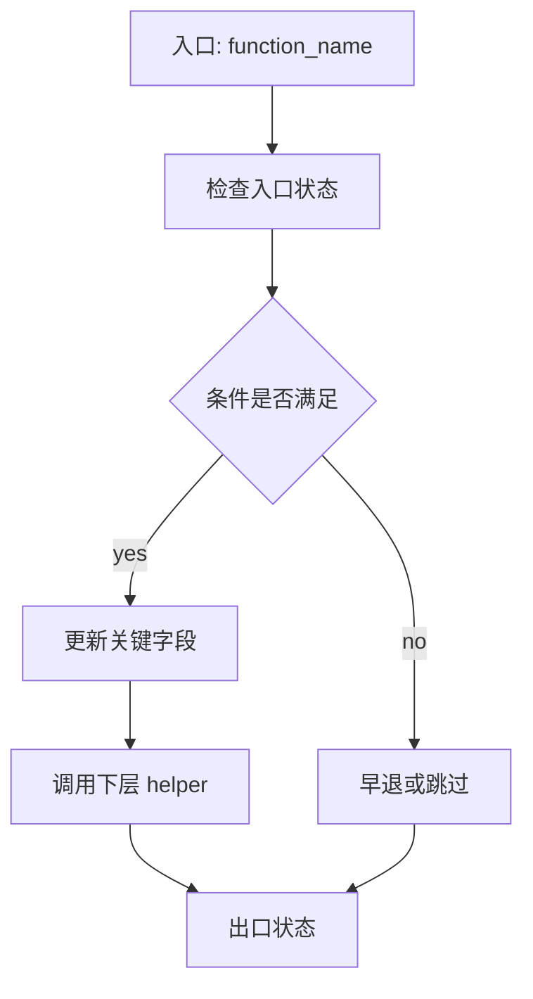
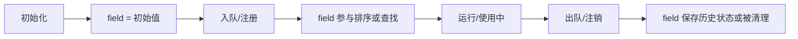
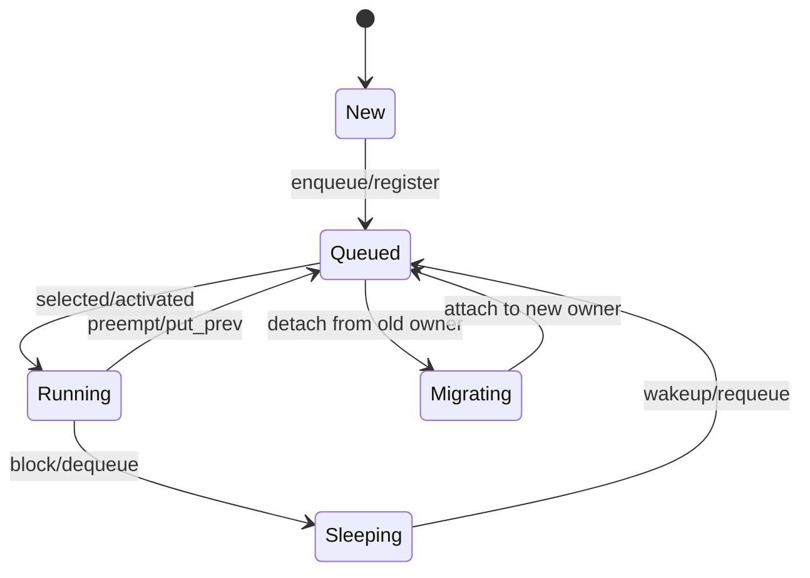
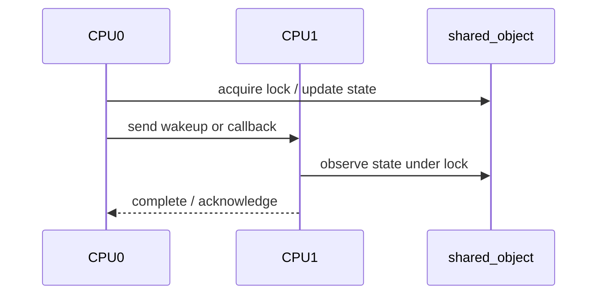

# Mermaid Examples

这些例子只用于帮助选择图类型和控制粒度。生成分析文档时必须替换成当前分析对象自己的函数、字段、状态和路径；不要把示例原样复用到无关对象。

## 什么时候画

优先画能减少理解成本的图：主路径分叉、状态迁移、字段生命周期、对象归属、跨 CPU/锁/唤醒交互。简单线性函数、单字段解释、已经能用 Step 2 ASCII 骨架清楚表达的内容，可以不画。

## 主执行路径 / 分支流程：`flowchart TD`

适合函数有多个阶段、早退、错误回滚或关键分支时使用。

## 字段生命周期 / 对象关系：`flowchart LR`

适合结构体分析，或字段在初始化、入队、运行、出队、释放阶段有不同含义时使用。

## 状态迁移：`stateDiagram-v2`

适合多个状态位共同决定对象生命周期时使用。

## 跨 CPU / 锁 / 唤醒交互：`sequenceDiagram`

适合展示两个以上参与者之间的锁顺序、跨 CPU 调用、唤醒通知、回调链。

## 粒度规则

- 8-18 个节点通常最合适。
- 节点名优先使用真实函数名/字段名，再加 2-6 个中文字说明。
- 图里只放主路径和关键分支；逐行细节、错误码、锁细节放正文解释。
- 图中每条调用边都必须来自 MCP 查询、源码阅读或用户提供代码；不确定的关系不要画。
