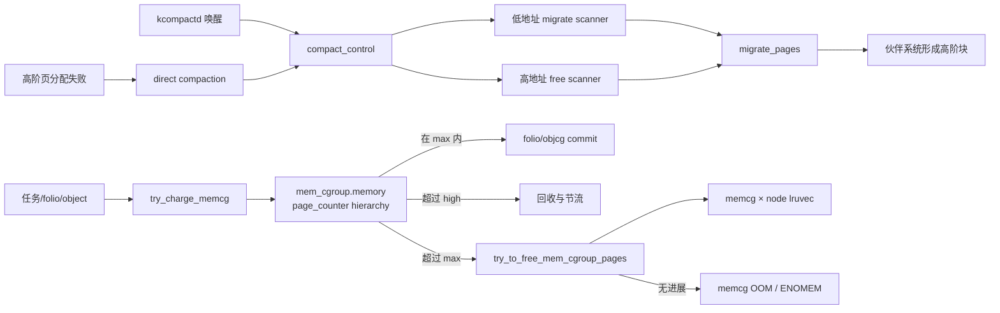

# `compact_control` 与 `mem_cgroup` 详解

> 源码位置：`mm/internal.h:823`、`include/linux/memcontrol.h:202`
> 关键实现：`mm/compaction.c`、`mm/memcontrol.c`、`mm/vmscan.c`、`kernel/cgroup/cgroup.c`
> 分析基线：kernel-graph MCP 的 Linux 7.2-rc6 索引
> 前者是一轮物理内存压缩的临时控制块，后者是一个内存控制组长期存在的层级资源账本。

## 一、大白话总览

### （a）为什么要设计它们？

内存管理有两个不同但会相互影响的问题：

- 空闲页总数可能不少，却散落在许多小块里，无法满足高阶连续页、THP 或 CMA 请求。内核必须搬走可移动页面，让空闲页合并——`compact_control` 记录一次“搬家整理”的目标、两个扫描器的位置和临时页面集合。
- 多个容器/服务共享整机内存，必须知道每一份匿名页、文件页、slab、socket 和 swap 应算给谁，并对层级执行 `min/low/high/max`——`mem_cgroup` 是这个租户的身份、账本、统计、回收域和生命周期节点。

没有 `compact_control`，压缩器无法协调“从低地址找待搬页”和“从高地址找空闲目的页”，也无法在同步、异步、后台、主动压缩和连续内存分配之间共享同一算法。没有 `mem_cgroup`，一个容器就能耗尽全机内存，内核也无法只回收或 OOM 某个租户。

### （b）如果让我自己设计，第一反应是什么？

#### 1. 一句话降级

压缩就是派两个工人从内存两端相向寻找“住户”和“空房”，把住户搬到高端空房；memcg 则给每个租户建分层账本，分配前先预扣，超额后只向这个租户催收。

#### 2. 最小模型

先忽略 NUMA、memcg v1、zswap、socket、writeback、MGLRU、并发和所有优化：

```text
物理 zone：
低地址                                                    高地址
migrate_pfn ──> [可移动页] ... [碎片空闲页] <── free_pfn
                       │ 搬迁到空闲目的页
                       ▼
                 连续空闲页块形成

内存租户：
task → mem_cgroup → page_counter {usage, high, max}
                         │
               charge 成功 / 定向回收 / memcg OOM
```

压缩的最小输入是 zone 和目标 order；核心状态是两个扫描 PFN、待迁移页和已隔离空闲页；出口是出现满足 order 的空闲块、扫描器相遇或遇到中断/竞争。memcg 的最小输入是归属和页数；核心状态是层级 usage 与限制；出口是 charge 成功、回收后重试或失败/OOM。

#### 3. 核心数据对象

| 对象 | 类比 | 角色 |
|---|---|---|
| `compact_control` | 搬家任务单 | 保存目标 order、扫描器位置、临时列表、模式和进度 |
| `zone` | 要整理的城区 | 提供 PFN 边界、伙伴系统空闲块和压缩缓存位置 |
| `migratepages/freepages` | 待搬住户/空房清单 | 前者交给迁移核心，后者作为目标页供应 |
| `mem_cgroup` | 租户总档案 | 嵌入 cgroup 身份，拥有层级计数、统计、事件和每节点回收域 |
| `page_counter` | 分层额度账本 | 同时维护 usage、min/low/high/max 与 parent 链 |
| `obj_cgroup` | 可延寿的对象归属标签 | slab 等对象活过 cgroup offline 后仍能正确 uncharge/reparent |
| `mem_cgroup_per_node::lruvec` | 租户在某节点的回收仓 | 让 memcg 定向回收只扫描本租户页面 |

#### 4. 真实复杂度从哪里来？

- 页面可能被锁定、脏、writeback、不可迁移或正在并发改变；异步压缩不能像同步压缩那样等待。
- 两个扫描器需要跳过不合适 pageblock，并缓存下次起点；过度跳过又可能永远无进展。
- 压缩有 direct、kcompactd、`compact_memory`、proactive 和 `alloc_contig_range` 等目标，完成条件不同。
- memcg 是层级账本：对子 cgroup charge 必须同时影响祖先，限制可能在任意祖先触发。
- `memory.high` 是节流/回收边界，`memory.max` 是硬边界，`memory.low/min` 又提供可回收保护。
- page、slab、socket、swap、zswap 和 writeback 的生命周期不同；有些对象会活过 cgroup 目录。
- 热路径 charge 不能每页都操作全局原子层级，因此有 per-CPU stock 和批量 charge。
- cgroup v1/v2 的 memory+swap 语义不同，结构体用 union 和条件字段兼容。

#### 5. 如果自己实现，大概步骤

1. 压缩入口按调用场景在栈上初始化 `compact_control`，固定 zone、order、GFP、迁移模式和跳过策略。
2. 初始化临时链表和计数，检查该 zone 是否值得压缩。
3. 低地址 migrate scanner 隔离可移动 folio，高地址 free scanner 隔离伙伴系统空闲页。
4. 调用通用迁移器，把源页内容、映射和引用切换到目标页；失败页放回原 LRU，剩余空闲页释放回伙伴系统。
5. 两扫描器相遇、目标高阶页已可分配、收到致命信号或竞争过重时结束；更新 zone 缓存起点和 vmstat。
6. 创建 memcg 时先分配长期对象、private ID、统计、每 CPU/每节点状态和 writeback/LRU 资源，再接到 parent `page_counter`。
7. 页面或对象分配时先从 stock 消费；不足则沿层级批量 charge。
8. 超过 max 时定向回收目标 memcg，清空 stock 后重试；仍失败则按 GFP 语义返回失败、memcg OOM 或强制 charge。
9. 超过 high 时先允许分配，但记录 overage，在返回用户态或 workqueue 中回收/节流。
10. offline 时先禁止新归属、解除保护、reparent objcg/writeback/LRU 状态并清 stock；所有延迟引用结束后才真正 free。

#### 6. 源码阅读 checklist

- 当前 `compact_control` 来自 direct、kcompactd、proactive 还是整 zone 压缩？
- `migrate_pfn` 和 `free_pfn` 正向还是反向移动，何时算相遇？
- 当前列表计数是否与真实链表同步，退出时是否全部放回/释放？
- `mode` 是否允许等待锁、writeback 或执行更重的迁移？
- skip hint 是被尊重、忽略，还是禁止写回新 hint？
- charge 命中的是当前 memcg 还是某个超限祖先？
- 当前处理的是 `memory.high` 软节流还是 `memory.max` 硬失败？
- 这次 charge 来自 page、slab object、socket 还是 swap？
- stock 批量余量、page counter 和 folio/objcg 归属是否一致？
- cgroup 已 offline 时，谁仍通过 private ID 或 objcg 保证旧对象可安全释放？

### （c）它们是怎么设计的？

`compact_control` 采用“一次调用一个栈上上下文”的设计：压缩算法本身共用 `compact_zone()`，入口只需改变控制字段。两个扫描器通过 PFN 和列表在这个对象里交接，不把某次任务策略永久写进 zone；zone 只缓存可复用的下次扫描位置。

`mem_cgroup` 则采用“cgroup 生命周期骨架 + page_counter 层级账本 + 每节点回收状态 + 可延寿对象 ID”的组合。热路径先批量预扣到 per-CPU stock，真正归属提交给 folio/objcg；慢路径才做定向回收、事件、节流和 OOM。

### （d）主要处理情形

**情况一：高阶分配因碎片失败**  
→ direct compaction 以目标 order、GFP 和 zone 约束调用 `compact_zone()`。  
→ 原因：总空闲页可能足够，只需把分散空洞合并，不应立刻 OOM。

**情况二：kcompactd 后台整理**  
→ 按节点记录的最大 order 和最高 zone 遍历，跳过 defer 或不适合的 zone。  
→ 原因：把高开销整理移出分配关键路径，同时避免持续攻击无收益 zone。

**情况三：memcg charge 在 max 内**  
→ stock 命中直接成功，或批量层级 charge 后把余量存回 stock。  
→ 原因：降低每个小页/对象都修改祖先原子计数的成本。

**情况四：memcg 达到 max**  
→ 对超限 memcg 定向回收、drain stock、有限重试，最后进入 memcg OOM 或返回 `-ENOMEM`。  
→ 原因：硬限制必须落实，但回收产生的空间和隐藏 stock 应先被利用。

**情况五：只超过 high**  
→ charge 仍成功，但给任务累计 over-high 页数，在返回用户态时回收/延迟；中断上下文用 `high_work`。  
→ 原因：`high` 是压力阀而不是硬拒绝，且不能在任意上下文同步睡眠回收。

## 二、控制流骨架

### 2.1 `compact_zone()`

```text
compact_zone(cc)
│
├─ 初始化每阶 freepages、migratepages、计数和 migratetype
├─ [不是 compact_memory 全区请求]
│     └─ zone 不适合压缩 → return 当前 compact_result
├─ [压缩从 defer 重新启动] → 清旧 pageblock skip hints
├─ 设置双扫描器起点
│     ├─ whole_zone → migrate 从头、free 从尾
│     └─ 非 whole_zone → 使用 zone cached PFN；越界则重置
├─ lru_add_drain()：先把本 CPU 延迟 LRU 项公开
│
├─ 【while compact_finished() == CONTINUE】
│     ├─ isolate_migratepages()
│     │     ├─ ABORT → 放回页面、清计数 → goto out
│     │     ├─ NONE → goto check_drain
│     │     └─ SUCCESS → 记录源 pageblock
│     ├─ migrate_pages()
│     │     ├─ 成功/部分成功 → 继续判断完成条件
│     │     └─ 失败
│     │           ├─ 扫描器未相遇且 -ENOMEM → goto out
│     │           └─ 未扫完 pageblock → finish_pageblock → goto rescan
│     ├─ [capture_control 已捕获目标页] → success → break
│     └─ [离开上一个 order 块] → drain PCP，使空闲页立即合并
│
└─ out
      ├─ 释放未消费 freepages，校正 cached free PFN
      ├─ 更新扫描统计和 trace
      ├─ 断言 migratepages 为空
      └─ return compact_result
```

### 2.2 `try_charge_memcg()`

```text
try_charge_memcg(memcg, gfp, nr_pages)
│
├─ retry
│     ├─ consume_stock() 成功 → return 0
│     ├─ 批量 charge memory/memsw 成功 → goto done_restock
│     ├─ 批量失败且 batch > 请求 → 缩为精确页数 → goto retry
│     ├─ PF_MEMALLOC → goto force，允许临时超限以避免回收递归
│     ├─ 已处于 memcg OOM / 不可阻塞 / OOM victim 已清理
│     │     → goto nomem
│     ├─ 记录 MEMCG_MAX → 定向回收超限 memcg
│     ├─ 回收后有 margin → goto retry
│     ├─ 尚未 drain stock → drain_all_stock() → goto retry
│     ├─ NORETRY / RETRY_MAYFAIL 条件 → goto nomem
│     ├─ 回收有进展且非 costly order → goto retry
│     ├─ 重试次数未耗尽 → goto retry
│     ├─ memcg OOM 能推进 → 重置重试次数 → goto retry
│     └─ OOM 无法推进 → goto nomem
│
├─ nomem
│     ├─ 普通可失败请求 → return -ENOMEM
│     └─ NOFAIL/HIGH 特权请求 → goto force
│
├─ force → 强制 page_counter_charge，允许暂时超过 max → return 0
│
└─ done_restock
      ├─ 批量多扣部分放回 per-CPU stock
      ├─ 遍历当前 memcg 及祖先检查 high
      │     ├─ 非 task 上下文 → schedule high_work → break
      │     └─ task 上下文 → 累计 over_high + notify_resume → break
      ├─ over_high 太多且可阻塞 → 同步处理一轮 high
      └─ return 0
```

## 三、Mermaid：压缩与 memcg 压力的关系



## 四、快速定位与宏观地位

### 4.1 快速定位

- `compact_control` 属于物理内存压缩/页面迁移，定义于 `mm/internal.h:823`。
- 它是 MM 内部结构，只在压缩算法中使用，生命周期是一轮 `compact_zone()`。
- `mem_cgroup` 属于 cgroup memory controller，定义于 `include/linux/memcontrol.h:202`。
- 它嵌入 `cgroup_subsys_state css`，通过 `memory_cgrp_subsys` 注册生命周期回调。
- 压缩主要改变页面所在 PFN，不以释放总内存为目标；回收主要减少使用量，两者不能混为一谈。
- memcg 的 `memory` 计数覆盖匿名页、文件页及按配置记账的内核对象；swap 的 v1/v2 语义另行处理。

### 4.2 所属层次

```text
页分配/THP/CMA/compact_memory
          │
          ▼
   compact_zone() 核心
          │
 [compact_control 在这里]
          │
 isolate source/free → migrate_pages → buddy merge

cgroup mkdir/online + task 分配内存
          │
          ▼
 memory_cgrp_subsys 生命周期/charge API
          │
   [mem_cgroup 在这里]
          │
 page_counter → objcg/folio → per-node lruvec
          │
 reclaim / throttle / events / memcg OOM
```

### 4.3 真实触发场景

1. 高阶分配慢路径：`__alloc_pages_slowpath()` 经 `__alloc_pages_direct_compact()`、`try_to_compact_pages()`、`compact_zone_order()` 到 `compact_zone()`。
2. 后台压缩：`kcompactd()` 经 `kcompactd_do_work()` 对符合条件的 zone 调用 `compact_zone()`。
3. 管理员写全局压缩接口：`sysctl_compaction_handler()` 经 `compact_nodes()`、`compact_node()` 到 `compact_zone()`。
4. 文件页或匿名页分配：`filemap_add_folio()`/`alloc_anon_folio()` 经 `mem_cgroup_charge()`、`charge_memcg()` 到 `try_charge_memcg()`。
5. 用户写 `memory.reclaim`：`memory_reclaim()` 经 `user_proactive_reclaim()` 到 `try_to_free_mem_cgroup_pages()`。

### 4.4 如果有 bug

- 双扫描器或列表计数错误会重复隔离页面、漏放回页面，直接破坏 LRU/伙伴系统。
- 迁移失败路径没释放目标空闲页，会表现为大量“消失”的空闲内存。
- memcg 层级 charge/unchage 不对称，会导致错误 OOM、限制失效或永久负 usage。
- offline 顺序错误会让仍存活的 slab/list_lru 对象指向已释放 memcg。
- `high` 和 `max` 语义混淆会把可节流负载直接杀死，或让硬限制形同虚设。

## 五、MCP 确认的调用链

### 5.1 压缩入口

```text
__alloc_pages_slowpath()
  └── __alloc_pages_direct_compact()
        └── try_to_compact_pages()              // mm/compaction.c:2834
              └── compact_zone_order()          // mm/compaction.c:2800
                    └── compact_zone()           // mm/compaction.c:2561

kcompactd()
  └── kcompactd_do_work()                       // mm/compaction.c:3084
        └── compact_zone()

sysctl_compaction_handler()
  └── compact_nodes()                           // mm/compaction.c:2959
        └── compact_node()                      // mm/compaction.c:2922
              └── compact_zone()
```

### 5.2 `compact_zone()` 向下

```text
compact_zone(cc)
  ├── compaction_suit_allocation_order()        // 判断水位/碎片是否值得整理
  ├── isolate_migratepages()                    // 从低端隔离可移动源页
  │     └── isolate_migratepages_block()
  ├── migrate_pages()                           // 通用页面迁移核心
  │     ├── compaction_alloc()                  // 从 cc->freepages 提供目标页
  │     └── compaction_free()                   // 归还未使用目标页
  ├── putback_movable_pages()                   // 失败源页放回
  ├── lru_add_drain_cpu_zone()                  // 让新释放页进入 buddy 合并
  └── release_free_list()                       // 释放遗留空闲目的页
```

### 5.3 memcg 创建与生命周期

`memory_cgrp_subsys` 在 `mm/memcontrol.c:5160` 明确注册：

```text
cgroup_subsys.css_alloc    → mem_cgroup_css_alloc()   // mm/memcontrol.c:4217
cgroup_subsys.css_online   → mem_cgroup_css_online()  // mm/memcontrol.c:4271
cgroup_subsys.css_offline  → mem_cgroup_css_offline() // mm/memcontrol.c:4348
cgroup_subsys.css_free     → mem_cgroup_css_free()    // mm/memcontrol.c:4383
```

这些是函数指针回调。MCP 的间接调用候选显示 cgroup core 的 `css_create()`、`online_css()`、`offline_css()` 和 `css_free_rwork_fn()` 分别消费对应字段；调用关系需按回调语义理解，而不是普通直接 call 指令。

### 5.4 charge 与定向回收

```text
filemap_add_folio()/alloc_anon_folio()
  └── mem_cgroup_charge()
        └── __mem_cgroup_charge()
              └── charge_memcg()                // mm/memcontrol.c:5201
                    └── try_charge_memcg()       // mm/memcontrol.c:2645
                          ├── page_counter_try_charge()
                          ├── try_to_free_mem_cgroup_pages()
                          ├── drain_all_stock()
                          ├── mem_cgroup_oom()
                          └── refill_stock()

memory_reclaim()
  └── user_proactive_reclaim()
        └── try_to_free_mem_cgroup_pages()       // mm/vmscan.c:6855
              └── do_try_to_free_pages()
                    └── shrink_zones()/shrink_node()
                          └── memcg per-node lruvec
```

## 六、`struct compact_control` 逐字段详解

### 6.1 临时列表与计数

| 字段 | 含义与不变量 |
|---|---|
| `freepages[NR_PAGE_ORDERS]` | 按 order 保存已隔离、可作为迁移目的地的空闲页。按阶组织便于为不同 folio 选择合适目标；退出必须全部消费或释放。 |
| `migratepages` | 已从 LRU/可移动源中隔离、等待 `migrate_pages()` 的页面链表。压缩结束断言为空。 |
| `nr_freepages` | `freepages[]` 中基础页总数，不是链表节点数；大页按页数累计。 |
| `nr_migratepages` | `migratepages` 中等待迁移的基础页数。迁移回调取/还目标页时会改变它，因此调用前先保存批次数用于 trace。 |

### 6.2 双扫描器位置

| 字段 | 作用 |
|---|---|
| `free_pfn` | 空闲页扫描器的搜索基准，从 zone 高地址向低地址移动。 |
| `migrate_pfn` | 迁移页扫描器的 in/out 参数，从低地址向高地址移动；隔离函数更新为最后扫描位置之后的 PFN。 |
| `fast_start_pfn` | 快速 freelist 搜索失败后开始线性扫描的 PFN，避免每次从固定边界重走。 |
| `zone` | 当前压缩目标。`compact_node()`/kcompactd 遍历 zone 时反复替换它，同一 `cc` 的 per-zone 计数会在 `compact_zone()` 开头重置。 |

典型相向关系：

```text
zone_start → migrate_pfn ───────> <────── free_pfn ← zone_end
                         相遇即表示整轮可搜索空间耗尽
```

### 6.3 统计与快速搜索反馈

| 字段 | 作用 |
|---|---|
| `total_migrate_scanned` | 本 zone 为寻找可移动源页扫描的基础页数，计入 `COMPACTMIGRATE_SCANNED`。 |
| `total_free_scanned` | 为寻找空闲目标页扫描的基础页数，计入 `COMPACTFREE_SCANNED`。 |
| `fast_search_fail` | 通过 freelist 快速寻找候选 pageblock 的失败次数，用来退化/调整搜索。 |
| `search_order` | 快速搜索从哪个 order 的 freelist 开始。direct/kcompactd 通常初始化为请求 order。 |

这些是“做了多少工作”的反馈，不等于迁移成功页数。高扫描、低成功通常意味着不可移动页、锁竞争或布局不适合。

### 6.4 调用者给定的不可变约束

| 字段 | 精确含义 |
|---|---|
| `const gfp_t gfp_mask` | direct compactor 的原始分配约束，也用于计算 `migratetype` 和迁移目标分配行为。const 表示本轮策略不应中途换请求语义。 |
| `order` | 希望最终可分配的连续块 order。`-1` 表示 `compact_memory`/全区整理语义，不针对某个分配 order。 |
| `migratetype` | 从 GFP 推导出的伙伴系统迁移类型，如 movable/reclaimable/unmovable，帮助判断目标空闲块是否服务原请求。 |
| `const alloc_flags` | direct compactor 对水位和分配许可的内部 flags。kcompactd 会按 defrag mode 选择高水位或最低水位。 |
| `const highest_zoneidx` | 原分配允许使用的最高 zone；适合性判断不能靠整理不符合请求的 zone 假装成功。 |

### 6.5 模式和布尔策略

| 字段 | 何时设置、改变什么 |
|---|---|
| `mode` | `MIGRATE_ASYNC`、`MIGRATE_SYNC_LIGHT` 或 `MIGRATE_SYNC`。异步避免重等待，完整同步更愿意克服瞬时失败。 |
| `ignore_skip_hint` | 即使 pageblock 标记 skip 也扫描。最低 direct priority、全区 compact 常开启，防止旧 hint 永久遮蔽候选。 |
| `no_set_skip_hint` | 本轮遇到失败也不写新的 skip hint，适合不希望污染未来普通压缩决策的特殊调用。 |
| `ignore_block_suitable` | 扫描通常认为不适合迁移/空闲隔离的 pageblock；最低优先级 direct 压缩可开启。 |
| `direct_compaction` | 来自页分配 direct compaction；kcompactd 和 `/proc`/sysctl 全区压缩为 false，完成/水位策略不同。 |
| `proactive_compaction` | kcompactd 的主动碎片治理，而不是已经失败分配的被动响应。 |
| `whole_zone` | 要求或已经证明本轮从 zone 起点到终点全扫；决定用边界还是 cached PFN 起步。 |
| `contended` | 隔离/迁移观察到锁竞争或调度压力，供结果归类和调用者退让。 |
| `finish_pageblock` | 即使当前请求已隔离部分页面，也扫完剩余 pageblock，确保瞬时失败后推进 skip hint，防止快速搜索循环重访。 |
| `alloc_contig` | 为 `alloc_contig_range` 服务；连续范围隔离有更严格边界和页面处理语义。 |

### 6.6 三类初始化差异

| 入口 | `order` | `mode` | skip/whole-zone 特征 |
|---|---:|---|---|
| `compact_zone_order()` direct | 请求 order | async priority→`MIGRATE_ASYNC`，否则 `SYNC_LIGHT` | 最低优先级才 whole-zone 并忽略 skip/suitable |
| `compact_node()` 全区/主动 | `-1` | proactive→`SYNC_LIGHT`，否则 `SYNC` | `whole_zone=true`、`ignore_skip_hint=true` |
| `kcompactd_do_work()` | 节点记录的 max order | `SYNC_LIGHT` | 尊重 skip hint，并先做 deferred/suitable 检查 |

## 七、`compact_zone()` 关键语句与设计

### 7.1 每个 zone 都重新初始化临时状态

`compact_node()` 会复用同一个 `compact_control` 遍历多个 zone，所以 `compact_zone()` 必须把扫描统计、列表计数和全部链表头重新初始化。若把这些值误认为跨 zone 总计，会把前一个 zone 的页面链接带进下一个 zone。

### 7.2 cached PFN 为什么要校验

非 whole-zone 优先从 `zone->compact_cached_*_pfn` 恢复，避免重复扫描。内存热插拔或上轮状态可能令缓存越界，因此进入本轮先检查 `[start_pfn, end_pfn)`，非法就回到两端边界并修正 zone 缓存。

### 7.3 为什么迁移失败还要扫完 pageblock

异步/轻同步可能因脏页、writeback 或瞬时锁失败只扫半个 block。若快速搜索下次仍命中同一 block，就会无穷重访。`finish_pageblock` 强制完成这一块，使其能被可靠标为 skip，然后继续前进；代价是本轮可能多隔离一些页面。

### 7.4 退出清理

- `ISOLATE_ABORT`：把源页放回并清 `nr_migratepages`。
- `migrate_pages()` 部分失败：失败源页放回。
- `freepages[]` 有剩余：`release_free_list()` 归还伙伴系统，并只按安全方向更新 cached free PFN。
- 最后 `VM_BUG_ON(!list_empty(&cc->migratepages))`，把页面泄漏变成可见错误。

## 八、`struct mem_cgroup` 逐字段详解

### 8.1 cgroup 身份与延寿 ID

| 字段 | 含义 |
|---|---|
| `css` | 嵌入的 `cgroup_subsys_state`，把 memcg 接入 cgroup 层级、引用和 online/offline 生命周期；可由 `container_of()` 反推 mem_cgroup。 |
| `id` | `mem_cgroup_private_id { int id; refcount_t ref; }`。workingset shadow 等对象可能活过 cgroup offline，用独立 ID 查找和 pin CSS。 |

online 末尾才把 `id → memcg` 发布进 XArray：此时 cgroup 树关系和每节点对象都已完整。offline 则 `mem_cgroup_private_id_put()` 撤销 online pin；旧 shadow/object 引用消失前，CSS 仍不会过早释放。

### 8.2 核心层级账本

| 字段 | 作用 |
|---|---|
| `memory` | v1/v2 都使用的 `page_counter`，统计主要内存用量并实现 min/low/high/max。parent 指向父 memcg 的 counter，charge 会沿层级传播。 |
| `swap` | cgroup v2 的独立 swap counter。memory 与 swap 可分别设限制。 |
| `memsw` | 与 `swap` 共 union 的 v1 memory+swap 合计 counter；同一实例按层级模式只解释其中一支。 |

`page_counter` 的关键子字段：

| 子字段 | 语义 |
|---|---|
| `usage` | 当前层级累计使用量，原子更新。 |
| `min/low` | 硬保护/尽力保护配置；`emin/elow` 与 usage 字段用于按层级计算有效保护。 |
| `high` | 超过后回收并节流，但允许临时超出。 |
| `max` | 硬限制，正常 charge 不得越过。 |
| `failcnt` | v1 等模式下限制失败统计。 |
| `watermark/local_watermark` | 峰值/本地观察水位相关状态。 |
| `parent` | 把子计数连到祖先，保证层级限制生效。 |

### 8.3 峰值、high 和 zswap

| 字段 | 作用 |
|---|---|
| `memory_peaks` | 注册的本地 memory peak watcher 列表。 |
| `swap_peaks` | swap peak watcher 列表。 |
| `peaks_lock` | 保护两类 watcher 注册、删除和更新。 |
| `high_work` | 中断等不能同步回收的 charge 超过 high 时，延迟到进程上下文处理。 |
| `zswap_max` | memcg 可使用的 zswap 上限。 |
| `zswap_writeback` | 是否允许该 memcg 的 zswap 页面回写真实 swap；关闭时 store 失败也不能简单换出绕过策略。 |

### 8.4 压力、OOM 与用户可见事件

| 字段 | 作用 |
|---|---|
| `vmpressure` | 累计 scanned/reclaimed 并产生压力通知；内部 `sr_lock` 保护窗口统计。 |
| `oom_group` | memcg OOM 选中一个任务后，是否把所属 cgroup 当作不可分割工作负载整体 kill。 |
| `events_file` | `memory.events` 的 kernfs/cgroup 通知句柄。 |
| `events_local_file` | `memory.events.local`，只呈现本 cgroup 本地事件而非层级累计。 |
| `swap_events_file` | `memory.swap.events` 通知句柄。 |
| `memory_events[]` | 层级传播的 low/high/max/oom/oom_kill 等原子事件计数。 |
| `memory_events_local[]` | 仅本地发生的同类事件。 |
| `kmem_stat` | 某些架构为 NMI 安全使用的原子 kmem 状态。 |

### 8.5 统计热路径

| 字段 | 作用 |
|---|---|
| `vmstats` | 汇总后的 memory.stat 状态、事件、本地值、pending delta 和刷新次数。 |
| `vmstats_percpu` | 每 CPU 热统计，单独 cacheline 对齐，避免与 event counters 争用；每项还指向父 per-CPU 统计和全局汇总。 |

统计采用 per-CPU 增量再 rstat/周期刷新，而不是每个 page fault 都更新一串全局原子计数。代价是读取 `memory.stat` 时可能需要 flush，某些决策只使用限频近似值。

### 8.6 socket 与内核对象归属

| 字段 | 作用 |
|---|---|
| `socket_pressure` | v2 socket 内存压力提示时间/状态，供网络栈决定收缩；v1 socket 单独记账时不能使用。 |
| `socket_pressure_seqlock` | 32 位机器读写 64 位 pressure 的一致性保护。 |
| `kmemcg_id` | 内核内存/slab 归属使用的标识；初始化为 `-1`，online kmem 后建立有效关系。 |

### 8.7 writeback 与 MGLRU

| 字段 | 作用 |
|---|---|
| `cgwb_list` | cgroup writeback 实例列表，把脏页写回归因到 memcg。 |
| `cgwb_domain` | memcg 自己的 writeback domain，参与脏页阈值与带宽控制。 |
| `cgwb_frn[]` | foreign writeback 记录，保存 bdi ID、memcg ID、时间和 completion，协调跨 cgroup 写回归属。 |
| `mm_list` | MGLRU 页表 walker 的 per-memcg `mm_struct` FIFO 与锁，使 aging 能只遍历本 memcg 地址空间。 |

### 8.8 cgroup v1 兼容字段

| 字段 | 作用 |
|---|---|
| `kmem` | v1 单独 kernel memory counter。 |
| `tcpmem` | v1 TCP memory counter。 |
| `events_percpu` | v1 事件的 per-CPU 存储。 |
| `soft_limit` | v1 soft limit，回收器用 soft-limit tree 选择超额 memcg。 |
| `oom_lock/under_oom` | v1 memcg OOM 串行化和层级 under-OOM 状态。 |
| `oom_kill_disable` | v1 禁用 memcg OOM killer 的配置。 |
| `thresholds_lock` | 保护 memory/memsw threshold 数组替换。 |
| `thresholds/memsw_thresholds` | RCU 保护的 eventfd 阈值数组及备用数组。 |
| `oom_notify` | v1 OOM eventfd 通知列表。 |
| `tcpmem_active/tcpmem_pressure` | v1 TCP 独立记账是否启用及压力状态。 |
| `event_list/event_list_lock` | 用户注册的 v1 事件集合及其锁。 |
| `swappiness` | v1 per-memcg 匿名/文件回收平衡参数。 |

### 8.9 每节点柔性数组

| 字段 | 作用 |
|---|---|
| `nodeinfo[]` | 结构体尾部按可能 NUMA 节点数分配的指针数组，每项指向 `mem_cgroup_per_node`。柔性数组避免固定嵌入所有大型节点状态。 |

每节点对象中最重要的是：

- `lruvec`：该 memcg 在该节点的匿名/文件回收集合。
- `lruvec_stats` 与 `lruvec_stats_percpu`：节点维度的 memcg LRU 统计。
- `shrinker_info`：哪些 slab shrinker 在该 memcg/节点有对象，RCU 发布。
- `objcg/orig_objcg`：当前与初始对象归属，支持 offline reparent。
- `lru_zone_size[zone][lru]`：按 zone/LRU 类型的页面数量。

## 九、memcg 创建、online、offline、free

### 9.1 alloc

`mem_cgroup_alloc()` 的资源顺序是：

```text
memcg_cachep 对象
  → private ID
  → 汇总 vmstats
  → per-CPU vmstats/events
  → 每节点 nodeinfo/lruvec
  → writeback domain
  → high_work/vmpressure/peak lists
  → v1 状态、foreign writeback completion、MGLRU mm_list
```

任一步失败都先从 private ID XArray 移除，再由 `__mem_cgroup_free()` 释放已经成功的资源。per-CPU 统计保存 `parent_pcpu`，为层级传播提供快速路径。

### 9.2 css_alloc

- 临时 `set_active_memcg(parent)`，让创建 memcg 自身所用的内存记到父组，避免把尚未 online 的对象记给自己。
- 初始化 memory/swap page counters 并连接 parent。
- root memcg 没有 parent，初始化全局统计并设置 `root_mem_cgroup`。
- v1 子组继承 swappiness 和 OOM kill disable 等语义。

### 9.3 css_online

顺序不可随意交换：先 online kmem，再分配 shrinker maps；为每个节点分配并 RCU 发布 objcg；online MGLRU；设置 private ID ref 并 `css_get()`；最后才把 `id → memcg` 发布到全局 XArray。失败路径逆序 kill/put objcg、释放 shrinker info、offline kmem、移除 ID。

### 9.4 css_offline

1. 清 v1 状态和 `memory.min/low`，让离线组不再保护页面。
2. 清理 zswap，offline kmem。
3. **先 reparent list_lru，再 reparent objcg**；源码明确反序会让对象错误取得父 list_lru。
4. reparent shrinker deferred、offline writeback/MGLRU。
5. `drain_all_stock()`，把藏在 CPU stock 的预扣额度归还。
6. put online private ID pin。

### 9.5 css_free

等待 foreign writeback completion，关闭静态分支引用，清 vmpressure，`cancel_work_sync(high_work)`，移出 v1 trees，释放 shrinker info，最后释放 memcg。offline 与 free 分开，是因为目录不可见不代表旧对象和异步工作都已消失。

## 十、`try_charge_memcg()` 深度分析

### 10.1 stock 快路径与批量 charge

先尝试当前 CPU stock；不够则默认按 `max(MEMCG_CHARGE_BATCH, nr_pages)` 批量 charge。成功后实际请求之外的额度用 `refill_stock()` 缓存。不可 spinning 的上下文只 charge 精确数量，避免为管理旧 stock 做额外同步。

批量失败时先把 batch 缩到 `nr_pages` 重试，防止“租户还有 1 页余量，却因想预取 32 页而错误失败”。

### 10.2 v1 memsw 与 memory 回滚

v1 memsw 开启时先尝试合计 counter，再尝试 memory；memory 失败必须 uncharge 已成功的 memsw。若 memsw 本身失败，禁止本次 reclaim 使用 swap，因为把内存页换成 swap 仍占 memsw，无法改善超限。

### 10.3 为什么 PF_MEMALLOC 可以 force charge

回收器为了释放内存可能需要少量内存。如果它在 charge 处再次进入回收，就会递归乃至死锁。`PF_MEMALLOC` 直接 force，允许短期越限，优先让回收动作完成并把整体 usage 拉回限制内。

`__GFP_NOFAIL/__GFP_HIGH` 也可走 force：memcg 没有独立原子 reserve，系统把回收负担留给普通分配，让特权/不可失败操作先前进。

### 10.4 max 超限处理顺序

```text
记录 MEMCG_MAX event
  → try_to_free_mem_cgroup_pages(target)
  → 检查 margin
  → drain_all_stock 一次
  → 按 GFP 和 costly order 有限重试
  → mem_cgroup_oom()
  → 成功推进则重试，否则 ENOMEM/force
```

`mem_over_limit` 可能是当前 memcg 的某个祖先，因为 page counter 沿层级 charge；定向回收必须针对实际失败 counter 所属组，而不是盲目只扫叶子组。

### 10.5 high 为什么在成功之后处理

`high` 不拒绝 charge。成功后沿祖先查 usage：任务上下文累计 `current->memcg_nr_pages_over_high` 并设置 notify-resume，把公平延迟和回收放在返回用户态路径；中断上下文则调度 `high_work`。overage 太大且当前可阻塞时还同步处理一轮，防止在长系统调用里无限超出。

### 10.6 提交归属

`charge_memcg()` 先按 folio NUMA 节点取得 objcg；根 objcg 不做普通层级 charge。`try_charge_memcg()` 成功后才 `commit_charge(folio, objcg)`，把 folio 实际归属写入；失败则先 put objcg，不留下“计数失败但页面已归属”的半状态。

## 十一、memcg 定向回收怎样复用 `scan_control`

`try_to_free_mem_cgroup_pages()` 构造：

```c
struct scan_control sc = {
    .nr_to_reclaim = max(nr_pages, SWAP_CLUSTER_MAX),
    .target_mem_cgroup = memcg,
    .reclaim_idx = MAX_NR_ZONES - 1,
    .priority = DEF_PRIORITY,
    .may_writepage = 1,
    .may_unmap = 1,
    .may_swap = reclaim_options & MEMCG_RECLAIM_MAY_SWAP,
    .proactive = reclaim_options & MEMCG_RECLAIM_PROACTIVE,
};
```

它从当前 NUMA 节点的 fallback zonelist 开始，以便对各节点施加较均衡压力，但真正页面集合由 `target_mem_cgroup` 限定到各节点对应 lruvec。调用 `memalloc_noreclaim_save()` 防止定向回收内部的辅助分配再次递归进入回收。

## 十二、关键设计决策与不变量

### 12.1 为什么压缩用两个相向扫描器？

若源页和空闲目的页在同一区域随机寻找，搬迁可能只是在局部交换碎片。低端找源、高端找空闲，会把已使用页面聚向一端、空闲空间聚向另一端，使伙伴块更容易合并。

### 12.2 为什么任务状态在 `compact_control`，cached PFN 在 zone？

本轮列表、模式和计数不能与并发/后续任务混用，所以放栈上；下次避免重扫的起点具有跨调用价值，所以只把 PFN cache 留在 zone，并在每轮验证边界。

### 12.3 为什么 memcg 需要 private ID 和 objcg？

cgroup 被删除后，page-cache shadow、slab 对象或 list_lru 项可能继续存在。直接保存可释放的 memcg 指针会 UAF；private ID/ref 与 objcg 把“目录生命周期”和“旧对象归属生命周期”分开，并允许 offline reparent。

### 12.4 为什么 high 与 max 不合并？

只设硬限制会让瞬时尖峰频繁失败/OOM；只有软限制又无法保证隔离。high 提供渐进式回收与节流，max 提供最终边界，两级反馈比单阈值更稳定。

### 12.5 为什么要 per-CPU stock？

层级 counter 是共享原子热点。批量预扣把多数页级 charge 变成本地加减，显著减少 cacheline bouncing。代价是限制附近存在隐藏余量，因此 max 失败后必须 `drain_all_stock()` 再判断 OOM。

### 12.6 核心不变量

| 不变量 | 违反后果 |
|---|---|
| `nr_freepages/nr_migratepages` 与列表中的基础页数一致 | 目标页短缺、泄漏或错误迁移 |
| compact 退出时 `migratepages` 为空，freepages 全部消费或释放 | 页面从 LRU/伙伴系统消失 |
| migrate/free PFN 始终在 zone 内并按相向方向推进 | 越界访问或无限循环 |
| 迁移失败的源页必须 putback，未用目标页必须 free | LRU/伙伴系统破坏 |
| memcg charge 与 uncharge 沿同一 page_counter 层级对称 | 假超限、限制绕过或负计数 |
| folio/objcg 归属只在 charge 成功后 commit | 计数与实际所有者分裂 |
| stock 必须持有相应 CSS 引用，offline 必须 drain | UAF 或隐藏用量 |
| online 最后发布 private ID，offline 后由引用延迟 free | 半初始化对象可见或 ID 指向已释放对象 |
| objcg reparent 必须晚于 list_lru reparent | 旧对象进入错误父级 LRU |
| `memory.low/min`、`high`、`max` 分别保持保护、节流、硬限制语义 | 回收公平性和隔离失效 |

## 十三、关键概念补充

### 13.1 压缩不等于回收

```text
回收：让已用页变成空闲页 → 增加 free 总量
压缩：搬迁可移动页，让小空洞合并 → 改善连续性
```

压缩过程中可能临时隔离空闲页和源页，但主要目标不是减少 RSS/page cache，而是让某个 order 的伙伴块可分配。高阶慢路径通常在回收和压缩间协调。

### 13.2 pageblock skip hint

skip bit 是性能提示：近期没有合适源页/空闲页的 pageblock 可跳过。它不是永久真相；页面会释放或变得可移动。因此压缩重启、最低优先级或 whole-zone 请求会清除/忽略它。

### 13.3 memcg 保护与限制

```text
memory.min  → 尽可能不回收的硬保护
memory.low  → 正常压力下尽力保护，OOM 前可突破
memory.high → 可超出，但触发回收和节流
memory.max  → 正常 charge 的硬上限
```

这些值沿 cgroup 层级计算有效保护/限制，不能只读取叶子配置判断真实行为。

### 13.4 offline 不等于立即 free

offline 表示不再接受新任务/新归属并开始迁移依赖；free 要等 CSS、private ID、objcg、writeback completion 和异步 work 都结束。这个分离是内核资源控制结构避免 UAF 的核心模式。

## 十四、实战：cgroup memory controller 的接入模板

`mem_cgroup` 本身由 cgroup core 创建，普通驱动不应手工分配。内存提供者通常接入现有 charge API：

```c
struct folio *folio = folio_alloc(gfp, order);
if (!folio)
    return -ENOMEM;

ret = mem_cgroup_charge(folio, mm, gfp);
if (ret) {
    folio_put(folio);          // charge 未 commit，释放新 folio
    return ret;
}

/* charge 成功后，folio 带有 memcg/objcg 归属，再进入映射或缓存。 */
```

释放路径必须使用对应 MM/page-cache helper，让 folio uncharge 与引用、LRU、mapping 清理按既定顺序完成；不要直接修改 `memcg->memory.usage`。

cgroup controller 自身通过已经验证的回调表接入：

```c
struct cgroup_subsys memory_cgrp_subsys = {
    .css_alloc   = mem_cgroup_css_alloc,
    .css_online  = mem_cgroup_css_online,
    .css_offline = mem_cgroup_css_offline,
    .css_free    = mem_cgroup_css_free,
    /* attach/fork/exit/cftypes ... */
};
```

顺序小结：

```text
cgroup core：css_alloc → css_online → task charge/reclaim → css_offline → 延迟 css_free
folio 使用：alloc → mem_cgroup_charge → commit 到 mapping/LRU → 正常释放 helper → uncharge
```

## 十五、把二者串成一句话

`compact_control` 是为解决物理内存碎片而创建的一次性搬迁上下文：它驱动低端源页扫描器和高端空闲页扫描器相向移动，借助 `migrate_pages()` 形成高阶伙伴块；`mem_cgroup` 是为解决多租户内存隔离而长期存在的层级账本：它在分配前批量 charge，在 high 处回收节流，在 max 处定向回收并可能 OOM，又通过 private ID、objcg 和 per-node lruvec 把对象生命周期、归属和回收范围安全串起来。

阅读后应能回答：

1. 为什么空闲页很多仍可能需要 compaction？
2. 为什么 migrate scanner 与 free scanner 要相向移动？
3. 为什么异步迁移失败后有时还要扫完当前 pageblock？
4. 为什么 `memory.high` 可以超出，而 `memory.max` 通常不能？
5. 为什么批量 charge 失败后要缩成精确 `nr_pages` 再试？
6. 为什么 max 回收失败后必须 drain per-CPU stock？
7. 为什么 memcg offline 不能直接释放结构体？
8. 为什么 objcg reparent 必须晚于 list_lru reparent？
