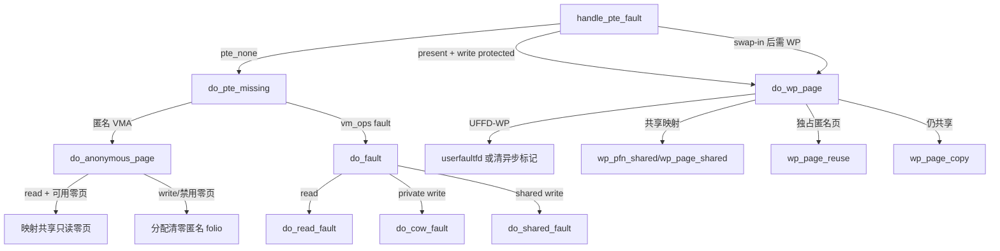

# `do_anonymous_page`、`do_fault` 与 `do_wp_page` 详解

> 源码位置：`mm/memory.c:5427`、`mm/memory.c:6104`、`mm/memory.c:4380`  
> 主线：`handle_pte_fault()` 在 PTE 叶子层把 fault 分成“匿名首次缺页”“文件后备首次缺页”和“已有映射写保护”三类，再分别建立、读入、复用或复制页面。  
> 分析基线：当前 kernel-graph MCP 索引；本地源码工作树为 Linux `v7.3-rc2`。行号会随版本变化，控制关系和不变量比绝对行号更重要。

## 一、大白话总览

### 1.1 三个函数分别解决什么问题

走到这三个函数时，PGD/P4D/PUD/PMD 已经定位完成，问题缩小到了一个 PTE：

| PTE/VMA 状态 | 入口 | 页面从哪里来 | 最终动作 |
|---|---|---|---|
| PTE 缺失，匿名私有 VMA | `do_anonymous_page()` | 共享零页，或新分配并清零的匿名 folio | 安装匿名 PTE |
| PTE 缺失，VMA 有 `vm_ops->fault` | `do_fault()` | 文件系统、设备或其他 VMA fault 回调 | 读映射、私有首次写 COW，或共享写映射 |
| PTE 已存在但写保护 | `do_wp_page()` | 原 folio、共享后备，或新匿名副本 | 复用、共享脏化或 COW |

最容易混淆的是两种 COW：

- **缺失 PTE + 私有文件映射首次写**：`do_fault()` → `do_cow_fault()`；需要先向文件后备取得原内容，再复制到匿名页。
- **已有只读 PTE + 写访问**：`do_wp_page()`；典型场景是 `fork()` 后父子共享匿名页，也包括零页、私有文件页和 swap-in 后的写保护页。

共享映射不做私有 COW。它通过 `page_mkwrite`/`pfn_mkwrite` 协调文件系统，再把共享页标脏。

### 1.2 如果让我自己设计

#### 一句话降级

先看“这个地址现在有没有 PTE、后备是谁、写入能否直接复用原页”，只有无法证明独占时才分配副本。

#### 最小模型

```text
PTE missing?
├─ yes ─ anonymous VMA ─ read ─→ shared zero page
│                    └─ write ─→ allocate zeroed anon folio
│
├─ yes ─ file/special VMA ─ read ─────────→ do_read_fault
│                       ├─ private write ─→ do_cow_fault
│                       └─ shared write ──→ do_shared_fault
│
└─ no, write-protected ─ shared mapping ──→ page_mkwrite + dirty
                         ├─ exclusive anon → reuse and make writable
                         └─ still shared ───→ copy + atomically replace PTE
```

#### 核心数据对象

| 对象 | 本组函数中的角色 |
|---|---|
| `vm_fault` | fault 工单；携带 `vma`、`address`、`flags`、`pmd`、`pte`、`ptl`、`orig_pte`、`page`、`cow_page`、`prealloc_pte` |
| `vm_area_struct` | 决定匿名/文件、私有/共享、可写权限、`vm_ops` 与 userfaultfd 策略 |
| PTE | 既描述 PFN 与权限，也保存 soft-dirty、UFFD-WP 等软件状态 |
| `folio` | 实际页面及其引用、锁、匿名/文件归属、rmap、LRU 与 swapcache 状态 |
| `vm_operations_struct` | 文件或特殊映射提供的 `fault`、`page_mkwrite`、`pfn_mkwrite` 回调 |
| `vm_fault_t` | 位图结果：成功、重试、OOM、SIGBUS、HWPOISON、NOPAGE、DONE_COW 等 |

#### 真实复杂度来源

- 调用文件系统 fault 或分配内存时会睡眠，不能一直持有 PTE lock。
- 一旦放掉 PTE lock，别的线程可能已经处理同一地址；回来后必须用 `pte_same()` 重验。
- “匿名页只有一个 PTE 映射”不等于引用计数为一；LRU、swapcache、临时引用都会影响复用判断。
- 大匿名 folio 可能包含多个 PTE，安装前必须确认整个目标范围仍为空。
- PTE 替换涉及 CPU TLB、反向映射、MMU notifier 和内存统计，顺序错误会让设备或 CPU 暂时看到不一致映射。
- userfaultfd 可以接管 missing/WP fault；返回时锁的所有权可能已改变。

#### 自己实现的大致步骤

1. 在 PTE lock 下确认 fault 前提仍成立。
2. 根据 VMA 后备和共享属性选择匿名、文件读、文件私有写或共享写。
3. 在锁外完成可能睡眠的页面分配、I/O或复制。
4. 重新取得 PTE lock，并用原 PTE 快照检测竞争。
5. 更新 memcg、rmap、LRU和 `mm` 计数。
6. 按 TLB/MMU notifier 要求清旧 PTE、刷新并安装新 PTE。
7. 最后移除旧 rmap和释放引用；竞争失败则丢弃候选页。

#### 阅读 checklist

- 当前是 missing PTE，还是 present 但只读的 PTE？
- VMA 是 `VM_SHARED` 还是私有？是否真的有 `vm_ops->fault`？
- 当前是否持有 `vmf->ptl`？哪个调用会释放它？
- 分配/I/O/复制后是否重验了 `vmf->orig_pte`？
- 新页何时进入 rmap、LRU、memcg和 `MM_ANONPAGES`？
- 旧 PTE 何时失效，TLB何时刷新，旧 rmap何时删除？
- `FAULT_FLAG_UNSHARE` 是要求可写，还是只要求解除共享？
- 返回的 `VM_FAULT_RETRY`/`COMPLETED` 是否意味着上层不能再使用旧 VMA或锁？

### 1.3 总体分派图



## 二、宏观定位与触发场景

三者都位于通用内存管理的 PTE fault 末端，上游主链为：

```text
x86 #PF
└── handle_page_fault
    └── do_user_addr_fault
        └── handle_mm_fault
            └── __handle_mm_fault
                └── handle_pte_fault
                    ├── do_pte_missing
                    │   ├── do_anonymous_page
                    │   └── do_fault
                    └── do_wp_page
```

典型触发：

- `malloc()`/匿名 `mmap()` 只建立 VMA，第一次真正读写才进入 `do_anonymous_page()`。
- `mmap(MAP_PRIVATE)` 文件第一次读走 `do_read_fault()`，第一次直接写且 PTE 尚未建立走 `do_cow_fault()`。
- `mmap(MAP_SHARED)` 第一次写走 `do_shared_fault()`，已有只读共享 PTE 再写走 `wp_page_shared()`。
- `fork()` 通过写保护共享父子 PTE；任一方写入时进入 `do_wp_page()`，独占则复用，否则复制。
- 读取匿名未分配内存可映射全局零页；以后写该地址时由 `do_wp_page()` 分配真正匿名页。
- `do_swap_page()` 换入一个仍需写保护处理的页面时，也可调用 `do_wp_page()`。

## 三、完整调用链

### 3.1 `do_anonymous_page()`

```text
handle_pte_fault
└── do_pte_missing
    └── do_anonymous_page
        ├── pte_alloc                         按需建立 PTE 表
        ├── zero_pfn + pfn_pte + pte_mkspecial
        │                                     构造共享零页 PTE
        ├── pte_offset_map_lock               映射并锁住 PTE
        ├── handle_userfault                  UFFD missing 接管
        ├── vmf_anon_prepare                  检查匿名映射准备条件
        ├── alloc_anon_folio                  分配清零匿名 folio，可选 PTE-mTHP
        └── map_anon_folio_pte_pf             安装 PTE、rmap、LRU与统计
```

### 3.2 `do_fault()`

```text
handle_pte_fault
└── do_pte_missing
    └── do_fault
        ├── [无 vm_ops->fault]
        │   └── pte_offset_map_lock + 二次检查 → SIGBUS/NOPAGE
        ├── [读 fault]
        │   └── do_read_fault
        │       ├── do_fault_around           可选邻页预填
        │       ├── __do_fault                调用 vma->vm_ops->fault
        │       └── finish_fault              将返回页安装进页表
        ├── [私有写 fault]
        │   └── do_cow_fault
        │       ├── vmf_anon_prepare
        │       ├── folio_prealloc            预分配匿名目标页
        │       ├── __do_fault                取得文件原页
        │       ├── copy_mc_user_highpage     内容复制
        │       └── finish_fault              安装匿名 COW 页
        ├── [共享写 fault]
        │   └── do_shared_fault
        │       ├── __do_fault
        │       ├── do_page_mkwrite           可选文件系统写协调
        │       ├── finish_fault
        │       └── fault_dirty_shared_page   共享页标脏与回写平衡
        └── pte_free                          释放未使用的预分配 PTE 表
```

### 3.3 `do_wp_page()`

```text
handle_pte_fault ───────────────┐
do_swap_page ───────────────────┤
                                └── do_wp_page
                                    ├── handle_userfault          同步 UFFD-WP
                                    ├── wp_pfn_shared             共享 PFN/设备映射
                                    ├── wp_page_shared            共享普通 folio
                                    ├── wp_can_reuse_anon_folio   验证匿名 folio 独占
                                    ├── wp_page_reuse              原地升级 PTE
                                    └── wp_page_copy               分配、复制并替换 PTE
```

MCP 上溯结果中，三条路径共同落在 `do_user_addr_fault()` → `handle_mm_fault()` → `__handle_mm_fault()` → `handle_pte_fault()` 下；上图只画直接调用边，避免把条件分派误画成直接调用。

## 四、`do_anonymous_page()` 逐段详解

### 4.1 控制流骨架

```text
do_anonymous_page(vmf)
├─ VM_SHARED 且没有 fault 回调？ → VM_FAULT_SIGBUS
├─ pte_alloc(mm, pmd) 失败？      → VM_FAULT_OOM
├─ 非写 fault 且允许零页？
│   ├─ 构造 special zero-page PTE
│   ├─ 取得并锁住 PTE；页表失效 → unlock
│   ├─ orig_pte 已变化 → 更新 TLB状态后 unlock
│   ├─ mm 正在禁止新映射 → unlock
│   ├─ UFFD missing → 解锁并交给 userfaultfd
│   ├─ 继承原 UFFD-WP marker
│   └─ set_pte_at + update_mmu_cache → unlock
└─ 需要真正匿名页
    ├─ vmf_anon_prepare 失败 → 返回错误
    ├─ alloc_anon_folio
    │   ├─ ERR_PTR(-EAGAIN) → return 0，让上层重新 fault
    │   └─ NULL → OOM
    ├─ 标记 uptodate；对多页 folio 对齐起始地址
    ├─ 锁 PTE并验证单个/整段 PTE仍为空
    ├─ 检查稳定地址空间与 UFFD missing
    └─ map_anon_folio_pte_pf → unlock/release
```

### 4.2 入口约束与 PTE 表准备

```c
if (vma->vm_flags & VM_SHARED)
    return VM_FAULT_SIGBUS;
if (pte_alloc(vma->vm_mm, vmf->pmd))
    return VM_FAULT_OOM;
```

能进入这里的正常匿名 VMA应是私有映射。共享映射若没有 `vm_ops->fault` 提供后备，就没有可共享的对象，不能凭空把普通匿名页当成共享文件页，因此返回 `SIGBUS`。随后确保 PMD下面已有 PTE页；这里分配的是**页表页**，不是用户数据页。

### 4.3 只读首次访问：共享零页

当 fault 不是写访问且 `mm_forbids_zeropage(mm)` 为假时，函数用 `zero_pfn(address)` 取得架构零页 PFN，再用 `pfn_pte()` 和 `pte_mkspecial()` 构造只读 special PTE。

这样做的动机是：大量“分配后只读、内容仍为零”的匿名地址无需每个虚拟页都消耗物理页。special 标记告诉通用 VM这不是普通可做 rmap/LRU管理的匿名页。

安装前必须：

1. `pte_offset_map_lock()` 取得 PTE地址和对应锁。
2. 检查映射 PTE页时是否失败。
3. 用 `vmf_pte_changed()` 比较当前 PTE与 `orig_pte`，处理并发赢家。
4. 用 `check_stable_address_space()` 阻止在地址空间清理等不稳定阶段加入映射。
5. 若注册 UFFD missing，先解锁，再由 `handle_userfault()` 接管。
6. 原位置若有 UFFD-WP marker，用 `pte_mkuffd_wp()` 把语义带到新 PTE。
7. `set_pte_at()` 安装后调用 `update_mmu_cache()`。

旧 PTE 原本 non-present，因此这里不需要像覆盖 present PTE那样做失效刷新。

### 4.4 写访问：分配匿名 folio

`vmf_anon_prepare()` 先检查并准备匿名 VMA所需状态。`alloc_anon_folio(vmf)` 随后尝试分配、memcg charge并清零页面：

- 返回 `NULL`：真正的内存不足，转 `VM_FAULT_OOM`。
- 返回 `ERR_PTR(-EAGAIN)`：当前适合重新 fault，而非报告 OOM；函数返回 0。
- 返回 folio：可能是一页，也可能是低于 PMD order、由多个 PTE映射的匿名 mTHP folio。

如果 userfaultfd 需要逐页精确事件，分配器会退回单页。否则它寻找对齐且整段 PTE均为空的最大合适 order，分配失败再逐级降阶。folio被清零并标记 uptodate；“内容初始化完成”必须先于 PTE可见。

取得 PTE lock 后，单页用 `vmf_pte_changed()` 重验，多页则用 `pte_range_none()` 检查整个范围。任何竞争失败都只释放本次新分配 folio，不覆盖赢家。最终 `map_anon_folio_pte_pf()` 负责安装 PTE、加入匿名 rmap/LRU并增加 `MM_ANONPAGES` 等统计。

### 4.5 零页后的第一次写

零页 PTE是只读的。后续写入会进入 `do_wp_page()`；`wp_page_copy()` 识别 `pfn_is_zero()` 后直接使用已经清零的新 folio，不必从零页做无意义复制。这是“读时零成本、写时付费”的完整闭环。

## 五、`do_fault()` 逐段详解

### 5.1 它是分派器，不是具体文件系统实现

`do_fault()` 自身不读磁盘。它根据 `FAULT_FLAG_WRITE` 与 `VM_SHARED` 选择通用包装器，真正的后备解析由 `vma->vm_ops->fault` 完成。普通文件通常最终进入 page cache；设备映射或特殊文件可以提供完全不同的实现。

### 5.2 没有 fault 回调时为什么还要重查 PTE

```text
!vma->vm_ops->fault
└─ 锁住 PTE并重查
   ├─ PTE仍为空 → VM_FAULT_SIGBUS
   └─ PTE不为空 → VM_FAULT_NOPAGE
```

在并发读改写流程中，PTE可能被暂时清除，当前线程看到 missing 后走到这里时，另一线程可能已恢复它。因此不能看到“无回调”就立即 SIGBUS；必须在 PTE lock 下复核。仍为空才说明 VMA确实无法提供页面；已经恢复则返回 `NOPAGE`，表示无需本层再安装页面。

### 5.3 三路分派

```c
else if (!(vmf->flags & FAULT_FLAG_WRITE))
    ret = do_read_fault(vmf);
else if (!(vma->vm_flags & VM_SHARED))
    ret = do_cow_fault(vmf);
else
    ret = do_shared_fault(vmf);
```

这三个条件的顺序表达了明确语义：读 fault 不需要区分共享/私有；写 fault 才需要决定“生成私有副本”还是“修改共同后备”。

### 5.4 `do_read_fault()`

1. 条件合适时先 `do_fault_around()`，让文件系统一次填充相邻 PTE，减少连续读取的 fault 次数。
2. `vmf_can_call_fault()` 检查当前上下文是否允许调用可能睡眠或释放锁的回调。
3. `__do_fault()` 调用 `vma->vm_ops->fault` 取得并锁住页面。
4. `VM_FAULT_ERROR | VM_FAULT_NOPAGE | VM_FAULT_RETRY` 直接按协议返回。
5. `finish_fault()` 才把返回页映射到当前地址；随后解锁并按结果释放引用。

因此“文件页已经在 page cache”与“PTE已经安装”是两个不同阶段。

### 5.5 `do_cow_fault()`：缺失 PTE上的私有文件首次写

流程是：

```text
准备匿名映射
→ 预分配匿名 cow folio，放入 vmf->cow_page
→ __do_fault 取得文件原页
→ 文件系统若返回 DONE_COW，则接受其已完成结果
→ copy_mc_user_highpage 复制内容到匿名页
→ 标记新页 uptodate
→ finish_fault 安装匿名 COW 页
→ 解锁并释放文件原页
```

先预分配目标匿名页，再调用文件 fault，是因为最终写入不能污染私有映射的文件后备。`copy_mc_user_highpage()` 还能把机器检查错误转换成适当 fault 结果。`VM_FAULT_DONE_COW` 则允许特殊后备自行完成 COW，避免通用层重复处理。

### 5.6 `do_shared_fault()`：共享文件首次写

`__do_fault()` 取得共享后备页后，如果 VMA实现 `page_mkwrite`，内核先解锁返回页并调用该回调，让文件系统完成块分配、写时一致性或日志准备；然后 `finish_fault()` 建立可写映射。最后 `fault_dirty_shared_page()` 标脏、执行回写节流并通知相关机制。

它与 `do_cow_fault()` 的根本差异是：共享路径保留文件页身份并使其变脏，私有路径产生匿名页。

### 5.7 `prealloc_pte` 的收尾

fault-around或下层路径可能预分配 PTE页，但最终不一定使用。`do_fault()` 在所有分支汇合后检查 `vmf->prealloc_pte`，调用 `pte_free()` 释放剩余候选并置空，保证竞态失败或路径改变不会泄漏页表页。

## 六、`do_wp_page()` 逐段详解

### 6.1 控制流骨架

```text
do_wp_page(vmf)
├─ 非 UNSHARE
│   ├─ 同步 UFFD-WP → 解锁，handle_userfault，return
│   ├─ 异步 UFFD-WP → 只清 UFFD-WP 位，更新 orig_pte
│   └─ mm 有延迟 TLB flush → flush_tlb_page
├─ vm_normal_page → page/folio 或特殊 PFN
├─ VMA可能共享？
│   ├─ 特殊 PFN/DAX → wp_pfn_shared
│   └─ 普通 folio  → wp_page_shared
└─ 私有映射
    ├─ 匿名 folio 已 exclusive，或能证明独占
    │   ├─ UNSHARE → 仅解锁返回
    │   └─ 普通写  → wp_page_reuse
    └─ 无法证明独占
        ├─ 持有 old folio 引用
        ├─ 解 PTE lock
        ├─ KSM COW 计数
        └─ wp_page_copy
```

函数带有 `__releases(vmf->ptl)` 注解：无论走哪条正常分支，它都负责消费并释放调用者传入的 PTE lock。调用者不能假定返回后仍持锁。

### 6.2 userfaultfd 写保护优先

若原 PTE带 UFFD-WP：

- 同步模式把事件交给用户态 fault handler；必须先释放 PTE lock。
- 异步模式不阻塞，只清除 UFFD-WP位、重装 PTE并更新 `vmf->orig_pte`，随后继续正常 WP逻辑。

若 `mm_tlb_flush_pending()` 表明此前有延迟刷新，复制旧页前先 `flush_tlb_page()`。否则某 CPU可能仍用旧的可写 TLB项修改源页，而当前 CPU正在复制，生成撕裂快照。

### 6.3 共享映射：协调写入，不做 COW

`vm_normal_page()` 把普通 PTE解析为 `struct page`；特殊 PFN或 DAX没有普通 page/folio，走 `wp_pfn_shared()`，通过可选 `pfn_mkwrite` 回调取得后备允许，或者直接复用 PTE。

普通共享 folio走 `wp_page_shared()`：先增加 folio引用；若有 `page_mkwrite`，释放 PTE lock并调用文件系统，再由 `finish_mkwrite_fault()` 完成；否则用 `wp_page_reuse()` 升级 PTE并锁住 folio。最终统一 `fault_dirty_shared_page()` 标脏并释放引用。

### 6.4 私有匿名页：能安全复用就不复制

若匿名 folio已有 `PageAnonExclusive`，说明当前 rmap语义已经证明它由本映射独占。否则 `wp_can_reuse_anon_folio()` 尝试证明可复用：

1. 排除 KSM等明显不能独占的情况。
2. 必要时 drain LRU临时引用。
3. 尝试锁 folio并移出 swapcache。
4. 最终重新检查引用计数/映射关系。
5. 把匿名 rmap归属迁移到当前 VMA，并建立 exclusive 语义。

这里不能只写 `folio_ref_count() == 1`：LRU、swapcache和临时引用都可能让计数暂时偏高；反过来，没有正确 rmap与锁保护的瞬时计数也不能证明以后没人访问。

证明独占后：

- 普通写 fault调用 `wp_page_reuse()`，把 PTE设为 young、dirty并在 VMA允许时设为 writable，再更新 MMU cache和 `PGREUSE` 统计。
- `FAULT_FLAG_UNSHARE` 只要求解除 KSM/COW共享，不要求变成可写；建立 exclusive 后直接解锁返回。

### 6.5 `wp_page_copy()`：真正的 COW

无法证明独占时，调用者先为旧 folio取引用并释放 PTE lock，随后进入可能睡眠的复制路径：

```text
folio_prealloc 新匿名页
→ 若旧页不是零页，复制用户可见内容
→ 新页标记 uptodate
→ mmu_notifier invalidate_range_start
→ 重新锁 PTE并 pte_same(orig_pte)
→ 更新 mm 计数（file/zero → anon）
→ 构造新 PTE
→ ptep_clear_flush 清旧映射并刷新 TLB
→ 加新页 anon exclusive rmap与LRU
→ set_pte_at 安装新 PTE
→ 删除旧页 rmap
→ 解锁
→ mmu_notifier invalidate_range_end
→ 释放新旧临时引用
```

几个关键不变量：

1. **复制发生在 PTE lock 外。** 页面分配和复制可能耗时，不能长时间阻塞同一页表锁。
2. **回来必须 `pte_same()`。** 若原 PTE已变化，本线程丢弃新页并接受竞争结果，绝不覆盖。
3. **先清旧 PTE并 flush，再装新 PTE。** 这避免不同 CPU同时通过旧/新 TLB写两个不同页面。
4. **新 rmap先准备，旧 rmap后删除。** PTE切换点前后都要让反向映射和实际可达页面一致。
5. **MMU notifier包围替换。** KVM、设备页表等二级映射观察者必须在旧物理页失效期间同步。

旧映射若是文件页，统计从 `MM_FILEPAGES` 转为 `MM_ANONPAGES`；若是零页，只增加匿名页统计。零页无需内容复制，因为新 folio已清零。

对于 `FAULT_FLAG_UNSHARE`，复制路径安装的是新的独占但仍只读 PTE，并保留 soft-dirty/UFFD-WP等软件位；对于普通写 fault，PTE会标 dirty并在权限允许时设 writable。

### 6.6 为什么 COW 不是“分配、memcpy、改 PTE”三步

最简单实现会在以下窗口出错：复制期间另一 CPU继续写源页、并发 fault抢先替换 PTE、设备二级页表仍指向旧页、旧页 rmap提前删除导致回收/迁移看不到映射。因此真实实现必须把复制候选、竞争重验、TLB失效、rmap切换与 notifier组成一个事务。

## 七、锁、引用与所有权时序

| 路径 | 进入时 PTE lock | 中途释放原因 | 回来后的验证 | 页面引用/锁 |
|---|---|---|---|---|
| 匿名零页 | 函数内取得 | UFFD时释放 | `vmf_pte_changed()` | 零页是 special PFN，无普通匿名 rmap |
| 匿名新页 | 分配后取得 | 分配在锁外完成 | 单页比较原 PTE，多页检查整段为空 | 竞争失败释放新 folio；成功交给映射 |
| 文件读 fault | 通常不持有 | 回调/I/O可睡眠 | `finish_fault()` 内完成页表侧验证 | 回调返回页通常带锁/引用，按结果释放 |
| 文件私有首次写 | 不跨回调持有 | 原页取得与复制可睡眠 | `finish_fault()` 完成安装验证 | cow页与原文件页分别管理 |
| WP复用 | 持有 | 不需要复制时直接消费锁 | 独占证明在相应 folio锁/rmap规则下完成 | 不创建新页 |
| WP复制 | 进入时持有，复制前释放 | 分配/复制不可持 PTE lock | `pte_same(vmf->orig_pte)` | old folio临时引用保护源页；新页失败即释放 |

## 八、关键返回值

| 返回位 | 含义 | 上层要点 |
|---|---|---|
| `0` | fault 已处理或应重新观察状态 | 不等同于“总是安装了新页” |
| `VM_FAULT_OOM` | 页表页或数据页分配失败 | 架构入口进入 OOM处理逻辑 |
| `VM_FAULT_SIGBUS` | VMA存在但后备无法提供页面 | 通常向进程报告总线错误 |
| `VM_FAULT_NOPAGE` | 无需通用层安装普通页 | 可能是并发者完成或特殊回调已处理 |
| `VM_FAULT_RETRY` | 下层要求重新走 fault | 原锁/VMA可用性必须按协议重新判断 |
| `VM_FAULT_COMPLETED` | 下层已完成并处理锁状态 | 上层不能重复收尾 |
| `VM_FAULT_DONE_COW` | 后备回调已经完成 COW | `do_cow_fault()` 不再复制 |
| `VM_FAULT_HWPOISON` | 复制源页遇到硬件内存错误 | 转入硬件毒页信号处理 |

## 九、三个函数的关系总结

| 维度 | `do_anonymous_page` | `do_fault` | `do_wp_page` |
|---|---|---|---|
| 初始 PTE | 缺失 | 缺失 | 已有但写保护，或 swap-in 后需WP |
| 后备 | 匿名零页/新匿名 folio | `vm_ops->fault` 提供的文件或特殊后备 | 原 PTE所指页面/特殊 PFN |
| 是否可能 I/O | 通常否 | 是 | 共享 `page_mkwrite` 等可能 |
| COW位置 | 零页后续写才发生 | 私有文件首次写由 `do_cow_fault` | 共享匿名/私有旧映射由 `wp_page_copy` |
| 可否原地复用 | 首次建立，不适用 | 由具体 fault/finish路径决定 | 可，前提是可靠证明 anon exclusive |
| 共享写 | 非法的无后备匿名共享映射 | `do_shared_fault` | `wp_pfn_shared`/`wp_page_shared` |

一句话串起来：`do_anonymous_page()` 决定“匿名地址第一次看见什么”，`do_fault()` 决定“后备对象第一次提供什么”，`do_wp_page()` 决定“已有内容被写时能否原地继续，还是必须复制”。

## 十、建议继续追踪

1. `do_swap_page()`：理解 swap PTE换入后为何还可能转入 `do_wp_page()`。
2. `finish_fault()`：理解文件 fault返回页面后如何按 PMD/PTE粒度安装。
3. `filemap_fault()`：把 `do_read_fault()` 接到 page cache与文件 I/O。
4. `page_add_anon_rmap()` / `page_remove_rmap()`：验证 COW前后反向映射不变量。
5. `mmu_notifier_invalidate_range_start/end()`：理解 KVM与设备二级页表为何参与 COW。
6. `copy_present_ptes()`：与 fork阶段“先写保护、后按需 COW”形成完整闭环。

