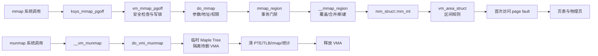

# `do_mmap`、`mmap_region`、`do_munmap` 与 VMA/MM 详解

> 源码位置：`mm/mmap.c:338`、`mm/vma.c:2938`、`mm/mmap.c:1077`、`include/linux/mm_types.h:923`、`include/linux/mm_types.h:1175`
> 分析对象：MMU 路径；本地源码为 Linux `v7.3-rc2` 工作树，文件与行号由 kernel-graph MCP 核验。`mm/nommu.c` 中的同名实现不在本文范围内。
> 核心职责：把用户的映射请求变成 `mm_struct` 中的一段 VMA 规则，或把已有规则、页表映射和相关账本安全撤销。

## 一、大白话总览

### （a）为什么要有这组对象和函数？

用户调用 `mmap()` 时给出的只是愿望：希望在某处得到一段多长、什么权限、由哪个文件或匿名内存支撑的虚拟地址。内核必须完成四件不同的事：

1. 判断愿望是否合法，并选择一个不冲突的地址——`do_mmap()`。
2. 把这段地址登记到进程地址空间；必要时覆盖旧映射——`mmap_region()`。
3. 用一条 `vm_area_struct` 保存这段连续、同质的映射规则。
4. 在 `munmap()` 时拆边界、清页表、解除反向映射、更新统计并释放 VMA——`do_munmap()` 及其下游。

`mm_struct` 是整本地址空间总账。VMA 只是总账中的一条区间记录。VMA 创建成功也不等于物理页已经分配：普通匿名映射通常等到首次访问产生缺页异常时，才真正安装 PTE 和物理页。

如果没有这些分层，系统调用参数检查、区间索引、文件回调、页表拆除、内存承诺、userfaultfd 通知和失败回滚会纠缠在一个巨大函数中；任何中途错误都可能留下重叠 VMA、泄漏文件引用，或让 `total_vm` 与真实区间不一致。

### （b）如果让我自己设计，第一反应是什么？

#### 1. 一句话降级

`mmap` 是“校验后在地址账本中登记一段规则”，`munmap` 是“从账本摘下一段规则，并把已经兑现的页表映射和附属账目一起结清”。

#### 2. 最小模型

先忽略多线程、文件、覆盖映射、VMA 合并、内存承诺、反向映射和缺页分配：

```text
输入：(地址提示, 长度, 权限)
          │
          ▼
在 mm_struct 的空洞中选 [start, end)
          │
          ▼
创建 vm_area_struct(start, end, flags)
          │
          ▼
插入 mm->mm_mt，返回 start

munmap(start, len)
          │
          ▼
从 mm->mm_mt 删除相交 VMA，清除对应 PTE
```

最小模型的输入是区间与权限；核心数据是 `mm_struct::mm_mt` 和 VMA；成功出口是一个无重叠、有序的 VMA 集合。失败出口必须保持地址空间自洽，但破坏性的 `MAP_FIXED` 一旦已经清掉旧映射，并不保证恢复原布局，可能留下空洞。

#### 3. 核心数据对象

| 对象 | 类比 | 在本路径中的角色 |
|---|---|---|
| `mm_struct` | 进程地址空间总账 | 拥有 VMA Maple Tree、页表根、锁、VMA 数量和虚拟内存统计 |
| `mm_struct::mm_mt` | 按地址编排的区间目录 | 查空洞、找相交 VMA、插入和删除区间；不是页表 |
| `vm_area_struct` | 一条连续区间规则 | 保存 `[vm_start, vm_end)`、权限、文件偏移、回调和反向映射关系 |
| `vma_iterator` | Maple Tree 游标 | 把查找、遍历和修改位置保持在同一条区间主线上 |
| `mmap_state` | 建图事务单 | 在 `__mmap_region()` 中携带新区间、邻居、记账量、被覆盖 VMA 和回滚信息 |
| `vma_munmap_struct` | 拆图事务单 | 记录待拆 VMA、页数、统计、userfaultfd 事件和是否允许降级锁 |
| 临时 `maple_tree mt_detach` | 暂存架 | 修改主树前暂存被隔离 VMA，供提交后释放或失败时重新挂回 |

#### 4. 真实复杂度从哪里来？

- 地址语义：`addr` 可能只是 hint，也可能是 `MAP_FIXED` 的强制地址；长度、偏移都可能溢出。
- 兼容性：`READ_IMPLIES_EXEC`、`MAP_SHARED` 忽略未知旧标志、`MAP_SHARED_VALIDATE` 严格拒绝未知标志。
- 安全和文件约束：noexec mount、memfd seal、MDWE、swapfile、append-only、文件读写模式。
- 区间编辑：新映射可能覆盖旧 VMA；munmap 可能切掉 VMA 的头、尾或中间，后者会把一条 VMA 拆成两条。
- 多套一致性账本：`mm_mt`、`map_count`、`total_vm`、`locked_vm`、data/exec/stack 统计、文件 `i_mmap`、匿名 rmap、文件引用必须同步。
- 并发：结构性修改要求 `mmap_lock` 写锁；页表清理还涉及页表锁、MMU notifier 和 TLB flush。
- 文件系统/驱动回调：传统 `.mmap` 与新式 `.mmap_prepare` 都可能改变 VMA 属性或失败。
- 失败回滚：一部分旧 VMA 可能已经拆分、隔离；必须区分仍可 reattach 的阶段，以及清 PTE/调用旧 VMA `close()` 后只能留下空洞的破坏性阶段。

#### 5. 如果自己实现，大概步骤

正常 mmap 路径：

1. 在持有 `mmap_lock` 写锁时检查长度、偏移、VMA 数量、权限和文件能力。
2. 把用户 `prot/flags` 归一化为 VMA flags，选择或验证地址。
3. 找出覆盖区间和左右邻居；为覆盖操作准备拆分及撤销信息。
4. 校验地址空间上限和内存承诺；在仍可回退的检查完成后清理被覆盖区间的 PTE。此后旧映射不再保证可恢复。
5. 优先把新区间与兼容邻居合并；不能合并才分配新 VMA。
6. 插入 `mm_mt`，连接文件反向映射，更新 `map_count`、`total_vm` 等账本。
7. 完成 uprobe、soft-dirty、页保护等外围动作；若要求 `MAP_POPULATE`/`MAP_LOCKED`，在解锁后预取页面。

正常 munmap 路径：

1. 验证页对齐和范围，找到第一条相交 VMA；空洞视为成功。
2. 必要时拆分起点/终点 VMA，让待删除部分成为完整 VMA。
3. 将目标 VMA 放进临时 Maple Tree，同时累计页数和统计差额。
4. 从主 `mm_mt` 清空目标区间；此步失败仍可 `reattach_vmas()`。
5. 跨过不可回退点后，清 PTE/TLB，解除 rmap/文件关系，扣减统计和承诺，释放 VMA。
6. 在锁外完成 userfaultfd 通知。

#### 6. 源码阅读 checklist

- 这个检查针对“参数合法性”“权限安全”“资源配额”还是“区间不变量”？
- 当前 `addr` 是用户 hint、已选定地址，还是强制覆盖地址？
- 当前变化要同步维护 `mm_mt`、反向映射、页表、文件引用和哪些统计？
- 分支是在处理文件/匿名、共享/私有、固定/非固定，还是预填充/按需 fault？
- 当前阶段还可以回滚吗？失败时旧 VMA 是留在主树、临时树，还是已经释放？
- helper 是否要求 `mmap_lock` 写锁，是否可能降级或释放锁？
- `pgoff` 此时表示文件页偏移，还是匿名 VMA 用于合并/线性关系的逻辑偏移？
- 返回值是成功地址，还是被编码进 `unsigned long` 的负 errno？

### （c）真实内核怎样设计？

这组代码采用“策略入口 + 区间事务 + 提交/回滚”的结构：

- `do_mmap()` 做外部请求归一化和策略判断，不直接分配 VMA。
- `mmap_region()` 做进入事务前的 MDWE、体系结构及可写文件映射门禁。
- `__mmap_region()` 用 `mmap_state` 串起覆盖旧区间、邻居合并、新 VMA 创建和收尾。
- `do_munmap()` 本身只是为非 Maple Tree-aware 调用者构造迭代器；真正工作在 `do_vmi_munmap()` / `do_vmi_align_munmap()`。
- 被移除的 VMA 先进入独立临时 Maple Tree。这样批量拆除过程中无需把“待释放集合”混在主地址树里；独立 munmap 在提交前可恢复 attached 状态，`MAP_FIXED` 覆盖则只在清 PTE/close 之前可恢复。

### （d）主要情况及处理方式

**非固定 mmap**：把 `addr` 当提示，经 `__get_unmapped_area()` 找空洞。这样 ASLR、栈保护间隙和架构约束可统一参与选址。

**`MAP_FIXED_NOREPLACE`**：内部附加 `MAP_FIXED` 以走架构固定地址校验，但在进入区域事务前显式查重；相交即 `-EEXIST`，绝不覆盖。

**`MAP_FIXED`**：允许覆盖原映射。`__mmap_setup()` 先收集和隔离相交 VMA、清相关 PTE，再建立新区间。

**文件共享可写映射**：要求文件以写模式打开、不是 swapfile/append-only 冲突对象，并用 `mapping_map_writable()` 临时声明正在建立可写共享映射，以便 seal 等规则阻止冲突。

**文件私有映射**：要求可读；写权限以后通常通过 COW 实现，不要求把写入回写原文件。

**匿名私有映射**：没有 `vm_file`，把 `pgoff` 设为地址页号以维持匿名 VMA 的线性关系和合并语义。

**映射区间与邻居兼容**：扩展/合并已有 VMA，减少 VMA 数量；不兼容才分配新 VMA。

**munmap 命中 VMA 中部**：先在 `start` 和 `end` 处拆分，删除中间完整 VMA；因此一次 unmap 可能暂时增加 `map_count`。

**munmap 命中空洞**：返回 0。POSIX/Linux 语义允许解除尚未映射的页，不将其视为错误。

## 二、对象关系与生命周期



```text
mm_struct 生命周期（通常覆盖整个进程地址空间）
└── mm_mt
    ├── VMA A [start, end)  生命周期可被 merge/split/mmap/munmap 改写
    ├── VMA B [start, end)
    └── VMA C [start, end)
          └── 页表项/物理页并非 VMA 创建时必然存在，而是可按 fault 延迟建立
```

关键不变量：

1. 同一 `mm_struct` 中 attached VMA 按地址有序且不重叠。
2. `mm->map_count` 等于 attached VMA 数量，而不是已映射物理页数。
3. `mm->total_vm` 统计 VMA 覆盖的虚拟页；RSS 统计驻留物理页，两者不能混用。
4. 文件 VMA 的 `vm_pgoff` 与虚拟地址保持线性映射关系；VMA 拆分时偏移必须同步平移。
5. detached VMA 不能再被新读者获取；释放前必须解除主树和反向映射关系。

## 三、控制流骨架

### 3.1 `do_mmap()`

```text
do_mmap(file, addr, len, prot, flags, vma_flags, pgoff, populate, uf)
│
├─ 初始化 *populate = 0；断言已持有 mmap_lock 写锁
├─ [len == 0] → return -EINVAL
├─ [READ_IMPLIES_EXEC 且非 noexec 文件] → 给 PROT_READ 补 PROT_EXEC
├─ [MAP_FIXED_NOREPLACE] → 同时置 MAP_FIXED，让选址走固定地址规则
├─ [非 MAP_FIXED] → 将过低 hint 提升到 mmap_min_addr
├─ PAGE_ALIGN(len)
│  └─ [对齐后为 0，说明溢出] → return -ENOMEM
├─ [pgoff + 页数回绕] → return -EOVERFLOW
├─ [map_count 已超上限] → return -ENOMEM
├─ [纯执行映射] → 尝试选择 execute-only pkey，失败回退 pkey 0
├─ 合成访问 flags、MAP flags、mm 默认 flags 与 MAY 权限
├─ __get_unmapped_area() 选择/验证地址
│  └─ [错误地址] → return errno
├─ [MAP_FIXED_NOREPLACE 且相交] → return -EEXIST
├─ [MAP_LOCKED 但无权限] → return -EPERM
├─ [未来锁页超限] → return -EAGAIN
├─ [file != NULL]
│  ├─ [文件偏移/长度不合法] → return -EOVERFLOW
│  ├─ switch (MAP_TYPE)
│  │  ├─ MAP_SHARED → 屏蔽非 legacy flags → fallthrough
│  │  ├─ MAP_SHARED_VALIDATE
│  │  │  ├─ [未知 flags] → return -EOPNOTSUPP
│  │  │  ├─ [写映射但文件不可写] → return -EACCES
│  │  │  ├─ [写映射 swapfile] → return -ETXTBSY
│  │  │  ├─ [append-only 冲突] → return -EACCES
│  │  │  └─ 设置 SHARED/MAYSHARE → fallthrough
│  │  ├─ MAP_PRIVATE → 继续公共文件检查
│  │  └─ 其他 → return -EINVAL
│  ├─ [文件不可读/noexec 执行/无 mmap 能力/非法 grow] → return 对应错误
│  └─ memfd seal 检查失败 → return error
├─ [匿名映射]
│  └─ switch (MAP_TYPE)
│     ├─ MAP_SHARED → 置共享标志，pgoff = 0
│     ├─ MAP_DROPPABLE → 校验配置和冲突标志，置 NORESERVE/WIPEONFORK/DONTDUMP
│     │                    → fallthrough 到 MAP_PRIVATE
│     ├─ MAP_PRIVATE → pgoff = addr >> PAGE_SHIFT
│     └─ 其他 → return -EINVAL
├─ [MAP_NORESERVE 且策略允许，或 hugetlb 文件] → 置 VMA_NORESERVE
├─ mmap_region() 建立区间
├─ [成功且 LOCKED，或 POPULATE 且非 NONBLOCK] → *populate = len
└─ return 成功地址或负 errno
```

### 3.2 `mmap_region()` / `__mmap_region()`

```text
mmap_region(...)
│
├─ 断言 mmap_lock 写锁
├─ [MDWE 拒绝] → return -EACCES
├─ [架构不接受 flags] → return -EINVAL
├─ [文件共享可写]
│  ├─ mapping_map_writable() 失败 → return error
│  └─ 记住必须撤销临时 writable 声明
├─ ret = __mmap_region(...)
├─ [曾声明 writable] → mapping_unmap_writable()（无论成功失败）
├─ validate_mm()
└─ return ret

__mmap_region(...)
│
├─ 构造 vma_iterator、mmap_state、vm_area_desc
├─ __mmap_setup()
│  ├─ 找第一条相交 VMA
│  ├─ [存在相交 VMA] → 拆边界并收集到临时树；失败 return error
│  ├─ [无相交 VMA] → 找 prev/next
│  ├─ 检查地址空间上限和 commit；失败 return error
│  └─ 清被覆盖区间 PTE，准备描述符
├─ [文件支持 mmap_prepare] → call_mmap_prepare()
├─ [任一步失败] → goto abort_munmap
│  ├─ [旧 PTE 尚未清] → reattach 旧 VMA
│  └─ [旧 PTE 已清且 close 已调用] → 完成删除并留下空洞，不能伪造 open 来恢复
├─ [可提前判断 KSM] → 更新 KSM flags
├─ [有邻居] → vma_merge_new_range()
├─ [不能合并]
│  ├─ __mmap_new_vma()
│  │  ├─ 分配并设置范围/flags/prot
│  │  ├─ 预分配 Maple Tree 节点；失败 → free VMA → return -ENOMEM
│  │  ├─ 文件回调或 shmem setup；失败 → 清局部映射/引用 → free VMA
│  │  ├─ 插入 mm_mt，map_count++，连接文件 rmap
│  │  └─ return 新 VMA
│  └─ [失败] → goto unacct_error：撤销 commit 后再 abort_munmap
├─ [mmap_prepare 存在] → 写入 vm_ops/private_data 等用户字段
├─ __mmap_complete()：完成旧 VMA 删除、统计、uprobes、soft-dirty、page prot
├─ [mmap_prepare + 新分配 VMA] → mmap_action_complete()
│  └─ [完成动作失败] → return error（动作层负责其协议内收尾）
└─ return addr
```

### 3.3 `do_munmap()` 及下游

```text
do_munmap(mm, start, len, uf)
│
├─ 用 start 构造 VMA_ITERATOR
└─ return do_vmi_munmap(..., unlock=false)

do_vmi_munmap(...)
│
├─ [start 未页对齐 / 越 TASK_SIZE / start+len 越界] → return -EINVAL
├─ end = start + PAGE_ALIGN(len)
├─ [end == start：零长或回绕] → return -EINVAL
├─ 找第一条与 [start,end) 相交的 VMA
│  └─ [没有]
│     ├─ [unlock=true] → 解 mmap 写锁
│     └─ return 0
└─ return do_vmi_align_munmap(...)

do_vmi_align_munmap(...)
│
├─ 初始化临时 mt_detach 和 vma_munmap_struct
├─ vms_gather_munmap_vmas()
│  ├─ [start 落在 VMA 中部] → 在 start 拆分；失败 goto gather_failed
│  ├─ 【遍历所有相交 VMA】
│  │  ├─ [sealed] → reattach → return -EPERM
│  │  ├─ [end 落在当前 VMA 中部] → 在 end 拆分；失败 reattach
│  │  ├─ 标为写入/存入临时树/标 detached
│  │  ├─ 累计 pages、locked/accounted/data/exec/stack
│  │  └─ 准备 userfaultfd 事件；失败 reattach
│  └─ 设置 clear_ptes = true → return 0
├─ vma_iter_clear_gfp() 从主 mm_mt 清区间
│  └─ [失败] → reattach_vmas() → validate_mm() → return error
├─ 【point of no return】vms_complete_munmap_vmas()
│  ├─ 扣 map_count/locked_vm；可选把写锁降级成读锁
│  ├─ 清 PTE、通知 MMU、批量 TLB flush、释放页表
│  ├─ 扣 total_vm/data_vm/exec_vm/stack_vm
│  ├─ 遍历临时树 remove_vma()，解除 rmap/文件引用并释放 VMA
│  ├─ 撤销 commit charge，按协议解锁
│  └─ 销毁临时树
└─ return 0
```

## 四、快速定位与宏观地位

### 4.1 快速定位

- 子系统：Linux MM 的用户虚拟地址空间与 VMA 管理。
- `do_mmap()`：请求策略层；把 syscall 参数变成内核 VMA flags，并选择/验证地址。
- `mmap_region()`：VMA 区间事务入口；处理安全门禁和文件 writable 声明。
- `do_munmap()`：兼容非迭代器调用者的薄封装；真正拆除逻辑在 `mm/vma.c`。
- `vm_area_struct`：一段同质虚拟地址区间的长期规则对象。
- `mm_struct`：地址空间所有者、VMA 索引根、页表根、锁和统计总账。
- 这些函数修改 VMA 元数据；只有覆盖/解除映射或 populate 时会直接触及已有 PTE。普通新 mmap 仍可完全按需 fault。

### 4.2 所属层次

```text
┌──────────────────────────────────────────────────────────────┐
│ 用户事件：mmap(2) / munmap(2)，或 exec、shmat、内核映射请求 │
└───────────────────────────┬──────────────────────────────────┘
                            ▼
┌──────────────────────────────────────────────────────────────┐
│ syscall/内核包装：ksys_mmap_pgoff、vm_mmap_pgoff、__vm_munmap│
└───────────────────────────┬──────────────────────────────────┘
                            ▼
┌──────────────────────────────────────────────────────────────┐
│ [本文函数] do_mmap / mmap_region / do_munmap                 │
│ 参数策略 → 区间事务 → 拆分/合并/插入/删除                    │
└───────────────────────────┬──────────────────────────────────┘
                            ▼
┌──────────────────────────────────────────────────────────────┐
│ VMA 基础设施：Maple Tree、vma_iterator、rmap、mmap_lock       │
└───────────────────────────┬──────────────────────────────────┘
                            ▼
┌──────────────────────────────────────────────────────────────┐
│ 页表/MMU：unmap_region、MMU notifier、TLB shootdown、fault    │
└──────────────────────────────────────────────────────────────┘
```

### 4.3 真实触发场景

1. 当用户执行匿名 `mmap()` 时：syscall → `ksys_mmap_pgoff()` → `vm_mmap_pgoff()` → `do_mmap()` → `mmap_region()`；通常只建立 VMA，随后访问才 fault 分配页。
2. 当动态链接器映射 ELF/共享库文件时：同一路径完成私有文件映射；VMA 保存 `vm_file/vm_pgoff/vm_ops`，缺页时再从 page cache 取页，写入时 COW。
3. 当用户以 `MAP_FIXED` 覆盖地址时：`__mmap_setup()` 收集相交 VMA、清旧 PTE，再合并或新建替代 VMA；这同时包含 unmap 和 map 两半事务。
4. 当用户调用 `munmap()` 时：`SYSCALL_DEFINE2(munmap)` → `__vm_munmap()` → `do_vmi_munmap()`；`do_munmap()` 是其他内核调用者使用的非迭代器包装入口。

### 4.4 出错会怎样？

- 选址或交叠检查错误：覆盖本不该覆盖的映射，直接造成用户数据损坏或安全边界失效。
- flags/文件权限错误：可能绕过 noexec、memfd seal、W^X/MDWE 或把写共享映射施加到只读文件。
- Maple Tree 与 `map_count` 不一致：后续查 VMA、拆分、fork、fault 或 `/proc/maps` 遍历会错误甚至崩溃。
- 先释放 VMA 后清 PTE/rmap：回收和 truncate 可访问已释放对象，形成 UAF。
- TLB 未同步：CPU 继续用陈旧翻译访问已解除或已换用途的物理页。
- 错误处理遗漏：`MAP_FIXED` 在破坏旧映射后的失败按设计可能留下空洞，但仍必须保证树、引用和 commit charge 自洽；若连这些收尾都遗漏，就会泄漏或破坏地址空间。

## 五、完整调用链

### 5.1 mmap 用户入口

```text
mmap(2)
└── SYSCALL_DEFINE6(mmap_pgoff)             // mm/mmap.c:626
    └── ksys_mmap_pgoff()                   // mm/mmap.c:581，取 fd/准备 hugetlb file
        └── vm_mmap_pgoff()                 // mm/util.c:565，LSM/fsnotify、加 mmap 写锁
            └── do_mmap()                   // mm/mmap.c:338 ← 请求策略核心
                └── mmap_region()            // mm/vma.c:2938 ← VMA 事务门禁
                    └── __mmap_region()      // mm/vma.c:2838
                        ├── __mmap_setup()   // mm/vma.c:2519，覆盖区准备/记账
                        ├── vma_merge_new_range() // mm/vma.c:1140
                        ├── __mmap_new_vma() // mm/vma.c:2634
                        └── __mmap_complete()// mm/vma.c:2714
```

kernel-graph 还确认 `do_mmap()` 可由 `do_shmat()`、`aio_setup_ring()`、`__do_sys_remap_file_pages()`、ELF 装载及架构附加页路径直接或间接进入；这些入口共享同一套 VMA 建立语义。

### 5.2 munmap 用户入口与内核入口

```text
munmap(2)
└── SYSCALL_DEFINE2(munmap)                 // mm/mmap.c:1091，先 untag 地址
    └── __vm_munmap()                       // mm/vma.c:3380，加 mmap 写锁/完成 uffd 通知
        └── do_vmi_munmap()                 // mm/vma.c:1710
            └── do_vmi_align_munmap()       // mm/vma.c:1663
                ├── vms_gather_munmap_vmas()// mm/vma.c:1478
                ├── vma_iter_clear_gfp()    // 从主 Maple Tree 清区间
                └── vms_complete_munmap_vmas() // mm/vma.c:1410

内核非 Maple Tree-aware 调用者
└── do_munmap()                             // mm/mmap.c:1077
    └── do_vmi_munmap()                     // mm/vma.c:1710
```

kernel-graph 查到的其他真实入口包括 `mremap_to()`、`ksys_shmdt()`、VDSO 映射失败清理、vmcore/uprobes，以及多个内核 `vm_munmap()` 调用者。

### 5.3 关键向下执行链

```text
[do_mmap]
├── __get_unmapped_area()        // 选择或验证地址
├── find_vma_intersection()      // NOREPLACE 查重
├── memfd_check_seals_mmap()     // seal 对 mmap 的限制
└── mmap_region()
    ├── map_deny_write_exec()    // MDWE/W^X 门禁
    ├── mapping_map_writable()   // 建立共享可写映射的临时互斥语义
    └── __mmap_region()
        ├── vms_gather_munmap_vmas() // 隔离被覆盖旧 VMA
        ├── vma_merge_new_range()    // 优先合并
        ├── vm_area_alloc()          // 无法合并才分配
        ├── vma_iter_store_new()     // 插入 mm_mt
        └── vms_complete_munmap_vmas() // 提交旧区间拆除

[do_munmap]
└── do_vmi_munmap()
    ├── vma_find()                   // 找第一条相交 VMA
    └── do_vmi_align_munmap()
        ├── __split_vma()            // 对齐删除边界
        ├── vma_iter_clear_gfp()     // 从主树删除区间
        ├── reattach_vmas()          // 提交前失败回滚
        └── vms_complete_munmap_vmas()
            ├── unmap_region()       // 清 PTE、TLB、页表
            ├── remove_vma()         // close/rmap/file/VMA 释放
            └── vm_unacct_memory()   // 撤销 commit charge
```

## 六、`do_mmap()` 逐段详解

### 6.1 参数与返回值

| 参数 | 含义 |
|---|---|
| `file` | 文件映射对象；匿名映射为 `NULL`，匿名 hugetlb 可由上层伪装成特殊文件 |
| `addr` | 用户地址 hint 或固定地址；成功后返回最终起始地址 |
| `len` | 字节长度，函数内向上页对齐 |
| `prot` | `PROT_READ/WRITE/EXEC/...`，表示当前访问权限请求 |
| `flags` | `MAP_PRIVATE/SHARED/FIXED/...` 用户 ABI 标志 |
| `vma_flags` | 上层额外提供的内部 VMA flags；syscall 主线传 `EMPTY_VMA_FLAGS` |
| `pgoff` | 以页为单位的文件偏移；匿名私有映射会重写为地址页号 |
| `populate` | 输出参数；非零表示上层解锁后需要 `mm_populate()` 的长度 |
| `uf` | 收集覆盖旧映射产生的 userfaultfd unmap 事件，锁外统一通知 |

返回类型虽是 `unsigned long`，却同时承载成功地址和负 errno；调用者必须用 `IS_ERR_VALUE()` 判断，而不能只判断是否为 0。

### 6.2 初始化、锁契约和范围校验（338—382）

```c
struct mm_struct *mm = current->mm; // mmap 修改当前进程地址空间
*populate = 0;                      // 默认不预填充，防止错误路径遗留旧值
mmap_assert_write_locked(mm);       // 本函数不加锁，契约由上层保证
```

- `len == 0` 返回 `-EINVAL`。
- `PAGE_ALIGN(len)` 后变 0 不是合法零长度，而是无符号回绕，因此返回 `-ENOMEM`。
- `pgoff + pages < pgoff` 检查文件页区间回绕，返回 `-EOVERFLOW`。
- `map_count > max_map_count` 用 `>` 而非 `>=`，为拆分/删除等资源释放路径保留短暂超限空间；真正创建路径仍会在下游受约束。

### 6.3 ABI 归一化与选址（354—422）

`READ_IMPLIES_EXEC` 是旧 ABI personality：读取通常隐含执行，但 noexec 挂载必须压过该兼容行为。

`MAP_FIXED_NOREPLACE` 先附加 `MAP_FIXED`，是为了让架构选址函数把地址当固定请求校验；随后 `find_vma_intersection()` 单独保证“不替换”。这两个动作缺一不可：不置 fixed 会被挪址，不查重会退化成破坏性的 `MAP_FIXED`。

内部 flags 由三部分合成：

```text
prot + pkey                → 当前 READ/WRITE/EXEC 权限
file + 用户 MAP flags     → SHARED/GROWSDOWN/DENYWRITE 等映射属性
mm->def_vma_flags         → 进程默认策略（例如未来映射锁定）
再统一加入 MAYREAD/MAYWRITE/MAYEXEC 上限，随后按文件能力收窄
```

`__get_unmapped_area()` 对非 fixed 请求寻找空洞，对 fixed 请求验证地址范围、对齐、架构约束和 guard gap。返回错误同样编码在地址类型中。

### 6.4 锁页资格（424—429）

- 显式 `MAP_LOCKED` 需要 `can_do_mlock()`，否则 `-EPERM`。
- `mlock_future_ok()` 同时考虑 VMA flags 中的 locked 状态与新增长度，避免超过 `RLIMIT_MEMLOCK` 等限制；失败为 `-EAGAIN`。
- 这里只决定资格和 VMA 属性；真正 fault-in/锁页由成功返回后上层的 populate 路径完成。

### 6.5 文件映射分支（431—501）

`file_mmap_ok()` 校验 `pgoff + len` 是否能由文件映射表示，避免偏移溢出。

| 类型 | 核心要求 | 原因 |
|---|---|---|
| `MAP_SHARED` | 兼容性地屏蔽非 legacy 未知 flags | 历史 ABI 要求旧程序的未知位不导致失败 |
| `MAP_SHARED_VALIDATE` | 未知 flags 返回 `-EOPNOTSUPP` | 调用者明确要求内核验证一致性模型，如 `MAP_SYNC` |
| shared + write | `FMODE_WRITE`，且不能是 swapfile | 修改将回写共享后备对象 |
| shared + append-only | 拒绝 | mmap 随机写会绕过 append-only 语义 |
| `MAP_PRIVATE` | 只要求 `FMODE_READ` | 私有写通过 COW，不写回原文件 |
| noexec mount | 禁止当前执行并清除未来可执行能力 | 防止后续 `mprotect()` 绕过挂载策略 |
| 无 `.mmap`/`.mmap_prepare` 能力 | `-ENODEV` | 后备对象不知道如何建立映射 |

`memfd_check_seals_mmap()` 不只检查当下是否合法，还可能收紧未来 VMA flags，防止以后通过 `mprotect()` 违反 seal。

### 6.6 匿名映射分支（502—557）

- 匿名 `MAP_SHARED` 没有普通文件，但需要共享后备；下游 `shmem_zero_setup()` 会建立 shmem 语义。传入 `pgoff` 没意义，置 0。
- 匿名 `MAP_PRIVATE` 的 `pgoff = addr >> PAGE_SHIFT` 不是文件偏移，而是匿名线性页索引；这样相邻 VMA 拆分/合并后仍能验证页偏移连续。
- `MAP_DROPPABLE` 页允许系统随时丢弃，因此不能与 locked、栈增长或当前 hugetlb 支持组合；也无需 reserve，并且不跨 fork、core dump 保留。

### 6.7 overcommit 与区域提交（559—578）

`MAP_NORESERVE` 只有在 overcommit 策略允许时才对普通映射生效；hugetlb 有自己的严格预留规则，因此显式 flag 可设置 `VMA_NORESERVE`。

最后调用 `mmap_region()`。成功后：

- VMA locked，或
- `MAP_POPULATE` 已设置且没有 `MAP_NONBLOCK`

才把 `*populate = len`。实际 `mm_populate()` 由 `vm_mmap_pgoff()` 在释放 `mmap_lock` 后调用，避免长时间 fault-in/I/O 占用地址空间写锁。

## 七、`mmap_region()`：带回滚的 VMA 建立事务

### 7.1 外层门禁（2938—2971）

`mmap_region()` 再次断言写锁，因为从这里开始会改 VMA 树。`map_deny_write_exec()` 落实 MDWE：当进程禁止“可写内存变可执行”时拒绝违规组合。`arch_validate_flags()` 让 MTE、GCS、ADI 等架构能力检查最终 VMA flags。

对文件共享可写映射，`mapping_map_writable()` 原子地增加 writable mapping 声明；若 inode/memfd 正被禁止写映射则失败。无论 `__mmap_region()` 成败，随后都必须 `mapping_unmap_writable()` 对称撤销这次临时声明。这里不是删除刚建成 VMA 的 writable 状态，而是释放“建图期间”的互斥/计数保护。

### 7.2 `__mmap_setup()`：先准备被覆盖旧区间

1. `vma_find(vmi, end)` 找第一条与新区间相交的 VMA。
2. 有交叠时，初始化临时 Maple Tree，并由 `vms_gather_munmap_vmas()` 拆分边界、收集旧 VMA；此时尚可 reattach。
3. 无交叠时，仅定位 `prev/next`，供后续合并。
4. `may_expand_vm()` 只按“新页数 - 被替换页数”检查地址空间增长。
5. 对私有可写 accountable 映射，按净新增承诺量调用 `security_vm_enough_memory_mm()`，并置 `VMA_ACCOUNT`。
6. `vms_clean_up_area()` 在旧 VMA 尚可由树/rmap 正确观察时清 PTE，然后调用其 close 阶段；从这里起不能假设可恢复旧映射。

源码注释强调先清 PTE 再最终释放 VMA，是为了避免 truncate/rmap 与释放竞态。对 `MAP_FIXED` 来说，旧映射的页面此时已经不可访问，且 `vm_ops->close()` 可能不是可由 `open()` 对称撤销的操作。若后续新映射准备失败，`vms_abort_munmap_vmas()` 会从主树清掉该范围并完成旧 VMA 释放，留下空洞，而不是冒险伪造恢复。

### 7.3 `.mmap_prepare` 与传统 `.mmap`

新式 `.mmap_prepare` 通过 `vm_area_desc` 在真正分配/插入 VMA 前准备映射，可修改允许的 `pgoff`、`vm_file`、flags、page protection、`vm_ops` 和 private data，并返回后续 `mmap_action`。

传统 `.mmap` 在 `__mmap_new_file_vma()` 中对已经构造但尚未插入主树的新 VMA 执行。驱动不能改 `vm_start`，也不能把原本不允许写的 VMA 扩权成 MAYWRITE。若驱动部分建立了页表后报错，`unmap_region()` 会撤销其局部映射，再释放文件引用。

### 7.4 先合并，后分配

`vma_merge_new_range()` 只有在范围相邻且 flags、文件、偏移、策略、匿名关系等兼容时才扩展邻居。这样能控制 `map_count` 和查找成本。

不能合并时，`__mmap_new_vma()`：

```c
vma = vm_area_alloc(map->mm);              // 分配并关联 mm
vma_set_range(vma, addr, end, pgoff, ...); // 设置半开区间和线性偏移
vma->flags = map->vma_flags;
vma->vm_page_prot = map->page_prot;
vma_iter_prealloc(vmi, vma);               // 提交前准备 Maple Tree 节点
/* 文件回调或匿名共享 shmem setup */
vma_start_write(vma);                      // 插树后还要继续修改，先建立排他状态
vma_iter_store_new(vmi, vma);              // 插入 mm->mm_mt
map->mm->map_count++;
vma_link_file(vma, ...);                   // 文件 VMA 加入 address_space::i_mmap
```

预分配树节点把可能睡眠/失败的内存分配放在主树提交前。失败标签按“迭代器预分配 → VMA 对象”的逆序释放。

### 7.5 `__mmap_complete()`：提交外围状态

完成阶段依次：

1. `perf_event_mmap(vma)` 通知 perf。
2. `vms_complete_munmap_vmas()` 最终释放被覆盖旧 VMA。
3. `vm_stat_account()` 增加 `total_vm/data_vm/exec_vm/stack_vm` 等新映射统计。
4. locked VMA 若实际不支持 mlock 就清标志，否则增加 `locked_vm`。
5. 文件映射通知 uprobes。
6. 给新建或扩大的 VMA 设置 soft-dirty，使“原地址 unmap 后重新 mmap”能被用户态识别为新区域。
7. `vma_set_page_prot()` 根据最终 flags 计算页保护。

### 7.6 错误路径与事务边界

| 错误发生点 | 已经发生什么 | 回滚动作 |
|---|---|---|
| 收集旧 VMA 之前/期间 | 最多发生 VMA 拆分，`clear_ptes` 仍为真 | `reattach_vmas()`；极少数拆分失败不强行合并回原形，但语义仍等价 |
| `vms_clean_up_area()` 之后 | 旧 PTE 已清、旧 VMA `close()` 已调用，`clear_ptes` 已转假 | 已不能对称恢复；abort 从主树清目标范围并完成旧 VMA 删除，`MAP_FIXED` 失败可留下空洞 |
| commit charge 之后、新 VMA创建失败 | 新承诺已记账，且可能已进入上述破坏阶段 | `vm_unacct_memory()` 撤销新承诺；再由 abort 根据 `clear_ptes` 选择 reattach 或完成删除 |
| 新 VMA 内部准备失败 | 新对象尚未插树 | 释放预分配节点、VMA、文件引用和驱动局部页表 |
| `vma_iter_store_new()` 之后 | 新 VMA 已 attached | 后续代码原则上走完成协议，不再用普通局部 free 回退 |
| `vms_complete_munmap_vmas()` 后 | 旧 VMA 已释放 | 已越过不可回退点，只能保证新状态完成，不能恢复旧映射 |

## 八、`do_munmap()`：VMA 拆分、隔离与最终释放

### 8.1 为什么 `do_munmap()` 只有几行？

它的注释明确说是“给不理解 Maple Tree 的调用者使用的 wrapper”。它只用 `start` 构造 `VMA_ITERATOR`，然后调用 `do_vmi_munmap()`。这不是逻辑缺失，而是避免上层都手写 Maple Tree 游标，同时让已经持有迭代器的内部路径跳过重复定位。

调用契约：调用者持有目标 `mm` 的 `mmap_lock` 写锁；`do_munmap(..., uf)` 传给下游的 `unlock=false`，所以它不会替调用者解锁。

### 8.2 `do_vmi_munmap()` 的边界校验

- `start` 必须页对齐。
- `start <= TASK_SIZE`，且 `len <= TASK_SIZE - start`，用减法形式避免加法溢出。
- `end = start + PAGE_ALIGN(len)`；若 `end == start`，覆盖零长和对齐回绕。
- `vma_find(vmi, end)` 查找 `[start,end)` 第一条相交 VMA；未命中返回成功。

注意 `len` 不要求页对齐，而是向上对齐。这意味着 `munmap(addr, 1)` 会解除包含该字节的整页，但 `addr` 自身必须对齐。

### 8.3 `vms_gather_munmap_vmas()` 为什么先拆分？

删除区间必须由完整 VMA 组成。假设原 VMA 是 `[A,D)`，用户删除 `[B,C)`：

```text
原来： [A-----------------------------D)
拆分： [A------B) [B---------C) [C----D)
删除：             ^^^^^^^^^^^
```

起点拆分可能新增一条 VMA；如果终点也在同一原 VMA 内，还要再新增一条。因此代码在最坏情况下预先检查 `map_count`，但允许资源释放路径暂时略超上限。

遍历目标区间时，每条 VMA：

1. 检查是否 sealed；sealed VMA 禁止被修改。
2. 必要时在 `end` 拆分。
3. `vma_start_write()` 排除并发 VMA 读者。
4. 存入按序号索引的临时 `mt_detach`，而不是继续只依赖主地址树。
5. `vma_mark_detached()` 阻止新读者取得它。
6. 累计页数、locked、accounted 和 data/exec/stack 分类差额。
7. 为 userfaultfd 准备区间事件。

任何提交前错误都经 `reattach_vmas()` 把对象恢复为 attached，并销毁临时树。源码特意不保证把已经成功的 split 再合并回去：即使 VMA 形状变多，地址空间语义仍相同；为极罕见错误实现复杂逆合并得不偿失。

### 8.4 为什么还要单独 `vma_iter_clear_gfp()`？

“标 detached/放入临时树”和“从主 `mm_mt` 清除地址范围”是两个步骤：前者冻结对象集合并准备回滚，后者提交主索引变化。若主树清除时分配失败，旧 VMA 尚未释放，因此可 reattach。

主树清除成功后到达源码标注的 `Point of no return`。此后查找已看不到这些 VMA，代码进入最终销毁，不再尝试恢复。

### 8.5 `vms_complete_munmap_vmas()` 的完成顺序

1. 先扣 `map_count` 和 `locked_vm`。
2. 若 syscall 路径允许 `unlock=true`，把写锁降级为读锁；VMA 已从主树隔离，所以页表清理不再需要保持全程写锁。
3. `vms_clear_ptes()` → `unmap_region()` 批量清 PTE、执行 MMU notifier/TLB flush、释放可释放页表。
4. 在降低 `total_vm` 前更新 high-water mark，再扣 total/data/exec/stack 统计。
5. 遍历临时树 `remove_vma()`，调用 close、解除文件/匿名关系、放文件引用并释放 VMA。
6. `vm_unacct_memory()` 撤销 accountable 页数。
7. 按锁协议释放读锁，销毁临时 Maple Tree。

这个顺序保证：页表/rmap 仍需 VMA 元数据时对象还活着；对象真正释放前，主树已不再发布它；TLB 同步完成后物理页才可安全改作他用。

### 8.6 syscall 为什么不直接调用 `do_munmap()`？

当前 syscall 路径由 `__vm_munmap()` 自己构造迭代器并调用 `do_vmi_munmap(..., unlock=true)`。这样下游在隔离 VMA 后可把写锁降为读锁，缩短独占地址空间锁的时间。`do_munmap()` 面向已有锁约定的内核调用者，固定 `unlock=false`，职责更保守。

## 九、`struct vm_area_struct` 逐字段详解

### 9.1 最少需要哪些字段？

最小 VMA 至少需要区间 `[start,end)`、所属 `mm`、权限 flags 和后备对象/偏移。真实结构再加入页保护缓存、回调、反向映射、并发生命周期、NUMA、userfaultfd 等字段。

### 9.2 地址、归属与权限热字段

| 字段 | 类型/保护 | 设置者与用途 |
|---|---|---|
| `vm_start` | `unsigned long` | 半开区间起点；建立、拆分、扩展时在写锁下修改，查找/fault 高频读取 |
| `vm_end` | `unsigned long` | 半开区间终点，不包含该地址；`vm_end - vm_start` 得字节长度 |
| `vm_freeptr` | `freeptr_t`，与 start/end 共用 union | VMA 回到 `SLAB_TYPESAFE_BY_RCU` slab 后供分配器使用；此时不能再按活 VMA 解读 start/end |
| `vm_mm` | `struct mm_struct *` | 所属地址空间；`vm_area_alloc(mm)` 初始化。unstable RCU 读者可读，但不能据此假定 VMA 仍 attached |
| `vm_page_prot` | `pgprot_t` | 从最终 flags/架构策略算出的页表保护模板；建立和 `mprotect` 等更新 |
| `vm_flags` / `flags` | legacy 位图 / `vma_flags_t` union | 当前权限、最大权限、shared、locked、account、grow、soft-dirty 等；应使用 helper 修改以满足锁和类型迁移约束 |

源码把树遍历热字段放在首个 cache line，以减少 fault 查找 VMA 时的 cache miss。

### 9.3 每 VMA 并发与匿名偏移

| 字段 | 含义 |
|---|---|
| `vm_lock_seq` | `CONFIG_PER_VMA_LOCK` 下与 `mm->mm_lock_seq` 配合判断该 VMA 是否写锁定；允许溢出，碰撞最多导致退回慢路径 |
| `vm_refcnt` | 同时编码 attached/detached、读者数和排除读者阶段；0 明确表示 detached 且不能再增加引用 |
| `vmlock_dep_map` | lockdep 调试模型，不是运行时业务锁本体 |
| `__vm_anon_pgoff_lo` / `__vm_anon_pgoff_hi` | 匿名页逻辑偏移的低/高 32 位；通过 helper 组合读取，服务匿名 VMA 合并、拆分和线性索引 |

`vm_refcnt` 关键状态：

| 值 | 状态 |
|---|---|
| `0` | detached；新读者禁止进入 |
| `1` | attached 且无读锁，或由序列号判定为写锁 |
| `>1` 且低于排除位 | 存在 VMA 读者 |
| 排除位及以上 | 写锁/拆除正在阻止新读者并等待旧读者退出 |

### 9.4 匿名与文件反向映射

| 字段 | 何时存在/谁使用 |
|---|---|
| `anon_vma_chain` | 把 VMA 挂入一个或多个 `anon_vma` 关系；由 `mmap_lock` 与 `page_table_lock` 串行化 |
| `anon_vma` | 匿名反向映射根；匿名页、私有文件页 COW 后用于从 folio 反查 VMA/PTE |
| `shared.rb` | 文件 `address_space::i_mmap` 区间树节点及 subtree last；它是文件反向映射红黑树，不是进程 VMA 主索引 |

一个 `MAP_PRIVATE` 文件 VMA 在发生 COW 后既保留 `vm_file/shared.rb` 关系，又可能加入 `anon_vma`；两套关系分别描述原文件页和已私有化匿名页。

### 9.5 后备对象与回调

| 字段 | 含义 |
|---|---|
| `vm_ops` | VMA 行为表，如 `open/close/fault/map_pages/page_mkwrite`；文件系统或驱动设置 |
| `vm_pgoff` | `vm_file` 内以 PAGE_SIZE 为单位的起始偏移；匿名路径也用于线性关系，不应一律解释成文件偏移 |
| `vm_file` | 后备文件引用；匿名私有映射为 `NULL`，匿名共享通常经 shmem 获得特殊后备 |
| `vm_private_data` | 文件系统/驱动的 VMA 私有上下文；含义由 `vm_ops` 提供者定义 |

### 9.6 可选策略和子系统字段

| 字段 | 配置 | 作用 |
|---|---|---|
| `swap_readahead_info` | `CONFIG_SWAP` | 保存该 VMA 的 swap 预读命中/窗口信息 |
| `vm_region` | `!CONFIG_MMU` | NOMMU 区域对象；本文 MMU 路径不用 |
| `vm_policy` | `CONFIG_NUMA` | 覆盖/细化进程默认 NUMA 分配策略 |
| `numab_state` | `CONFIG_NUMA_BALANCING` | 此 VMA 的 NUMA 自动平衡扫描状态 |
| `anon_name` | `CONFIG_ANON_VMA_NAME` | 用户为匿名 VMA 指定的名称，由 `mmap_lock` 保护并通过 helper 访问 |
| `vm_userfaultfd_ctx` | 常驻成员 | 此 VMA 的 userfaultfd 注册上下文 |
| `pfnmap_track_ctx` | 架构支持时 | 跟踪 PFNMAP 映射生命周期，避免原始 PFN 映射失配 |

### 9.7 谁初始化、读写和释放？

- `vm_area_alloc(mm)` / `vma_init()` 建对象并关联 `vm_mm`、初始化锁/引用状态。
- `__mmap_new_vma()` 设置范围、flags、保护、文件和回调，再插入 `mm_mt`。
- `vma_merge_new_range()`、`__split_vma()`、`mprotect`、`mremap` 等在写锁下改变范围或属性。
- fault 路径按地址读取 VMA 规则，通常不改变区间边界。
- munmap 先 `vma_mark_detached()`，再清主树/PTE/rmap，最后 `vm_area_free()`；RCU/slab 复用意味着“内存还没复用”不等于“仍是有效 VMA”。

## 十、`struct mm_struct` 逐字段详解

### 10.1 设计分组

`mm_struct` 不是“页表结构体”的别名，而是整个用户地址空间的所有者。字段可分为：生命周期、VMA/页表索引、并发、容量统计、ELF 布局、体系结构上下文和可选子系统状态。

### 10.2 生命周期、索引与地址布局

| 字段 | 含义与生命周期 |
|---|---|
| `mm_count` | 内核对象引用数；所有 `mm_users` 合计只占其中一个引用。用 `mmgrab/mmdrop`，归零才释放 `mm_struct` 本体 |
| `mm_users` | 正在使用完整地址空间的用户数和临时持有者；用 `mmget/mmput`，归零触发 `exit_mmap()` 等重型销毁，再放一个 `mm_count` |
| `mm_mt` | 进程 VMA 的 Maple Tree 主索引；键是虚拟地址范围，值是 VMA |
| `mmap_base` | 默认 top-down mmap 搜索基址 |
| `mmap_legacy_base` | legacy bottom-up 布局基址 |
| `mmap_compat_base` / `mmap_compat_legacy_base` | compat ABI 的对应基址，受配置控制 |
| `task_size` | 此 mm 可使用的用户虚拟地址上界，可能受 ABI/架构影响 |
| `pgd` | 多级页表根；CPU 切换地址空间和软件 fault 遍历的起点 |
| `map_count` | 当前 attached VMA 数量；mmap 新建递增、merge 可不增、munmap 按释放 VMA 数递减 |

### 10.3 并发与同步

| 字段 | 保护对象/为什么需要 |
|---|---|
| `page_table_lock` | 保护页表及部分计数；具体 PTE 页也可能有拆分锁 |
| `mmap_lock` | 地址空间结构的全局读写锁；VMA 插入、删除、拆分、合并需写锁，遍历通常需读锁或专门 RCU/VMA 锁路径 |
| `vma_writer_wait` | 每 VMA 锁写者等待机制 |
| `mm_lock_seq` | 每次 mmap 写锁获取/释放递增；奇数表示写锁持有，与 `vm_lock_seq` 构成每 VMA 写锁判定 |
| `write_protect_seq` | fork 等批量写保护页表以建立 COW 时的序列保护，使并发 GUP/fault 能检测变化 |
| `arg_lock` | 单独保护 code/data/brk/stack/arg/env 边界字段，避免为读取这些元数据拿整个 mmap 锁 |
| `tlb_flush_pending` | 标识存在批量 TLB flush 操作；移动 PROT_NONE 等页面的路径据此补同步 |
| `tlb_flush_batched` | 架构启用时记录批量 unmap TLB flush 状态 |

源码特别要求谨慎在 `mmap_lock` 前插字段，因为 rwsem 的热点成员跨 cache line 布局是为降低高竞争 cache bouncing 特意安排的。

### 10.4 虚拟内存和驻留统计

| 字段 | 统计口径 |
|---|---|
| `pgtables_bytes` | 页表自身占用字节数，不是用户页面大小 |
| `hiwater_rss` | 历史最大 RSS |
| `hiwater_vm` | 历史最大虚拟映射页数 |
| `total_vm` | 当前 VMA 覆盖总页数；mmap 成功即可能增加，即使尚无物理页 |
| `locked_vm` | locked VMA 页数/已锁定口径，受 mlock 支持和实际流程调整 |
| `pinned_vm` | 长期 pin 导致引用永久提高的页面计数，使用原子 64 位 |
| `data_vm` | 可写、非共享、非栈的数据映射页数 |
| `exec_vm` | 可执行、非写、非栈映射页数 |
| `stack_vm` | 栈 VMA 页数 |
| `def_flags` / `def_vma_flags` | 新 VMA 默认 flags；union 是 flags 类型迁移期兼容表示 |
| `rss_stat[NR_MM_COUNTERS]` | 匿名、文件、shmem 等驻留页的 per-CPU 统计，区别于 `total_vm` |

### 10.5 程序映像边界

| 字段 | 含义 |
|---|---|
| `start_code/end_code` | ELF 代码区边界 |
| `start_data/end_data` | 数据区边界 |
| `start_brk/brk` | heap 初始与当前 program break |
| `start_stack` | 用户栈起始参考位置 |
| `arg_start/arg_end` | argv 字符串范围 |
| `env_start/env_end` | envp 字符串范围 |
| `saved_auxv` | `/proc/PID/auxv` 等使用的辅助向量副本 |
| `saved_e_flags` | 配置支持时保存 ELF core dump 所需架构 flags |
| `binfmt` | 当前程序映像的 binary format handler |
| `exe_file` | `/proc/PID/exe` 指向的文件，RCU 保护 |

这些字段描述程序布局，但不是 VMA 索引本身；例如 `brk` 变化最终仍需通过 VMA 操作兑现。

### 10.6 调度、架构与其他核心子系统

| 字段 | 作用 |
|---|---|
| `membarrier_state` | 控制该 mm 的 membarrier 行为；靠近 `pgd` 是为 `switch_mm()` cache locality |
| `mm_cid` | MM concurrency ID 相关存储 |
| `sc_stat` | sched_cache 相关统计 |
| `mmlist` | 挂入全局可能含 swap 的 mm 链表，由全局锁保护 |
| `futex` | 私有 futex 与 mm 生命周期相关的数据 |
| `context` | ASID/PCID、LDT 或其他架构地址空间上下文 |
| `flags` | mm 全局状态位，必须通过 `mm_flags_*` helper 访问 |
| `ioctx_lock/ioctx_table` | AIO 上下文表及其锁 |
| `owner` | memcg 下代表此 mm 的规范 task；变更条件由注释严格约束，RCU 读取 |
| `notifier_subscriptions` | KVM、设备等 MMU notifier 订阅者；页表撤销前后接收通知 |
| `pmd_huge_pte` | 特定 THP 配置下暂存/保护 PMD huge PTE |
| `uprobes_state` | 用户探针在此 mm 上的状态 |
| `delayed_drop` | PREEMPT_RT 下延迟释放用 RCU 节点 |
| `hugetlb_usage` | hugetlb 使用量 |
| `async_put_work` | 异步释放 mm 相关资源的 work item |
| `iommu_mm` | IOMMU 与该进程地址空间关联的数据 |

### 10.7 NUMA、KSM、代际 LRU 与尾部数组

| 字段 | 配置 | 作用 |
|---|---|---|
| `numa_next_scan` | NUMA balancing | 下次把 PTE 改成 PROT_NONE 以采样访问位置的时间 |
| `numa_scan_offset` | NUMA balancing | 扫描重启地址 |
| `numa_scan_seq` | NUMA balancing | 防止两个线程重复执行同轮 remap/scan |
| `ksm_merging_pages` | KSM | 此 mm 参与 KSM 合并的页面数 |
| `ksm_rmap_items` | KSM | 已建立的 KSM rmap 扫描项数量 |
| `ksm_zero_pages` | KSM | 合并到内核零页的页数 |
| `lru_gen.list` | multigen LRU | 把 mm 挂到页表扫描集合 |
| `lru_gen.bitmap` | multigen LRU | 标识哪些 node 上此 mm 最近可能运行过，减少无效页表 walk |
| `lru_gen.memcg` | multigen LRU + memcg | 指向 owner 对应 memcg |
| `mm_id` | `CONFIG_MM_ID` | 地址空间唯一标识 |
| `flexible_array[]` | 动态尾部 | 承载依 `nr_cpu_ids` 大小变化的 `mm_cpumask`，所以必须位于结构体末尾 |

### 10.8 `mm_users` 与 `mm_count` 为什么不能合并？

最后一个地址空间用户离开时，需要撤销全部 VMA/页表，这是可能睡眠且代价很高的 `exit_mmap()` 生命周期事件；但内核其他对象仍可能只需要 `mm_struct` 元数据保持可寻址。于是：

```text
mm_users -> 0：不再有完整地址空间用户，执行 __mmput()/exit_mmap()
      │
      └── 放掉由“所有 users”共同占用的一个 mm_count

mm_count -> 0：再无任何内核引用，最终释放 mm_struct 本体
```

合并会迫使“保住对象指针”和“保住整个页表/VMA 世界”使用同一昂贵生命周期，或制造提前释放 UAF。

## 十一、关键设计决策与不变量

### 11.1 为什么 VMA 主索引用 Maple Tree？

VMA 负载既要按地址高速查找，又频繁做范围插入、删除、空洞搜索和批量遍历。Maple Tree 直接表达范围，并允许锁策略放在树外由 `mmap_lock`/RCU 协调。`vm_area_struct::shared.rb` 仍是红黑树节点，但它属于文件 `i_mmap` 反向映射，不能据此说进程 VMA 主索引仍是红黑树。

### 11.2 为什么不在 `do_mmap()` 里直接分配 VMA？

请求可能与相邻 VMA 完全兼容，扩展旧 VMA 即可；提前分配会浪费对象并复杂化失败清理。更重要的是 `MAP_FIXED` 还要先计算被替换区域的净增长和回滚状态，所以分配属于区域事务，而不是参数策略层。

### 11.3 为什么 munmap 要“临时树”而不是边遍历边 free？

- 遍历主树时直接 free 会破坏迭代器和回滚能力。
- 页表清理、反向映射和统计需要完整待删集合。
- 批量 TLB flush 比逐 VMA flush 更高效。
- detached 集合可阻止新读者，同时让失败路径在 point of no return 前统一 reattach。

### 11.4 为什么清 PTE 时 VMA 还要活着？

`unmap_region()`、rmap、MMU notifier、文件/驱动 close 等过程仍要读取 VMA 的范围、flags、后备对象和回调。先 free 会造成 UAF；正确顺序是“停止发布 → 清现实映射 → 解除附属关系 → 释放描述对象”。

### 11.5 为什么 VMA 和页表必须分开？

VMA 表示“哪些访问合法、缺页时怎样兑现”，页表表示“此刻 CPU 如何翻译”。一个 1 GiB 匿名 VMA 刚 mmap 后可能没有一个普通 PTE；反过来，拆 VMA 时必须先撤销仍存在的 PTE，防止硬件绕过新规则继续访问。

### 11.6 不变量检查表

| 不变量 | 违反后果 |
|---|---|
| attached VMA 有序、不重叠，范围为页对齐半开区间 | fault 命中错误 VMA或覆盖用户数据 |
| `map_count` 与主树 attached VMA 数一致 | 错误拒绝/允许新映射，调试校验失败 |
| VMA 范围改变时同步 `vm_pgoff`/匿名偏移 | 文件页或 COW 页索引错位 |
| 文件 VMA 与 `address_space::i_mmap` 同步 | truncate、写回、失效看不到映射 |
| 匿名 VMA 与 anon rmap 同步 | 回收、迁移、COW 无法反查 PTE |
| 页表清除配套 MMU notifier 与 TLB flush | 设备/CPU 使用陈旧翻译 |
| commit、total/data/exec/stack/locked 统计与区间净变化一致 | overcommit 和资源限制失真 |
| 可回退阶段失败必须 reattach/free/unacct 对称；破坏阶段失败必须一致地完成删除 | 树状态损坏、泄漏或 double free |
| VMA detached 后不允许新读者增加引用 | VMA 释放竞态和 UAF |

## 十二、关键概念补充

### 12.1 `MAP_FIXED` 不只是“指定地址”

它是破坏性替换操作：目标区间旧映射会被拆除。`MAP_FIXED_NOREPLACE` 才是“必须用该地址，但已有映射就失败”。两者都走固定地址架构校验，区别由显式相交检查建立。

### 12.2 VMA merge/split 改的是描述粒度，不必改变语义

两个属性完全相同且线性连续的相邻 VMA 合并后，用户看见的映射语义不变；一条 VMA 为 munmap 边界拆成两三条也一样。因此某些错误回滚只保证语义恢复，不花高成本恢复原先恰好几条 VMA 的形状。

### 12.3 TLB 为什么是 munmap 正确性的一部分？

CPU 在 TLB 中缓存虚拟到物理的翻译。仅把 PTE 清零并不能保证其他 CPU 立即停止使用旧翻译。unmap 必须按架构规则批量失效 TLB；在完成前，旧物理页不能安全重新分配给不相关用途。

### 12.4 userfaultfd 为什么先收集、后通知？

VMA 修改时持有 `mmap_lock` 写锁，而用户态通知可能唤醒、阻塞或引出复杂操作。内核先把事件挂到 `uf` 列表，完成结构修改并解锁后再 `userfaultfd_unmap_complete()`，避免在核心地址空间写锁内与用户态协议交互。

### 12.5 映射成功、预填充和物理页分配的关系

```text
mmap 成功
├── 普通情况：只有 VMA，PTE/物理页等首次访问 fault
├── MAP_POPULATE：上层解锁后主动 fault-in
├── MAP_LOCKED：尝试填充并锁住受支持页面
└── 文件/驱动特殊 mmap：回调可能直接安装 PFN/PTE，但这不是通用保证
```

## 十三、把整条主线串成一句话

`mm_struct` 用 `mm_mt` 和各类账本拥有整个进程地址空间，`do_mmap()` 把用户 ABI 参数校验并归一化成一个合法区间请求，`mmap_region()` 以可回滚事务方式覆盖旧区间、合并邻居或创建 `vm_area_struct`，而 `do_munmap()` 的下游则把目标 VMA 拆成完整边界、隔离到临时 Maple Tree，在越过提交点后清页表/TLB/rmap、扣统计并释放对象；VMA 始终描述规则，页表与物理页只是这些规则在实际访问时的兑现结果。

读完应能回答：

1. 为什么 `mmap()` 成功不等于物理内存已经分配？
2. 为什么 `MAP_FIXED_NOREPLACE` 既要置 `MAP_FIXED` 又要单独查交叠？
3. 为什么匿名私有映射也需要一个 `pgoff`？
4. 为什么建立新区间时要先尝试 VMA merge？
5. 为什么 munmap 要先 split、再 detach、再清主树，最后才 free？
6. 哪一步是 point of no return，之前怎样回滚？
7. `mm->map_count`、`total_vm` 和 RSS 分别统计什么？
8. 为什么 `vm_area_struct::shared.rb` 不能证明 VMA 主索引仍是红黑树？
9. 为什么 `mm_users` 归零和 `mm_count` 归零对应两个不同销毁阶段？
10. 为什么清 PTE 后还必须做 TLB flush？
