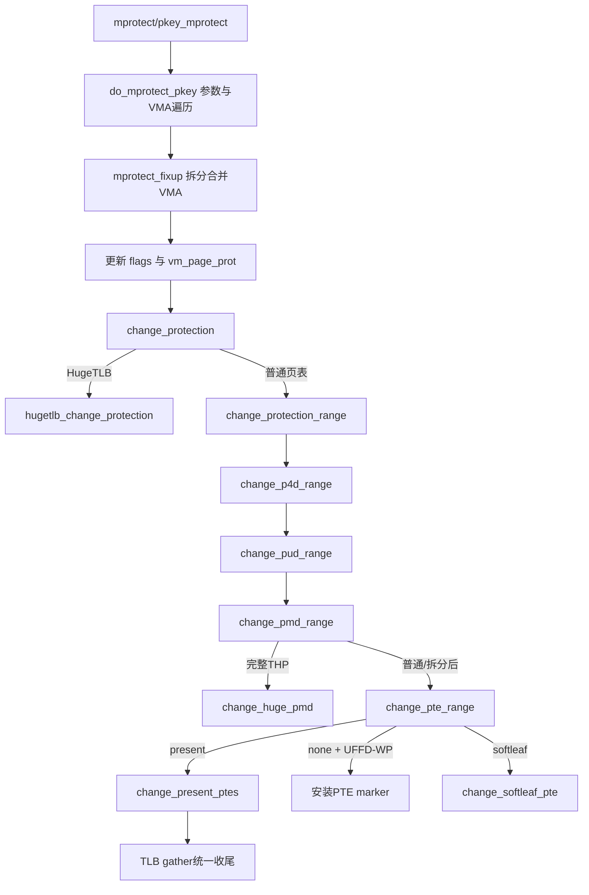

# `do_mprotect_pkey` 到 `change_pte_range` 详解

> 源码位置：`mm/mprotect.c:871`、`mm/mprotect.c:759`、`mm/mprotect.c:686`、`mm/mprotect.c:331`  
> 主线：校验用户提交的地址、权限和 protection key，逐 VMA调整映射规则，再遍历已有页表，把新权限安全地下沉到 PUD/PMD/PTE或 HugeTLB叶子。  
> 分析基线：当前 kernel-graph MCP 索引；本地 Linux 源码工作树为 `v7.3-rc2`。

## 一、大白话总览

### （a）为什么需要这组函数？

`mprotect()` 改的不是一处标志，而是两个必须一致的世界：

- VMA记录“这个虚拟区间依法拥有什么权限”，以后新缺页会按它建立 PTE。
- 已存在的 PTE/PMD记录“CPU现在实际能做什么”。

只改 VMA，旧 TLB/PTE仍可能保留可写或可执行权限；只改 PTE，下一次 fault又会按旧 VMA恢复错误权限。这组函数把用户请求拆成参数校验、VMA区间事务和页表权限事务，并处理拆分、合并、TLB、HugeTLB/THP、pkey、userfaultfd与 NUMA提示。

### （b）如果让我自己设计

#### 1. 一句话降级

先确认用户有权修改整段连续地址，再改“区间规则”，最后逐级改已经存在的硬件目录项并刷新旧缓存。

#### 2. 最小模型

```text
mprotect(start, len, R/W/X)
        │
        ▼
找到覆盖 [start,end) 的 VMA
        │
        ├─ 必要时在 start/end 拆 VMA
        ├─ 更新 VMA flags + vm_page_prot
        └─ PGD→P4D→PUD→PMD→PTE 修改现有叶子
                                      │
                                      └─ TLB失效
```

输入是页对齐区间、`PROT_*`与可选 pkey；核心对象是 `mm_struct`、VMA、`mmu_gather`和各级页表；正常出口是整个区间未来与当前权限一致，错误出口是 `-EINVAL/-EACCES/-ENOMEM/-EPERM/-EINTR`等。

#### 3. 核心数据对象

| 对象 | 当前路径中的角色 |
|---|---|
| `mm_struct::mm_mt` | VMA区间目录，用 iterator检查整段是否连续并驱动拆分/合并 |
| `vm_area_struct::flags` | 权限规则账本，包含当前 `VM_READ/WRITE/EXEC`、上限 `VM_MAY*`、共享及特殊属性 |
| `vm_area_struct::vm_page_prot` | 从 flags/pkey转换出的架构页表保护模板，供当前改表和未来 fault使用 |
| `struct mmu_gather` | TLB修改事务，批量记录并在统一出口兑现失效 |
| `cp_flags` | 内核内部操作类型：普通 mprotect、NUMA、UFFD-WP/RWP、resolve、尝试恢复写权限 |
| `pte_t/softleaf_t` | present PTE或 swap/migration/device/marker软件叶子，权限变化规则不同 |
| `folio` | 用于 NUMA过滤、批量识别以及判断共享/COW状态 |

#### 4. 真实复杂度来源

- 请求可横跨多个 VMA，但中间不能有洞，每个 VMA的最大权限、LSM和驱动回调可能不同。
- 修改子区间需要拆 VMA；相邻兼容区间又应合并，避免 VMA碎片失控。
- `PROT_READ`在旧 personality下可能隐含 `PROT_EXEC`，pkey还可由架构覆盖。
- 共享可写、私有 COW和写通知映射不能一律直接把 PTE设为 writable。
- PTE可能是空、present、PROT_NONE、swap、migration、device-private或 marker。
- NUMA和 userfaultfd也借用“权限降级产生 fault”，但语义不同，不能混淆普通 `PROT_NONE`。
- PMD可能在遍历中是 THP并被拆分；PTE页映射可能失败，需要上层从 PMD重试。

#### 5. 如果自己实现

1. 去掉地址tag，验证页对齐、长度溢出、架构权限和 pkey。
2. 获取 `mmap_lock`写锁，定位起始 VMA并验证区间无洞。
3. 对每个 VMA计算新 flags，检查 `VM_MAY*`、W^X策略、架构和 LSM限制。
4. 调用 VMA私有 `mprotect`回调。
5. 对边界拆分、中间复用、相邻兼容区间合并；同步 commit charge和 mm统计。
6. 更新 VMA flags和 `vm_page_prot`。
7. 对已有页表按层级遍历；huge项整块修改或拆分，小页进入 PTE锁。
8. present页保留软件/访问状态并提交新保护；non-present页修改对应软件项；空项仅在 UFFD需要时装 marker。
9. 统一完成 TLB gather，解锁并返回。

#### 6. 阅读 checklist

- 用户请求是否页对齐、无溢出且被架构接受？
- 目标范围是否被 VMA连续覆盖？
- 请求权限是否超过 `VM_MAYREAD/WRITE/EXEC`？
- 当前动作是在改 VMA边界、VMA规则，还是已有 PTE？
- 增加私有写权限是否需要 commit charge？失败由谁退还？
- PTE是 present、none还是 softleaf？
- `PROT_NONE`来自 mprotect、NUMA还是 UFFD-RWP？
- 为什么不能直接恢复 write位？是否受 COW/write-notify约束？
- THP是整块改权限还是必须拆成 PTE？
- TLB、lazy MMU和 PTL是否成对结束？

### （c）它是怎么设计的？

设计核心是“**先验证规则，再修改拓扑，最后提交硬件权限**”。顶层按 VMA逐段做访问控制；`mprotect_fixup()`把目标子区间变成一个具有统一 flags的 VMA并更新账本；`change_protection()`选择 HugeTLB或普通页表；叶子层按 PTE状态和内部操作类型精确变换。TLB修改由同一个 `mmu_gather`跨多个 VMA批量收尾。

### （d）主要情况

| 条件 | 动作 | 原因 |
|---|---|---|
| 地址未对齐、长度溢出、同时 GROWSDOWN/GROWSUP | 拒绝 | 请求区间无法规范化 |
| 区间含未映射洞 | `-ENOMEM` | mprotect要求整个请求范围已有映射 |
| 新权限超过 VMA的 `VM_MAY*` | `-EACCES` | mmap时的最大许可不能被绕过 |
| VMA sealed | `-EPERM` | 映射已禁止后续属性修改 |
| flags未变化 | 直接成功 | 避免不必要拆分和页表遍历 |
| 子区间变化 | `vma_modify_flags()`拆分/合并 | Maple Tree必须准确表达每段统一属性 |
| HugeTLB | `hugetlb_change_protection()` | 独立页表和共享规则 |
| THP覆盖完整且无需拆 | `change_huge_pmd()` | 整块修改更高效 |
| PTE present | 批量 `change_present_ptes()` | 保留状态并按需刷新TLB |
| PTE none + UFFD-WP | 可安装 marker | 页不驻留但仍要记住写保护语义 |
| migration/device/marker | `change_softleaf_pte()` | 软件项不能用普通 `pte_modify()` |

## 二、控制流骨架

### 2.1 `do_mprotect_pkey()`

```text
do_mprotect_pkey(start,len,prot,pkey)
├─ 去地址 tag；提取并移除 GROWS标志
├─ 两种 GROWS同时设置 → return -EINVAL
├─ start未页对齐 → return -EINVAL
├─ len==0 → return 0
├─ 对齐len；end溢出 → return -ENOMEM
├─ arch_validate_prot失败 → return -EINVAL
├─ mmap写锁被信号打断 → return -EINTR
├─ pkey未分配 → goto out，返回 -EINVAL
├─ 找不到起始 VMA → goto out，返回 -ENOMEM
├─ GROWSDOWN/GROWSUP校正范围并验证VMA类型；失败 → goto out
├─ tlb_gather_mmu
├─ 【遍历 [start,end) 内 VMA】
│  ├─ 当前 VMA与上段不连续 → error=-ENOMEM → break
│  ├─ READ_IMPLIES_EXEC且允许执行 → prot加入EXEC
│  ├─ 计算新pkey、flags，并保留非访问属性
│  ├─ 超过 VM_MAY* → -EACCES → break
│  ├─ deny-write-exec/架构/LSM检查失败 → break
│  ├─ vm_ops->mprotect失败 → break
│  ├─ mprotect_fixup失败 → break
│  └─ 更新下一段起点；prot恢复reqprot → continue
├─ tlb_finish_mmu
├─ 无错误但未覆盖到end → error=-ENOMEM
└─ out：解 mmap_lock → return error
```

### 2.2 `mprotect_fixup()`

```text
mprotect_fixup(vmi,tlb,vma,pprev,start,end,newflags)
├─ sealed → return -EPERM
├─ flags相同 → 更新pprev → return 0
├─ PFNMAP/MIXEDMAP改PROT_NONE需架构逐PFN检查
│  └─ walk失败 → return error
├─ 新增私有写权限
│  ├─ 超资源上限 → return -ENOMEM
│  └─ 必要时收commit；失败 → return -ENOMEM
├─ 匿名无anon_vma且取消写 → 可清ACCOUNT
├─ vma_modify_flags拆分/合并
│  └─ 失败 → goto fail：退还本轮charge
├─ 发布新flags；决定TRY_CHANGE_WRITABLE；重算vm_page_prot
├─ change_protection修改已有页表
├─ 若ACCOUNT被清除 → 退还原commit
├─ locked私有只读VMA变可写 → populate触发COW预填
├─ 更新mm统计；perf_event_mmap通知
└─ return 0
```

### 2.3 `change_protection()`与`change_pte_range()`

```text
change_protection
├─ UFFD-WP/RWP flags组合非法 → WARN → return 0
├─ NUMA或UFFD-RWP → newprot=PAGE_NONE
├─ HugeTLB → hugetlb_change_protection
└─ 普通页表 → change_protection_range → ... → change_pte_range

change_pte_range
├─ 设置TLB粒度为PAGE_SIZE；映射并锁PTE
│  └─ 失败 → return -EAGAIN（PMD层重试）
├─ NUMA时计算单线程私有优化条件
├─ 刷新待处理批量TLB；进入lazy MMU
├─ 【PTE循环，可按folio批量前进】
│  ├─ present
│  │  ├─ 已是目标NUMA/RWP状态 → continue
│  │  ├─ NUMA不适合制造fault → 批量skip → continue
│  │  └─ change_present_ptes；pages += nr
│  ├─ none
│  │  ├─ 非UFFD-WP → continue
│  │  └─ 支持marker → 安装UFFD-WP marker；pages++
│  └─ softleaf → change_softleaf_pte；累加变化数
├─ 退出lazy MMU；解PTL
└─ return pages
```

## 三、Mermaid 主路径



## 四、宏观定位与调用链

### 4.1 所属层次

```text
用户 mprotect()/pkey_mprotect()
        │
        ▼
__do_sys_mprotect()
        │
        ▼
┌──────────────────────────────────────────────┐
│ [本文主线]                                   │
│ do_mprotect_pkey()       mm/mprotect.c:871   │
│   └─ mprotect_fixup()    mm/mprotect.c:759   │
│      └─ change_protection() mm/mprotect.c:686│
│         └─ ... → change_pte_range() :331     │
└──────────────────────────────────────────────┘
        │
        ├─ Maple Tree/VMA拆分合并与commit记账
        ├─ PGD/P4D/PUD/PMD/PTE、THP/HugeTLB
        └─ PTL/lazy MMU/TLB gather
```

### 4.2 触发场景

1. 用户调用 `mprotect()`修改堆、JIT代码或保护页，经 `__do_sys_mprotect()`进入本主线。
2. 用户用 protection keys改变页表pkey，经同一内部入口校验 pkey分配状态并由架构编码到保护模板。
3. ELF装载通过 `setup_arg_pages()`直接调用 `mprotect_fixup()`调整初始栈权限，不经过用户参数入口。
4. NUMA balancing、userfaultfd WP/RWP也复用 `change_protection()`，但通过 `cp_flags`赋予 PROT_NONE不同的软件语义。

### 4.3 向上与向下调用链

```text
__do_sys_mprotect
└── do_mprotect_pkey
    └── mprotect_fixup
        └── change_protection
            ├── hugetlb_change_protection
            └── change_protection_range
                └── change_p4d_range
                    └── change_pud_range
                        └── change_pmd_range
                            ├── change_huge_pmd
                            └── change_pte_range
                                ├── change_present_ptes
                                ├── change_softleaf_pte
                                └── UFFD-WP marker安装
```

`mprotect_fixup()`还有 `setup_arg_pages()`入口；`change_protection()`还由 `change_prot_numa()`、`uffd_wp_range()`、`mrwprotect_range()`和 userfaultfd清理路径复用。因此 `cp_flags`不是 mprotect私有参数，而是通用权限变换协议。

## 五、关键字段与内部标志

| 字段/标志 | 含义 |
|---|---|
| `reqprot` | 用户原始 R/W/X 请求，传给 LSM；循环中 `prot` 可能因 `READ_IMPLIES_EXEC` 临时扩展 |
| `VM_ACCESS_FLAGS` | 当前生效的读写执行权限 |
| `VM_MAY*` | 该 VMA允许提升到的权限上限 |
| `VMA_ACCOUNT_BIT` | 私有可写映射需要commit承诺 |
| `MM_CP_TRY_CHANGE_WRITABLE` | 在满足COW/write-notify条件时尝试直接恢复PTE写位 |
| `MM_CP_PROT_NUMA` | 把合适页映射成NUMA PROT_NONE以采样下一次访问 |
| `MM_CP_UFFD_WP/RWP` | userfaultfd写保护/读写保护；RWP通常叠加PAGE_NONE |
| `*_RESOLVE` | 清除对应UFFD保护状态 |

## 六、`do_mprotect_pkey()` 逐段详解

### 6.1 参数正规化（883—900）

`untagged_addr()`去除架构地址tag；GROWSDOWN/GROWSUP先保存再从普通 `prot`清除，因为它们描述范围扩展方式，不是PTE权限。同时设置二者非法。`start`必须页对齐；零长度按历史ABI成功返回。长度向上页对齐，`end <= start`捕获加法溢出。`arch_validate_prot()`检查BTI、MTE等架构位组合。

`reqprot`保存正规化后的用户请求。循环中的 `prot`可能依据 personality加入EXEC，但安全模块仍需要区分用户明确请求和兼容性派生结果。

### 6.2 锁、pkey和起始VMA（902—940）

写锁保证 Maple Tree、VMA flags和 `vm_page_prot`在整个事务中稳定。非 `-1` pkey必须已由该 mm分配。`vma_find(&vmi,end)`寻找与范围相交的首个VMA；没有VMA或首个VMA起点晚于请求start都意味着有洞。

GROWSDOWN把start扩到向下增长VMA的开头，GROWSUP把end扩到向上增长VMA的末尾，并验证VMA确实有相应属性。`prev`供后续VMA合并判断；若start位于VMA内部，当前VMA就是修改区间的左邻语境。

### 6.3 跨VMA验证与执行（941—1009）

`tlb_gather_mmu()`建立跨整次系统调用的TLB事务。循环用 `tmp`检查相邻VMA是否无缝衔接；不连续即请求覆盖了洞，返回 `-ENOMEM`。

每段重新从 `reqprot` 出发：`READ_IMPLIES_EXEC` 只在 VMA 允许执行时加入 `EXEC`。新 flags 以本次访问位覆盖旧访问位，同时保留其他属性；`arch_override_mprotect_pkey()` 可实现架构的 execute-only pkey 策略。

表达式 `(newflags & ~(newflags >> 4)) & VM_ACCESS_FLAGS`把请求权限与平移后的 `VM_MAY*`比较，任何越权返回 `-EACCES`。随后依次执行 deny-write-exec策略、架构flags检查、LSM `security_file_mprotect()`和VMA私有回调。全部通过才调用 `mprotect_fixup()`。

每轮通过 `vma_iter_end()`取得修改/合并后的真实迭代边界，不能假设原VMA对象仍保持不变。最后 `tlb_finish_mmu()`统一刷新；若循环无显式错误但 `tmp < end`，说明尾部仍有洞。

## 七、`mprotect_fixup()` 逐段详解

### 7.1 快速拒绝与PFN特殊检查（772—795）

sealed VMA禁止修改。新旧完整flags pair相同则只更新 `pprev`并返回。PFNMAP/MIXEDMAP改成无访问权限时，部分架构要求逐PFN验证新pgprot；这项昂贵检查放在修改任何VMA状态之前，失败无需复杂回滚。

### 7.2 私有写权限的commit记账（797—822）

只读私有映射变可写意味着未来每页都可能COW，需要预留commit。函数先用 `may_expand_vm()`检查RLIMIT语义，再排除已经ACCOUNT、原本WRITE、HugeTLB、SHARED或NORESERVE的情形；其余调用 `security_vm_enough_memory_mm()`收费并给新flags加ACCOUNT。

反方向只有“匿名且尚无anon_vma”能安全清ACCOUNT：尚未产生任何匿名页，确定不存在需要保留承诺的COW内容。一般VMA从可写改只读不能精细证明哪些commit可退，因此保守保留。

### 7.3 VMA拓扑与权限模板（824—842）

`vma_modify_flags()`可能在start/end拆分VMA，也可能和相邻同属性VMA合并，返回代表修改段的新VMA。失败时只需退还本轮新增charge。

在写 `mmap_lock`下，`vma_start_write()`建立per-VMA写侧语义，随后一次性发布新flags。若共享写映射需要write-notify或私有映射仍需COW约束，设置 `MM_CP_TRY_CHANGE_WRITABLE`，让PTE层“能证明安全才恢复写”，而不是盲目设写位。`vma_set_page_prot()`重算未来fault使用的架构模板，`change_protection()`再修改已经存在的页表。

### 7.4 后置副作用（844—865）

若ACCOUNT从有变无，退还原区间commit。锁定的私有只读VMA变可写时主动 `populate_vma_page_range()`触发COW，避免随后访问产生可能睡眠的major fault并维持mlock预驻留语义。

最后从旧flags统计中减去页数、向新flags统计加回，通知perf映射变化。注意 `change_protection()`返回修改页数，但这里不把它当错误：页表可以稀疏，未驻留地址由未来fault按新VMA权限建立。

## 八、`change_protection()`与中间层

### 8.1 内部标志防御（693—718）

UFFD-WP的设置/解除、UFFD-RWP的设置/解除互斥，WP与RWP也不能混用。非法组合来自内核调用者接线错误，`WARN_ON_ONCE`后no-op；用户普通mprotect无法直接构造这些flags。

NUMA sampling把 `newprot`强制为PAGE_NONE。支持PTE PROT_NONE的架构上，UFFD-RWP同样使用PAGE_NONE，但还用UFFD位区分“由用户态handler接管”与普通mprotect/NUMA。

### 8.2 HugeTLB与普通页表分流（720—727）

HugeTLB进入专用函数。普通页表由 `change_protection_range()`从PGD开始，用 `*_addr_end()`逐级限制区间。PMD层若遇到完整且允许整块处理的THP，调用 `change_huge_pmd()`；区间不完整或操作要求PTE粒度时先 `__split_huge_pmd()`再下钻。

`change_pte_range()`返回负 `-EAGAIN`表示PTE页映射期间PMD发生变化，`change_pmd_range()`通过 `goto again`重新判断huge/普通形态，不把它当用户可见错误。

## 九、`change_pte_range()` 逐行详解

### 9.1 PTE锁与预备（344—353）

`tlb_change_page_size(PAGE_SIZE)`声明本层失效粒度。`pte_offset_map_lock()`在检查PMD稳定性的同时映射PTE页并取PTL，失败返回 `-EAGAIN`给PMD层重试。

NUMA模式下预先计算VMA是否单线程私有，用于放宽部分folio的提示映射条件。`flush_tlb_batched_pending()`先兑现更早的延迟失效，避免在旧权限仍可能被CPU使用时基于错误状态继续变换。随后进入lazy MMU批处理区。

### 9.2 present PTE（354—411）

NUMA下已经 `pte_protnone()`的条目无需重复处理。UFFD-RWP只有“PROT_NONE且UFFD位存在”才算目标状态；普通mprotect产生的PROT_NONE仍需升级为带UFFD语义的RWP条目，否则fault来源无法区分。

`vm_normal_page()`尝试取得普通page/folio。NUMA只应给适合迁移采样的folio制造fault；零页、KSM、被pin、某些共享/文件或拓扑条件由 `folio_can_map_prot_numa()`过滤。不适合时仍用 `mprotect_folio_pte_batch()`算出可批量跳过数，避免逐PTE重复判断。

适合修改时，以 `FPB_RESPECT_SOFT_DIRTY | FPB_RESPECT_WRITE`寻找同folio且关键位兼容的一批PTE。单页被特化为编译器友好快路径，多页调用相同 `change_present_ptes()`；返回计数加入 `pages`。

### 9.3 `change_present_ptes()`如何保留状态

`modify_prot_start_ptes()`以架构正确方式取得并临时清理/锁定旧条目，`pte_modify(oldpte,newprot)`替换保护位但保留PFN和应保留的软件/访问状态。UFFD设置添加位，resolve清位；若VMA处于RWP且UFFD位仍在，再强制PAGE_NONE，防止普通mprotect意外解除读写拦截。

`MM_CP_TRY_CHANGE_WRITABLE`不是“强制设写”。`set_write_prot_commit_flush_ptes()`还会检查共享write-notify、匿名COW独占等条件，只有安全时才免掉未来write fault；否则保持只读。普通路径由 `prot_commit_flush_ptes()`提交并按架构判断是否需要TLB失效。

### 9.4 none PTE与UFFD marker（412—430）

普通mprotect对空PTE无事可做：未来fault会读取新的 `vm_page_prot`。UFFD-WP不同，即使文件页PTE为空，page/swap cache中可能已有内容，后续fault也必须记住写保护。因此在 `userfaultfd_wp_use_markers(vma)`允许时安装 `PTE_MARKER_UFFD_WP`。

### 9.5 non-present软件叶子（431—433）

`change_softleaf_pte()`分别处理：

- writable migration entry变readable；匿名迁移项保留exclusive语义，并保留soft-dirty。
- writable device-private entry变readable，按现有协议保留UFFD但不保留soft-dirty。
- poison/guard marker保持不动，访问本来就应报错。
- resolve UFFD marker时清空PTE，使下次fault不再被UFFD拦截。
- 其他swap类条目按设置/解除动作增删UFFD位。

只有 `pte_same(old,new)`为假才写回并计数。

### 9.6 循环退出（434—438）

PTE指针和地址按 `nr_ptes`批量前进。循环结束后退出lazy MMU，再用最后处理位置对应的映射地址解锁PTE页，返回实际变化/处理的页数。该计数用于NUMA/userfaultfd统计与上层累计，不代表VMA总页数。

## 十、关键设计决策

### 10.1 为什么先改VMA，再改PTE？

持写锁时外部看不到中间状态；先发布VMA规则可保证后续fault即使在页表稀疏处发生，也不会按旧权限建页。已有PTE随后在同一事务内降权或升级。

### 10.2 为什么权限升级也可能保留只读PTE？

私有映射可能仍与fork兄弟共享folio，共享文件映射可能需要 `page_mkwrite`通知文件系统。直接设写会绕过COW或write-notify，所以VMA允许写不等于当前PTE立即可写。

### 10.3 为什么使用一个跨VMA的`mmu_gather`？

系统调用可能修改多个VMA和大量PTE。逐项立即广播TLB失效代价高；gather把范围与页表回收同步批量化，同时用 `tlb_start_vma/end_vma`保留架构边界。

### 10.4 为什么NUMA也走权限修改路径？

NUMA balancing通过临时PROT_NONE让下一次访问进入fault，从而知道“哪个CPU正在使用该页”。复用页表遍历和TLB机制可避免另一套改表实现，但必须用 `MM_CP_PROT_NUMA`区分真实权限撤销。

### 10.5 为什么mprotect成功不要求每页已有PTE？

VMA是权限真相，页表只是驻留缓存。空页无需提前分配；未来fault自然使用新权限。这样mprotect大型稀疏映射不会无谓填满页表。

## 十一、与页表生命周期其他阶段的连接

```text
mmap建立 VMA规则
  └─ fault按 vm_page_prot填充PTE
      └─ fork复制并写保护父子PTE
          └─ mprotect修改VMA规则 + 已有PTE权限   ← 本文
              ├─ 后续写fault可能do_wp_page/COW
              └─ munmap/exit最终撤销PTE与VMA
```

阅读关联：fork写保护见 [`dup_mmap.md`](dup_mmap.md)，写保护fault兑现见 [`do_anonymous_page_do_fault_do_wp_page.md`](do_anonymous_page_do_fault_do_wp_page.md)。

## 十二、最终不变量

成功返回后应同时满足：

1. 请求区间完全被VMA覆盖，且每段新权限未超过 `VM_MAY*`。
2. 目标子区间的VMA边界、flags、pkey和 `vm_page_prot`一致。
3. commit charge、VM统计、文件/驱动安全策略已经同步。
4. 已驻留present、huge及softleaf条目表达新策略；空项由未来fault继承。
5. COW、write-notify、UFFD和NUMA的软件语义没有被简单权限覆盖破坏。
6. 所有修改需要的TLB失效已由 `mmu_gather`兑现。
7. `mmap_lock`、PTL和lazy MMU临界区均成对结束。

一句话总结：`do_mprotect_pkey()`决定“能不能改、改哪一段”，`mprotect_fixup()`决定“VMA规则怎样重组”，`change_protection()`决定“走哪类页表”，`change_pte_range()`负责“把语义精确落实到每个现存叶子”。
