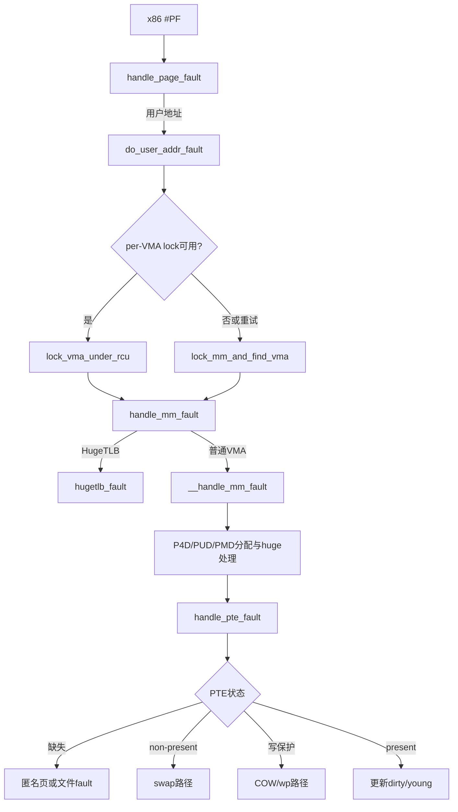

# `do_user_addr_fault` 到 `handle_pte_fault` 详解

> 源码位置：`arch/x86/mm/fault.c:1215`、`mm/memory.c:451`、`mm/memory.c:6514`、`mm/memory.c:6604`、`mm/memory.c:6841`
> 主线：x86 页故障异常 → 用户地址合法性与 VMA 锁 → 通用 fault 环境 → PGD/P4D/PUD/PMD 遍历或分配 → PTE 状态分派。
> 分析基线：当前 kernel-graph MCP 索引；本地源码工作树为 Linux `v7.3-rc2`。`do_user_addr_fault()` 是 x86 特有实现，其后的四个函数属于通用 MM。

## 一、大白话总览

### （a）为什么需要这组函数？

CPU 访问虚拟地址失败时只提供“地址、访问类型、硬件错误码”。它不知道该地址是否属于合法 VMA，也不知道内核应分配匿名页、从文件读页、换入 swap、执行 COW、处理 NUMA hinting，还是给进程发信号。

这组函数把问题逐层翻译：

- `do_user_addr_fault()`：把 x86 异常语义翻译成通用 `FAULT_FLAG_*`，找到并锁住 VMA，负责重试和最终信号/OOM处理。
- `handle_mm_fault()`：建立通用 fault 外围环境，检查架构权限，接入 memcg/LRU 统计，并区分 HugeTLB 与普通页表。
- `__handle_mm_fault()`：构造 `vm_fault`，沿 PGD→P4D→PUD→PMD 前进，途中处理 PUD/PMD 大页。
- `__pte_alloc()`：只在确实需要小页 PTE 表时分配候选页表页，并用“锁内竞争安装、失败者释放”解决并发 fault。
- `handle_pte_fault()`：读取 PTE 快照，按缺失、非 present、PROT_NONE、写保护或正常 present 分派。

如果没有这些层次，架构异常代码会和文件系统、swap、THP、NUMA、userfaultfd、COW、memcg 全部纠缠在一起，任何锁释放或返回码错误都可能造成死循环 fault、页表 UAF 或错误信号。

### （b）如果让我自己设计

#### 1. 一句话降级

拿着出错地址先查“这块地能不能这样访问”，再沿目录找到缺失的最小一级，补目录或处理已有条目的特殊状态，最后把结果翻译成重试、成功或信号。

#### 2. 最小模型

```text
CPU fault(address, read/write/exec)
        │
        ▼
查 VMA 与权限
        │
        ▼
PGD → P4D → PUD → PMD → PTE
                         │
          ┌──────────────┼───────────────┐
          ▼              ▼               ▼
       PTE 缺失       PTE 写保护      PTE 已可访问
       分配/读入       执行 COW        更新 young/dirty
```

输入是寄存器现场、fault 地址和访问属性；核心数据是 `mm_struct`、VMA、各级页表项与 `vm_fault`；成功出口是硬件重试后能够完成访问，错误出口是明确的 `VM_FAULT_*`，由架构层转成 OOM、SIGBUS 或 SIGSEGV。

#### 3. 核心数据对象

| 对象 | 角色 |
|---|---|
| `pt_regs` | 异常现场，判断用户/内核模式并用于修复或发信号 |
| x86 `error_code` | 硬件报告的 present/protection、读写、用户、取指、保留位、PK、shadow-stack 状态 |
| `mm_struct` | 地址空间总账，提供 VMA 索引、页表根和全局页表锁 |
| `vm_area_struct` | 地址范围规则，定义权限、匿名/文件属性、THP和 userfaultfd 行为 |
| `vm_fault` | 通用 fault 工单，把地址、flags、页偏移、分配掩码和当前页表位置一路传下去 |
| `vm_fault_t` | 结果位图，可同时表达 major、retry、completed、OOM、信号等 |
| `vmf->pte/ptl/orig_pte` | PTE 指针、保护它的锁和本次判断使用的稳定快照 |

#### 4. 真实复杂度来源

- fault 可能来自用户态，也可能是内核访问用户地址；“用户地址”不等于“用户模式”。
- VMA 查找有 per-VMA lock 快路径和 `mmap_lock` 慢路径，fault handler 还可能主动释放锁并要求重试。
- 页表层级可折叠；PUD/PMD 位置可能是普通目录、大页、迁移项或设备私有项。
- PTE 的 non-present 位型不仅是“空”，还编码 swap 等软件状态。
- 多个 CPU 可能同时为同一地址分配同一级页表，必须允许竞争但只能安装一个。
- 文件 fault、THP、userfaultfd 和 I/O 可能睡眠；返回时原 VMA 甚至已经被删除。

#### 5. 自己实现的大致步骤

1. 拒绝保留位损坏、SMAP违规、无 mm、禁止 fault 上下文等不可恢复情形。
2. 把硬件错误码正规化为通用 fault flags。
3. 优先尝试 per-VMA lock；不适用、失败或要求 retry 时退到 `mmap_lock`。
4. 验证 VMA权限，进入通用 fault；对 retry/completed/error严格遵循锁所有权约定。
5. 初始化 `vm_fault`，从 PGD逐级取得下一层；缺层时先分配候选、锁内安装。
6. PUD/PMD若是大页，在当前层直接处理；否则进入 PTE。
7. PTE层按缺失、swap、NUMA/userfault、COW或访问位更新分派。
8. 回到架构层更新统计，并把错误翻译成 OOM或信号。

#### 6. 阅读 checklist

- 当前判断处理的是硬件异常安全、VMA权限、页表层级，还是具体页面内容？
- 当前持有 per-VMA lock、`mmap_lock`、`page_table_lock` 还是 PTE lock？
- 某个返回值是否意味着下层已经释放锁？
- 该表项是空、non-present软件项、普通 present项，还是 huge项？
- 分配发生在锁外，安装为何必须在锁内？竞争失败的新页表由谁释放？
- 为什么这里延迟 PTE 表分配？是否在给大页留下机会？
- fault 是第一次还是 retry？信号能否打断它？
- VMA 在调用下层后还能否解引用？

### （c）它是怎么设计的？

设计核心是“逐层缩小问题，并让每层拥有自己的锁和结果协议”。x86 层只处理异常现场和用户可见结果；通用入口负责跨子系统记账；页表遍历层处理目录与大页；PTE层处理页面语义。返回值使用位图而非单一 errno，因为一次 fault 可能既是 major fault，又要求 retry或已经释放锁完成。

### （d）主要情况

| 条件 | 动作 | 原因 |
|---|---|---|
| x86 保留位错误、SMAP违规、无合法上下文 | oops、fixup或信号，不进入通用 MM | 这不是可以靠分配页面修复的缺页 |
| 用户模式且 per-VMA lock 成功 | 快速调用 `handle_mm_fault(...VMA_LOCK)` | 避免全 mm 的 `mmap_lock` 争用 |
| 快路径失败或 retry | 用 `mmap_lock` 重新查 VMA | VMA可能已变化，不能沿用旧指针 |
| HugeTLB VMA | `hugetlb_fault()` | HugeTLB有独立页表与配额语义 |
| PUD/PMD允许 THP | 尝试 huge fault，失败才 fallback | 优先建立大映射，避免先暴露小页表 |
| PTE缺失 | 匿名走 `do_anonymous_page()`，文件走 `do_fault()` | 后备来源不同 |
| PTE non-present | `do_swap_page()` | 软件项需要换入或处理迁移/设备状态 |
| PTE PROT_NONE且可访问 | userfaultfd RWP或 NUMA fault | PROT_NONE在这里是软件采样/拦截状态 |
| present但写保护 | `do_wp_page()` | 建立COW或升级可写权限 |
| present且权限足够 | 更新 dirty/young和架构MMU缓存 | 多为访问位 fault或伪 fault |

## 二、控制流骨架

### 2.1 x86 `do_user_addr_fault()`

```text
do_user_addr_fault(regs, error_code, address)
│
├─ [内核模式从用户地址取指]
│  ├─ AMD erratum 93 → return
│  └─ 其他 → page_fault_oops → return
├─ [kprobe接管 / RSVD损坏 / SMAP违规 / 禁止fault或无mm / IF异常]
│  └─ 对应处理 → return或终止
├─ 开中断、记录perf fault、构造WRITE/INSTRUCTION/USER flags
├─ [x86-64 vsyscall地址] → 尝试模拟 → 成功则return
├─ [用户模式] lock_vma_under_rcu快路径
│  ├─ 无VMA → goto lock_mmap
│  ├─ 权限错误 → 发信号 → return
│  ├─ fault非RETRY → 正确结束VMA锁 → goto done
│  └─ RETRY → 记录TRIED/检查信号 → 进入慢路径
├─ lock_mmap/retry：lock_mm_and_find_vma
│  ├─ 无VMA或权限错误 → 发信号 → return
│  ├─ COMPLETED → return（下层已完成并释放锁）
│  ├─ RETRY → flags加TRIED → goto retry
│  └─ 普通完成 → mmap_read_unlock
└─ done
   ├─ 无错误 → return
   ├─ OOM → 用户态调用OOM处理；内核态fixup/oops
   ├─ SIGBUS/HWPOISON → do_sigbus
   └─ SIGSEGV → bad_area_nosemaphore
```

### 2.2 `handle_mm_fault()` 与页表层

```text
handle_mm_fault(vma, address, flags, regs)
├─ sanitize_fault_flags失败 → 记账并return
├─ arch_vma_access_permitted失败 → SIGSEGV
├─ 进入用户memcg fault与LRU-gen fault上下文
├─ HugeTLB VMA → hugetlb_fault
└─ 普通VMA → __handle_mm_fault
   ├─ p4d_alloc / pud_alloc / pmd_alloc失败 → OOM
   ├─ PUD huge路径 → 创建、写保护或更新accessed
   ├─ PUD竞争不稳定 → goto retry_pud
   ├─ PMD huge/迁移/设备私有路径 → 当前层处理
   └─ fallback → handle_pte_fault
      ├─ PTE缺失 → do_pte_missing
      ├─ non-present → do_swap_page
      ├─ PROT_NONE → do_uffd_rwp / do_numa_page
      ├─ 写保护 → do_wp_page
      └─ 正常present → 更新dirty/young
```

## 三、Mermaid 主路径



## 四、快速定位与宏观地位

```text
CPU #PF异常
└── arch/x86/mm/fault.c
    └── handle_page_fault
        └── [do_user_addr_fault：x86边界]
            └── mm/memory.c
                └── [handle_mm_fault：通用总入口]
                    └── [__handle_mm_fault：目录与大页层]
                        └── [handle_pte_fault：PTE分派]
                            ├── [__pte_alloc：按需建PTE表]
                            ├── anonymous/file
                            ├── swap/NUMA/userfaultfd
                            └── COW/accessed/dirty
```

真实触发场景包括：首次读取匿名内存并映射共享零页；首次写匿名内存并分配私有 folio；访问尚未驻留的文件映射并产生 major fault；fork 后写私有页触发 COW；访问 swap-out 页；NUMA balancing把PTE改成PROT_NONE后再次访问；userfaultfd注册区间由用户态处理器接管。

## 五、完整调用链

### 5.1 x86异常入口

```text
x86 page-fault entry
└── handle_page_fault()                 // arch/x86/mm/fault.c:1470
    ├── do_kern_addr_fault()            // 内核地址
    └── do_user_addr_fault()            // arch/x86/mm/fault.c:1215
        ├── lock_vma_under_rcu()        // per-VMA lock快路径
        ├── lock_mm_and_find_vma()      // mmap_lock慢路径
        └── handle_mm_fault()           // mm/memory.c:6841
            ├── hugetlb_fault()
            └── __handle_mm_fault()     // mm/memory.c:6604
                └── handle_pte_fault()  // mm/memory.c:6514
```

`handle_mm_fault()` 也被 GUP fault-in、HMM、IOMMU SVA以及其他架构异常入口调用，因此不能包含 x86错误码或x86信号细节。

### 5.2 PTE页表分配链

```text
handle_pte_fault()
└── do_pte_missing()
    ├── do_anonymous_page()
    │   └── pte_alloc宏
    │       └── [PMD为空] __pte_alloc()
    └── do_fault()
        └── read/COW/shared file fault
            └── 按需要预分配并安装PTE表

__pte_alloc()
├── pte_alloc_one()       // 架构分配并初始化PTE页
├── pmd_install()         // 锁内竞争安装
└── pte_free()            // 竞争失败者释放自己的候选页
```

kernel-graph直接调用图看不到宏 `pte_alloc()` 展开后的 `__pte_alloc()` 边；上述连接由MCP源码片段中的宏定义和 `do_anonymous_page():5444` 调用共同确认。

## 六、x86 `do_user_addr_fault()` 逐段详解

### 6.1 先排除不能交给MM修复的异常（1226—1286）

`current->mm` 是目标地址空间。函数名中的 user 指“用户地址范围”，内核执行 `copy_from_user()` 等操作时也可能进入这里。

- 仅有 `X86_PF_INSTR`、没有 `X86_PF_USER`：内核试图从用户地址执行，除AMD erratum 93外不可恢复。
- `kprobe_page_fault()` 异常返回：kprobe不应截获伪fault，WARN后退出。
- `X86_PF_RSVD`：用户页表项设置了硬件保留位，属于页表损坏。
- SMAP开启、supervisor访问且AC位未开：非法内核访问用户页，不尝试普通VMA fault。
- `faulthandler_disabled()` 或无 `mm`：当前上下文不能睡眠/没有用户地址空间，走无锁错误处理。
- IF位意外关闭：当前代码把它视为遗留一致性检查失败。

### 6.2 硬件错误码到通用flags（1288—1329）

异常入口起初关闭中断；通过安全检查后重新开启，以允许后续分配、I/O和调度，返回 `handle_page_fault()` 时会再次关闭。

| x86信息 | 通用flag/动作 |
|---|---|
| `X86_PF_SHSTK` | 强制 `FAULT_FLAG_WRITE`，确保先破COW再建shadow-stack PTE |
| `X86_PF_WRITE` | `FAULT_FLAG_WRITE` |
| `X86_PF_INSTR` | `FAULT_FLAG_INSTRUCTION` |
| `user_mode(regs)` | `FAULT_FLAG_USER` |

`FAULT_FLAG_USER` 故意依据寄存器特权级而不是硬件 `X86_PF_USER` 位，因为某些用户操作可产生system page fault，但语义仍是用户访问。x86-64 vsyscall没有真实VMA，必须在VMA查找前模拟。

### 6.3 per-VMA lock快路径（1331—1362）

只有真正用户态fault尝试 `lock_vma_under_rcu()`。成功后先用 `access_error()` 验证读写、执行和pkey等权限，再携带 `FAULT_FLAG_VMA_LOCK` 调通用入口。

若结果既不是 `RETRY` 也不是 `COMPLETED`，调用者仍持VMA读锁，必须 `vma_end_read()`；这两个返回状态意味着下层已经按协议处理锁。无retry则完成。retry时旧VMA指针不再可信，记录统计；major fault还把 `TRIED` 带到慢路径，并优先响应信号。

### 6.4 `mmap_lock`慢路径与重试（1363—1422）

`lock_mm_and_find_vma()` 获取mm读锁并重新定位VMA，必要时也处理合法栈扩展。无VMA或权限不符立即转成bad area。

第一次 fault带 `ALLOW_RETRY`。下层若需要长等待，可以释放 `mmap_lock` 返回 `VM_FAULT_RETRY`；上层设置 `FAULT_FLAG_TRIED` 后从头重新查VMA，绝不能复用旧指针。`VM_FAULT_COMPLETED` 表示工作和解锁都完成，直接返回；普通结果才由本层 `mmap_read_unlock()`。

### 6.5 结果翻译（1423—1457）

无 `VM_FAULT_ERROR` 即成功。OOM在用户态进入 `pagefault_out_of_memory()`，内核态访问则尝试异常表修复或oops；SIGBUS/HWPOISON走 `do_sigbus()`；SIGSEGV走bad-area路径。未知错误位触发BUG，防止静默无限重试。

## 七、`handle_mm_fault()` 逐段详解

1. `__set_current_state(TASK_RUNNING)`：fault路径可能来自将任务状态设成睡眠的调用点，进入可睡眠处理前恢复一致状态。
2. `sanitize_fault_flags()`：拒绝WRITE+UNSHARE、不可写映射上的非法写fault，以及per-VMA lock与RETRY_NOWAIT的非法组合。
3. `arch_vma_access_permitted()`：在通用VMA flags之外检查架构权限，例如x86 protection keys。
4. 缓存 `is_droppable`：下层可能释放锁并使VMA失效，后面不能再读 `vma->vm_flags`。
5. 用户fault进入memcg OOM上下文，所有普通/hugetlb fault进入LRU-gen fault上下文。
6. HugeTLB VMA走 `hugetlb_fault()`；其他走 `__handle_mm_fault()`。
7. 下层返回后禁止再次解引用VMA；退出LRU上下文，对 `VM_DROPPABLE` 清除OOM致命位。
8. 退出memcg上下文；若memcg曾进入OOM但fault已被优雅处理，则同步清理OOM状态。
9. 所有出口统一调用 `mm_account_fault()` 记录major/minor等统计。

`vm_fault_t` 是位图：例如 `VM_FAULT_MAJOR|VM_FAULT_RETRY` 可以同时成立。最重要的控制位是 `RETRY`（重新查找）、`COMPLETED`（fault处理和解锁均已完成）、`FALLBACK`（大页降级）和 `VM_FAULT_ERROR` 集合。

## 八、`__handle_mm_fault()` 逐级详解

### 8.1 构造 `vm_fault`（6607—6619）

`address` 按页对齐用于页表操作，`real_address` 保留原始字节地址；`pgoff` 把虚拟地址换算成VMA内逻辑页偏移，文件fault优先使用它；`gfp_mask` 根据VMA获得分配约束。函数缓存 `vm_flags`，同样是为了避免后续可能解锁后再读VMA。

### 8.2 PGD、P4D、PUD（6621—6654）

`pgd_offset()`只定位已有根中的条目。`p4d_alloc()` / `pud_alloc()` 是“若父项为空则分配，否则直接求offset”的内联包装；层级折叠的架构可能根本不分配实体页。

PUD为空且VMA允许PUD阶THP时先 `create_huge_pud()`；只有返回 `VM_FAULT_FALLBACK` 才继续小一级。已有PUD huge项时，写入只读项走 `wp_huge_pud()`，普通访问只更新accessed。

### 8.3 PMD层与竞争（6656—6707）

`pmd_alloc()`失败返回OOM。若它与huge PUD建立并发，`pud_trans_unstable()` 要求回到 `retry_pud`，避免把已变化的目录当普通PUD。

PMD为空且允许PMD THP时先尝试 `create_huge_pmd()`。对已有项先无锁取 `orig_pmd` 快照：

- 空：进入PTE fallback。
- non-present device-private：专用恢复。
- migration entry：等待迁移完成，让CPU重新fault。
- THP PROT_NONE：userfaultfd RWP或NUMA处理。
- THP写保护：`wp_huge_pmd()`。
- THP权限足够：锁PMD，更新accessed；若无需改变则修复伪fault。
- 普通PMD：进入 `handle_pte_fault()`。

## 九、各级页表“锁外分配、锁内安装”

`__p4d_alloc()`、`__pud_alloc()`、`__pmd_alloc()` 与 `__pte_alloc()` 使用同一竞争模型：

```text
CPU0 分配候选表 ─┐
                  ├─ 获取父项锁 → 只有一个CPU populate
CPU1 分配候选表 ─┘                    └─ 失败者释放候选表
```

分配可能睡眠，不能长时间持页表锁；允许重复分配比把慢分配放进全局锁更有伸缩性。安装前 `smp_wmb()` 保证页表页清零、锁和元数据初始化先于父项对其他CPU可见。P4D/PUD多用 `mm->page_table_lock`，PMD使用 `pud_lock()`；具体锁粒度受架构配置影响。

## 十、`__pte_alloc()` 逐行详解

```c
int __pte_alloc(struct mm_struct *mm, pmd_t *pmd)
{
    pgtable_t new = pte_alloc_one(mm);
    if (!new)
        return -ENOMEM;

    pmd_install(mm, pmd, &new);
    if (new)
        pte_free(mm, new);
    return 0;
}
```

`pte_alloc_one()` 是架构接口，分配并初始化PTE页。`pmd_install()` 获取对应PMD锁；若PMD仍为空，增加 `pgtables_bytes` 统计、执行写屏障并 `pmd_populate()`，随后把 `new` 置NULL表示所有权已转移给mm。若另一CPU已安装，`new` 保持非NULL，调用者释放自己的候选页。这不是错误：目标PTE表已经存在，所以返回0。

调用宏：

```c
#define pte_alloc(mm, pmd) \
    (unlikely(pmd_none(*(pmd))) && __pte_alloc(mm, pmd))
```

因此已有PTE表不分配；只有父PMD看起来为空才进入慢函数。并发变化最终由 `pmd_install()` 锁内复查裁决。

## 十一、`handle_pte_fault()` 逐段详解

### 11.1 为什么先不分配PTE表（6518—6527）

若PMD为空，函数把 `vmf->pte=NULL` 并清 `ORIG_PTE_VALID`，直接让后续 missing handler决定。原因是文件 `vm_ops->fault` 仍可能建立大页；若这里瞬间发布小PTE表，并发fault和rmap已经能看到它，再撤销以换大页会非常困难。

### 11.2 读取PTE快照（6528—6555）

已有普通PMD时，用 `pte_offset_map_rw_nolock()` 映射PTE并取得其锁指针，但暂不加锁；映射失败通常表示文件/shmem THP collapse并发改变PMD，返回0让硬件稍后重试。

随后无锁读 `orig_pte` 并设置有效标志。如果PTE为空，先解除临时映射并把指针清NULL，统一进入missing路径；保留一个跨睡眠阶段的裸PTE指针是不安全的。

### 11.3 五类分派（6557—6572）

1. `!vmf->pte`：`do_pte_missing()`；匿名VMA走 `do_anonymous_page()`，文件VMA走 `do_fault()`。
2. `!pte_present(orig_pte)`：`do_swap_page()`；名字虽是swap，也承接多种编码在non-present PTE中的软件状态。
3. `pte_protnone`：若带userfaultfd RWP位，走 `do_uffd_rwp()`；否则是NUMA hinting，走 `do_numa_page()`。

匿名缺页中，读fault通常可映射共享零页；写fault准备anon_vma、分配anon folio并安装PTE。文件缺页再按read、私有写COW、共享写分到 `do_read_fault()`、`do_cow_fault()`、`do_shared_fault()`。

### 11.4 加锁复查与present处理（6574—6595）

无锁快照只用于选择方向，真正修改前必须拿 `vmf->ptl` 并用 `pte_same()` 复查。若表项已变化，本轮不覆盖别人结果，只同步MMU/TLB状态后退出。

写或UNSHARE fault遇到只读PTE时，直接把锁和PTE上下文交给 `do_wp_page()`；它负责COW及对应解锁，所以这里不能再落到统一unlock。已有写权限的写fault只需置dirty。所有正常present访问置young，再通过 `ptep_set_access_flags()` 原子更新；改变时调用 `update_mmu_cache_range()`，无需改变则走 `fix_spurious_fault()`。普通出口最终 `pte_unmap_unlock()`。

## 十二、锁与指针有效期总表

| 阶段 | 主要保护 | 指针规则 |
|---|---|---|
| VMA快路径 | per-VMA read lock + RCU查找 | RETRY/COMPLETED后由协议决定锁已释放 |
| VMA慢路径 | `mmap_lock`读锁 | RETRY时锁已释放，必须重新查VMA |
| 目录安装 | `page_table_lock`或父级分裂锁 | 锁外候选不能发布，锁内populate后归mm所有 |
| PTE判型 | lockless snapshot | 只能用于分派，修改前必须锁内 `pte_same()` |
| PTE修改 | `vmf->ptl` | `pte/ptl` 只在持锁期间有效 |
| fault下层返回 | 可能已释放VMA/mm锁 | `handle_mm_fault()` 6880之后禁止解引用VMA |

## 十三、关键设计决策

- 为什么先VMA后页表：页表项存在不代表访问符合VMA软件策略，权限与后备对象必须先确定。
- 为什么快路径只用于用户fault：内核访问用户地址需要更复杂的异常表和修复语义，慢路径更容易维持锁约定。
- 为什么多次retry而不死等：I/O、userfaultfd和迁移可能需要释放大锁；重新查找允许并发munmap/mprotect进展。
- 为什么大页优先于PTE分配：一旦发布小页表，其他CPU和rmap会观察它，大页替换的并发成本显著增加。
- 为什么无锁读后锁内复查：常见present fault减少持锁范围，同时防止用过时快照覆盖并发结果。
- 为什么竞争分配返回成功：loser虽然释放候选页，但winner已经满足“该层存在”的目标。
- 为什么返回位图：锁状态、I/O性质和错误原因是正交信息，单一errno无法表达。

## 十四、结果与排错矩阵

| 现象 | 优先检查 |
|---|---|
| 同一地址无限fault | RETRY/TRIED协议、PTE权限、TLB更新、spurious fault路径 |
| 合法地址却SIGSEGV | VMA查找、栈扩展、`access_error()`、pkey、sanitize flags |
| 文件越界访问SIGBUS | `vm_ops->fault`、`do_fault()`和文件大小竞争 |
| fork后首次写fault | `do_wp_page()`、anon rmap、COW引用与写保护 |
| 页表页泄漏 | `pmd_install()`竞争失败后的 `pte_free()`、各级统计 |
| THP总是降级 | VMA allowable条件、提前暴露PTE表、`VM_FAULT_FALLBACK` |
| 只在并发collapse时复现 | PMD/PTE lockless snapshot、map失败重试和 `pud_trans_unstable()` |
| memcg OOM状态残留 | enter/exit user fault与 `mem_cgroup_oom_synchronize()` |

## 十五、整条路径一句话

x86 CPU对用户地址触发 #PF 后，`do_user_addr_fault()` 先排除不可恢复异常、把硬件错误码转成通用flags，并在per-VMA lock或 `mmap_lock` 下找到合法VMA；`handle_mm_fault()` 建立memcg/LRU/架构权限与统计环境；`__handle_mm_fault()` 构造 `vm_fault` 并逐级分配或处理P4D/PUD/PMD及大页；普通PMD最终交给 `handle_pte_fault()`，由它根据PTE缺失、swap、NUMA/userfaultfd、写保护或present状态选择页面动作，而 `__pte_alloc()` 只在小页路径真正需要时用锁外分配、锁内竞争安装的方式发布PTE页表。

读完应能回答：

1. 为什么 `do_user_addr_fault()` 也能处理内核模式访问用户地址？
2. `X86_PF_USER` 与 `FAULT_FLAG_USER` 为什么不能简单等同？
3. per-VMA lock快路径如何退回 `mmap_lock`？
4. `VM_FAULT_RETRY` 和 `VM_FAULT_COMPLETED` 对锁意味着什么？
5. 为什么 `handle_mm_fault()` 调用下层后不能再访问VMA？
6. 页表层级折叠时 `p4d_alloc()` 是否一定分配物理页？
7. 为什么PUD/PMD huge fault必须先于PTE表发布？
8. 两个CPU同时 `__pte_alloc()` 为什么不算错误？
9. PTE为空与PTE non-present有什么本质差别？
10. `pte_same()` 为什么必须在拿锁后重新检查？
