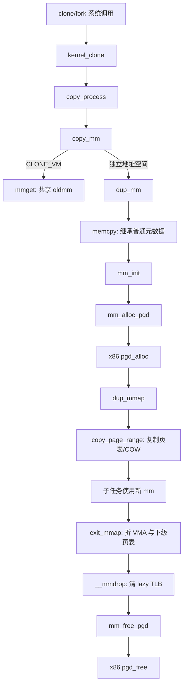

# `dup_mm` 与 x86 `pgd_alloc` / `pgd_free` 详解

> 源码位置：`kernel/fork.c:1527`、`arch/x86/mm/pgtable.c:311`、`arch/x86/mm/pgtable.c:365`
> 关联主线：`copy_mm()` → `dup_mm()` → `mm_init()` / `dup_mmap()` → `copy_page_range()`；根页表最终经 `mm_free_pgd()` → 架构 `pgd_free()` 释放。
> 分析基线：当前 kernel-graph MCP 索引；本地源码工作树为 Linux `v7.3-rc2`。同名 `pgd_alloc()` / `pgd_free()` 在多个架构中各有实现，本文逐行部分只解释 x86。

## 一、大白话总览

### （a）为什么要设计这组函数？

`fork()` 需要给子进程一套看起来与父进程相同、但能独立演化的地址空间。内核不能只把父进程的 `mm_struct` 指针交给子进程：那是 `CLONE_VM` 的共享语义，不是普通 fork。也不能把父进程的整套页表逐页复制：代价太高，而且私有可写页本来就可以先共享，等一方写入时再 COW。

因此这条路径分成三件事：

- `dup_mm()` 建立复制事务：取得子 `mm_struct`，继承可复制的普通元数据，重建不能裸复制的资源，然后复制 VMA 和页表。
- x86 `pgd_alloc()` 为新 mm 建立可用的页表根及架构强制骨架，但不负责复制父进程全部用户 PTE。
- x86 `pgd_free()` 在下级用户映射已经拆除后，撤销 x86 构造阶段留下的 PMD、全局登记和虚拟化状态，最后释放根页。

没有这种分层，锁、引用计数、Maple Tree、PGD、架构 context 和 VMA 文件引用很容易被错误共享；失败时也无法判断哪些资源属于父进程、哪些属于半构造的子进程。

### （b）如果让我自己设计，第一反应是什么？

#### 1. 一句话降级

复制父进程的“地址空间档案”，但给子进程换上自己的锁、目录根和资源所有权；内容页先共享，写入时再分家。

#### 2. 最小模型

先忽略锁、文件映射、userfaultfd、KSM、hugetlb、PTI、PAE、虚拟化和失败回滚：

```text
父 oldmm
├── VMA 规则 ───────────────┐
└── PGD → ... → PTE → folio │
                            ▼
                        dup_mm()
                            │
                            ▼
子 mm：新 PGD + 新 VMA/PTE ──┘
                 │
                 └── 私有可写页：父子 PTE 都先只读，共享 folio
```

输入是父地址空间 `oldmm` 和未来拥有它的子任务 `tsk`；成功出口是一份具有独立管理对象、独立页表页但可共享物理数据页的子地址空间；失败出口是不留下半初始化的子 mm。

#### 3. 核心数据对象

| 对象/字段 | 类比 | 在本路径中的角色 |
|---|---|---|
| `oldmm` | 父档案 | 提供布局、VMA、页表项和可继承元数据 |
| 新 `mm_struct` | 子档案 | 拥有自己的树、锁、计数、PGD 和架构上下文 |
| `mm->mm_mt` | 地址区间目录 | `dup_mmap()` 先复制 Maple Tree 形状，再逐个替换成新的 VMA |
| `mm->pgd` | 新目录根 | 由 `mm_init()` → `mm_alloc_pgd()` → x86 `pgd_alloc()` 建立 |
| `vm_area_struct` | 映射规则卡片 | 决定某段地址是否复制、清空以及页表是否需要 COW |
| `write_protect_seq` | 写保护版本章 | fork 降低父 PTE 权限时，让无锁观察者识别并发变化 |
| `ptdesc` | 页表页档案 | x86 用它登记 PGD 所属 mm、链表节点和页表页生命周期 |

#### 4. 真实复杂度从哪里来？

- `memcpy(mm, oldmm, ...)` 会暂时复制锁、指针和引用；`mm_init()` 必须在对象发布前重建所有独占资源。
- VMA 有 `VM_DONTCOPY`、`VM_WIPEONFORK`、文件映射、匿名反向映射、内存策略和 userfaultfd 等不同语义。
- COW 不只是复制子 PTE，还要写保护父 PTE，并通知 KVM/IOMMU 等二级 MMU 消费者。
- x86 根布局受 PAE、PTI、Xen/paravirt 和 4/5 级页表配置影响。
- 任一步可能失败；清理必须只碰已经归属子 mm 的资源，并与 uprobe begin/end 配对。

#### 5. 如果自己实现，大概步骤

1. 分配子 `mm_struct` 外壳并复制父地址空间的普通布局元数据。
2. 调用统一构造器，重新初始化树、锁、引用、计数、PGD、ID 和架构 context。
3. 锁住父、子地址空间，复制 VMA 目录和每个 VMA 的附属引用。
4. 对需要复制的 VMA 建立子页表；私有可写映射在父子两侧建立 COW 写保护。
5. 完成架构、KSM、THP、userfaultfd 和水位统计等外围状态。
6. 若失败，先清已复制的 VMA/页表，再通过 `mmput()` 走完整 mm 销毁；若根构造自身失败，则由 `mm_init()` 内部逆序回滚。
7. 地址空间最终退出时，先拆用户页表和 VMA，确认 lazy TLB 不再引用，再调用架构 `pgd_free()`。

#### 6. 源码阅读 checklist

- 这一字段是允许从父 mm 继承，还是必须由 `mm_init()` 重建？
- 当前动作只创建页表根，还是已经复制了某个 VMA 的下级页表？
- 分支对应 `CLONE_VM`、`VM_DONTCOPY`、`VM_WIPEONFORK`，还是普通 COW？
- 父 PTE 权限被降低时，谁负责 MMU notifier、序列计数和 TLB 一致性？
- 当前失败发生在 `mm_init()` 之前、`dup_mmap()` 中途，还是 binfmt 引用阶段？
- x86 当前配置是否启用 PAE、PTI 或 paravirt？分配了一个 PGD 还是连续两个 PGD？
- `pgd_list` 的观察者能否看见只完成一半预填充的根？
- `pgd_free()` 执行前，普通用户 PTE/PMD 是否已经由 `exit_mmap()` / `free_pgtables()` 清完？

### （c）它是怎么设计的？

核心设计是“复制值，重建所有权，延迟复制物理数据”。`dup_mm()` 先用整块复制继承大量地址空间属性，再立即调用 `mm_init()` 覆盖所有不能共享的基础设施；`dup_mmap()` 复制 VMA 和页表结构；数据 folio 通过 COW 共享。架构差异只从 `mm_alloc_pgd()` 分派到 `pgd_alloc()`，所以通用 fork 代码不需要知道 x86 的 PTI、PAE 或 Xen 约束。

### （d）它处理哪几种情况？

| 情况 | 做法 | 原因 |
|---|---|---|
| `copy_mm()` 发现当前任务没有用户 mm | 不调用 `dup_mm()` | 内核线程没有普通用户地址空间可复制 |
| 带 `CLONE_VM` | `mmget(oldmm)`，父子共享同一 mm | 这是线程式共享地址空间语义 |
| 普通 fork/不带 `CLONE_VM` | 调 `dup_mm()` 创建独立 mm | VMA 和页表管理状态必须独立演化 |
| VMA 标记 `VM_DONTCOPY` | 从子 Maple Tree 清掉该范围 | 该映射明确不继承 |
| VMA 标记 `VM_WIPEONFORK` | 复制 VMA 规则但不复制页表/anon_vma | 子进程保留地址范围，内容从零开始 |
| 普通私有可写 VMA | 复制页表并写保护父子 PTE | 以共享物理页实现延迟 COW |
| x86 非 PAE | PMD 预分配数组为 0 | 没有 PAE 顶层更新约束 |
| x86 PAE | 预分配顶层使用的 PMD | 避免进程早期频繁修改顶层并反复重载 CR3 |
| x86 PTI | order-1 分配两页根，并准备受限用户视图 | 内核/用户页表视图需要成对、对齐布局 |

## 二、控制流骨架

### 2.1 `dup_mm()`

```text
dup_mm(tsk, oldmm)
│
├─ allocate_mm()
│  ├─ [失败] → goto fail_nomem → return NULL
│  └─ [成功] → 取得子 mm 外壳
├─ memcpy(mm, oldmm)
│  └─ 暂时继承父 mm 的普通元数据
├─ mm_init(mm, tsk)
│  ├─ [失败] → mm_init 已自行回滚并释放外壳 → return NULL
│  └─ [成功] → 子 mm 拥有独立锁、树、引用、PGD 和 context
├─ uprobe_start_dup_mmap()
├─ err = dup_mmap(mm, oldmm)
│  ├─ [失败] → goto free_pt
│  └─ [成功] → uprobe_end_dup_mmap()
├─ 更新 hiwater_rss / hiwater_vm
├─ 尝试持有 binfmt 模块引用
│  ├─ [失败] → goto free_pt
│  └─ [成功] → return mm
└─ free_pt
   ├─ 清 `mm->binfmt`，防止释放未取得的模块引用
   ├─ 清 owner，mmput(mm) 销毁半成品
   ├─ [err != 0] → 补做 uprobe_end_dup_mmap()
   └─ return NULL
```

### 2.2 x86 `pgd_alloc()`

```text
pgd_alloc(mm)
│
├─ pgd = _pgd_alloc(mm)
│  └─ [失败] → return NULL
├─ mm->pgd = pgd
├─ [PAE] 预分配 kernel-side PMDs
│  └─ [失败] → _pgd_free → return NULL
├─ [PAE + PTI] 预分配 user-view PMDs
│  └─ [失败] → free kernel PMDs → _pgd_free → return NULL
├─ paravirt_pgd_alloc(mm)
│  └─ [失败] → free user PMDs → free kernel PMDs → _pgd_free → return NULL
├─ spin_lock(pgd_lock)
│  ├─ pgd_ctor：复制必要内核项，登记 mm，加入 pgd_list
│  ├─ 预填充 kernel-side PMDs
│  └─ 预填充 PTI user-view PMDs
├─ spin_unlock(pgd_lock)
└─ return pgd
```

### 2.3 x86 `pgd_free()`

```text
pgd_free(mm, pgd)
│
├─ pgd_mop_up_pmds()：拆除构造期预置 PMD
├─ pgd_dtor()：在 pgd_lock 下移出 pgd_list
├─ paravirt_pgd_free()：通知虚拟化后端
└─ _pgd_free()：页表页析构并释放根分配
```

## 三、生命周期 Mermaid 图



## 四、快速定位与宏观地位

- 子系统：进程创建 + 虚拟内存 + x86 页表管理。
- `dup_mm()`：普通 fork 创建独立地址空间的事务入口。
- x86 `pgd_alloc()`：构造能被 x86 页表机制和内核映射同步逻辑接受的根。
- x86 `pgd_free()`：只负责架构根及构造期骨架，不替代通用用户页表销毁。
- 通用位置：`kernel/fork.c:1527`。
- x86 位置：`arch/x86/mm/pgtable.c:311`、`:365`。
- 页表复制入口：`mm/memory.c:1588` 的 `copy_page_range()`。

### 4.1 所属层次

```text
┌────────────────────────────────────────────────────────┐
│ 用户 fork/vfork/clone/clone3                           │
└───────────────────────┬────────────────────────────────┘
                        ▼
┌────────────────────────────────────────────────────────┐
│ kernel_clone → copy_process → copy_mm                  │
│                  ├─ CLONE_VM：共享                     │
│                  └─ 独立：[dup_mm 在这里]              │
└───────────────────────┬────────────────────────────────┘
                        ▼
┌────────────────────────────────────────────────────────┐
│ mm_init → mm_alloc_pgd → [x86 pgd_alloc 在这里]        │
└───────────────────────┬────────────────────────────────┘
                        ▼
┌────────────────────────────────────────────────────────┐
│ dup_mmap → copy_page_range → 各级页表复制/COW          │
└───────────────────────┬────────────────────────────────┘
                        ▼
┌────────────────────────────────────────────────────────┐
│ exit_mmap → __mmdrop → mm_free_pgd                     │
│                         → [x86 pgd_free 在这里]         │
└────────────────────────────────────────────────────────┘
```

### 4.2 真实触发场景

1. 当用户调用普通 `fork()` 时：`__do_sys_fork()` → `kernel_clone()` → `copy_process()` → `copy_mm()` → `dup_mm()`。
2. 当用户调用 `clone3()` 且没有设置 `CLONE_VM` 时：`__do_sys_clone3()` 经过同一主线创建独立 mm；设置 `CLONE_VM` 则只 `mmget(oldmm)`。
3. 当用户调用 `vfork()` 时，静态调用图同样经过 `kernel_clone()` → `copy_process()` → `copy_mm()`，但当前 `__do_sys_vfork()` 固定带 `CLONE_VM`，运行时会共享父 mm，不会进入 `dup_mm()`；这也说明静态调用图必须结合 flag 分支阅读。
4. 当最后一个地址空间用户退出时：`do_exit()` → `exit_mm()` → `mmput()` → `__mmput()` → `mmdrop()` → `__mmdrop()` → `mm_free_pgd()` → x86 `pgd_free()`。

### 4.3 如果这里有 bug 会怎样？

- 错误复用父锁或树：父子并发 mmap/fault 破坏彼此结构。
- PGD 内核半区或 PTI 视图构造错误：切换 CR3 后立即 fault，甚至暴露不该出现在用户视图中的内核映射。
- COW 写保护遗漏：父子对“私有”映射的写入会互相可见。
- 回滚少释放：fork 压力下泄漏 VMA、页表页、文件或模块引用。
- `pgd_list` 过早加入/过晚删除：内核映射同步遍历看到半构造对象或已释放对象。

## 五、完整调用链路

### 5.1 向上：复制入口

```text
__do_sys_fork()                 // kernel/fork.c:2847
__do_sys_clone()/clone3()       // kernel/fork.c:2876/3048
  └── kernel_clone()            // kernel/fork.c:2712
        └── copy_process()      // kernel/fork.c:2012
              └── copy_mm()     // kernel/fork.c:1568
                    ├── CLONE_VM → mmget(oldmm)
                    └── dup_mm() // kernel/fork.c:1527 ← 本文入口

__do_sys_vfork()                // kernel/fork.c:2863
  └── kernel_clone() → copy_process() → copy_mm()
                    └── 固定 CLONE_VM → mmget(oldmm)，运行时不进 dup_mm
```

### 5.2 `dup_mm()` 向下主线

```text
dup_mm()
├── allocate_mm()               // 分配 mm_struct slab 对象
├── memcpy()                    // 继承父 mm 的值字段
├── mm_init()
│   └── mm_alloc_pgd()
│       └── pgd_alloc()         // x86: arch/x86/mm/pgtable.c:311
├── uprobe_start_dup_mmap()
├── dup_mmap()                  // mm/mmap.c:1708
│   ├── __mt_dup()              // 复制 VMA Maple Tree 形状
│   ├── vm_area_dup()           // 创建子 VMA
│   ├── anon_vma_fork()         // 连接匿名反向映射
│   └── copy_page_range()       // mm/memory.c:1588
│       └── copy_p4d_range()    // 继续逐级复制页表
├── try_module_get()            // 持有 binfmt 模块
└── [失败] mmput()
    └── __mmput()/__mmdrop()
        └── mm_free_pgd()
            └── pgd_free()
```

### 5.3 最终释放入口

```text
do_exit()
└── exit_mm()
    └── mmput()
        └── __mmput()
            ├── exit_mmap()     // 先拆 VMA、叶子映射和下级页表
            └── mmdrop()
                └── __mmdrop() // kernel/fork.c:724
                    ├── cleanup_lazy_tlbs()
                    └── mm_free_pgd()
                        └── x86 pgd_free() // arch/x86/mm/pgtable.c:365
```

> kernel-graph 对同名架构函数的全局调用图会聚合多架构结果；上面 x86 的向下边严格按 MCP 返回的 `arch/x86/mm/pgtable.c` 源码体筛选，不能把其他架构的 helper 混进来。

## 六、`dup_mm()` 逐行详解

### 6.1 分配外壳并复制父元数据（1527—1537）

```c
static struct mm_struct *dup_mm(struct task_struct *tsk,
                                struct mm_struct *oldmm)
{
    struct mm_struct *mm;
    int err;

    mm = allocate_mm();
    if (!mm)
        goto fail_nomem;

    memcpy(mm, oldmm, sizeof(*mm));
```

`tsk` 是将拥有新 mm 的子任务，`oldmm` 是父地址空间。`allocate_mm()` 只从 `mm_cachep` 取得对象，没有自动清零。这里选择整块 `memcpy`，是因为 `mm_struct` 中有大量布局属性、代码/数据/栈边界、随机化基址和默认策略需要继承。

但这一步产生的只是“模板副本”：其中复制来的 `pgd`、锁、引用计数、Maple Tree 根、链表节点、notifier 指针和架构 context 不能作为子对象直接使用。新 mm 此时绝不能发布给其他线程。

### 6.2 用 `mm_init()` 重建所有权（1539—1540）

```c
    if (!mm_init(mm, tsk))
        goto fail_nomem;
```

`mm_init()` 会重建 VMA Maple Tree、锁、两层引用计数、统计、CPU mask、notifier 空状态、PGD、mm ID、架构 context、CID 和 per-CPU 计数等。它保留的是允许继承的值语义，覆盖的是不能共享的资源语义。

关键边界：`mm_init()` 失败时会在内部按逆序清理，并最终 `free_mm(mm)`。所以此处只能返回 NULL，不能再次 `mmput()`，否则会 double free。

新 PGD 正是在这里通过：

```text
dup_mm → mm_init → mm_alloc_pgd → arch pgd_alloc
```

建立的。此时用户页表仍基本为空；父用户页表的复制发生在后面的 `dup_mmap()`。

### 6.3 复制 VMA 和页表（1542—1546）

```c
    uprobe_start_dup_mmap();
    err = dup_mmap(mm, oldmm);
    if (err)
        goto free_pt;
    uprobe_end_dup_mmap();
```

`dup_mmap()` 在锁保护下复制父 VMA 目录，建立文件、匿名 rmap、策略和 userfaultfd 等引用，并对普通 VMA 调 `copy_page_range()`。后者从父、子 PGD 对应位置向下遍历；COW 映射会先发 MMU notifier，包围 `write_protect_seq` 写段，再修改父页表权限并创建子表项。

`uprobe_start/end_dup_mmap()` 包围整个复制阶段。若 `dup_mmap()` 失败，正常的 end 尚未执行，错误路径根据非零 `err` 补做；若后面的 binfmt 引用失败，`err` 仍为 0，避免第二次 end。

### 6.4 重算水位与取得 binfmt 引用（1548—1554）

```c
    mm->hiwater_rss = get_mm_rss(mm);
    mm->hiwater_vm = mm->total_vm;

    if (mm->binfmt && !try_module_get(mm->binfmt->module))
        goto free_pt;

    return mm;
```

父进程的历史峰值不应直接成为子进程的历史峰值，因此复制完成后按子 mm 当前 RSS/虚拟页数重新建立高水位。`binfmt` 指针来自前面的模板复制；返回前必须给其模块增加引用，保证模块不会在子 mm 使用期间卸载。

### 6.5 `free_pt` 为什么这样清理（1556—1565）

```c
free_pt:
    mm->binfmt = NULL;
    mm_init_owner(mm, NULL);
    mmput(mm);
    if (err)
        uprobe_end_dup_mmap();
fail_nomem:
    return NULL;
```

- 清 `binfmt`：此路径没有成功取得模块引用，不能让 `mmput()` 按正常 mm 去 put 它。
- 清 owner：半成品不应继续表现为某任务的稳定地址空间。
- `mmput()`：`mm_init()` 已把 `mm_users` 初始化为 1，因此一次 put 会进入 `__mmput()`，统一拆除已复制的 VMA/页表，最终走到 `__mmdrop()` 和 `pgd_free()`。
- `if (err)`：区分 `dup_mmap()` 失败与其后 binfmt 失败，保证 uprobe end 恰好一次。

## 七、`dup_mmap()` 与 COW：理解 `dup_mm()` 必须补上的一层

`dup_mm()` 自己没有循环复制 PTE；它把这项工作委托给 `dup_mmap()`。当前源码的重要阶段是：

1. 可中断地写锁父 mm，再嵌套写锁尚未发布的子 mm。
2. 复制 `exe_file`、虚拟内存统计和 Maple Tree 形状。
3. 遍历父 VMA：`VM_DONTCOPY` 从子树移除；其他 VMA分配新对象并修复策略、anon_vma、文件/rmap 和回调引用。
4. `VM_WIPEONFORK` 不复制页表；普通 VMA 调 `copy_page_range()`。
5. 成功后执行 `arch_dup_mmap()`、KSM、khugepaged、userfaultfd 完成动作。
6. 中途失败时只清理已经替换为有效子 VMA 的范围，销毁 Maple Tree，并给 mm 标记 `MMF_UNSTABLE`。

`copy_page_range()` 的 COW 边界尤其重要：它只在 `vma_is_cow_mapping()` 为真时通知二级 MMU并开启 `oldmm->write_protect_seq`，因为只有这类复制会降低父 PTE 权限。共享映射不应被错误写保护，hugetlb 则走专用复制函数。

## 八、x86 `pgd_alloc()` 逐行详解

### 8.1 分配根页（311—322）

```c
pgd_t *pgd_alloc(struct mm_struct *mm)
{
    pgd_t *pgd;
    pmd_t *u_pmds[MAX_PREALLOCATED_USER_PMDS];
    pmd_t *pmds[PREALLOCATED_PMDS];

    pgd = _pgd_alloc(mm);
    if (pgd == NULL)
        goto out;
    mm->pgd = pgd;
```

`_pgd_alloc()` 调通用 `__pgd_alloc(mm, pgd_allocation_order())`。底层以 `GFP_PGTABLE_USER` 分配 `ptdesc`，执行 PGD 页表构造；`init_mm` 例外使用内核页表分配标志。

`pgd_allocation_order()` 在 PTI 开启时返回 1，即分配 8 KiB 且 8 KiB 对齐的连续两页；通过翻转地址 bit 12 可在 kernel/user 两个 4 KiB PGD 之间切换。未启用 PTI 时返回 0。

PAE 硬件自身的顶层可能只需很小空间，但 PTI/Xen 需要整页；x86 为简化生命周期统一至少按页分配。`mm->pgd` 在预分配前写入，是因为后续页表构造和 TLB helper 需要从 mm 找到当前根；失败路径仍由本函数收回。

### 8.2 预分配两组 PMD（324—330）

```c
    if (sizeof(pmds) != 0 &&
        preallocate_pmds(mm, pmds, PREALLOCATED_PMDS) != 0)
        goto out_free_pgd;

    if (sizeof(u_pmds) != 0 &&
        preallocate_pmds(mm, u_pmds, PREALLOCATED_USER_PMDS) != 0)
        goto out_free_pmds;
```

非 PAE 时三个预分配宏都是 0，编译期条件使这两步消失。PAE 时：

- `PREALLOCATED_PMDS = PTRS_PER_PGD`，为顶层各项预备 PMD。
- PTI 开启时 `PREALLOCATED_USER_PMDS = KERNEL_PGD_PTRS`，额外为用户视图中的内核部分准备 PMD，例如承载每进程 LDT 所需映射。

`preallocate_pmds()` 使用 `GFP_PGTABLE_USER`，移除 `__GFP_HIGHMEM`，因为这些页表结构必须能被内核直接寻址；对 `init_mm` 去掉记账标志。每个成功页都执行 PMD constructor、增加 `mm` 的 PMD 统计。若任一槽失败，函数清掉本组全部成功项后返回 `-ENOMEM`。

### 8.3 paravirt 与原子发布（332—349）

```c
    if (paravirt_pgd_alloc(mm) != 0)
        goto out_free_user_pmds;

    spin_lock(&pgd_lock);
    pgd_ctor(mm, pgd);
    if (sizeof(pmds) != 0)
        pgd_prepopulate_pmd(mm, pgd, pmds);
    if (sizeof(u_pmds) != 0)
        pgd_prepopulate_user_pmd(mm, pgd, u_pmds);
    spin_unlock(&pgd_lock);

    return pgd;
```

paravirt hook 允许 Xen 等后端登记新的页表根；原生配置下它是空操作。随后 `pgd_lock` 把 `pgd_ctor()` 的全局登记与 PMD 预填充包成一个原子发布区间，保证遍历 `pgd_list` 的内核映射同步代码不会看到半填充根。

`pgd_ctor()` 在非 PAE 下从 `swapper_pg_dir` 复制内核 PGD 区间；PAE 已通过预填充 PMD建立必要结构，无需这次 PGD clone。然后把 `ptdesc->pt_mm` 指向 mm，并把 `ptdesc->pt_list` 加入全局 `pgd_list`。

PAE 的 `pgd_prepopulate_pmd()` 把 PMD挂入对应 PUD，并为内核边界后的项复制 `swapper_pg_dir` 内容。PTI 的 `pgd_prepopulate_user_pmd()` 则操作成对分配中的用户 PGD，复制受限用户视图所需的内核项。

### 8.4 失败标签严格逆序（353—362）

| 失败点 | 已拥有资源 | 回滚顺序 |
|---|---|---|
| `_pgd_alloc()` | 无 | 直接返回 NULL |
| 第一组 PMD | PGD | `_pgd_free()` |
| 用户视图 PMD | PGD + 第一组 PMD | `free_pmds(first)` → `_pgd_free()` |
| paravirt hook | PGD + 两组 PMD | `free_pmds(user)` → `free_pmds(first)` → `_pgd_free()` |

注意：PGD 只有在 `pgd_ctor()` 内才加入 `pgd_list`；所有可能失败的步骤都发生在 ctor 之前，所以这些错误标签不应调用 `pgd_dtor()`。

## 九、x86 `pgd_free()` 逐行详解

```c
void pgd_free(struct mm_struct *mm, pgd_t *pgd)
{
    pgd_mop_up_pmds(mm, pgd);
    pgd_dtor(pgd);
    paravirt_pgd_free(mm, pgd);
    _pgd_free(mm, pgd);
}
```

### 9.1 `pgd_mop_up_pmds()`

它只拆 x86 `pgd_alloc()` 构造期预置的 PMD：遍历 `PREALLOCATED_PMDS`；若 PTI 启用，再切换到用户 PGD 并拆 `PREALLOCATED_USER_PMDS`。每项会清顶层链接、通知 paravirt 释放 PMD、调用 `pmd_free()` 并递减 PMD 统计。

它不是完整 `exit_mmap()` 的替代品。普通用户地址的叶子 PTE和动态下级表必须先由 `unmap_vmas()` / `free_pgtables()` 清理；根析构只收尾架构骨架。

### 9.2 `pgd_dtor()`

它在 `pgd_lock` 下把根从 `pgd_list` 删除。删除后，运行期同步内核全局映射的遍历者不再取得这个 PGD；这必须发生在底层页真正释放前。

### 9.3 paravirt 与底层释放

`paravirt_pgd_free()` 与分配时的 hook 对称，让虚拟化后端先撤销页表根状态。最后 `_pgd_free()` → `__pgd_free()` 将 PGD 转回 `ptdesc`，检查页对齐，执行页表析构并释放 order-0 或 PTI order-1 分配。

### 9.4 为什么 PGD 要到 `__mmdrop()` 才释放？

`mm_users` 归零时，`__mmput()` 负责 `exit_mmap()`，把地址空间内容拆掉；但内核仍可能通过 `mm_count` 或 lazy TLB 持有 mm。`__mmdrop()` 先 `cleanup_lazy_tlbs(mm)`，确认 CPU 不再借用它作为活动硬件上下文，随后才 `mm_free_pgd()`。因此“VMA/PTE 已拆完”和“PGD 物理页可释放”是两个不同时间点。

## 十、x86 配置矩阵

| 配置 | 根分配 | PMD 预置 | 内核映射来源 | 释放时额外动作 |
|---|---|---|---|---|
| 非 PAE、无 PTI | order-0 | 无 | `pgd_ctor()` clone 内核 PGD 区间 | 从 `pgd_list` 删除后释放根 |
| 非 PAE、启用 PTI（典型 x86-64） | order-1 成对 PGD | 此处不预分配 PMD | `pgd_ctor()` 准备内核 PGD 区间；PTI 双根由成对分配承载 | 从列表删除并释放连续双根 |
| PAE、无 PTI | 至少一整页 | `PTRS_PER_PGD` | 预填充 PMD，内核项复制自 `swapper_pg_dir` | mop up 全部预置 PMD |
| PAE + PTI | order-1 成对 PGD | 再加 user-view PMD | 分别准备内核视图和受限用户视图 | 同时清两侧预置 PMD，再释放连续根页 |
| PARAVIRT_XXL | 取决于 PAE/PTI | 同左 | 同左，并调用 paravirt hooks | 先通知后端，再释放物理根 |

配置项可以组合；表格是理解维度，不代表只有四种互斥内核构建。

## 十一、其他架构为什么位置和实现不同？

通用 MM 只依赖接口：

```text
mm_alloc_pgd(mm) → pgd_alloc(mm)
mm_free_pgd(mm)  → pgd_free(mm, mm->pgd)
```

当前 MCP 定位显示 `pgd_alloc()` 还存在于 `arch/arm/mm/pgd.c`、`arch/arm64/mm/pgd.c`、`arch/loongarch/mm/pgtable.c`、多个 PowerPC 头文件、RISC-V `asm/pgalloc.h` 等；部分简单架构的 `pgd_free()` 直接采用 `include/asm-generic/pgalloc.h`。差异来自硬件页表级数、内核/用户地址空间布局、ASID机制、KPTI 类隔离、虚拟化协议和分配对齐要求。

因此只有三条结论可跨架构直接复用：

1. `mm_init()` 通过统一接口取得根并写入 `mm->pgd`。
2. `dup_mmap()` / fault 通过架构页表类型和 helper 填充下级结构。
3. 最终根释放发生在通用地址空间内容销毁和硬件引用解除之后。

`pgd_list`、order-1 PTI 双根、PAE PMD 预分配和 paravirt 顺序都是 x86 具体实现，不能套到 ARM64、RISC-V 或 PowerPC。

## 十二、关键设计决策与不变量

| 设计/不变量 | 为什么 |
|---|---|
| 先 `memcpy`，再 `mm_init` | 高效继承大量值字段，同时重建所有独占资源 |
| `mm_init` 失败由其自身释放 | 它最清楚初始化进行到哪一级，可精确逆序回滚 |
| 根页表先建，用户页表后复制 | `copy_page_range()` 需要合法的子 PGD 作为落点 |
| VMA 语义先复制，再复制对应页表 | `VM_DONTCOPY/WIPEONFORK/COW` 决定页表动作 |
| COW 修改父权限时包围 notifier/seqcount | CPU 外的页表消费者和无锁观察者也必须看到一致变化 |
| x86 先完成所有可失败分配，再加入 `pgd_list` | 避免复杂的全局可见半对象回滚 |
| ctor + prepopulate 共用 `pgd_lock` | 列表遍历者不能看到已登记但未填完整的根 |
| `pgd_free` 只清架构骨架 | 普通用户页表应在更早的范围销毁阶段释放 |
| lazy TLB 清理早于根释放 | 防止 CPU 继续把已释放 PGD 当作 `active_mm` |

## 十三、排错索引

- fork 返回 `-ENOMEM`：先区分 `allocate_mm/mm_init` 失败，还是 `dup_mmap/copy_page_range` 中途失败。
- 只有某类 VMA 在子进程缺失：检查 `VM_DONTCOPY`，不要先怀疑页表复制。
- 子进程范围存在但读到零：检查 `VM_WIPEONFORK`。
- fork 后私有内存互相可见：追 `copy_page_range()` 的 COW 判定、父 PTE 写保护和 TLB/MMU notifier。
- x86 仅在 PTI/PAE 构建启动子进程失败：检查根分配 order、两组 PMD 预分配和错误标签。
- 内核映射更新时访问已释放页表：检查 `pgd_ctor/dtor` 与 `pgd_list` 锁序。
- `check_mm()` 报页表统计残留：先检查 `exit_mmap/free_pgtables`，因为 `pgd_free()` 不负责清普通叶子页表。

## 十四、把整条主线串成一句话

普通 fork 经 `copy_mm()` 选择 `dup_mm()` 后，先复制父 `mm_struct` 的值语义，再由 `mm_init()` 建立子进程独立的锁、树、引用、架构 context 和 x86 页表根；`dup_mmap()` 随后复制 VMA，并由 `copy_page_range()` 建立子下级页表及父子 COW 写保护；若任何阶段失败就由精确回滚或 `mmput()` 销毁半成品，而正常生命周期结束时必须先由 `exit_mmap()` 拆用户映射、由 `cleanup_lazy_tlbs()` 排除硬件借用，最后才由 x86 `pgd_free()` 清预置 PMD、注销 `pgd_list`、通知 paravirt 并释放根页。

读完应能回答：

1. 为什么 `memcpy(mm, oldmm)` 不等于错误共享父 mm？
2. `mm_init()` 与 `dup_mmap()` 分别复制/重建哪一层？
3. 新 PGD 何时建立，父用户 PTE 又何时复制？
4. `CLONE_VM`、`VM_DONTCOPY`、`VM_WIPEONFORK` 和 COW 的语义有什么不同？
5. `dup_mm()` 的 `err` 为什么还能控制 uprobe end 是否执行？
6. x86 PTI 为什么让 `pgd_allocation_order()` 返回 1？
7. PAE 为什么预分配 PMD，而非 PAE 为什么数组大小为 0？
8. `pgd_ctor()` 与 PMD 预填充为什么必须处于同一个 `pgd_lock` 区间？
9. 为什么 x86 `pgd_free()` 不能替代 `exit_mmap()`？
10. 哪些结论属于通用 MM 接口，哪些只能用于 x86？
