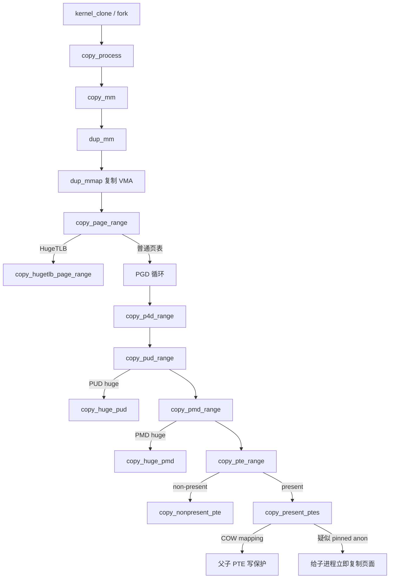

# `dup_mmap` 到 `copy_pte_range` 详解

> 源码位置：`mm/mmap.c:1708`、`mm/memory.c:1588`、`mm/memory.c:1534`、`mm/memory.c:1497`、`mm/memory.c:1460`、`mm/memory.c:1305`  
> 主线：fork 创建新 `mm_struct` 后，复制父进程的 VMA 元数据与页表层级；私有可写映射不复制全部物理页，而是把父子 PTE 改成只读，留待后续写 fault 完成 COW。  
> 分析基线：当前 kernel-graph MCP 索引；本地 Linux 源码工作树为 `v7.3-rc2`。本文分析 MMU 版本的 `mm/mmap.c::dup_mmap()`，不是 `mm/nommu.c` 的同名实现。

## 一、大白话总览

### （a）为什么要设计这条复制链？

`fork()` 要给子进程一个“看起来和父进程完全一样”的地址空间，但直接复制所有物理页面成本太高。内核因此把工作拆成两部分：

- `dup_mmap()` 复制地址空间的规则：哪些虚拟区间存在、权限是什么、对应哪个文件、采用什么 NUMA 策略、怎样参与匿名反向映射。
- `copy_page_range()` 及以下函数复制已经存在的页表状态：哪些地址已经驻留、指向什么 folio、是 swap/migration/marker 还是 present PTE。

私有可写页面的物理内容通常不立即复制。父子先共享同一 folio，同时都改成只读；以后谁写，谁通过 `do_wp_page()` 获得私有副本。这就是 fork COW 的“建约阶段”。

如果没有这一组函数，子进程或者只得到空地址空间，或者 fork 必须同步复制全部内存；如果只复制 PTE却不维护引用、rmap、RSS、swap计数和写保护，可能出现 use-after-free、父子互相污染数据或回收器看不到映射。

### （b）如果让我自己设计

#### 1. 一句话降级

先复制父进程的“地址区间目录”，再沿父页表逐级查看已填内容，把可安全共享的条目登记到子页表，把需要延后分家的页面改成只读。

#### 2. 最小模型

先忽略 HugeTLB、THP、swap、设备页、userfaultfd、锁和错误回滚：

```text
父 mm
├── VMA A [start, end, flags]
│   └── PGD → P4D → PUD → PMD → PTE → folio X
└── VMA B [start, end, flags]

                 fork
                  │
                  ▼

子 mm
├── VMA A' [相同范围和规则]
│   └── 新页表目录 → PTE → 同一个 folio X
└── VMA B' [相同范围和规则]

私有可写：父 PTE = RO，子 PTE = RO，写入时 COW
```

输入是父、子 `mm_struct` 和成对的父子 VMA；核心数据是 Maple Tree、各级页表、PTE与 folio；正常出口是子地址空间可观察到 fork 时的逻辑快照，失败出口是负 errno并完整拆除已初始化部分。

#### 3. 核心数据对象

| 对象/字段 | 在复制中的角色 |
|---|---|
| `mm_struct::mm_mt` | VMA目录；`dup_mmap()` 先复制树形骨架，再用子 VMA替换叶子中的父 VMA指针 |
| `mm_struct::pgd` | 页表根；已由 `mm_alloc_pgd()` 建好，本组函数从它向下按需建立子目录 |
| `mm_struct::write_protect_seq` | 父页表写保护事务的序列号，告诉无锁观察者 fork 正在批量降权 |
| `vm_area_struct` | 单段映射规则；连接虚拟区间、权限、文件、anon_vma、policy、userfaultfd和回调 |
| `anon_vma` / rmap | 匿名页的反向索引，使回收、迁移和 COW知道哪些 VMA映射同一 folio |
| `pte_t` / `softleaf_t` | 叶子状态；既可能是 present 映射，也可能编码 swap、migration、device-private或 marker |
| `folio` | 被父子共享或为子进程预先复制的物理内存实体，必须同步维护引用、rmap和RSS |

#### 4. 真实复杂度从哪里来

- VMA存放在 Maple Tree中；快速克隆树后，叶子暂时仍指向父 VMA，失败清理必须知道替换到了哪里。
- 并非所有 VMA都应继承：`VMA_DONTCOPY_BIT` 要删除，`VMA_WIPEONFORK_BIT` 只复制 VMA而不复制页面。
- 文件 VMA还挂在 `address_space` 的 interval tree中，并持有文件引用；匿名 VMA还需要重建 anon_vma链。
- 五级页表可折叠；PUD/PMD处可能直接是 huge映射，不能强行当下级目录解释。
- PTE既有 present页，也有 swap、迁移、设备私有和 userfaultfd marker。
- PTE批量复制同时持有父子两个 PTL，必须定期让出 CPU和锁。
- 匿名页可能被 pin。简单共享后再 COW可能破坏“被 pin 的页地址稳定”预期，因此某些页在 fork 时直接复制。
- 父 PTE降权会影响 CPU、KVM或设备二级页表，需要 MMU notifier、写保护序列和最终 TLB flush协调。

#### 5. 如果自己实现，大致步骤

1. 锁住父 `mmap_lock`，再锁尚未发布的子 `mmap_lock`。
2. 复制 mm统计和 Maple Tree骨架。
3. 遍历每个父 VMA：跳过 `DONTCOPY`，克隆 VMA、policy、userfaultfd、anon_vma、文件与回调状态。
4. 用真正的子 VMA替换新树叶子，并维护 `map_count`、文件 rmap树和提交量。
5. 非 `WIPEONFORK` VMA调用 `copy_page_range()`。
6. 普通页表逐级按边界遍历：源项为空就跳过，目标下级缺失就分配，huge项交给 huge helper。
7. PTE层锁住父子页表：复制 non-present软件项；对 present页增加引用/rmap/RSS；COW映射同时写保护父子。
8. 定期释放双 PTL并调度；需要内存分配时在锁外分配后从当前地址重试。
9. 成功后执行架构、KSM、khugepaged和 userfaultfd收尾；失败则只清理已经替换完成的子 VMA区间，并撤销引用、提交量和页表。

#### 6. 源码阅读 checklist

- 当前复制的是 VMA元数据、页表目录，还是叶子映射？
- 此 VMA是忽略、清空继承，还是完整复制？
- 当前 Maple Tree叶子指向父 VMA还是子 VMA？失败点如何划定？
- 源页表项为空、坏项、huge项、non-present项还是 present项？
- 当前同时持有哪些锁？为何某个分配必须先解锁？
- 复制 PTE时是否同步增加 folio引用、rmap、swap计数和子 mm RSS？
- 私有可写映射是否同时写保护父子？二级 MMU是否收到通知？
- helper返回值是“复制了多少项”，还是 `-EAGAIN/-EIO/-EBUSY/-EHWPOISON`？
- 失败路径清理的是所有克隆树节点，还是仅已完成初始化的前缀？

### （c）它是怎么设计的？

核心是“**结构先行、内容按需、逐层降维、失败按前缀回滚**”：

- VMA层先批量克隆 Maple Tree结构，避免每插入一个 VMA都重新分配树节点；随后逐个把旧叶子替换成完整初始化的新 VMA。
- 页表层每一级只理解本级条目和地址边界。普通目录继续下钻，huge叶子交给专用 helper，空项直接跳过。
- PTE层将“软件状态复制”和“物理页映射复制”分开；present映射优先批量处理。
- COW只建立共享与写保护关系，不急于复制内容；唯有疑似 pinned匿名页例外。
- 所有会睡眠的动作放在自旋锁外，通过保存 `addr`并 `goto again`恢复工作。

### （d）主要情况

| 条件 | 做法 | 原因 |
|---|---|---|
| `mmap_write_lock_killable(oldmm)` 被信号打断 | 返回 `-EINTR` | fork不应在可杀死锁等待上无限阻塞 |
| VMA带 `VMA_DONTCOPY_BIT` | 从子 Maple Tree清除范围并扣减统计 | 该区间明确不应出现在子进程 |
| VMA带 `VMA_WIPEONFORK_BIT` | 复制 VMA，但清空 `anon_vma`且不复制页表 | 子进程保留地址布局，首次访问得到全新内容 |
| 普通共享/私有只读文件 VMA且无必须复制状态 | `vma_needs_copy()` 返回 false | 将来 fault可从文件后备正确重建，省下 fork成本 |
| HugeTLB VMA | `copy_hugetlb_page_range()` | HugeTLB有独立页表格式、预留和锁规则 |
| PUD/PMD huge映射 | `copy_huge_pud()` / `copy_huge_pmd()` | 在当前层复制大映射，避免错误下钻 |
| PTE为空 | 跳过 | 子进程以后按自己的 fault填充 |
| PTE为 swap/migration/device/marker | `copy_nonpresent_pte()` | 软件表项需要专门维护计数、独占位和标记 |
| present普通页 | `copy_present_ptes()` | 增加引用/rmap/RSS，并安装子 PTE |
| COW映射中原 PTE可写 | 父子 PTE都写保护 | 确保任何一方写入都触发 COW |
| 匿名 folio疑似被 pin | 给子进程预分配并复制新 folio | 保证父进程 pinned页不会被后续 COW随机替换 |
| 双 PTL持有过久或有调度/锁竞争 | 退出内层循环、解锁、`cond_resched()`后重进 | 限制跨 CPU锁等待和调度延迟 |

## 二、控制流骨架

### 2.1 `dup_mmap()`

```text
dup_mmap(child_mm, parent_mm)
│
├─ 父 mmap_lock 可杀死写锁失败
│  └─ return -EINTR：信号打断
├─ flush_cache_dup_mm + uprobe_dup_mmap
├─ 嵌套写锁子 mm；复制 exe_file 与 mm 统计
├─ __mt_dup 复制 Maple Tree骨架
│  └─ 失败 → goto out：尚无逐 VMA资源需要回滚
│
├─ 【for_each_vma】遍历新树中暂存的父 VMA指针
│  ├─ 父 VMA写锁失败 → goto loop_out
│  ├─ [DONTCOPY]
│  │  ├─ 从子树清除该区间；失败 → goto loop_out
│  │  ├─ 扣减子 mm统计
│  │  └─ continue：不创建子 VMA
│  ├─ [ACCOUNT]
│  │  ├─ 检查/收取提交量；不足 → goto fail_nomem
│  │  └─ 记录本轮 charge
│  ├─ vm_area_dup；失败 → goto fail_nomem
│  ├─ vma_dup_policy；失败 → goto fail_nomem_policy
│  ├─ 设置 tmp->vm_mm；复制 userfaultfd
│  │  └─ 失败 → goto fail_nomem_anon_vma_fork
│  ├─ [WIPEONFORK] tmp->anon_vma = NULL
│  └─ [其他] anon_vma_fork失败 → goto fail_nomem_anon_vma_fork
│  ├─ 清除子 VMA锁页标志；复制 hugetlb私有状态
│  ├─ vma_iter_bulk_store：用 tmp替换树中父 VMA指针
│  ├─ map_count++；调用 vm_ops->open
│  ├─ [文件 VMA] 增加文件引用并加入 mapping rmap树
│  ├─ [非 WIPEONFORK] copy_page_range
│  │  └─ 失败 → 取下一 VMA作为边界 → goto loop_out
│  └─ continue：处理下一 VMA
│
├─ 循环成功 → arch_dup_mmap
├─ [retval == 0]
│  ├─ 新树进入 RCU状态
│  ├─ ksm_fork + khugepaged_fork
│  └─ 进入统一解锁
├─ [retval != 0]
│  ├─ 根据 map_count/mpnt计算已初始化前缀 end
│  ├─ 标记 MMF_OOM_SKIP
│  ├─ end != 0 → unmap_region + tear_down_vmas + 退还提交量
│  ├─ __mt_destroy
│  └─ 标记 MMF_UNSTABLE
│
├─ out：解子 mmap_lock；flush_tlb_mm(parent)；解父锁
├─ 成功 → dup_userfaultfd_complete
├─ 失败 → dup_userfaultfd_fail
└─ return retval

fail_nomem_anon_vma_fork：释放 policy
→ fail_nomem_policy：释放 tmp
→ fail_nomem：设置 -ENOMEM、退还本轮 charge
→ goto loop_out：执行统一前缀回滚
```

### 2.2 `copy_page_range()`

```text
copy_page_range(child_vma, parent_vma)
│
├─ vma_needs_copy == false
│  └─ return 0：后续 fault可重建，无需复制 PTE
├─ HugeTLB VMA
│  └─ return copy_hugetlb_page_range
├─ 判断是否 COW映射
│  └─ [是] notifier start + write_protect_seq begin
├─ 从父子 PGD中取得起始项
├─ 【按 PGD边界循环】
│  ├─ 源 PGD空或坏 → continue：跳过该段
│  ├─ copy_p4d_range失败
│  │  └─ ret = -ENOMEM → break
│  └─ 地址与指针前进到 next
├─ [COW] write_protect_seq end + notifier end
└─ return ret
```

### 2.3 `copy_p4d_range()` / `copy_pud_range()` / `copy_pmd_range()`

```text
copy_p4d_range
├─ p4d_alloc失败 → return -ENOMEM
└─ 【P4D边界循环】
   ├─ 源 P4D空/坏 → continue
   ├─ copy_pud_range失败 → return -ENOMEM
   └─ 循环结束 → return 0

copy_pud_range
├─ pud_alloc失败 → return -ENOMEM
└─ 【PUD边界循环】
   ├─ [PUD huge]
   │  ├─ copy_huge_pud == -ENOMEM → return -ENOMEM
   │  ├─ copy_huge_pud == 0 → continue：本层已完成
   │  └─ 其他值 → fall through：状态已变化，按普通层级重看
   ├─ 源 PUD空/坏 → continue
   ├─ copy_pmd_range失败 → return -ENOMEM
   └─ 循环结束 → return 0

copy_pmd_range
├─ pmd_alloc失败 → return -ENOMEM
└─ 【PMD边界循环】
   ├─ [PMD huge]
   │  ├─ copy_huge_pmd == -ENOMEM → return -ENOMEM
   │  ├─ copy_huge_pmd == 0 → continue：本层已完成
   │  └─ 其他值 → fall through：改按普通 PTE表处理
   ├─ 源 PMD空/坏 → continue
   ├─ copy_pte_range失败 → return -ENOMEM
   └─ 循环结束 → return 0
```

### 2.4 `copy_pte_range()`

```text
again：从当前 addr开始一轮
├─ 清 progress与局部 RSS增量
├─ 分配/映射/锁住子 PTE表
│  └─ 失败 → ret=-ENOMEM → goto out
├─ 映射父 PTE表
│  └─ 失败 → 解子 PTL → goto out（ret仍为0）
├─ 嵌套锁父 PTL；进入 lazy MMU mode
│
├─ 【逐 PTE/批量 PTE循环】
│  ├─ 每累计32个进度单位检查调度与双锁竞争
│  │  └─ 需要让出 → break
│  ├─ PTE为空 → progress++ → continue
│  ├─ PTE non-present → copy_nonpresent_pte
│  │  ├─ -EIO → 保存 swap entry → break：锁外扩展计数表
│  │  ├─ -EBUSY → break：设备独占项暂时无法恢复
│  │  ├─ 0 → progress += 8 → continue
│  │  └─ -ENOENT → 已恢复为 present，继续 present路径
│  ├─ copy_present_ptes
│  │  ├─ -EAGAIN → break：锁外预分配复制页
│  │  ├─ -EHWPOISON → break：源页硬件错误
│  │  └─ nr>0 → 指针和地址批量前进 nr项
│  └─ 若 prealloc未被当前地址消费 → folio_put，不能跨地址复用
│
├─ 退出 lazy MMU mode；解父 PTL
├─ 合并子 mm RSS；解子 PTL；cond_resched
├─ ret == -EIO
│  ├─ swap_retry_table_alloc失败 → ret=-ENOMEM → goto out
│  └─ 成功 → 清 entry，继续重试
├─ ret == -EBUSY/-EHWPOISON → goto out
├─ ret == -EAGAIN
│  ├─ folio_prealloc失败 → return -ENOMEM
│  └─ 成功 → 保留候选页供同一 addr重试
├─ 其他负值 → WARN；随后按已解析状态重试
├─ ret=0
├─ addr != end → goto again
└─ out：释放未消费 prealloc → return ret
```

## 三、Mermaid 主路径图



## 四、快速定位与宏观地位

### 4.1 所属层次

```text
用户态 fork()/clone3()
        │
        ▼
kernel_clone()                         kernel/fork.c:2712
        │
        ▼
copy_process() → copy_mm() → dup_mm() kernel/fork.c:2012/1568/1527
        │
        ▼
┌────────────────────────────────────────────────────────────┐
│ [本文主线]                                                  │
│ dup_mmap()                         mm/mmap.c:1708            │
│   └─ copy_page_range()             mm/memory.c:1588          │
│      └─ copy_p4d/pud/pmd/pte_range mm/memory.c:1534..1305   │
└────────────────────────────────────────────────────────────┘
        │
        ├─ Maple Tree / VMA / anon_vma / file interval tree
        ├─ PGD/P4D/PUD/PMD/PTE 与 THP/HugeTLB
        └─ folio refcount / rmap / RSS / MMU notifier / TLB
```

### 4.2 真实触发场景

1. 当普通用户进程调用 `fork()` 时，经 `kernel_clone()` → `copy_process()` → `copy_mm()` → `dup_mm()` 到达 `dup_mmap()`，复制独立地址空间。
2. 当 `clone3()` 未设置 `CLONE_VM` 时，同样创建新 `mm_struct`并走本路径；设置 `CLONE_VM` 的线程则共享原 mm，不执行整套复制。
3. 当父进程拥有私有可写匿名/文件映射时，`copy_page_range()` 包围父页表写保护事务，PTE层把可写父映射改成父子只读，为后续 COW建立条件。
4. 当父 VMA带 `MADV_DONTFORK`或 `MADV_WIPEONFORK` 对应属性时，`dup_mmap()` 分别删除子区间或只保留空白布局。

### 4.3 这条链解决什么问题

它同时维持三个一致性视图：

- **地址范围视图**：子 Maple Tree中的每个区间都必须指向完整初始化的子 VMA。
- **页表视图**：子页表要表达 fork瞬间应继承的驻留、swap和软件标记状态。
- **物理页账本视图**：folio引用、rmap、RSS、swap引用与父子 PTE权限必须对应实际共享关系。

任一视图漏更新都会出问题。例如只复制 PTE而不加 folio引用会让页面过早释放；只给子 PTE写保护而不降权父 PTE，父进程仍可绕过 COW修改共享页；树克隆失败时清理越过已初始化前缀，则会对仍是父 VMA的指针执行子 VMA析构。

## 五、完整调用链路

### 5.1 向上调用链

```text
fork()/clone3()
└── kernel_clone()                    // kernel/fork.c:2712
    └── copy_process()                // kernel/fork.c:2012
        └── copy_mm()                 // kernel/fork.c:1568
            └── dup_mm()              // kernel/fork.c:1527
                └── dup_mmap()        // mm/mmap.c:1708
                    └── copy_page_range() // mm/memory.c:1588
                        └── copy_p4d_range() // mm/memory.c:1534
                            └── copy_pud_range() // mm/memory.c:1497
                                └── copy_pmd_range() // mm/memory.c:1460
                                    └── copy_pte_range() // mm/memory.c:1305
```

MCP还显示 `dup_mmap()` 的入口可来自 `copy_process()` 的其他内核创建场景，例如 `create_io_thread()`、`fork_idle()` 和 `vhost_task_create()`；是否实际复制 mm仍由各自传入的 clone参数与 `copy_mm()` 分支决定。

### 5.2 向下执行链

```text
dup_mmap
├── __mt_dup                           // 批量复制 VMA Maple Tree骨架
├── vm_area_dup + vma_dup_policy       // 克隆 VMA对象与内存策略
├── dup_userfaultfd + anon_vma_fork    // 重建外围继承关系
├── vma_iter_bulk_store                // 用子 VMA替换新树叶子
├── mapping_rmap_tree_insert_after     // 文件 VMA加入 address_space反向树
├── copy_page_range
│   ├── copy_hugetlb_page_range        // HugeTLB专用复制
│   ├── mmu_notifier_invalidate_range_start/end
│   └── copy_p4d_range
│       ├── p4d_alloc
│       └── copy_pud_range
│           ├── copy_huge_pud
│           └── copy_pmd_range
│               ├── copy_huge_pmd
│               └── copy_pte_range
│                   ├── pte_alloc_map_lock
│                   ├── copy_nonpresent_pte
│                   ├── copy_present_ptes
│                   │   ├── __copy_present_ptes
│                   │   └── copy_present_page
│                   ├── swap_retry_table_alloc
│                   └── folio_prealloc
├── arch_dup_mmap + ksm_fork + khugepaged_fork
└── [失败] unmap_region + tear_down_vmas + __mt_destroy
```

## 六、关键结构与字段

### 6.1 `mm_struct`

| 字段 | 写入/读取位置 | 不变量 |
|---|---|---|
| `mm_mt` | `__mt_dup()` 克隆；`vma_iter_bulk_store()`替换叶子；失败时销毁 | 对外可用前，叶子不能残留父 VMA指针 |
| `pgd` | `copy_page_range()`用 `pgd_offset()`取得父子起点 | 子 PGD根已存在，下级目录按需分配 |
| `map_count` | 每成功挂入一个子 VMA后递增 | 只统计已完成关键初始化的子 VMA，也用于失败边界判断 |
| `total_vm/data_vm/exec_vm/stack_vm` | 先整体继承，DONTCOPY再扣减 | 与最终子 VMA集合一致 |
| `mmap_lock` | 父子均持写锁 | 防止 VMA结构变化，并支撑页表/THP稳定性假设 |
| `write_protect_seq` | COW页表复制前后 begin/end | 读者可识别父 PTE正在批量降权 |
| `rss_stat[]` | PTE复制按局部 `rss[]` 批量合并 | 与子页表新增的 anon/file/swap项数量一致 |
| `flags` | 失败时置 `MMF_OOM_SKIP`与 `MMF_UNSTABLE` | 半初始化 mm不能被 OOM当正常候选，也不能被当稳定地址空间使用 |

### 6.2 `vm_area_struct`

| 字段 | 复制语义 |
|---|---|
| `vm_mm` | `vm_area_dup()`后显式改为子 `mm` |
| `vm_flags` | 决定 DONTCOPY/WIPEONFORK/ACCOUNT/SHARED/COW/LOCKED等行为；子 VMA清除锁页掩码 |
| `anon_vma`、`anon_vma_chain` | 普通继承通过 `anon_vma_fork()`建立子 rmap关系；WIPEONFORK置空 |
| `vm_ops` | 子 VMA挂入后调用可选 `open(tmp)`，让后备对象建立每 VMA状态 |
| `vm_file` | 子 VMA增加文件引用，并加入 `address_space` 的映射树 |
| `vm_page_prot` | 构造子 PTE权限；共享/COW/userfaultfd路径可能进一步清写、清脏或恢复保护 |
| `vm_userfaultfd_ctx` | `dup_userfaultfd()`准备，统一 complete/fail收尾 |

### 6.3 页表与叶子对象

| 对象 | 角色 |
|---|---|
| `src_pgd/p4d/pud/pmd/pte` | 父地址空间真相来源；COW时部分父叶子会被降为只读 |
| `dst_pgd/p4d/pud/pmd/pte` | 子地址空间目录；下级表按需分配，叶子从空状态安装 |
| `softleaf_t entry` | 把 non-present PTE抽象为 swap/migration/device/marker软件叶子 |
| `src_ptl/dst_ptl` | 保护父子 PTE页；子锁先取得，父锁用 nested注解取得 |
| `rss[NR_MM_COUNTERS]` | 锁内累计的子 RSS变化，解父锁后一次合并 |
| `prealloc` | 疑似 pinned匿名页的子副本候选；必须按故障地址的 mempolicy分配，不能跨地址复用 |

## 七、`dup_mmap()` 逐段详解

### 7.1 锁顺序与复制前准备（1708—1726）

`mmap_write_lock_killable(oldmm)` 首先冻结父 VMA布局，允许致命信号中断等待。`flush_cache_dup_mm(oldmm)` 在复制页表前完成架构所需 cache一致性；`uprobe_dup_mmap()`复制 uprobe相关 mm状态。

随后对子 mm使用 `mmap_write_lock_nested(mm, SINGLE_DEPTH_NESTING)`。子 mm尚未链接给其他任务，不存在外部竞争，但 lockdep仍需知道这是同类锁的合法嵌套顺序。`dup_mm_exe_file()`继承可执行文件引用。

### 7.2 先复制统计与 Maple Tree骨架（1728—1738）

函数先复制 `total_vm/data_vm/exec_vm/stack_vm`。`__mt_dup(&oldmm->mm_mt, &mm->mm_mt, GFP_KERNEL)` 高效建立形状相同的新树；此时新树叶子暂时仍是父 VMA指针，随后循环逐一替换。

这比为每个子 VMA调用普通插入接口更高效，而且预先分配了树节点，因此后面的 `vma_iter_bulk_store()`不再需要内存分配、不会失败。`mt_clear_in_rcu()`把构造中的树暂时移出常规 RCU发布状态，成功后再 `mt_set_in_rcu()`。

### 7.3 DONTCOPY与提交量（1739—1761）

`for_each_vma(vmi, mpnt)`实际遍历新树复制出的叶子，但这些叶子此刻指向父 VMA。每个 `mpnt`先取得 VMA写锁。

`VMA_DONTCOPY_BIT` 分支直接从新树清除 `[vm_start, vm_end)`，再用负页数修正子 mm统计并 `continue`。这对应 `MADV_DONTFORK`语义。

`VMA_ACCOUNT_BIT` 分支按 VMA页数调用 `security_vm_enough_memory_mm(oldmm, len)` 预收 commit charge。源码特意标注 `/* sic */`，说明传 `oldmm`是有意的既有记账语义。`charge`每轮清零，使失败标签只退还当前尚未正式纳入整体回滚的那一笔。

### 7.4 构造子 VMA外围关系（1763—1790）

`vm_area_dup(mpnt)`复制 VMA基础对象，`vma_dup_policy()`复制 NUMA内存策略，然后把 `tmp->vm_mm`改成子 mm。`dup_userfaultfd()`不是立即完成继承，而是把待完成资源挂到局部 `uf`链，函数最终成功或失败后统一提交/撤销。

WIPEONFORK只保留 VMA规则，不继承内容，所以将 `tmp->anon_vma = NULL`，并跳过 `anon_vma_fork()`与后面的页表复制。普通 VMA则用 `anon_vma_fork(tmp, mpnt)`克隆 anon_vma chains，使父子匿名映射进入同一反向映射体系。

子进程不直接继承父进程的 mlock状态，因此 `vma_clear_flags_mask(tmp, VMA_LOCKED_MASK)`。HugeTLB VMA另由 `hugetlb_dup_vma_private()`复制其私有 VMA信息。

### 7.5 发布 VMA并复制后备关系（1792—1816）

`vma_iter_bulk_store(&vmi, tmp)` 是关键提交点：从这一刻起，该叶子不再借用父 VMA指针，而指向真正子 VMA。紧接着 `mm->map_count++`，二者共同界定失败清理的已初始化前缀。

如果 VMA定义了 `vm_ops->open`，调用它建立后备对象的 VMA级引用。文件 VMA还需要：

1. `get_file(file)` 增加文件引用。
2. 锁住 `file->f_mapping` 的 `i_mmap`结构。
3. 对 shared-maywrite映射调用 `mapping_allow_writable()`。
4. 在 dcache mmap锁区间把子 VMA插到父 VMA之后的 `mapping_rmap_tree`。

因此复制 VMA不只是 `memcpy`；它要把新对象重新挂入所有外部索引。

### 7.6 页表复制与成功收尾（1818—1833）

非 WIPEONFORK VMA调用 `copy_page_range(tmp, mpnt)`。若失败，源码先 `mpnt = vma_next(&vmi)`，使 `mpnt`指向失败 VMA之后的位置；这是为了让后面的前缀边界包含刚刚已经挂入、但页表复制不完整的 `tmp`。

所有 VMA成功后调用 `arch_dup_mmap()`复制架构上下文。统一 `loop_out`先释放迭代器资源；成功时把 Maple Tree重新置为 RCU状态，再调用 `ksm_fork()`和 `khugepaged_fork()`接入 KSM与 khugepaged。

### 7.7 失败前缀回滚（1834—1899）

虽然整棵 Maple Tree骨架已经复制，但并非每个叶子都已替换成子 VMA。函数按三种状态计算可安全析构的 `end`：

- `map_count == 0`：没有任何子 VMA写入，`end = 0`。
- `mpnt != NULL`：只完成前缀，`end = mpnt->vm_start`。
- `mpnt == NULL`：全部叶子已替换，`end = ULONG_MAX`。

先置 `MMF_OOM_SKIP`，避免正在释放的半成品参与 OOM选择。若 `end != 0`，只对该前缀执行 `unmap_region()`、`tear_down_vmas()`并退还 commit charge；随后销毁整棵树并置 `MMF_UNSTABLE`。

统一 `out`按相反顺序解锁，`flush_tlb_mm(oldmm)`兑现父 PTE写保护产生的 TLB失效，最后根据结果调用 `dup_userfaultfd_complete()`或 `dup_userfaultfd_fail()`。

三个失败标签体现逆序释放：先放 policy，再放 VMA对象，再退还本轮 commit charge，然后进入统一树前缀回滚。

## 八、`copy_page_range()` 逐行详解

### 8.1 何时根本不复制页表（1601—1605）

`vma_needs_copy()`只在以下情况返回 true：

- 子 VMA带 `VM_COPY_ON_FORK`，其中包括必须保留页表级软件状态的情形；检查子 VMA是因为 `VM_UFFD_WP`可能只在子侧设置。
- 父 VMA已有 `anon_vma`，表示其中可能存在无法仅靠后备 fault重建的匿名页面。

大型共享文件映射或私有只读文件映射若没有这些状态，可以不复制 PTE，让子进程以后从文件后备 fault回来。这用少量后续 fault换取更轻的 fork。HugeTLB则立即转到专用复制函数。

### 8.2 COW通知与写保护序列（1607—1628）

只有 `vma_is_cow_mapping(src_vma)` 为真时，复制过程才可能降低父 PTE权限。函数因此只对 COW VMA构造 `MMU_NOTIFY_PROTECTION_PAGE`范围并调用 notifier start，避免对纯新增子映射做无意义通知。

随后确认父 VMA持有写锁，并对 `src_mm->write_protect_seq` 调用 raw seqcount write begin。读侧不会自旋，而是回退到 `mmap_lock`，所以写侧无需禁抢占；使用 raw接口是为了避免 lockdep把这种可抢占写侧误报为普通 seqcount违规。

### 8.3 PGD循环（1630—1642）

父子 PGD根均已存在。`pgd_offset()`取得 VMA起始地址对应的项，`pgd_addr_end(addr, end)`把本次处理限制在当前 PGD覆盖边界。

`pgd_none_or_clear_bad(src_pgd)` 对空项直接跳过，对坏项先清理再跳过。只有源 PGD有效时才调用 `copy_p4d_range()`。任何下层非零结果在这里统一折叠成 `ret = -ENOMEM`并 `break`；fork上层只需要知道地址空间复制失败，具体叶子层重试类错误已经尽量在下层内部消化。

循环更新父子 PGD指针与 `addr = next`，直到 VMA末尾。

### 8.4 对称结束（1644—1648）

无论成功或失败，只要进入了 COW事务，就必须先 `raw_write_seqcount_end()`，再 `mmu_notifier_invalidate_range_end()`；不能因中途 ENOMEM留下奇数序列或未闭合通知区间。最后返回0或 `-ENOMEM`。

## 九、P4D/PUD/PMD 逐级复制

### 9.1 共同模板

三级函数都遵循同一结构：

```text
为子地址空间取得/分配当前层
→ 从父地址空间取得当前层
→ 按本层覆盖边界循环
→ 源项空/坏则跳过
→ 否则复制下一级
```

`*_addr_end()` 非常关键：一个 VMA可能跨越多个目录项，每次 helper只处理当前条目能够覆盖的子区间，保证地址与页表指针同步前进。

### 9.2 `copy_p4d_range()`（1534—1556）

`p4d_alloc(dst_mm, dst_pgd, addr)` 获取或分配子 P4D；失败立即 `-ENOMEM`。`p4d_offset(src_pgd, addr)`定位父项。循环中，空/坏 P4D跳过，有效项进入 `copy_pud_range()`。

在页表层级折叠的架构上，这些 helper可能编译为近似恒等操作；保留统一源码层级让通用 MM无需为四级、五级页表分别写遍历逻辑。

### 9.3 `copy_pud_range()`（1497—1532）

PUD层增加了 huge判断。`pud_trans_huge(*src_pud)` 为真时先断言区间正好覆盖 `HPAGE_PUD_SIZE`，再调用 `copy_huge_pud()`：

- `-ENOMEM`：目标资源分配失败，直接上抛。
- `0`：大页映射复制完成，`continue`到下一 PUD。
- 其他值：不直接报错，而是 fall through。helper处理期间 huge状态可能已经拆分或要求按普通层级重试，此时重新检查当前源 PUD。

随后空/坏项跳过，普通目录进入 `copy_pmd_range()`。

### 9.4 `copy_pmd_range()`（1460—1495）

PMD层与 PUD层对称，但用 `pmd_is_huge()`、`HPAGE_PMD_SIZE`和 `copy_huge_pmd()`处理 PMD THP/huge类映射。若 helper返回0则当前 PMD完成；否则 fall through后重新检查源 PMD，再决定跳过或进入 `copy_pte_range()`。

这种“先尝试整块复制，状态变化后允许降级”的设计避免强制拆大页，也能承受并发或 helper主动转换映射形态。

## 十、`copy_pte_range()` 逐行详解

### 10.1 局部状态与 `again` 重启点（1305—1325）

函数保存父子 mm、父子 PTE起始指针、两个 PTL、局部RSS数组、`softleaf_t entry`和可选 `prealloc` folio。`nr`表示本次处理多少个连续 PTE；普通路径是一项，批量路径可大于一。

`again` 每轮把 `progress`清零并初始化 `rss[]`，但不清 `prealloc`：锁外按当前地址分配的候选页必须带进下一轮消费。

### 10.2 为什么先锁子 PTE再锁父 PTE（1327—1357）

`pte_alloc_map_lock(dst_mm, dst_pmd, addr, &dst_ptl)`同时完成子 PTE表按需分配、映射和加锁。失败转 `-ENOMEM`。

父侧用 `pte_offset_map_rw_nolock()`映射并取得锁指针，再通过 `spin_lock_nested(src_ptl, SINGLE_DEPTH_NESTING)`加锁。固定的“子锁→父锁”顺序与 nested注解避免 lockdep把合法的同类锁嵌套视为死锁。

源码注释说明：父子 VMA均持排他 `mmap_lock`，并结合 `anon_vma`规则阻止意外 THP转换，因此父 PTE页稳定，无需读取 PMD快照再做 `pmd_same()`重验。父 PTE映射失败时只解子锁并返回0，因为该段已无可复制的小页表。

`lazy_mmu_mode_enable()`允许架构批量延迟部分页表更新开销，退出本轮前必须对称 disable。

### 10.3 双锁延迟控制（1359—1371）

循环同时持有父子 PTL，可能阻塞另一个 CPU的 fault、unmap或页表操作。内核用 `progress`近似工作量：空 PTE加1，实际复制通常加8乘以条目数。累计到32后检查：

- `need_resched()`：当前任务应让出 CPU。
- `spin_needbreak(src_ptl/dst_ptl)`：锁上已有竞争者。

任一成立就 `break`，随后完整解锁、合并统计、`cond_resched()`，再从当前 `addr`进入 `again`。这不是错误重试，而是主动削短临界区。

### 10.4 空项与 non-present项（1372—1399）

`ptep_get(src_pte)`取得架构正确的 PTE快照。空项无需在子表写零，直接前进。

non-present项交给 `copy_nonpresent_pte()`：

- 普通 swap项增加 swap引用，必要时把父 swap PTE的 exclusive位清掉，因为现在父子共享同一 swap entry，并增加子 `MM_SWAPENTS`。
- migration项增加对应RSS；COW映射需把可写 migration entry改成 readable，并保留 soft-dirty/UFFD位。
- device-private项增加 folio引用/rmap/RSS；COW时可写设备私有项也要改为 readable。
- device-exclusive项先尝试恢复为 present：忙则返回 `-EBUSY`；成功恢复后返回 `-ENOENT`，通知主循环继续按 present PTE复制。
- marker按子 VMA能力筛选后复制；若子 VMA未启用 userfaultfd保护，则清 UFFD位。

`-EIO` 在这里通常表示 swap引用计数存储需要扩展。主循环保存当前 `entry`后解锁，在锁外调用 `swap_retry_table_alloc()`再重试。分配不能在双 PTL内进行。

### 10.5 present PTE的批量复制（1400—1424）

`max_nr`是从当前地址到本段末尾最多可复制的 PTE数。`copy_present_ptes()`先用 `vm_normal_page()`识别普通 page；特殊 PTE退回单项 `__copy_present_ptes()`。

对于大 folio且无需预复制时，`folio_pte_batch_flags()`查找物理连续、关键标志兼容的一批 PTE。私有映射要求 dirty语义兼容，启用 soft-dirty时也必须尊重对应位。批量成功后一次性：

1. 增加 folio的 `nr`个引用。
2. 匿名 folio复制 `nr`个 anon rmap；失败返回 `-EAGAIN`。
3. 文件 folio复制 file rmap。
4. 累加对应RSS。
5. `__copy_present_ptes()`批量安装子 PTE。

小 folio走单项路径。匿名页的 `folio_try_dup_anon_rmap_pte()` 若判断页面可能被 pin，不建立普通共享rmap，而调用 `copy_present_page()`要求为子进程立即复制页面。

### 10.6 COW写保护真正发生在哪里

`__copy_present_ptes()`先保存原 PTE的 `writable = pte_write(pte)`。这个快照必须在 userfaultfd RWP重写之前取得，否则 `pte_modify()`可能静默清掉写位，后续误以为原映射不可写，从而漏掉父 PTE的 COW写保护。

然后：

```c
if (vma_is_cow_mapping(src_vma) && writable) {
    wrprotect_ptes(src_mm, addr, src_pte, nr); // 父：降为只读
    pte = pte_wrprotect(pte);                  // 子模板：降为只读
}
```

共享映射不会按 COW降权，但子 PTE会 `pte_mkclean()`，避免把父进程尚未完成的脏状态直接当成子侧新脏化；所有子 PTE都 `pte_mkold()`，让子进程重新建立访问热度。最后 `set_ptes()`批量安装。

### 10.7 pinned匿名页为什么立即复制

若匿名页疑似被 GUP等机制 pin，未来把父 PTE通过 COW替换成别的页可能破坏 pin使用者对物理页稳定性的假设。因此 `copy_present_page()`让**子进程**立即获得独立副本，父进程继续使用被 pin 的原页。

第一次遇到时没有 `prealloc`，返回 `-EAGAIN`。主循环解开双 PTL后用 `folio_prealloc(src_mm, src_vma, addr, false)`按该地址的策略分配清零 folio，再回到同一地址。第二次：复制源页内容，标记 uptodate，建立子侧 exclusive anon rmap、LRU和RSS，构造可写/脏子 PTE，并按需继承 userfaultfd状态。

`prealloc`不能拿到下一个地址复用，因为 mempolicy可能依虚拟地址选择不同 NUMA节点；若当前 PTE竞态变化导致候选未被消费，必须立即 `folio_put()`。

### 10.8 解锁、记账与锁外重试（1426—1457）

退出内循环后严格按顺序：关闭 lazy MMU模式，解父 PTL，`add_mm_rss_vec(dst_mm, rss)`合并局部统计，解子 PTL，然后 `cond_resched()`。

锁外处理返回状态：

| 状态 | 处理 |
|---|---|
| `-EIO` | 为记录的 swap entry扩展重试计数表；失败转 `-ENOMEM` |
| `-EBUSY` | 设备独占项暂不能恢复，直接退出并上抛 |
| `-EHWPOISON` | 源页面复制遇到硬件毒页，直接退出 |
| `-EAGAIN` | 为当前地址预分配子匿名 folio；失败返回 `-ENOMEM` |
| 其他负值 | `VM_WARN_ON_ONCE`暴露内部协议异常 |

已经处理的可恢复状态把 `ret`重置为0。只要 `addr != end`，就 `goto again`重新映射并加锁；最终 `out`释放任何未消费 `prealloc`并返回。

## 十一、关键设计决策

### 11.1 为什么先克隆整棵 Maple Tree，再替换 VMA？

逐个普通插入会重复查找、平衡和分配节点。`__mt_dup()`一次复制树结构，后续 bulk store不再分配；代价是失败时树中存在“已替换子 VMA前缀 + 未替换父 VMA后缀”，所以源码必须精确计算清理边界。

### 11.2 为什么文件只读映射经常不复制 PTE？

VMA和文件后备足以让 fault重建同一内容。对大型库或只读数据逐 PTE复制可能比将来实际访问的少量 fault更贵；`vma_needs_copy()`选择让未访问部分保持稀疏。

### 11.3 为什么父子 `mmap_lock`都用写锁？

复制不仅读取父 VMA，还会修改父 PTE写权限、swap独占位、migration/device条目，并依赖 anon_vma阻止 THP形态突变。写锁为这些跨层假设提供稳定边界；子树也在进行结构性构造。

### 11.4 为什么 COW要通知二级 MMU？

CPU页表从可写降为只读时，KVM、IOMMU或其他订阅者可能缓存了父映射权限。MMU notifier把降权区间包围起来，防止二级映射继续允许写入，从而绕过主 CPU页表的 COW保护。

### 11.5 为什么 PTE层要同时锁父子，却又频繁放锁？

同时锁住才能原子地建立“父状态被读取/降权、子状态被安装、引用和rmap同步”的关系。但自旋锁不能覆盖内存分配，也不应长期阻塞别的 CPU，所以分配和调度发生在锁外，以当前地址为续点重进。

### 11.6 为什么空页表项不复制？

空项代表尚未驻留，不代表缺失 VMA语义。子进程已有 VMA规则，未来访问自然走 fault；提前创建叶子只会浪费页表内存。

## 十二、关键概念补充

### 12.1 fork COW不是复制，而是建立未来复制的约束

常规匿名页 fork时只增加共享关系并写保护父子。之后 `handle_pte_fault()`发现 present但写保护的 PTE，进入 `do_wp_page()`；能证明独占则原地复用，否则 `wp_page_copy()`生成副本。本文与 [`do_anonymous_page_do_fault_do_wp_page.md`](do_anonymous_page_do_fault_do_wp_page.md) 正好组成“fork建约 → 写 fault兑现”的闭环。

### 12.2 rmap为什么和 PTE同样重要

页表回答“虚拟地址指向哪个页”，rmap回答“某个物理页被哪些地址映射”。回收、迁移、KSM和 COW都要从物理页反查映射；因此复制 PTE时必须同步 `folio_try_dup_anon_rmap_*()`或 `folio_dup_file_rmap_*()`。

### 12.3 lazy MMU mode

它是架构优化边界：通用 MM声明接下来会连续改多个 PTE，架构可以延迟昂贵的同步动作，在 disable时统一兑现。它不替代 PTL，也不改变 COW语义。

### 12.4 页表层级折叠

通用代码始终写出 PGD→P4D→PUD→PMD→PTE。某架构没有独立 P4D或 PUD时，相关类型和 helper折叠为上一级的薄包装，控制流仍保持统一。

## 十三、整条链的最终不变量

复制成功后必须同时成立：

1. 子 `mm_mt`只包含允许继承的子 VMA，不含父 VMA指针。
2. `map_count`与各类 VM统计匹配子 VMA集合。
3. 文件 VMA持有文件引用并进入 mapping rmap树；匿名 VMA进入正确 anon_vma体系。
4. 子页表只为有必要继承的 VMA复制，空项仍可按需 fault。
5. 每个复制叶子都有相应 folio/swap引用、rmap和RSS。
6. 私有可写共享页在父子两侧均不可写，后续写入必经 COW。
7. pinned匿名页需要时已为子进程建立独立副本。
8. 所有 notifier、seqcount、lazy MMU、PTL和 mmap锁都成对结束。
9. 父 mm的写保护 TLB失效已在解锁前后得到兑现。

一句话总结：`dup_mmap()`复制的是地址空间的“规则和索引”，`copy_page_range()`到 `copy_pte_range()`复制的是“已经发生的驻留状态”，而 COW把最昂贵的页面内容复制推迟到真正写入之时。
