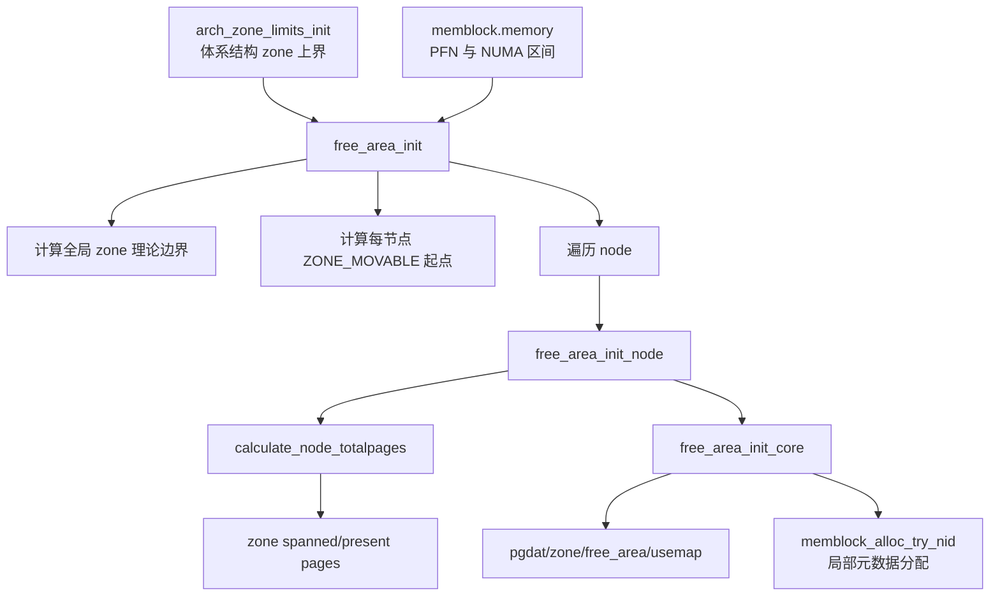

# free_area_init() 详解

> 源码位置：`mm/mm_init.c:1761`（Linux 7.2-rc6）  
> 核心职责：读取体系结构给出的 zone 边界和 memblock 的物理/NUMA 范围，为每个节点建立 `pglist_data`、各类 `zone` 及伙伴系统所需的早期元数据。

## 一、大白话总览

### （a）为什么要设计它

memblock 只知道“哪些物理地址存在、哪些已被占用”，还不能回答普通页分配器的问题：这个 PFN 属于哪个 NUMA 节点和 zone？zone 跨多少页、实际存在多少页？伙伴系统的 free area 和 pageblock bitmap 在哪里？

`free_area_init()` 是从“启动期物理区间账本”过渡到“正式 node/zone 页管理模型”的核心入口。没有它，后续 `memmap_init()` 即使创建了 `struct page`，也没有完整的 zone 归属和伙伴系统容器。

### （b）如果让我自己设计

**一句话降级：**把一组零散物理地址段按硬件节点和 DMA 能力切成管理区，并为每个管理区建立账本。

最小模型：

```text
arch zone 上界 + memblock.memory/NUMA ranges
                       │
                       ▼
            计算每个 node/zone 的 PFN 范围
                       │
                       ▼
          pglist_data → zone[] → free_area[]/usemap
```

核心对象：

| 对象 | 角色 |
|---|---|
| `max_zone_pfn[]` | 体系结构提供的各 zone 最大 PFN 边界 |
| `arch_zone_lowest/highest_possible_pfn[]` | 全局 zone 理论边界 |
| `memblock.memory` | 实际存在的 PFN/NUMA 区间输入 |
| `pg_data_t` / `pglist_data` | 一个 NUMA 节点的内存总账本 |
| `zone` | 按寻址能力/用途切分的页管理域 |
| `spanned_pages` | 包围 zone 的整个 PFN 跨度，包含洞 |
| `present_pages` | 扣除洞后真实存在的页数 |

真实复杂度来自多 zone 边界可能升序或降序、`ZONE_MOVABLE` 的动态切分、NUMA 空洞、memoryless node、flatmem/sparsemem 差异、memory hotplug，以及初始化期间仍需用 memblock 给 zone 元数据分配内存。

自己实现时应：向架构询问 zone 上限；转换为互不重叠的最低/最高 PFN；单独计算每节点 movable 起点；遍历 memblock 打印/验证早期节点图；为每个 node 准备 pgdat；统计每个 zone 的跨度和实存页；分配 memmap/usemap；初始化 node/zone 内部锁、链表和 free_area；标记节点状态；最后计算内核页总数和高端内存边界。

阅读 checklist：

- 理论 zone 边界和实际有内存的范围为何分开？
- `spanned_pages` 为什么可能大于 `present_pages`？
- `managed_pages` 为什么此时先置 0？
- `ZONE_MOVABLE` 为什么单独计算而不是直接取架构上界？
- memoryless node 为什么仍可能需要 pgdat？
- 哪些步骤读取 memblock，哪些步骤又反过来使用 memblock 分配？

### （c）它是怎么设计的

函数采用“两级切分”：先建立系统级 zone 理论边界，再对每个 NUMA 节点，把实际 memblock PFN 范围裁入这些边界。它把“跨度”和“实际存在”同时保存，以表达有洞的物理地址空间。

`free_area_init()` 负责全局策略和遍历；`free_area_init_node()` 负责单节点；`calculate_node_totalpages()` 计算每 zone 数量；`free_area_init_core()` 初始化可运行的数据结构。

### （d）主要情况

| 情况 | 做法 | 原因 |
|---|---|---|
| zone 上界升序 | 从低 zone 向高 zone 推进 `start_pfn` | 常见物理布局 |
| zone 上界降序 | 反向处理 zone | 支持特殊体系结构布局 |
| 当前 zone 是 `ZONE_MOVABLE` | 主边界循环跳过，稍后按节点计算 | movable 是策略切分，不是固定硬件寻址界限 |
| 节点无 `NODE_DATA` | 分配 offline pgdat | 保证每个可能节点有描述对象 |
| 节点有 PFN 范围 | 统计 zone、分配 memmap、初始化 core | 正常内存节点 |
| 节点没有 PFN 范围 | 重置为 memoryless node | 保留拓扑但不虚构 present pages |
| zone `spanned_pages == 0` | 只做基础初始化后 continue | 无需 usemap 和 empty-zone 初始化 |
| 节点有 present pages | 设置 `N_MEMORY` 并检查 zone 类型 | 避免为 memoryless node暴露错误 sysfs 状态 |

## 二、控制流骨架

```text
free_area_init()
│
├─ arch_zone_limits_init(max_zone_pfn)
├─ start_pfn = memblock_start_of_DRAM()
├─ 判断 zone PFN 是否按降序描述
├─ 【遍历所有 zone】
│   ├─ 根据方向选择 zone 下标
│   ├─ [ZONE_MOVABLE] → continue，交给专用算法
│   ├─ end = max(max_zone_pfn[zone], start)
│   ├─ 保存 lowest/highest_possible_pfn
│   └─ start = end
├─ find_zone_movable_pfns_for_nodes()
├─ 【遍历 zone】打印理论地址范围
│   ├─ [ZONE_MOVABLE] → continue
│   ├─ [low == high] → 打印 empty
│   └─ 否则打印物理闭区间
├─ 【遍历节点】打印 movable 起始 PFN
├─ 【遍历 memblock PFN range】打印早期 node map
├─ 验证 page flags 布局、确定 nr_node_ids/pageblock_order
├─ 【遍历所有 node】
│   ├─ [NODE_DATA 不存在] → alloc_offline_node_data()
│   ├─ free_area_init_node(nid)
│   │   ├─ 取得节点 PFN 包络
│   │   ├─ [有内存] → calculate_node_totalpages()
│   │   ├─ [无内存] → reset_memoryless_node_totalpages()
│   │   ├─ alloc_node_mem_map()
│   │   ├─ free_area_init_core()
│   │   └─ lru_gen_init_pgdat()
│   └─ [node_present_pages != 0] → 标记 N_MEMORY 并检查 zone
├─ calc_nr_kernel_pages()
├─ 单节点时修正 hash distribution
└─ set_high_memory()
```

## 三、Mermaid：从 memblock 到 node/zone



## 四、快速定位与宏观地位

```text
start_kernel()
  └── mm_core_init_early()
      ├── [free_area_init()]          ← 建 node/zone 容器
      ├── hugetlb 启动期准备
      ├── sparse_init()               ← 建 sparse memory 元数据
      └── memmap_init()               ← 初始化每个 PFN 的 struct page
```

源码位置：

- `free_area_init()`：`mm/mm_init.c:1761`
- `free_area_init_node()`：`mm/mm_init.c:1656`
- `free_area_init_core()`：`mm/mm_init.c:1535`
- `calculate_node_totalpages()`：`mm/mm_init.c:1277`
- 上层 `mm_core_init_early()`：`mm/mm_init.c:2627`

具体触发场景：

- 正常开机时，`start_kernel()` 在体系结构完成内存探测后调用 `mm_core_init_early()`。
- NUMA 系统启动时，函数读取带 nid 的 memblock ranges，为每个 node 计算 pgdat 和 zone。
- 配置了 movable node、kernelcore/movablecore 或镜像内存策略时，动态确定 `ZONE_MOVABLE` 起点。
- 存在可能节点但当前没有内存时，为 memoryless/offline node 建最小 pgdat，等待以后 hotplug 完善。

## 五、完整调用链

向上只有清晰的核心启动入口：

```text
start_kernel()
  └── mm_core_init_early()                    // mm/mm_init.c:2627
      └── free_area_init()                    // mm/mm_init.c:1761
```

向下主链：

```text
free_area_init()
  ├── arch_zone_limits_init()
  ├── memblock_start_of_DRAM()
  ├── find_zone_movable_pfns_for_nodes()
  ├── for_each_mem_pfn_range                  // 读取 memblock PFN/NUMA ranges
  ├── setup_nr_node_ids()
  ├── set_pageblock_order()
  ├── free_area_init_node()
  │   ├── get_pfn_range_for_nid()
  │   ├── calculate_node_totalpages()
  │   ├── alloc_node_mem_map()
  │   ├── free_area_init_core()
  │   │   ├── pgdat_init_internals()
  │   │   ├── zone_init_internals()
  │   │   ├── setup_usemap()
  │   │   │   └── memblock_alloc_node()
  │   │   │       └── memblock_alloc_try_nid()
  │   │   └── init_currently_empty_zone()
  │   └── lru_gen_init_pgdat()
  ├── calc_nr_kernel_pages()
  ├── fixup_hashdist()
  └── set_high_memory()
```

## 六、逐段详解：建立 zone 理论边界

```c
unsigned long max_zone_pfn[MAX_NR_ZONES] = { 0 };
unsigned long start_pfn, end_pfn;
int i, nid, zone;
bool descending;

arch_zone_limits_init(max_zone_pfn);
```

`max_zone_pfn[]` 是临时数组，由体系结构根据 DMA 寻址限制等填写。清零保证架构未实现某 zone 时范围为空。

```c
start_pfn = PHYS_PFN(memblock_start_of_DRAM());
descending = arch_has_descending_max_zone_pfns();
```

最低 PFN 来自 memblock，而 zone 最大边界来自架构。`descending` 允许同一算法兼容反向描述的架构。

```c
for (i = 0; i < MAX_NR_ZONES; i++) {
    zone = descending ? MAX_NR_ZONES - i - 1 : i;
    if (zone == ZONE_MOVABLE)
        continue;

    end_pfn = max(max_zone_pfn[zone], start_pfn);
    arch_zone_lowest_possible_pfn[zone] = start_pfn;
    arch_zone_highest_possible_pfn[zone] = end_pfn;
    start_pfn = end_pfn;
}
```

- `max(..., start_pfn)` 防止架构给出的边界倒退，产生负长度 zone。
- 下一 zone 从上一 zone 的末尾开始，形成不重叠的半开区间。
- `ZONE_MOVABLE` 跳过，因为它从普通 zone 中按策略切出，不代表独立硬件寻址范围。

## 七、ZONE_MOVABLE 与早期地图输出

`find_zone_movable_pfns_for_nodes()` 综合总页数、kernelcore/movablecore、hotpluggable/mirror 标志和节点 PFN 范围，计算 `zone_movable_pfn[nid]`。

随后三组日志分别输出：

1. 非 movable zone 的理论范围。
2. 每节点 movable 起点。
3. `for_each_mem_pfn_range()` 看到的真实 node memory ranges。

这三者不能混为一谈：理论 zone 范围允许有洞，memblock range 才表示真实存在的物理内存。

## 八、逐节点初始化

### 8.1 预检查

```c
mminit_verify_pageflags_layout();
setup_nr_node_ids();
set_pageblock_order();
```

- 验证 `struct page` flags 中 zone/node/section 位布局不会冲突。
- 根据可能节点集合确定有效 node ID 上界。
- 决定 pageblock 粒度，为迁移类型和 compaction 元数据做准备。

### 8.2 pgdat 准备

```c
if (!NODE_DATA(nid))
    alloc_offline_node_data(nid);
pgdat = NODE_DATA(nid);
free_area_init_node(nid);
```

没有 pgdat 不必然表示错误：节点可能存在于拓扑中但当前 memoryless/offline。先建描述符，使后续热插拔有稳定对象。

### 8.3 节点状态

只有 `pgdat->node_present_pages` 非零才设置 `N_MEMORY` 并调用 `check_for_memory()`。这样用户空间不会看到一个实际上没有内存的 node 被错误标记为 memory node。

## 九、free_area_init_node()

```c
WARN_ON(pgdat->nr_zones || pgdat->kswapd_highest_zoneidx);
get_pfn_range_for_nid(nid, &start_pfn, &end_pfn);
pgdat->node_id = nid;
pgdat->node_start_pfn = start_pfn;
```

WARN 检查 pgdat 必须是零初始化的新对象。`get_pfn_range_for_nid()` 遍历该 nid 的所有 memblock PFN range，取最小起点和最大终点；没有 range 时把起点从 `-1UL` 修正为 0。

有内存时调用 `calculate_node_totalpages()`；无内存时调用 `reset_memoryless_node_totalpages()`。之后无论哪种情况都执行：

```text
alloc_node_mem_map()       为 flatmem 等模型准备 struct page 数组
pgdat_set_deferred_range() 记录延迟初始化范围
free_area_init_core()      初始化节点和 zone 核心容器
lru_gen_init_pgdat()       初始化 MGLRU 节点状态
```

## 十、calculate_node_totalpages()

对每个 zone：

```text
spanned = zone 在 node 中的 PFN 包络长度
absent  = 包络内不属于实际 memblock memory 的洞
real_size = spanned - absent
```

随后写入：

```c
zone->zone_start_pfn = spanned ? zone_start_pfn : 0;
zone->spanned_pages  = spanned;
zone->present_pages  = real_size;
pgdat->node_spanned_pages = node_end_pfn - node_start_pfn;
pgdat->node_present_pages = sum(real_size);
```

关键关系：

```text
present_pages <= spanned_pages
node_present_pages = Σ zone.present_pages
node_spanned_pages 可以包含多个物理洞
```

## 十一、free_area_init_core()

先由 `pgdat_init_internals()` 初始化节点锁、等待队列和内部状态，再暂时让 `per_cpu_nodestats` 指向启动期 `boot_nodestats`。

遍历每个 zone：

```c
zone_init_internals(zone, j, nid, zone->present_pages);
if (!zone->spanned_pages)
    continue;
setup_usemap(zone);
init_currently_empty_zone(zone, zone->zone_start_pfn,
                          zone->spanned_pages);
```

`zone_init_internals()` 把 `managed_pages` 初始化为 0。原因是“物理页存在”不等于“已经交给伙伴系统”：内核镜像、页表和 memblock reserved 页面不能被普通分配。稍后的 `memblock_free_all()` 把真正可用页释放给 buddy 时，才逐步建立 managed 数量。

`setup_usemap()` 为 pageblock flags 分配 bitmap；此时 slab 尚不可用，所以走 `memblock_alloc_node()`，这就是本函数与 `memblock_alloc_try_nid()` 的真实间接调用关系。

`init_currently_empty_zone()` 初始化 zone wait table、free_area 链表等，但此刻名字中的 “empty” 很重要：容器已建好，空闲页尚未正式灌入。

## 十二、收尾步骤

- `calc_nr_kernel_pages()`：遍历 free mem ranges 计算可供内核使用的页数量。
- `fixup_hashdist()`：单节点系统关闭没有意义的跨节点 hash 分布。
- `set_high_memory()`：依据 DRAM 末端和体系结构布局设置高端内存相关边界。

## 十三、关键设计决策

1. **为什么保存 span 和 present 两个数字？** 物理地址空间可以有洞；寻址范围和真实 RAM 数量服务于不同算法。
2. **为什么 managed 不能等于 present？** present 中可能有永久或启动期 reserved 页，只有交给 buddy 的页才是 managed。
3. **为什么 movable 单独计算？** 它是可迁移性策略边界，不是设备 DMA 能力形成的天然物理边界。
4. **为什么先建 zone 再初始化每个 `struct page`？** page 初始化需要知道其 node/zone 身份，容器和边界必须先存在。
5. **为什么初始化页分配器还要依赖 memblock？** 正式分配器自己的 bitmap、memmap 等元数据也要占内存，启动阶段只能先用前级分配器完成自举。

## 十四、三个函数的阶段关系

```text
第一阶段：发现
  memblock_add()
  → memory[] 记录真实 RAM

第二阶段：启动期消费
  memblock_alloc_try_nid()
  → 从 memory - reserved 中分配
  → reserved[] 记录早期占用

第三阶段：建立正式页管理器
  free_area_init()
  → 读取 memory 的 PFN/NUMA 分布
  → 建 pgdat/zone/free_area/usemap

第四阶段：后续交接
  memmap_init() 初始化 struct page
  memblock_free_all() 将未 reserved 页交给 buddy
```

因此三者关联在数据与启动时序上很强，但实现职责和控制流不同，拆成独立文档阅读更清晰。
