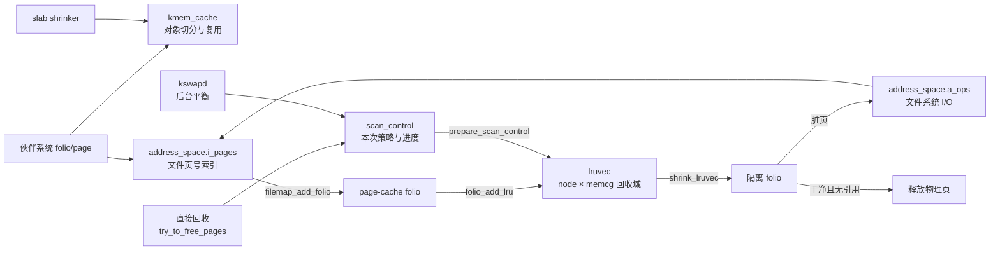

# `kmem_cache`、`address_space`、`lruvec` 与 `scan_control` 详解

> 源码位置：`mm/slab.h:240`、`include/linux/fs.h:471`、`include/linux/mmzone.h:766`、`mm/vmscan.c:76`
> 关键实现：`mm/slab_common.c`、`mm/slub.c`、`fs/inode.c`、`mm/filemap.c`、`mm/folio.c`、`mm/mmzone.c`、`mm/vmscan.c`
> 分析基线：kernel-graph MCP 的 Linux 7.2-rc6 索引
> 四者分别回答：内核对象怎样重复分配、文件内容怎样缓存在内存、可回收 folio 怎样分组、一次回收行动应该怎样扫描。

## 一、大白话总览

### （a）为什么需要这四个对象？

Linux 不能只靠伙伴系统直接分配和释放物理页，因为上层面对的是不同形态的数据：

- inode、dentry、VMA 等是大量同尺寸的小对象，需要快速复用——`kmem_cache` 描述一类对象的 SLUB 缓存。
- 文件内容按页缓存在内存中，需要从“文件页号”查到 folio，并调用文件系统完成读写——`address_space` 是文件页缓存的索引和操作中心。
- 匿名页和文件页占满内存时，需要按节点和 memcg 归属组织冷热状态——`lruvec` 是一个回收域内的 LRU/代际状态。
- 每次回收的原因、目标数量、允许动作和实际进度都不同——`scan_control` 是一次回收调用的策略与统计上下文。

如果没有这些层次，内核小对象会频繁冲击页分配器；文件页无法按偏移共享；回收器无法区分匿名/文件、节点/memcg和冷热；更无法根据调用者的 GFP、zone、I/O 与 swap 约束安全回收。

### （b）如果让我自己设计，第一反应是什么？

#### 1. 一句话降级

先把整页切成可重复领取的小格子，把文件页放进按页号索引的仓库，再给所有可淘汰页面分队；内存紧张时拿一张任务单规定从哪队找、能做什么、找到多少。

#### 2. 最小模型

先假设单 CPU、单 NUMA 节点、无 memcg、无 swap、无 MGLRU、无调试功能：

```text
伙伴系统 page
   ├── kmem_cache：切成 N 个同尺寸 object → alloc/free
   │
   └── address_space.i_pages：index → file folio
                                │
                                └── lruvec file LRU
                                         │ 内存不足
                                         ▼
                                  scan_control
                                  目标/权限/进度
```

最小模型需要：对象大小与空闲对象集合；文件页号到 folio 的映射；匿名/文件的冷热队列；一次扫描的目标数、扫描深度和已回收数。正常出口是快速得到对象或缓存页；压力路径的出口是释放足够页面，或明确报告无进展。

#### 3. 核心数据对象

| 对象 | 类比 | 在主线中的角色 |
|---|---|---|
| `kmem_cache` | 对象模具和仓库规则 | 固定一类对象的真实步长、对齐、slab 阶数、每 CPU/节点缓存和调试策略 |
| `address_space` | 文件内容仓库 | 用 XArray 以页偏移索引 folio，并用 `a_ops` 接入文件系统 I/O |
| `folio` | 仓库里的货物 | 同时属于 page cache、memcg 与某个节点，并在可回收时进入 lruvec |
| `lruvec` | 一个回收域的候选队列 | 以“节点 × memcg”为边界组织匿名/文件冷热状态和反馈数据 |
| `scan_control` | 一次回收任务单 | 描述目标、允许写回/解映射/swap、扫描优先级和累计结果 |
| `pglist_data` | 节点总账 | 无 memcg 时拥有根 `__lruvec`，也是 kswapd 回收的节点边界 |

#### 4. 真实复杂度从哪里来？

- SLUB 分配是极热路径，要有每 CPU sheaf、节点 partial slab、NUMA 策略和无锁/局部锁快路径。
- 对象可能需要 redzone、KASAN、freelist hardening、usercopy 白名单、memcg 和构造函数，`size` 因而大于 `object_size`。
- page cache 同时被 fault、read/write、truncate、writeback 和 reclaim 并发访问，需要 XArray、invalidate 锁、i_mmap 锁与错误序列。
- folio 的回收归属不是只有 NUMA 节点；开启 memcg 后是 `memcg × node` 的 lruvec。
- 传统 LRU 和 MGLRU 可以共存于结构布局中，运行时由静态分支选择。
- 回收不能只“扫最老页面”：还要平衡匿名与文件成本、swap 可用性、脏页写回、内存分层 demotion、memcg 保护、分配 order 和 zone 边界。

#### 5. 如果自己实现，大概步骤

1. 创建对象 cache：验证名字/尺寸/flags，计算布局和 slab 阶数，建立 per-CPU/per-node 状态，注册全局和 sysfs；失败逆序释放。
2. 分配对象：先检查调试和 memcg，再从当前 CPU sheaf 取；失败才找 partial slab 或向伙伴系统申请新 slab。
3. 初始化 inode 的 `address_space`：建立 `i_pages` XArray、锁、空 `i_mmap`，再由文件系统设置 `host`、`a_ops` 和 GFP 策略。
4. 文件读/fault 缺页：查 `i_pages`；缺失则分配/charge folio，锁住并插入 XArray，同步 `nrpages`，最后加入 LRU。
5. 按节点和 memcg 找到 folio 所属 `lruvec`，批量挂入对应匿名/文件、active/inactive 队列或 MGLRU generation。
6. 回收入口在栈上建立 `scan_control`，写入 order、GFP、zone、目标和动作许可。
7. `prepare_scan_control()` 根据 lruvec 的 refault、rotation 和 I/O 成本更新扫描偏好。
8. `shrink_lruvec()` 分批隔离、检查、写回或释放 folio，更新 `nr_scanned/nr_reclaimed`；不足则降低 priority 扩大扫描。
9. 所有树、链表、页数、memcg charge、LRU 状态和错误状态必须成对维护；释放缓存页还要解除 `mapping/index` 关系。

#### 6. 源码阅读 checklist

- 当前对象是 cache 描述符、slab、object，还是物理页？
- 走的是每 CPU 快路径、节点 partial 路径，还是新建 slab 慢路径？
- `object_size` 与 `size` 的差值来自对齐还是调试/安全元数据？
- page-cache 操作是否同时维护 `i_pages`、`nrpages`、folio mapping/index 和 memcg/LRU？
- 当前 lruvec 是节点根 lruvec，还是某 memcg 在该节点的 lruvec？
- 当前使用传统 `lists[]`，还是 MGLRU 的 `lrugen`？
- `scan_control` 的字段是入口策略、循环中间状态，还是输出统计？
- `may_writepage/may_unmap/may_swap` 哪个约束阻止了回收？
- 扫描无进展是因为页面活跃、脏/写回、不可解映射、无 swap，还是 memcg 保护？
- 失败路径是否撤销 charge、锁状态、XArray 项、对象引用和预分配资源？

### （c）总体设计思路

这四个结构体不是一条严格的一对一拥有链，而是四个正交视角：`kmem_cache` 优化“对象大小和复用”；`address_space` 建立“文件偏移到缓存 folio”的身份；`lruvec` 建立“folio 在某回收域中的冷热归属”；`scan_control` 则只在一次回收期间携带政策。

它们通过 folio 和内存压力间接相遇：page cache 的 folio 加入 lruvec；回收器用 `scan_control` 从 lruvec 隔离它，必要时通过 `address_space::a_ops` 写回或释放；回收 slab 对象时又会通过 shrinker 间接减轻 `kmem_cache` 占用。

### （d）主要处理情形

**情况一：cache 有本 CPU 可用对象**  
→ 从 `cpu_sheaves` 快速取出，执行 post hook 后返回。  
→ 原因：避免全局/节点锁和伙伴系统分配。

**情况二：本 CPU 缓存为空**  
→ `___slab_alloc()` 查 partial slab，仍无则 `new_slab()`。  
→ 原因：慢路径集中处理 NUMA、调试和整页补货。

**情况三：文件页缓存命中或缺失**  
→ 命中直接增加引用；缺失时插入 `i_pages`、恢复 workingset 状态并加入 LRU。  
→ 原因：所有进程共享同一 inode 的缓存内容，避免重复 I/O。

**情况四：直接回收或 kswapd 回收**  
→ 创建不同配置的 `scan_control`，选择目标 lruvec，按成本与反馈扫描。  
→ 原因：前者为当前分配请求尽快前进，后者负责恢复节点水位，两者约束不同。

**情况五：MGLRU 启用**  
→ `shrink_lruvec()` 优先转入 `lru_gen_shrink_lruvec()`；传统列表代码仅在切换期或相应配置下继续。  
→ 原因：代际算法用访问代数表达冷热，但结构仍保留兼容和切换所需状态。

## 二、生命周期与控制流骨架

```text
对象/cache/page-cache/reclaim 主线
│
├─ 【kmem_cache 创建】__kmem_cache_create_args()
│     ├─ 参数或 flags 非法 → goto out_unlock → return NULL
│     ├─ 可与已有 cache 合并 → 返回 alias，增加共享关系
│     └─ 必须新建 → create_cache() → do_kmem_cache_create()
│           ├─ 布局或 per-CPU/per-node 初始化失败 → __kmem_cache_release()
│           └─ 成功 → 注册 sysfs/debugfs（sysfs 失败不影响功能）
│
├─ 【对象分配】kmem_cache_alloc_noprof()
│     └─ slab_alloc_node()
│           ├─ pre hook 拒绝 → return NULL
│           ├─ KFENCE 命中 → 直接进入 post hook
│           ├─ per-CPU sheaf 命中 → 返回对象
│           └─ 未命中 → ___slab_alloc() → partial/new_slab → post hook
│
├─ 【文件 folio 入缓存】filemap_add_folio()
│     ├─ memcg charge 失败 → return error
│     ├─ __filemap_add_folio() 失败
│     │     → uncharge + 清锁 → return error
│     └─ 插入成功
│           → workingset refault 判断 → folio_add_lru() → return 0
│
└─ 【页面回收】shrink_node()/shrink_lruvec()
      ├─ MGLRU 生效且非切换期 → lru_gen 路径 → return
      └─ 传统 LRU
            ├─ prepare_scan_control() 计算 anon/file 成本与模式
            ├─ get_scan_count() 生成各 LRU 扫描量
            ├─ 【while】每次最多 SWAP_CLUSTER_MAX 扫描各队列
            │     ├─ 目标未完成 → continue
            │     ├─ 比例扫描要求继续 → continue
            │     └─ 一侧扫描量归零 → break，避免继续攻击另一侧
            ├─ 更新 sc->nr_reclaimed
            └─ 匿名 inactive 太少 → 降级一批 active anon
```

## 三、Mermaid：四个对象怎样在内存压力下相遇



## 四、快速定位与宏观地位

### 4.1 快速定位

- `kmem_cache`：SLUB 分配器的每类对象 cache 描述符，定义于 `mm/slab.h:240`。
- `address_space`：VFS/page cache 的文件缓存地址空间，定义于 `include/linux/fs.h:471`。
- `lruvec`：页回收中一个节点/memcg 维度的冷热集合，定义于 `include/linux/mmzone.h:766`。
- `scan_control`：`vmscan` 私有的一次扫描控制块，定义于 `mm/vmscan.c:76`，不对其他子系统公开布局。
- `kmem_cache` 管的是对象模板与缓存，不是某一个 object。
- `address_space` 不是进程的 `mm_struct`；它通常隶属于 inode，多个进程映射同一文件时共享。
- `lruvec` 不是单一链表；传统 LRU、成本反馈、MGLRU 和拥塞状态都以它为边界。
- `scan_control` 不长期保存；直接回收、kswapd、memcg 回收分别在调用栈上初始化它。

### 4.2 所属层次

```text
用户/内核事件：对象分配、文件 read/fault、内存水位不足
                         │
        ┌────────────────┼────────────────┐
        ▼                ▼                ▼
  SLUB 对象层        VFS/page cache    页分配慢路径/kswapd
        │                │                │
 [kmem_cache]      [address_space]  [scan_control]
        │                │                │
        │              folio ─────────> [lruvec]
        │                                 │
        └──── slab shrinker <────── 页面/对象回收策略
                                          │
                                    伙伴系统与块 I/O
```

### 4.3 真实触发场景

1. 当子系统创建专用对象 cache 时，`__kmem_cache_create()` 进入 `__kmem_cache_create_args()`，经 `create_cache()` 到 `do_kmem_cache_create()` 初始化 `kmem_cache`。
2. 当 inode cache 构造新 inode 时，`address_space_init_once()` 清零 mapping，并由 `__address_space_init_once()` 建立 XArray 与锁；随后具体文件系统设置 `a_ops`。
3. 当文件 mmap 首次 fault 且页缓存缺页时，`filemap_fault()` 经 `__filemap_get_folio()`、`__filemap_get_folio_mpol()` 到 `filemap_add_folio()`，最后 `folio_add_lru()`。
4. 当页分配慢路径直接回收时，`try_to_free_pages()` 构造 `scan_control`，经 `do_try_to_free_pages()`、`shrink_zones()`、`shrink_node()` 到 `shrink_lruvec()`。
5. 当节点水位不足唤醒 kswapd 时，`kswapd()` 经 `balance_pgdat()`、`kswapd_shrink_node()`、`shrink_node()` 扫描节点内各 memcg lruvec。

### 4.4 如果实现有 bug

- cache 的对象步长、free pointer 偏移或 slab 阶数算错，会直接导致对象相互覆盖和任意内存破坏。
- `i_pages`、folio mapping/index 和 `nrpages` 不一致，会产生重复缓存、丢失脏页或 truncate 后 UAF。
- folio 加错 lruvec 会破坏 memcg 隔离与 NUMA 统计，甚至在错误锁下操作链表。
- `scan_control` 权限错误可能在不允许 I/O 的上下文写回，在无 swap 时死扫匿名页，或越过调用者允许的 zone。
- 扫描/回收计数错误会导致过度回收、OOM 误判或 kswapd 无休止运行。

## 五、MCP 确认的调用链

### 5.1 `kmem_cache` 创建与分配

```text
__kmem_cache_create()                         // include/linux/slab.h:393
  └── __kmem_cache_create_args()              // mm/slab_common.c:318
        ├── __kmem_cache_alias()              // 尝试复用兼容 cache
        └── create_cache()
              └── do_kmem_cache_create()      // mm/slub.c:8710

kmem_cache_alloc_noprof()                     // mm/slub.c:5001
  └── slab_alloc_node()                       // mm/slub.c:4969
        ├── alloc_from_pcs()                  // per-CPU sheaf 快路径
        └── ___slab_alloc()
              ├── get_from_partial()          // 节点 partial slab
              └── new_slab()                 // mm/slub.c:3503
```

### 5.2 `address_space` 与 page cache

```text
address_space_init_once()                     // fs/inode.c:481
  └── __address_space_init_once()             // fs/inode.c:473
        ├── xa_init_flags(&i_pages, ...)
        ├── init_rwsem(&i_mmap_rwsem)
        ├── spin_lock_init(&i_private_lock)
        └── i_mmap = RB_ROOT_CACHED

filemap_fault()                               // mm/filemap.c:3555
  └── __filemap_get_folio()
        └── __filemap_get_folio_mpol()
              └── filemap_add_folio()         // mm/filemap.c:955
                    ├── mem_cgroup_charge()
                    ├── __filemap_add_folio() // 插入 i_pages
                    ├── workingset_refault()
                    └── folio_add_lru()        // mm/folio.c:467
```

普通 buffered read 也汇入同一插入点：

```text
generic_file_read_iter()
  └── filemap_read()
        └── filemap_get_pages()
              └── filemap_create_folio()
                    └── filemap_add_folio()
```

### 5.3 `lruvec` 与 `scan_control` 回收

```text
try_to_free_pages()                           // mm/vmscan.c:6769
  └── do_try_to_free_pages()
        └── shrink_zones()
              └── shrink_node()               // mm/vmscan.c:6239
                    ├── prepare_scan_control() // mm/vmscan.c:2280
                    └── shrink_node_memcgs()
                          └── shrink_lruvec()  // mm/vmscan.c:5969
                                └── shrink_list()
                                      └── shrink_inactive_list()

kswapd()
  └── balance_pgdat()                         // mm/vmscan.c:7157
        └── kswapd_shrink_node()
              └── shrink_node()
```

## 六、`struct kmem_cache` 逐字段详解

### 6.1 热路径与对象布局

| 字段 | 含义、初始化与使用 |
|---|---|
| `cpu_sheaves` | 每 CPU 的 `slub_percpu_sheaves`。`do_kmem_cache_create()` 用 `alloc_percpu()` 创建，分配快路径 `alloc_from_pcs()` 优先读取，避免节点锁。 |
| `flags` | cache 行为与调试策略，如 reclaim/account、redzone、poison、store-user、no-merge 等；创建时校验并经 `kmem_cache_flags()`规范化。 |
| `min_partial` | 每节点倾向保留的最少 partial slab 数。对象越大，值通常越高，避免频繁打到伙伴系统。 |
| `size` | 每个槽位实际步长，包含对齐、free pointer、redzone/KASAN 等元数据。定位第 N 个 object 使用它。 |
| `object_size` | 调用者请求的有效对象大小，不含 SLUB 附加元数据。zero/init、usercopy 边界和 trace 关心它。 |
| `reciprocal_size` | `size` 的预计算倒数，用乘法/移位替代热路径除法，快速从偏移反算对象序号。 |
| `offset` | 空闲对象中 freelist next 指针的存放偏移。若对象内部不安全或被构造函数占用，可放到对象有效区之后。 |
| `sheaf_capacity` | 单个 per-CPU sheaf 可缓存的对象数；非默认容量会使 cache 不可合并，避免 alias 破坏专属调优。 |
| `oo` | 首选 slab order 与可容纳 object 数的压缩编码，正常补充 slab 使用。 |
| `min` | 内存紧张或高阶分配失败时可接受的最低 order/object 组合。 |
| `allocflags` | 为 cache 补充新 slab page 时附加的 GFP flags，不等于每次调用者传入的完整 `gfpflags`。 |

`kmem_cache_order_objects` 只有一个 `x`，把 order 和 objects 压缩在一个整数中。这样热路径读取一个字段即可得到整页布局，并保持 cache 描述符紧凑。

### 6.2 生命周期、构造和全局组织

| 字段 | 作用 |
|---|---|
| `refcount` | cache alias/销毁引用。兼容 cache 可合并，因此多个名字/创建请求可能共享描述符；归零才允许销毁。 |
| `ctor` | 新对象首次构造时的回调，不等同于每次 alloc 都执行的初始化函数；使用者仍需按 API 约定重置运行期状态。 |
| `inuse` | 有效对象及其必要对齐之后、附加元数据开始的偏移边界。 |
| `align` | 每个 object 的对齐要求，由调用者、架构和 flags 综合计算。 |
| `red_left_pad` | 启用左 redzone 时对象前的 padding 大小，越界检测据此找到真正对象起点。 |
| `name` | cache 展示名，用于 slabinfo/sysfs/debug；注释强调它只用于显示，逻辑不能依赖名称身份。 |
| `list` | 把该 cache 挂到全局 slab cache 链表，创建/销毁由 `slab_mutex` 串行化。 |
| `kobj` | `CONFIG_SYSFS` 下在 `/sys/kernel/slab` 暴露参数和统计。sysfs 注册失败不会让 SLUB cache 本身失败。 |

### 6.3 安全、调试、NUMA 与统计

| 字段 | 作用 |
|---|---|
| `random` | freelist hardening 的每 cache 随机秘密，用于编码空闲指针，增加 freelist 劫持难度。 |
| `remote_node_defrag_ratio` | NUMA 下为改善 slab 利用率而尝试远端节点 partial slab 的概率/比例控制。 |
| `random_seq` | freelist random 配置下对象初始化顺序的随机序列，降低可预测布局。 |
| `kasan_info` | generic KASAN 针对该 cache 的 shadow/元数据布局。 |
| `useroffset/usersize` | hardened usercopy 允许复制到用户态的对象内部白名单区间；创建时 fail-closed 校验，非法则清零。 |
| `cpu_stats` | SLUB_STATS 下每 CPU 分配、慢路径、partial 等统计，避免全局计数热点。 |
| `per_node[MAX_NUMNODES]` | 每节点 cache 状态指针集合，NUMA 下让 partial slab 和 sheaf 仓库按节点管理。 |

`per_node` 中：

- `node` 指向 `kmem_cache_node`，后者用 `list_lock` 保护 `partial` 链表和 `nr_partial`。
- `barn` 指向 `node_barn`，管理 full/empty sheaf 列表及数量。
- 每 CPU `main/spare/rcu_free` sheaf 分别承担当前库存、备用库存和需要延迟处理的库存。

### 6.4 创建控制流关键点

`__kmem_cache_create_args()`：

1. 显式 debug flags 会打开静态分支；`SLAB_STORE_USER` 需要 stack depot。
2. 自定义 `sheaf_capacity` 强制 `SLAB_NO_MERGE`。
3. `slab_mutex` 串行化 sanity check、alias 查找和创建。
4. hardened usercopy 的 offset/size 任一越界时清零，两者不会以半合法状态继续。
5. 能 alias 则直接返回已有 cache；否则复制常量名称、算对齐并创建。
6. `SLAB_PANIC` 失败时 panic，否则警告并返回 NULL。

`do_kmem_cache_create()`：先写名称/尺寸/flags/对齐/ctor，再 `calculate_sizes()`；然后建立 per-CPU sheaves、NUMA node 状态、统计和随机序列。任何核心资源失败都走 `__kmem_cache_release()`。sysfs 只是观察接口，失败不回滚可用 cache。

### 6.5 分配快慢路径

```text
kmem_cache_alloc_noprof(s, gfpflags)
│
├─ 建 slab_alloc_context：调用点、object_size、默认 flags
├─ slab_alloc_node()
│     ├─ slab_pre_alloc_hook()：fault injection/memcg/上下文校验
│     ├─ kfence_alloc()：抽样进入防护分配
│     ├─ apply_strict_numa_policy()
│     ├─ alloc_from_pcs()：per-CPU sheaf 快路径
│     ├─ [空] ___slab_alloc()：partial/new slab 慢路径
│     ├─ 清理可能暴露的 free pointer
│     └─ slab_post_alloc_hook()：KASAN/KMSAN/init/memcg/追踪
└─ trace_kmem_cache_alloc() → return object/NULL
```

## 七、`struct address_space` 逐字段详解

| 字段 | 含义、保护与使用者 |
|---|---|
| `host` | 通常指向拥有该 mapping 的 inode。writeback、大小、时间戳和文件系统上下文从这里取得；某些特殊 mapping 可有不同宿主语义。 |
| `i_pages` | 以 `pgoff_t` 页号索引 folio 或 exceptional/shadow entry 的 XArray。page-cache lookup、插入、truncate 和 workingset 都依赖它。初始化为 `XA_FLAGS_LOCK_IRQ | XA_FLAGS_ACCOUNT`。 |
| `invalidate_lock` | 串行化会使缓存范围失效的操作与某些 DIO/fault/写入路径，防止一边 invalidate 一边重新建立页面。 |
| `gfp_mask` | 为此 mapping 分配 page-cache folio/XArray 节点时允许的 GFP 行为；应通过 `mapping_set_gfp_mask()` 等 helper 设置。 |
| `i_mmap_writable` | 可写共享映射计数。原子化使 seal/write-deny 等路径无需拿大范围锁即可判断是否存在 writable mapping。 |
| `i_mmap` | 按文件页区间组织所有映射该文件的 VMA interval tree，用于 truncate、unmap_mapping、rmap；它不是 page-cache folio 索引。 |
| `nrpages` | `i_pages` 中缓存的基础页数量统计，大 folio 按其页数计。必须与插入/删除同步，但不是 XArray 节点数。 |
| `writeback_index` | 循环/后台 writeback 下一次开始扫描的页偏移，避免每次总从文件头开始。 |
| `a_ops` | 文件系统提供的 `address_space_operations`：read_folio、readahead、writepages、dirty、invalidate、release、migrate、direct_IO 等。它把通用 page cache 连接到具体存储实现。 |
| `flags` | mapping 状态和能力位，如错误、可执行映射、large folio order、kernel file 等；更新按对应 helper/bitops 规则。 |
| `wb_err` | writeback 异步错误的 `errseq_t`，允许每个 file descriptor 看到自上次检查后的错误，而不是用一个会被抢先清除的 errno。 |
| `i_private_lock` | 保护 mapping 私有链表/关联数据等传统内部状态；具体使用依赖文件系统/块层约定。 |
| `i_mmap_rwsem` | 专门保护 `i_mmap` interval tree。文件反向映射锁与 `i_pages` 的 XArray lock 分离，避免两种热点互相串行化。 |

### 7.1 `address_space`、`mm_struct` 与 VMA 的区别

```text
mm_struct                         address_space
进程虚拟地址空间                 文件内容缓存空间
key = 用户虚拟地址               key = 文件页偏移 pgoff
索引 = mm_mt → VMA               索引 = i_pages → folio
拥有进程页表 pgd                  拥有文件系统操作 a_ops
          \                       /
           vm_area_struct(vm_file)
           同时把二者关联起来
```

### 7.2 初始化与插入事务

`address_space_init_once()` 先清零，再初始化 `i_pages`、`i_mmap_rwsem`、`i_private_lock` 和空 `i_mmap`。它只建立通用容器；`host`、`a_ops`、GFP 策略等由 inode/文件系统初始化继续填写。

`filemap_add_folio()` 的顺序非常关键：

1. kernel file 临时把 active memcg 切到 root。
2. 先 `mem_cgroup_charge()`，失败则没有任何 page-cache 可见状态。
3. 标记 folio locked，再由 `__filemap_add_folio()` 在 XArray 锁下检查冲突、设置 mapping/index、引用和统计。
4. 插入失败必须 uncharge 并清 locked。
5. 插入成功且存在 shadow entry 时执行 workingset refault 判断。
6. 最后 `folio_add_lru()`；这样回收器看见 folio 时，其 page-cache 身份已经完整。

## 八、`struct lruvec` 逐字段详解

### 8.1 传统 LRU 与反馈字段

| 字段 | 含义 |
|---|---|
| `lists[NR_LRU_LISTS]` | 传统 LRU 链表头数组，主要包括 inactive/active anon、inactive/active file 和 unevictable 类别。folio 的 LRU 链接挂在其中。 |
| `lru_lock` | 保护该 lruvec 的 LRU 链表和相关状态。隔离/放回 folio 常用 irq 版本，因为 LRU 更新可能来自会与中断上下文交错的批处理路径。 |
| `cost[ANON_AND_FILE]` | 匿名与文件回收成本模型。每项保存衰减后的 `count` 以及上轮 rotation/I/O 单调计数快照。成本越高，扫描倾向越偏向另一侧。 |
| `cost_lock` | 只保护 `cost[]` 的更新和衰减，避免用更热的 `lru_lock` 串行化策略计算。 |
| `nonresident_age` | 被驱逐页面的逻辑年龄；workingset shadow/refault 用它判断页面离开期间工作集移动了多远。原子化支持并发年龄推进。 |
| `refaults[ANON_AND_FILE]` | 上一回收周期观察到的匿名/文件激活 refault 计数快照，用于判断是否需要把 active 页面降到 inactive。 |
| `flags` | lruvec 状态位，例如 memcg/node writeback 拥塞。`shrink_node()` 根据本轮 dirty/congested/writeback 统计设置。 |
| `zswap_lruvec_state` | zswap 针对该回收域的状态；当前字段 `nr_disk_swapins` 记录从磁盘 swap-in 的反馈。 |

### 8.2 MGLRU 可选字段

| 字段 | 作用 |
|---|---|
| `lrugen` | `CONFIG_LRU_GEN` 下按 generation、anon/file、zone 组织可回收 folio，维护 `max_seq/min_seq`、时间戳、页数、refault/evict 历史和 tiers。 |
| `mm_state` | `CONFIG_LRU_GEN_WALKS_MMU` 下并发遍历 mm 列表、页表扫描位置、Bloom filters 和代际统计。 |
| `pgdat` | memcg 配置下回指所属 NUMA 节点，允许从 memcg 的 lruvec 恢复节点上下文。 |

### 8.3 lruvec 的归属模型

```text
无 memcg / 根回收：pglist_data::__lruvec

开启 memcg：
mem_cgroup
  └── mem_cgroup_per_node[node]
        └── lruvec
              └── pgdat → 对应 NUMA 节点
```

所以 lruvec 的真实含义是“某 memcg 在某节点上的可回收集合”。`mem_cgroup_lruvec(memcg, pgdat)` 负责取得它；不能只根据 folio 的 node 就假设锁定根 lruvec。

### 8.4 初始化中的故意陷阱

`lruvec_init()` 清零、初始化两把锁和每个 LRU 链表，然后故意：

```c
list_del(&lruvec->lists[LRU_UNEVICTABLE]);
```

注释说明 unevictable LRU 是“虚构”的：维护数量，但不可回收 folio 不真正串在该链表上，其 `lru` 字段可复用保存 `mlock_count`。把链表头 poison 掉能让误操作尽早崩溃，而不是静默破坏链表。

### 8.5 folio 怎样进入 lruvec

`folio_add_lru()` 先断言 folio 不能同时 active 与 unevictable，也不能已经在 LRU。MGLRU fault 场景下，refault workingset folio 会设 active；prefault file folio会标 referenced。最后不是立即逐个拿 `lru_lock`，而是 `folio_batch_add_and_move(..., lru_add)` 批量移动，降低锁竞争。

## 九、`struct scan_control` 逐字段详解

### 9.1 目标与作用域

| 字段 | 类型与含义 |
|---|---|
| `nr_to_reclaim` | 本次希望回收的基础页数量。直接回收初始化为 `SWAP_CLUSTER_MAX`，不是扫描上限。 |
| `nodemask` | 调用者允许扫描的 NUMA 节点集合；NULL 表示全部。 |
| `target_mem_cgroup` | 因达到限制而成为主要目标的 memcg；NULL/根语义表示全局回收。 |
| `order` | 触发分配所需的伙伴系统 order。高阶请求不仅要页数，还需要连续性，并影响压缩/继续扫描判断。 |
| `reclaim_idx` | 允许隔离 folio 的最高 zone index，由分配 GFP zone 约束产生，防止用不可满足请求的 zone 做无效回收。 |
| `gfp_mask` | 当前回收上下文的分配/IO/FS 等许可来源；直接回收先经过 `current_gfp_context()`。 |

### 9.2 扫描强度与匿名/文件平衡

| 字段 | 含义 |
|---|---|
| `priority` | 扫描比例的反向强度，约为 `total_size >> priority`。从 `DEF_PRIORITY` 向下递减时扫描越来越激进；它不是“数值越大优先级越高”。 |
| `anon_cost` | 本轮从目标 lruvec 快照出的匿名回收成本。rotation、refault 和匿名写 swap 都会提高它。 |
| `file_cost` | 文件页回收成本，主要反映 rotation/refault I/O。 |
| `proactive_swappiness` | 主动回收专用 swappiness 指针；源码要求通过 `sc_swappiness()` 读取，以处理普通和主动两种来源。 |
| `may_deactivate` | 两位 mask：`DEACTIVATE_ANON` 和 `DEACTIVATE_FILE`，决定本轮能否把 active folio 降级。 |
| `force_deactivate` | 忽略常规 inactive/refault 判断，强制允许匿名和文件降级。 |
| `skipped_deactivate` | 记录本轮曾因策略跳过降级，供后续重试/决策识别。 |

### 9.3 允许动作位

| 字段 | 为 0 时意味着什么 |
|---|---|
| `may_writepage` | 不允许回收器主动提交脏文件页写回；boosted reclaim 会关闭它，避免低效 I/O。 |
| `may_unmap` | 不允许拆除仍被进程页表映射的 folio，只能处理无需 unmap 的候选。 |
| `may_swap` | 不允许匿名页进入 swap；无 swap、特定 cgroup 或 boost 场景可限制。 |
| `no_demotion` | 不把页面迁移到低层级内存，直接尝试 discard/reclaim。 |

这三项 `may_*` 是能力上限，不表示一定会执行对应动作；folio 自身状态和后备设备仍可能阻止它。

### 9.4 模式与回退状态

| 字段 | 作用 |
|---|---|
| `no_cache_trim_mode` | 禁止本轮进入“优先清理易回收冷文件 cache”模式。 |
| `cache_trim_mode` | 当前节点有足够 inactive file 且不需降级 file active，先集中清 cache。 |
| `cache_trim_mode_failed` | cache trim 已尝试但无进展；kswapd 可设置 `no_cache_trim_mode` 后从更全面策略重启。 |
| `file_is_tiny` | 文件 LRU 已危险地小，防止“cache trap”继续攻击很小且抖动的 file working set。 |
| `proactive` | 本次由用户态主动回收触发；影响 vmpressure 等副作用。 |
| `memcg_low_reclaim` | 正在第二轮突破 `memory.low` 保护，以避免最终 OOM。 |
| `memcg_low_skipped` | 第一轮曾因 `memory.low` 降低力度或跳过 memcg，且可能需要再走一轮。 |
| `memcg_full_walk` | 共享 cgroup 树遍历失败，需要完整重扫。 |
| `hibernation_mode` | 休眠镜像回收模式，改变节流等策略。 |
| `compaction_ready` | 某 zone 已适合压缩；高阶分配可以停止纯回收，转向 compaction。 |

### 9.5 输入输出计数

| 字段 | 含义 |
|---|---|
| `nr_scanned` | 本次累计扫描的 inactive pages 数量，用于效率、压力和继续扫描判断。 |
| `nr_reclaimed` | `shrink_zones()` 周期累计成功释放/回收的页数，是最主要输出。 |
| `nr.dirty` | 隔离候选中脏页数量。 |
| `nr.congested` | 脏页中受拥塞/回写限制的数量。 |
| `nr.writeback` | 已在 writeback 的候选数量。 |
| `nr.immediate` | 标记需要立即回收却仍在 writeback 的页数；kswapd 据此节流等待。 |
| `nr.taken` | 本轮从 LRU 隔离出来的总页数，用来判断 writeback 是否覆盖全部候选。 |
| `reclaim_state.reclaimed` | 当前任务通过 slab shrinker 等路径间接回收的对象/页贡献，`flush_reclaim_state()` 汇入主计数。 |

### 9.6 直接回收如何初始化它

```c
struct scan_control sc = {
    .nr_to_reclaim = SWAP_CLUSTER_MAX,       // 先争取一个标准批次
    .gfp_mask      = current_gfp_context(gfp_mask),
    .reclaim_idx   = gfp_zone(gfp_mask),     // 不越过分配允许的最高 zone
    .order         = order,
    .nodemask      = nodemask,
    .priority      = DEF_PRIORITY,           // 从温和扫描开始
    .may_writepage = 1,
    .may_unmap     = 1,
    .may_swap      = 1,
};
```

三个 `s8` 字段节省栈空间，但源码用 `BUILD_BUG_ON()` 验证最大 page order、priority 和 zone 数不会溢出。这是“紧凑布局必须由编译期不变量兜底”的典型设计。

如果 `throttle_direct_reclaim()` 因 fatal signal 等情况要求退出，函数返回 1 而不是 0，防止页分配器在此刻误以为彻底无进展并立即 OOM kill。

## 十、`prepare_scan_control()`：把 lruvec 反馈写入本轮策略

### 10.1 成本模型

MGLRU 稳定启用时该函数直接返回，因为代际回收有自己的策略。传统路径取得目标 `lruvec` 后，限频刷新 memcg 统计，再在 `cost_lock` 下分别处理 anon/file：

```text
本轮 rotation 增量 = 当前 PGROTATE - last_rotated
本轮 I/O 增量      = 当前 refault/restore - last_io
匿名侧额外计入 reclaim-driven writes

cost.count += I/O增量 × SWAP_CLUSTER_MAX + rotation增量
```

当两侧总成本大于 LRU 大小的四分之一时反复除以 2，使历史衰减、避免溢出，也让策略能跟随工作负载变化。最终复制到 `sc->anon_cost/file_cost`，让本轮后续读取不必继续持锁。

### 10.2 active/inactive 与 cache trap

- 若观测到新的 refault，说明工作集正在重建，需要允许 active 降级，以尽快清掉陈旧 active 页面。
- 若 inactive 太少，也允许对应 anon/file active 降级。
- inactive file 足够且未抖动时开启 `cache_trim_mode`，优先回收冷文件 cache。
- 但 file LRU 已小到 `file + free <= high watermark`，同时匿名 inactive 仍充足时设置 `file_is_tiny`，避免新文件 fault 都进入 inactive 后形成“越扫越小、越小越偏向扫文件”的正反馈陷阱。

## 十一、`shrink_lruvec()`：执行扫描任务单

1. MGLRU 生效且当前不是 root 特例时进入 `lru_gen_shrink_lruvec()`；非切换期直接返回。
2. 传统路径由 `get_scan_count()` 按 `scan_control` 和 lruvec 状态生成各 LRU 的扫描目标，并保留原始 `targets[]`。
3. `blk_start_plug()` 合并回收中产生的块 I/O，减少零碎提交。
4. while 循环按 `SWAP_CLUSTER_MAX` 分批调用 `shrink_list()`：active 队列做 aging/deactivate，inactive 队列做隔离与实际回收。
5. 每批后给 RCU tasks quiescent state 和调度机会，避免长回收循环独占 CPU。
6. 达到目标后，kswapd/memcg 仍按原始目标校正 anon/file 比例；一侧已扫空则 `break`，避免报复性过扫另一侧。
7. `blk_finish_plug()` 提交剩余 I/O，并把局部 `nr_reclaimed` 加入 `sc`。
8. 即使没扫描匿名页，只要 anonymous inactive 偏低且能够 aging，也从 active anon 降一批，为未来回收准备候选。

`shrink_node()` 每轮清空 `sc->nr`，调用 `prepare_scan_control()` 和所有 memcg lruvec，然后 `flush_reclaim_state()`。它根据 dirty/writeback 比例设置 `PGDAT_WRITEBACK` 或 `LRUVEC_*_CONGESTED`，必要时节流；`should_continue_reclaim()` 成立就 `goto again`，所以同一个 `scan_control` 会跨多轮累积总进度。

## 十二、四者之间最容易混淆的边界

| 容易混淆 | 正确区分 |
|---|---|
| `kmem_cache` vs page cache | 前者缓存固定尺寸内核对象；后者缓存文件内容 folio。两者的“cache”不是同一种索引。 |
| `address_space` vs `mm_struct` | 前者以文件偏移为地址空间，属于 inode；后者以用户虚拟地址为地址空间，属于进程。 |
| `address_space::i_pages` vs `i_mmap` | `i_pages` 索引缓存 folio；`i_mmap` 索引映射该文件区间的 VMA。 |
| `lruvec` vs `zone` | zone 管伙伴系统可分配物理页；lruvec 管已经在使用、但可能被回收的 folio，边界还包含 memcg。 |
| `lruvec` vs `scan_control` | lruvec 是长期状态与候选集合；scan_control 是一次行动的短期策略和计数。 |
| `nr_to_reclaim` vs `nr_scanned` | 前者是希望释放多少；后者是为此检查过多少。扫描 100 页可能一页也没释放。 |
| `priority` | 数值越小扫描越激进，不是普通调度优先级语义。 |
| inactive vs unevictable | inactive 是可回收候选；unevictable 是不能正常扫描的页，甚至不真正挂在所谓 unevictable 链表。 |

## 十三、关键设计决策与不变量

### 13.1 为什么专用 cache 可以合并？

若对象大小、对齐和关键 flags 等兼容，共享同一 `kmem_cache` 可减少 cache 数和碎片。自定义 sheaf 容量、安全布局或 ctor 等会阻止合并，因为这时两个创建者不再共享完全相同的运行语义。

### 13.2 为什么 `address_space` 同时用 XArray 和红黑 interval tree？

查询问题不同：`i_pages` 是“给定文件页号找 folio”的点/范围索引；`i_mmap` 是“给定文件区间找所有重叠 VMA”的 interval 查询。强行共用一种结构会让锁、元素类型和查询模式互相拖累。

### 13.3 为什么 page-cache folio 插入后才进 LRU？

回收器一旦看到 folio，就可能检查 mapping、dirty、private 或调用 `a_ops`。所以必须先完成 charge、mapping/index、XArray 和统计，再公开给 LRU；失败时也能在尚未进入回收域前干净回滚。

### 13.4 为什么 lruvec 是 node × memcg？

物理回收受 NUMA 节点水位约束，内存归属又受 memcg 限额约束。二维交叉能让全局回收按节点工作，也让 cgroup 回收只扫描目标租户在该节点的页面。

### 13.5 为什么策略放在 `scan_control` 而不是 lruvec？

同一 lruvec 会被直接回收、kswapd、memcg、休眠和主动回收以不同权限扫描。长期集合不应被某次调用的 order、nodemask 或 GFP 污染；栈上的 scan_control 还能自然支持嵌套和并发回收。

### 13.6 为什么回收成本要衰减？

不衰减会让过去一次昂贵 I/O 永久支配未来扫描；只看瞬时值又容易抖动。衰减累计兼顾稳定性与工作负载变化，且通过成本锁在每轮准备阶段集中更新。

### 13.7 核心不变量

| 不变量 | 违反后果 |
|---|---|
| `size >= object_size`，槽位满足 `align`，free pointer 位于合法 `offset` | 对象覆盖、freelist 损坏 |
| cache 创建资源按逆序释放，alias 引用归零才销毁 | 泄漏或仍有调用者时释放 |
| folio 插入 `i_pages` 时 mapping/index/refcount/`nrpages` 一致 | 重复页、丢页、UAF |
| `i_mmap` 修改持 `i_mmap_rwsem`，XArray 修改持其锁 | VMA/file rmap 或页缓存树损坏 |
| folio 同一时刻只属于正确的 node × memcg lruvec | 跨 cgroup 记账、错误锁与链表损坏 |
| LRU 链表修改与统计在对应 `lru_lock`/批处理规则下同步 | 链表和 vmstat 漂移 |
| `scan_control` 不越过 nodemask、reclaim_idx 和 may_* 能力 | 回收错误节点/zone或在非法上下文做 I/O |
| 每轮 `nr_scanned/nr_reclaimed` 单调累积，临时 `nr.*` 按轮清零 | 效率误判、过度回收或错误节流 |

## 十四、实战：怎样使用这两类通用框架

### 14.1 创建一个专用 `kmem_cache`

```c
static struct kmem_cache *my_cache;

int my_init(void)
{
    my_cache = kmem_cache_create("my_object",
                                 sizeof(struct my_object),
                                 __alignof__(struct my_object),
                                 SLAB_ACCOUNT,
                                 NULL);
    return my_cache ? 0 : -ENOMEM;
}

struct my_object *obj = kmem_cache_alloc(my_cache, GFP_KERNEL);
if (!obj)
    return -ENOMEM;

kmem_cache_free(my_cache, obj);

void my_exit(void)
{
    kmem_cache_destroy(my_cache);  // 必须保证所有 obj 已归还
}
```

这对应第六节的 cache 创建、对象快慢路径和 alias 生命周期。若对象状态每次分配都必须清零，应选择合适 API/flags 或显式初始化，不能把 `ctor` 当成每次 alloc 回调。

### 14.2 为文件系统提供 `address_space_operations`

```c
static const struct address_space_operations my_aops = {
    .read_folio       = my_read_folio,
    .readahead        = my_readahead,
    .writepages       = my_writepages,
    .dirty_folio      = my_dirty_folio,
    .invalidate_folio = my_invalidate_folio,
    .release_folio    = my_release_folio,
};

void my_inode_init(struct inode *inode)
{
    inode->i_mapping->a_ops = &my_aops;
    mapping_set_gfp_mask(inode->i_mapping, GFP_KERNEL);
}
```

通用 page cache 负责 `i_pages` 索引、引用、锁和 LRU；文件系统回调负责把 folio 内容与具体存储后端同步。回调实现必须遵守调用点的 folio 锁、writeback 和错误返回约定，不能自行维护另一套 page-cache 索引。

顺序小结：

```text
kmem_cache：create → alloc/use/free → 确认无活对象 → destroy
address_space：inode 初始化 → 设置 a_ops/GFP → 通用 page cache 调回文件系统 → inode 销毁前清空缓存
```

## 十五、把四者串成一句话

`kmem_cache` 把伙伴系统提供的页高效变成固定尺寸内核对象；`address_space` 把文件偏移映射成共享的 page-cache folio；folio 按节点和 memcg 归入 `lruvec` 的冷热集合；内存紧张时，直接回收或 kswapd 创建 `scan_control`，根据 GFP、zone、swap、写回、refault 和成本反馈决定扫描哪些 lruvec、允许怎样处置页面，并把扫描与回收结果带回页分配器。

阅读后应能回答：

1. 为什么 `kmem_cache::size` 往往大于 `object_size`？
2. 为什么 `address_space` 同时需要 `i_pages` 和 `i_mmap`？
3. 为什么一个 page-cache folio 必须先完成 XArray 插入，再加入 LRU？
4. 为什么 lruvec 的边界是 node × memcg，而不只是 zone？
5. 为什么 `scan_control::priority` 越小扫描反而越激进？
6. 为什么 boosted reclaim 会关闭 `may_writepage` 和 `may_swap`？
7. 为什么 `prepare_scan_control()` 要衰减 anon/file cost？
8. 为什么 unevictable LRU 的链表头会被故意 poison？
