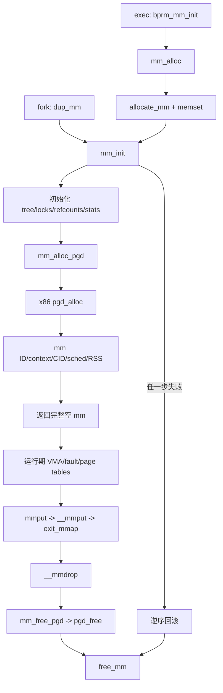

# `mm_alloc`、`mm_init`、`mm_alloc_pgd`、`mm_free_pgd` 详解

> 源码位置：`kernel/fork.c:581`、`kernel/fork.c:589`、`kernel/fork.c:1091`、`kernel/fork.c:1172`；x86 实例位于 `arch/x86/mm/pgtable.c:311`、`arch/x86/mm/pgtable.c:365`
> 分析基线：当前 kernel-graph MCP 索引；本地源码工作树为 Linux `v7.3-rc2`。调用关系、文件和行号均以 MCP 查询为准。
> 整体职责：分配一份空白 `mm_struct`，初始化地址空间的通用状态和架构状态，建立根页表；初始化失败或对象最终销毁时按生命周期释放根页表和描述对象。

## 一、大白话总览

### （a）为什么要设计这组函数？

一个普通用户进程需要一套独立的虚拟地址空间。内核不能只给它一个 PGD 指针，因为地址空间还必须同时保存：VMA 索引、页表锁、VMA 锁、引用计数、RSS 统计、CPU 使用掩码、MMU notifier、体系结构 ASID/PCID 类上下文、futex 状态以及多个可选子系统的状态。

这组函数把创建过程分成三层：

- `mm_alloc()`：取得并清零 `mm_struct` 外壳。
- `mm_init()`：建立通用地址空间不变量，并协调所有可能失败的子系统初始化。
- `mm_alloc_pgd()` / `mm_free_pgd()`：把根页表的架构差异封装在 `pgd_alloc()` / `pgd_free()` 后面。

如果没有这种分层，每个 fork、exec、KUnit 或架构特殊调用者都要复制几十项初始化和逆序清理代码；少初始化一把锁、一个引用计数或一个 notifier 指针，就可能在后续 fault、上下文切换或销毁时崩溃。

### （b）如果让我自己设计，第一反应是什么？

#### 1. 一句话降级

先申请一本空白“地址空间账本”，给账本装好目录、锁、编号、统计和根页表；任何一步失败，就按安装的逆序拆回去。

#### 2. 最小模型

先忽略 SMP、NUMA、AIO、KSM、MMU notifier、虚拟化、架构 ASID 和所有性能优化：

```text
allocate_mm()
     │
     ▼
mm_struct（全部清零）
     │
     ├── 初始化引用计数、VMA 树和锁
     └── pgd = pgd_alloc(mm)
               │
               ├── 成功：返回可继续建立 VMA 的 mm
               └── 失败：free_mm(mm)，返回 NULL
```

输入是可选的 owner task；核心对象是 `mm_struct` 和 `mm->pgd`；成功出口是“空 VMA、空用户页表，但基础设施完整”的地址空间；失败出口是不留下半初始化对象。

#### 3. 核心数据对象

| 对象 | 类比 | 本路径角色 |
|---|---|---|
| `mm_struct` | 地址空间总账 | 汇总 VMA、页表根、锁、引用、统计和架构上下文 |
| `mm_cachep` | 地址空间账本对象池 | `allocate_mm/free_mm` 实际使用的 slab cache |
| `mm->mm_mt` | 空白区间目录 | 初始化后尚无 VMA，但已经绑定外部 `mmap_lock` |
| `mm->pgd` | 地址翻译目录根 | CPU/软件页表遍历的入口；不是完整用户页表的同义词 |
| `mm_users/mm_count` | 两层保管计数 | 分别控制完整地址空间销毁和 `mm_struct` 本体释放 |
| `mm->context` | 架构通行证 | 保存 ASID/PCID、LDT 或架构私有地址空间状态 |
| `task_struct *p` | 初始归属提示 | 供 owner、CID、调度缓存和架构 context 初始化使用 |

#### 4. 真实复杂度从哪里来？

- `mm_struct` 被 fault、fork、exec、调度、futex、KVM/IOMMU、uprobes、AIO、KSM、NUMA 等共同消费。
- `pgd_alloc()` 是架构接口；x86 还涉及内核半区复制、PTI 用户 PGD、预分配 PMD、paravirt 和全局 `pgd_list`。
- 初始化存在多级失败点，每个失败点只能销毁已经成功建立的资源。
- `mm_users` 与 `mm_count` 控制不同销毁阶段，不能用一个引用计数代替。
- 对象来自 slab，旧内容不能被信任，所以 `mm_alloc()` 先完整清零。
- 根页表被 CPU、lazy TLB 和内核映射同步机制观察，最终释放前必须保证无人再使用。

#### 5. 如果自己实现，大概步骤

1. 从专用 slab cache 分配 `mm_struct`，失败直接返回。
2. 清零全部字段，使可选配置字段和错误路径拥有确定初态。
3. 初始化 VMA Maple Tree，并把其外部锁绑定到 `mmap_lock`。
4. 初始化两层引用、页表/VMA锁、序列计数、CPU mask、统计和子系统空状态。
5. 从当前 mm 继承允许继承的 flags；没有当前用户 mm 时使用系统默认值。
6. 分配 PGD，再依次分配 mm ID、架构 context、CID、调度缓存和 per-CPU RSS 计数器。
7. 任一步失败时，从最后成功项向前逆序销毁，最后释放 PGD 和 `mm_struct`。
8. 最终生命周期结束时，先确保 CPU/lazy TLB 不再使用该 mm，再释放调度/CID/context/notifier/统计/PGD，最后归还 slab 对象。

#### 6. 源码阅读 checklist

- 当前语句是在建立“零值初态”、锁不变量、引用不变量，还是可选子系统状态？
- helper 会不会失败？若会，它对应哪个 `goto` 标签和哪个对称 destroy/free？
- 当前资源是在 `mm_init()` 失败时释放，还是只在最终 `__mmdrop()` 才释放？
- `mm->pgd` 只有根页，还是已经包含架构强制预建的内核/用户页表部分？
- 当前字段从 `current->mm` 继承是否安全，为什么只继承掩码允许的部分？
- `p` 与 `current` 是否必然相同？fork 的 `dup_mm()` 场景下要特别检查。
- `mm_count`、`mm_users` 在这里为什么都初始化为 1？后续谁分别减到 0？
- 架构 `pgd_alloc()` 的错误路径是否按预分配、paravirt、PGD 的逆序清理？

### （c）它是怎么设计的？

设计核心是“通用框架拥有生命周期，架构只实现根页表细节”。`mm_init()` 建立与架构无关的地址空间状态，通过 `mm_alloc_pgd()` 调用架构 `pgd_alloc()`，再调用 `init_new_context()` 建立架构上下文。释放时同样由通用 `__mmdrop()` 协调，`mm_free_pgd()` 只分派到架构 `pgd_free()`。

所有可失败资源按获得顺序排列，源码标签按相反顺序排列。这使每个 `goto` 自动落入后续清理标签，而不重复多套释放代码。

### （d）它处理哪几种情况？

**普通 exec 新地址空间**：`bprm_mm_init()` 调 `mm_alloc()`，得到空地址空间，再由 exec 建立栈和 ELF VMA。原因是新程序不能沿用旧程序的映射规则。

**fork 复制地址空间**：`dup_mm()` 已经取得并复制父 mm 外壳的一部分，但仍调用 `mm_init(mm, task)` 重建所有不可直接复制的锁、引用、树、PGD和上下文，之后才复制 VMA/页表。原因是锁和资源所有权不能通过裸 `memcpy` 继承。

**内核特殊地址空间**：KUnit、x86 text poking、调试页表等路径直接调用 `mm_alloc()`，借用标准 mm 生命周期而不一定对应普通用户进程。

**初始化中途失败**：按成功阶段选择 `fail_pcpu` 到 `fail_mm_init` 标签，逆序释放后返回 `NULL`。调用者只看到“创建失败”，不会拿到半有效 mm。

**最终引用消失**：`__mmdrop()` 在地址空间内容已由 `mmput/__mmput/exit_mmap` 拆除后调用 `mm_free_pgd()`，再释放 mm 本体。原因是根页表不能早于叶子映射和 CPU 引用被清理。

## 二、生命周期与控制流骨架

### 2.1 总生命周期



### 2.2 `mm_alloc()` 控制流

```text
mm_alloc()
│
├─ mm = allocate_mm()
│  └─ [分配失败] → return NULL
├─ memset(mm, 0, sizeof(*mm))
└─ return mm_init(mm, current)
   ├─ 成功 → 返回已初始化 mm
   └─ 失败 → mm_init 已释放对象，返回 NULL
```

### 2.3 `mm_init()` 控制流

```text
mm_init(mm, p)
│
├─ 初始化 mm_mt，并绑定 mmap_lock
├─ 初始化 mm_users/mm_count/write_protect_seq/mmap_lock/mmlist
├─ 初始化页表字节、VMA/锁页/pin/RSS 统计
├─ 初始化 page_table_lock/arg_lock/cpumask/AIO/owner/PASID
├─ 初始化 exe_file/MMU notifier/TLB pending/THP/uprobes/hugetlb/futex
├─ 清全部 mm flags
│  ├─ [current->mm 存在] → 继承过滤后的 legacy flags 和 def_flags
│  └─ [current->mm 不存在] → 使用 coredump_filter，def_flags = 0
├─ mm_alloc_pgd(mm)
│  └─ [失败] → goto fail_mm_init → free_mm → return NULL
├─ mm_alloc_id(mm)
│  └─ [失败] → goto fail_noid → mm_free_pgd → free_mm → return NULL
├─ init_new_context(p, mm)
│  └─ [失败] → goto fail_nocontext → mm_free_id → mm_free_pgd → free_mm
├─ mm_alloc_cid(mm, p)
│  └─ [失败] → goto fail_cid → destroy_context → mm_free_id → mm_free_pgd → free_mm
├─ mm_alloc_sched(mm)
│  └─ [失败] → goto fail_sched → mm_destroy_cid → ... → free_mm
├─ percpu_counter_init_many(rss_stat)
│  └─ [失败] → goto fail_pcpu → mm_destroy_sched → ... → free_mm
├─ lru_gen_init_mm(mm)
└─ return mm
```

### 2.4 根页表包装函数

```text
mm_alloc_pgd(mm)
│
├─ mm->pgd = pgd_alloc(mm)
├─ [pgd == NULL] → return -ENOMEM
└─ return 0

mm_free_pgd(mm)
└─ pgd_free(mm, mm->pgd) → return void
```

### 2.5 x86 `pgd_alloc()` / `pgd_free()` 控制流

```text
x86 pgd_alloc(mm)
│
├─ pgd = _pgd_alloc(mm)
│  └─ [失败] → return NULL
├─ mm->pgd = pgd
├─ [架构配置需要] preallocate_pmds(kernel-side)
│  └─ [失败] → _pgd_free → return NULL
├─ [PTI等需要] preallocate_pmds(user-side)
│  └─ [失败] → free kernel PMDs → _pgd_free → return NULL
├─ paravirt_pgd_alloc(mm)
│  └─ [失败] → free user PMDs → free kernel PMDs → _pgd_free → return NULL
├─ spin_lock(pgd_lock)
├─ pgd_ctor()：复制内核半区/登记 pgd_list
├─ 按配置预填充 kernel/user PMD
├─ spin_unlock(pgd_lock)
└─ return pgd

x86 pgd_free(mm, pgd)
│
├─ pgd_mop_up_pmds()：清理架构预建 PMD
├─ pgd_dtor()：从 pgd_list 删除
├─ paravirt_pgd_free()
└─ _pgd_free()：释放根页
```

## 三、快速定位

- 子系统：进程创建/exec 与 MM 地址空间生命周期，通用实现位于 `kernel/fork.c`。
- `mm_alloc()`：分配并清零地址空间描述对象。
- `mm_init()`：真正建立新 mm 的通用不变量和可选子系统状态。
- `mm_alloc_pgd()`：把通用 mm 生命周期连接到架构根页表分配。
- `mm_free_pgd()`：把失败回滚或最终销毁连接到架构根页表释放。
- x86 `pgd_alloc/pgd_free()`：展示内核半区、PTI、paravirt、预分配 PMD 和 `pgd_list` 如何参与。
- `allocate_mm/free_mm` 是 `kernel/fork.c:655-656` 的宏，分别封装 `kmem_cache_alloc(mm_cachep, GFP_KERNEL)` 与 `kmem_cache_free()`。

## 四、宏观地位

### 4.1 所属层次

```text
┌─────────────────────────────────────────────────────┐
│ 外部事件：exec / fork / KUnit / 架构特殊 mm 用户    │
└─────────────────────────┬───────────────────────────┘
                          ▼
┌─────────────────────────────────────────────────────┐
│ bprm_mm_init / dup_mm / 直接 mm_alloc 调用者        │
└─────────────────────────┬───────────────────────────┘
                          ▼
┌─────────────────────────────────────────────────────┐
│ [本文] mm_alloc → mm_init                           │
│ 建立地址空间对象、树、锁、引用、统计和子系统状态    │
└─────────────────────────┬───────────────────────────┘
                          ▼
┌─────────────────────────────────────────────────────┐
│ [本文] mm_alloc_pgd → arch pgd_alloc                │
│ 建立页表根和架构要求的根级骨架                      │
└─────────────────────────┬───────────────────────────┘
                          ▼
┌─────────────────────────────────────────────────────┐
│ 后续：dup_mmap / mmap / fault 按需建立 VMA和下级页表│
└─────────────────────────┬───────────────────────────┘
                          ▼
┌─────────────────────────────────────────────────────┐
│ exit_mmap → __mmdrop → mm_free_pgd → free_mm        │
└─────────────────────────────────────────────────────┘
```

### 4.2 触发场景

1. 当 `execve()` 准备新程序映像时，`alloc_bprm()` → `bprm_mm_init()` → `mm_alloc()`，先得到空地址空间，再建立栈和 ELF 映射。
2. 当 `fork/clone` 需要独立地址空间时，`kernel_clone()` → `copy_process()` → `copy_mm()` → `dup_mm()` → `mm_init()`，之后 `dup_mmap()` 复制 VMA和页表；若 `CLONE_VM` 则会共享旧 mm，不走独立复制主线。
3. 当 x86 初始化 text poking 专用 mm 时，`start_kernel()` → `poking_init()` → `mm_alloc()`，复用标准地址空间基础设施。
4. 当 `mm_count` 最终降到 0 时进入 `__mmdrop()`；它清理 lazy TLB 使用者后调用 `mm_free_pgd()`，最终 `free_mm()`。

### 4.3 解决什么问题

- 没有统一清零和初始化：slab 复用的旧指针/计数会被误当成有效资源。
- Maple Tree 未绑定正确外部锁：VMA 并发修改的锁模型失效。
- 两个引用计数初值或语义错误：可能提前 `exit_mmap()`、提前 free，或永远泄漏。
- PGD 只分配不执行架构构造：用户态切换后可能看不到必要内核映射，PTI/paravirt 状态也可能失配。
- 回滚次序错误：对未初始化资源执行 destroy，或遗漏已初始化资源。
- PGD 在 lazy TLB CPU 仍引用时释放：CPU 可能继续使用已归还的页表内存。

## 五、完整调用链路

### 5.1 向上：创建入口

```text
execve 新映像
└── alloc_bprm()                         // fs/exec.c
    └── bprm_mm_init()                  // fs/exec.c:258
        └── mm_alloc()                  // kernel/fork.c:1172
            └── mm_init()               // kernel/fork.c:1091
                └── mm_alloc_pgd()      // kernel/fork.c:581
                    └── pgd_alloc()     // arch/x86/mm/pgtable.c:311（x86实例）

fork 独立地址空间
└── kernel_clone()
    └── copy_process()
        └── copy_mm()                   // kernel/fork.c:1568
            └── dup_mm()                // kernel/fork.c:1527
                └── mm_init()           // 重建不可 memcpy 的 mm 基础设施
                    └── mm_alloc_pgd()

x86 启动期 text poking
└── start_kernel()
    └── poking_init()                   // arch/x86/mm/init.c:824
        └── mm_alloc()
```

kernel-graph 还确认 `mm_alloc()` 的直接调用者包括 ARM ecard、PowerPC text patching、dma-resv lockdep、KUnit user allocation 和 debug_vm_pgtable；它是可由内核内部复用的地址空间分配入口，不只服务进程 syscall。

### 5.2 向上：释放入口

```text
最后一个 mm_users 消失
└── mmput()
    └── __mmput()
        └── exit_mmap()                 // 先撤销 VMA和用户页表内容
            └── mmdrop()/相关引用收尾
                └── __mmdrop()          // kernel/fork.c:724
                    └── mm_free_pgd()   // kernel/fork.c:589
                        └── pgd_free()   // arch/x86/mm/pgtable.c:365（x86实例）

mm_init() 初始化失败
└── fail_noid 及更晚错误标签
    └── mm_free_pgd()                   // 只在 PGD 已成功分配后执行
```

### 5.3 向下：关键执行链

```text
[mm_alloc]
├── allocate_mm()                       // mm_cachep slab 分配，GFP_KERNEL
├── memset()                            // 清除 slab 旧状态
└── mm_init()
    ├── mt_init_flags()/mt_set_external_lock() // VMA Maple Tree
    ├── mmap_init_lock()/锁与引用初始化
    ├── mmu_notifier_subscriptions_init()
    ├── futex_mm_init()
    ├── mm_alloc_pgd()
    │   └── pgd_alloc()                 // 架构根页表
    ├── mm_alloc_id()
    ├── init_new_context()
    ├── mm_alloc_cid()/mm_alloc_sched()
    └── percpu_counter_init_many()

[mm_free_pgd]
└── pgd_free()
    ├── pgd_mop_up_pmds()               // x86 清架构预建 PMD
    ├── pgd_dtor()                      // 从 pgd_list 摘除
    ├── paravirt_pgd_free()
    └── _pgd_free()
```

## 六、`mm_alloc()` 逐行详解

```c
struct mm_struct *mm_alloc(void)
{
    struct mm_struct *mm;

    mm = allocate_mm();                 // 从 mm_cachep 分配，可睡眠
    if (!mm)
        return NULL;                    // 连外壳都没有，无资源可回滚

    memset(mm, 0, sizeof(*mm));         // slab 对象不是天然清零，先建立安全零态
    return mm_init(mm, current);         // 初始化成功返回 mm；失败由 mm_init 自行 free
}
```

### 6.1 为什么 `allocate_mm()` 不是 `kzalloc()`？

`mm_struct` 使用专用 `mm_cachep` slab cache，便于复用、对齐、调试和缓存局部性。`allocate_mm()` 只是 `kmem_cache_alloc(mm_cachep, GFP_KERNEL)` 宏，因此必须显式 `memset()`。这里处于进程上下文并允许睡眠，所以使用 `GFP_KERNEL`，不是 `GFP_ATOMIC`。

### 6.2 为什么把失败释放交给 `mm_init()`？

只有 `mm_init()` 知道初始化进行到了哪一步。让它内部逆序回滚，可保证调用者只处理两种结果：完整 mm 或 `NULL`，不会暴露“PGD 已有但 context 未建”之类半状态。

### 6.3 `mm_alloc()` 与 `dup_mm()` 的区别

`mm_alloc()` 面向全新空白地址空间，清零后用 `current` 初始化。`dup_mm()` 面向 fork，会先从 slab 取对象并复制父 mm 中可复制的普通字段，再由 `mm_init(mm, task)` 重建树、锁、引用、PGD、context 等不能裸复制的资源。两者共享 `mm_init()`，但准备输入的方式不同。

## 七、`mm_init()` 逐行/逐阶段详解

### 7.1 VMA 索引、引用与锁（1093—1107）

| 语句/字段 | 做什么 | 为什么 |
|---|---|---|
| `mt_init_flags(&mm->mm_mt, MM_MT_FLAGS)` | 初始化空 VMA Maple Tree | 新 mm 尚无 VMA，但后续 mmap/fork 需要合法空树 |
| `mt_set_external_lock(..., &mm->mmap_lock)` | 告诉 Maple Tree 锁由 `mmap_lock` 外部管理 | 树本身不单独决定地址空间锁协议 |
| `mm_users = 1` | 建立一个完整地址空间用户引用 | 创建者将持有可用地址空间；归零触发 `__mmput/exit_mmap` |
| `mm_count = 1` | 建立一个 mm 对象引用 | 所有 users 共同占其中一个 count；归零才 free 本体 |
| `write_protect_seq` | 初始化 fork/COW 写保护序列 | 并发 GUP/fault 可检测批量写保护变化 |
| `mmap_init_lock(mm)` | 初始化 `mmap_lock`，以及配置下的每 VMA 锁序列/等待状态 | 保护 VMA树和结构性修改 |
| `INIT_LIST_HEAD(&mm->mmlist)` | 初始化 swap mm 全局链表节点为空 | 未入链前也必须是合法自环节点 |
| `mm_pgtables_bytes_init(mm)` | 页表内存计数清零 | 后续每级页表分配/释放要对称记账 |
| `map_count/locked_vm/pinned_vm/rss_stat` | 建立零统计 | 空 mm 没有 VMA、锁页、pin 或驻留页 |
| `page_table_lock` | 初始化页表及部分计数保护锁 | 后续页表/rmap 修改需要 |
| `arg_lock` | 初始化程序布局字段专用锁 | 读取 argv/env/code 边界无需争用整个 mmap_lock |
| `mm_init_cpumask(mm)` | 清空使用该 mm 的 CPU 集合 | 新 mm 尚未装载到任何 CPU |

`mm_users` 和 `mm_count` 同为 1 不表示重复计数：前者保活“完整地址空间内容”，后者保活“描述对象本身”。最后一个 `mm_users` 消失会释放其共同占用的一个 `mm_count`。

### 7.2 子系统空状态（1108—1119）

| helper/字段 | 初始化内容 |
|---|---|
| `mm_init_aio(mm)` | AIO 锁和上下文表 |
| `mm_init_owner(mm, p)` | memcg 配置下的规范 owner |
| `mm_pasid_init(mm)` | 进程地址空间与 IOMMU PASID 的初态 |
| `exe_file = NULL` | 通过 RCU helper 建立安全空指针 |
| `mmu_notifier_subscriptions_init(mm)` | KVM/IOMMU 等 notifier 订阅集合初态 |
| `init_tlb_flush_pending(mm)` | 批量 TLB flush 状态清零 |
| `pmd_huge_pte = NULL` | 特定 THP 配置下的预留 PTE 指针初态 |
| `mm_init_uprobes_state(mm)` | uprobes 地址空间状态 |
| `hugetlb_count_init(mm)` | hugetlb 使用计数 |
| `futex_mm_init(mm)` | futex hash/robust unlock 的 mm 级状态 |

这些 helper 多数在对应配置关闭时退化为空操作。统一调用让 `mm_init()` 保持一条源码主线，而不用把所有配置条件摊在主体中。

### 7.3 flags 的继承边界（1121—1130）

先 `mm_flags_clear_all(mm)`，再分两种情况：

- `current->mm != NULL`：取当前 mm flags，经 `mmf_init_legacy_flags()` 过滤后写入；`def_flags` 也只继承 `VM_INIT_DEF_MASK` 允许的位。
- `current->mm == NULL`：内核线程等没有用户 mm 的上下文无法继承，使用系统 `coredump_filter` 和零 `def_flags`。

不能直接复制全部 flags，因为有些位描述旧 mm 的瞬时/生命周期状态，而不是新地址空间的可继承策略。先清零再白名单继承比“复制后逐位清除”更不容易随新增 flags 漏洞化。

### 7.4 可失败资源链（1132—1152）

| 获得顺序 | 函数 | 新资源/状态 | 对称清理 |
|---:|---|---|---|
| 1 | `mm_alloc_pgd()` | 根页表 `mm->pgd` | `mm_free_pgd()` |
| 2 | `mm_alloc_id()` | 可选唯一 mm ID | `mm_free_id()` |
| 3 | `init_new_context(p, mm)` | 架构 MMU context | `destroy_context()` |
| 4 | `mm_alloc_cid(mm, p)` | MM CID 存储 | `mm_destroy_cid()` |
| 5 | `mm_alloc_sched(mm)` | sched_cache 相关资源 | `mm_destroy_sched()` |
| 6 | `percpu_counter_init_many()` | `NR_MM_COUNTERS` 组 RSS per-CPU 计数器 | `percpu_counter_destroy_many()`（最终销毁） |
| 完成 | `lru_gen_init_mm()` | multi-gen LRU 挂接初态 | 后续 mm 生命周期管理 |

`GFP_KERNEL_ACCOUNT` 表示 per-CPU RSS 计数器的分配可睡眠，并纳入内核内存的 memcg 记账。

### 7.5 失败标签逐个解释（1154—1166）

```text
fail_pcpu:      mm_destroy_sched()
fail_sched:     mm_destroy_cid()
fail_cid:       destroy_context()
fail_nocontext: mm_free_id()
fail_noid:      mm_free_pgd()
fail_mm_init:   free_mm()
                return NULL
```

标签名表示“从哪个资源之后开始回滚”，并利用 C 的顺序落穿执行后续标签：

- PGD 分配本身失败时跳 `fail_mm_init`，不能调用 `pgd_free(NULL/未完成PGD)`。
- ID 分配失败时跳 `fail_noid`，此时 PGD 已成功，所以先 free PGD。
- context 失败时跳 `fail_nocontext`，不调用 `destroy_context()`，因为 context 没有成功建立。
- CID 失败时跳 `fail_cid`，context 已成功，必须销毁。
- sched 失败时跳 `fail_sched`；per-CPU RSS 失败时还要先销毁 sched。

这正是“资源获取顺序正向、错误清理顺序反向”的内核常见模式。

## 八、`mm_alloc_pgd()` 与 `mm_free_pgd()` 逐行详解

### 8.1 `mm_alloc_pgd()`

```c
static inline int mm_alloc_pgd(struct mm_struct *mm)
{
    mm->pgd = pgd_alloc(mm);       // 调架构接口，并立即把根地址发布到 mm
    if (unlikely(!mm->pgd))
        return -ENOMEM;            // 唯一失败语义：根页表无法建立
    return 0;
}
```

`unlikely()` 只给编译器分支概率提示，不改变语义。包装函数把各架构可能复杂的错误统一压成 `-ENOMEM`，使 `mm_init()` 只处理成功/失败。

### 8.2 `mm_free_pgd()`

```c
static inline void mm_free_pgd(struct mm_struct *mm)
{
    pgd_free(mm, mm->pgd);         // 架构知道如何撤销 ctor、预分配和根页
}
```

它没有 NULL 检查，因为调用点的生命周期不变量保证 PGD 已成功建立：`mm_init()` 只有 `fail_noid` 及更晚标签会调用；最终 `__mmdrop()` 处理的也是完整初始化过的 mm。随意在更早错误点调用反而会掩盖生命周期 bug。

### 8.3 为什么只看到 PGD，没有 PUD/PMD/PTE？

通用初始化只要求地址空间拥有可切换的根。普通用户下级页表通常在 `__handle_mm_fault()` 中由 `p4d_alloc()`、`pud_alloc()`、`pmd_alloc()`、`__pte_alloc()` 按需建立；fork 的 `copy_page_range()` 也会按源映射需要建立目标下级表。

x86 `pgd_alloc()` 可能因 PAE/PTI/架构布局预建部分 PMD，并复制必要内核映射，但这属于“让根页表可合法装载”的架构骨架，不代表所有用户虚拟地址已经建立页表。

## 九、x86 `pgd_alloc()` / `pgd_free()` 实例

### 9.1 `_pgd_alloc()` 为什么统一分配整页？

x86 源码说明：PAE 硬件可能只需要很小的 PGD，但 PTI 和 Xen 需要整页。为简化所有配置，`_pgd_alloc()` 统一按 `pgd_allocation_order()` 调 `__pgd_alloc()`，避免上层随配置理解不同尺寸。

### 9.2 为什么先预分配 PMD？

`PREALLOCATED_PMDS` 和 `MAX_PREALLOCATED_USER_PMDS` 由 x86 配置决定，数组甚至可能编译为零大小语义。需要时先分配所有 PMD，再进入 `pgd_lock` 临界区进行构造和挂接：

- 临界区内不做可能失败的批量内存分配，缩短锁持有时间。
- `pgd_list` 遍历者永远只能看到“尚未加入”或“已经完整预填充”的 PGD，不能看到半成品。
- PTI 配置可能同时维护内核 PGD 与用户侧影子 PGD 所需的预建层级。

### 9.3 `pgd_ctor()` 做什么？

非 PAE 时，`clone_pgd_range()` 从 `swapper_pg_dir` 复制 `KERNEL_PGD_BOUNDARY` 以上的内核半区。每个用户进程拥有不同用户映射，但进入内核后仍需要正确的内核地址映射；具体隔离方式再受 PTI 等机制影响。

随后 `pgd_set_mm()` 建立 PGD 到 mm 的归属，`pgd_list_add()` 把它加入全局列表，使内核映射更新可以同步到现存地址空间。

### 9.4 x86 分配失败路径

| 失败点 | 已获得资源 | 清理顺序 |
|---|---|---|
| `_pgd_alloc()` | 无 | 直接 `return NULL` |
| kernel PMD 预分配 | PGD | `_pgd_free()` |
| user PMD 预分配 | PGD + kernel PMDs | `free_pmds(kernel)` → `_pgd_free()` |
| `paravirt_pgd_alloc()` | PGD + 两组 PMD | `free_pmds(user)` → `free_pmds(kernel)` → `_pgd_free()` |

`pgd_ctor()` 和树挂接发生在所有可失败准备之后，因此成功离开构造临界区后直接返回，不再经过普通分配错误标签。

### 9.5 x86 释放为何有四步？

1. `pgd_mop_up_pmds()` 清理由架构根创建阶段预建的 PMD，包括 PTI 用户侧部分。
2. `pgd_dtor()` 在 `pgd_lock` 下从全局 `pgd_list` 删除，阻止后续内核映射同步再访问它。
3. `paravirt_pgd_free()` 通知 Xen/paravirt 后端撤销相应状态。
4. `_pgd_free()` 执行底层页表析构并释放根页。

顺序不能倒置：已经释放根页后再从列表摘除或通知 paravirt，会让并发遍历者/后端接触悬空地址。

## 十、初始化失败与最终销毁不是同一条路径

### 10.1 初始化失败

此时没有 VMA、没有用户 PTE，也未被 CPU 正常装载。`mm_init()` 只需撤销已经创建的 PGD、ID、context、CID、sched 等初始化资源，然后 `free_mm()`。

### 10.2 正常最终销毁

完整 mm 已经运行过，可能被多个线程、CPU、KVM/IOMMU 和内核观察者使用。先由 `mm_users` 归零路径执行 `__mmput()/exit_mmap()`，拆除 VMA、用户页表映射和相关账本；之后 `mm_count` 归零才进入 `__mmdrop()`：

```c
cleanup_lazy_tlbs(mm);                         // 确保 lazy TLB CPU 不再引用
mm_destroy_sched(mm);
mm_free_pgd(mm);
mm_free_id(mm);
destroy_context(mm);
mmu_notifier_subscriptions_destroy(mm);
check_mm(mm);
mm_pasid_drop(mm);
mm_destroy_cid(mm);
percpu_counter_destroy_many(mm->rss_stat, ...);
free_mm(mm);
```

`BUG_ON(mm == &init_mm)` 表明内核初始地址空间是静态永久对象，绝不能走普通 mm 释放。`WARN_ON_ONCE(mm == current->mm/active_mm)` 检测仍被当前 CPU 正式或 lazy 使用的生命周期错误。

### 10.3 创建与销毁对照

| 创建阶段 | 正常销毁阶段 | 备注 |
|---|---|---|
| `allocate_mm()` | `free_mm()` | slab 对象外壳 |
| `mm_users/mm_count = 1` | `mmput/mmdrop` | 两阶段生命周期，不是直接 `atomic_dec + free` |
| `mm_alloc_pgd()` | `mm_free_pgd()` | 架构根页表 |
| `mm_alloc_id()` | `mm_free_id()` | 配置可选 |
| `init_new_context()` | `destroy_context()` | 架构相关 |
| `mm_alloc_cid()` | `mm_destroy_cid()` | 配置可退化为空操作 |
| `mm_alloc_sched()` | `mm_destroy_sched()` | sched_cache 资源 |
| `percpu_counter_init_many()` | `percpu_counter_destroy_many()` | RSS per-CPU 计数器 |

## 十一、关键设计决策

### 11.1 为什么清零后还要逐字段初始化？

零值只能提供可预测的未初始化状态，不能构造 rwsem、spinlock、list head、Maple Tree、seqcount 和 per-CPU counter 的内部不变量。二者缺一不可：不清零会污染可选字段，不调用构造 helper 会产生“看似为零、实际非法”的同步对象。

### 11.2 为什么 Maple Tree 先初始化、后初始化 `mmap_lock`？

`mt_set_external_lock()` 只是登记锁地址，不会立刻获取或使用该锁；随后 `mmap_init_lock()` 才构造锁本体。在 `mm_init()` 返回前对象不会发布给并发 VMA 操作者，因此顺序安全。关键不变量是“发布前二者都完成”，不是登记指针时锁已经可获取。

### 11.3 为什么 `mm_init()` 是 `static`？

它只服务同一翻译单元中的 `mm_alloc()` 和 `dup_mm()`。限制可见性可阻止外部调用者跳过必要的外壳准备，并让编译器更好检查/优化调用约定。

### 11.4 为什么架构 context 在 PGD 之后建立？

不少架构 context 初始化需要引用根页表或基于地址空间布局生成硬件标识。先有 PGD 再建 context，使架构接口获得完整基础；context 失败时又能明确先 free ID/PGD。

### 11.5 为什么 PGD 释放不放进 `exit_mmap()`？

`exit_mmap()` 对应 `mm_users` 归零，负责拆地址空间内容；但 `mm_struct` 仍可能被内核引用。PGD 根地址和 mm 元数据必须保留到 `mm_count` 归零，并在 `__mmdrop()` 确保 lazy TLB 不再使用后释放。

### 11.6 为什么 x86 要维护 `pgd_list`？

用户 PGD 含有或关联内核映射部分。运行期内核页表映射更新需要找到所有相关 PGD并同步；全局列表提供枚举能力。构造和预填充必须在同一 `pgd_lock` 临界区完成，避免枚举者看见半构造对象。

## 十二、关键不变量与排错表

| 不变量 | 违反后的典型后果 |
|---|---|
| `mm_init()` 成功返回时所有锁、树、引用和可选状态均已构造 | 第一次 mmap/fault/销毁即崩溃 |
| `mm_mt` 的 external lock 指向本 mm 的 `mmap_lock` | VMA 并发保护错配 |
| `mm_users=1`、`mm_count=1` 的两级语义不混用 | 提前拆页表、UAF 或 mm 泄漏 |
| `mm->pgd != NULL` 才能进入 `fail_noid`/最终 free PGD 路径 | NULL/半构造 PGD 析构 |
| 初始化失败严格逆序回滚 | 泄漏、double free 或调用未初始化 destroy |
| 普通用户下级页表不被误认为在 `mm_alloc_pgd()` 全部创建 | 错判内存占用和 fault 行为 |
| `exit_mmap()` 先拆内容，`__mmdrop()` 后拆根和对象 | CPU/notifier 访问悬空页表 |
| x86 PGD 从 `pgd_list` 摘除后才能释放底层页 | 内核映射同步遍历 UAF |
| `cleanup_lazy_tlbs()` 完成后才释放 PGD | lazy TLB CPU 使用已释放根页表 |

常见排错入口：

- `mm_alloc()` 返回 NULL：先区分 slab 外壳失败，还是 `mm_init()` 某个子资源失败。
- 页表根分配失败：看 `mm_alloc_pgd()` 的 `-ENOMEM`，再进入目标架构 `pgd_alloc()` 的具体错误标签。
- fork 创建 mm 失败：检查 `dup_mm()` 是否在 `mm_init()` 后的 `dup_mmap()` 阶段失败；两者清理范围不同。
- `check_mm()` 警告页表/统计残留：通常问题发生在更早的 unmap/exit 路径，不应只怀疑 `pgd_free()`。
- x86 内核映射不同步：检查 `pgd_ctor/dtor`、`pgd_list` 和锁定范围，而不只是根页是否成功分配。

## 十三、关键概念补充

### 13.1 根页表、下级页表和 VMA

```text
mm_struct
├── mm_mt → VMA：软件合法性与映射规则
└── pgd   → P4D → PUD → PMD → PTE：硬件当前翻译状态
```

`mm_alloc_pgd()` 建立的是第二条线的根和必要架构骨架；它不创建 VMA，也通常不创建所有用户下级页表。`mmap()` 可只改变第一条线；后续 fault 才把规则兑现为第二条线的表项。

### 13.2 内核半区为什么会出现在用户进程 PGD？

传统设计要求系统调用/中断进入内核后能继续用当前页表访问内核地址，所以用户地址空间根通常包含必要内核映射。x86 PTI 会加强隔离并维护用户侧受限视图，但 `pgd_alloc()` 仍必须按配置构造一致的根布局。

### 13.3 lazy TLB 是什么？

内核线程可能没有自己的用户 `mm`，为减少切换成本而暂时保留前一个 mm 作为 `active_mm`，但不以普通用户身份使用它。这就是 PGD 释放前需要 `cleanup_lazy_tlbs()` 的原因：`mm_users` 已归零不代表所有 CPU 硬件上下文都已完全忘记该 mm。

### 13.4 `mm_users` 与 `mm_count` 的时间线

```text
创建：mm_users=1, mm_count=1
共享线程：mm_users 增加，mm_count 不按线程一一增加
最后用户退出：mm_users→0 → __mmput()/exit_mmap() → 放掉 users 代表的 mm_count
最后内核引用释放：mm_count→0 → __mmdrop() → free PGD/context/mm
```

## 十四、把四个函数串成一句话

`mm_alloc()` 从 `mm_cachep` 取得并清零地址空间外壳，`mm_init()` 把它构造成拥有合法 VMA树、锁、两级引用、统计、子系统状态和架构 context 的完整 `mm_struct`，其中 `mm_alloc_pgd()` 通过架构 `pgd_alloc()` 建立可装载的根页表；任一后续初始化失败会按逆序调用 `mm_free_pgd()` 等 helper 回滚，而正常运行过的地址空间则必须先经历 `exit_mmap()` 和 lazy TLB 清理，最终才由 `mm_free_pgd()` 调架构 `pgd_free()` 并释放 `mm_struct` 本体。

读完应能回答：

1. `mm_alloc()` 与 `mm_init()` 为什么不能简单合成一次 `kzalloc()`？
2. 为什么 fork 的 `dup_mm()` 不能直接复制父 mm 的锁、PGD 和引用计数？
3. 为什么 `mm_alloc_pgd()` 成功不代表用户下级页表已经建立？
4. `mm_users` 和 `mm_count` 分别保护哪一段生命周期？
5. `mm_init()` 每个错误标签为什么从不同位置开始落穿？
6. 为什么 PGD 分配失败不能调用 `mm_free_pgd()`？
7. x86 为什么可能预分配 PMD、复制内核半区并维护 `pgd_list`？
8. 为什么最终释放 PGD 前必须处理 lazy TLB？
9. 初始化失败清理与正常 `__mmdrop()` 清理为什么不同？
10. VMA、根页表和按需建立的 PTE 各自描述什么？
