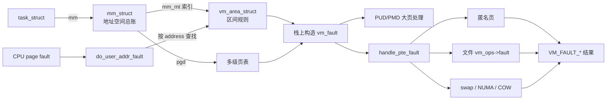

# `mm_struct`、`vm_area_struct` 与 `vm_fault` 详解

> 源码位置：`include/linux/mm_types.h:1175`、`include/linux/mm_types.h:923`、`include/linux/mm.h:753`
> 关键实现：`kernel/fork.c`、`mm/vma.c`、`mm/mmap.c`、`mm/memory.c`、`arch/x86/mm/fault.c`
> 分析基线：kernel-graph MCP 的 Linux 7.2-rc6 索引
> 三者共同构成“进程地址空间 → 一段映射规则 → 一次缺页处理现场”的虚拟内存主线。

## 一、大白话总览

### （a）为什么要设计这三个对象？

用户看到的是一大片虚拟地址，内核却必须分别回答三个尺度的问题：

- 这个进程的整张虚拟地址空间有哪些区域、根页表在哪里、用了多少内存、由谁共享？——`mm_struct`。
- 地址 `0x...` 落在哪一段映射里，这段允许读/写/执行吗，背后是匿名内存还是文件？——`vm_area_struct`。
- CPU 刚刚访问某个地址失败，这次是读、写还是取指，页表走到哪一级，原表项是什么，处理器应返回什么结果？——`vm_fault`。

没有这种分层，内核要么给每个虚拟页重复保存整段映射规则，要么每次 fault 都重新拼装进程级、区间级和页表级状态；前者浪费巨大，后者难以正确处理并发、COW、文件回填、交换和大页。

### （b）如果让我自己设计，第一反应是什么？

#### 1. 一句话降级

给每个进程建一本地址簿，地址簿里每一项描述一段连续地址；访问出错时，再生成一张只服务于本次处理的工单。

#### 2. 最小模型

先忽略多线程、锁、文件、COW、交换、NUMA、大页和 userfaultfd，只考虑单进程匿名页：

```text
task_struct
    │ mm
    ▼
mm_struct（整本地址簿，含根页表）
    │ mm_mt 按地址查找
    ▼
vm_area_struct [vm_start, vm_end)（这一段的权限）
    │ CPU 首次访问，PTE 尚不存在
    ▼
vm_fault（地址、访问类型、页表游标）
    │
    └── 分配物理页并安装 PTE → 指令重试成功
```

最小输入是“当前进程、故障地址、访问类型”；核心数据是地址空间、命中的区间和页表；正常出口是页表已能完成该访问，异常出口是 `SIGSEGV`、`SIGBUS` 或 OOM 等结果。

#### 3. 核心数据对象

| 对象 | 类比 | 在主线中的角色 |
|---|---|---|
| `task_struct::mm` | 当前使用的地址簿 | 把普通用户线程关联到其用户地址空间 |
| `mm_struct::mm_mt` | 地址区间索引 | 以 Maple Tree 保存并快速查找全部 VMA |
| `mm_struct::pgd` | 多级目录的根 | 是硬件页表遍历和软件补页表的起点 |
| `vm_area_struct` | 地址簿的一条区间规则 | 描述 `[vm_start, vm_end)` 的权限、后备存储和 fault 回调 |
| `vm_area_struct::vm_ops` | 区间处理手册 | 文件或设备映射用它把 fault 分派给具体实现 |
| `vm_fault` | 一次缺页工作单 | 把 VMA、地址、访问标志、页表游标和临时结果在各层间传递 |
| `PUD/PMD/PTE` | 逐级目录项 | 最终把虚拟页翻译到物理页，或编码 swap/迁移等非驻留状态 |

#### 4. 真实复杂度从哪里来？

- 一个地址空间可被多个线程共享，`mm_users` 与 `mm_count` 还表示两种不同生命周期。
- VMA 会插入、删除、拆分、合并；查找必须快，修改必须与 `map_count`、文件反向映射和统计同步。
- VMA 既可能是匿名映射，也可能由普通文件、shmem、DAX 或设备驱动提供页面。
- 同一 fault 可能是缺页、swap-in、COW 写保护、NUMA hint、userfaultfd、大页或伪故障。
- fault 会睡眠、I/O，甚至暂时释放 `mmap_lock`；释放后原 `vma` 指针可能已经失效。
- 页表由硬件并发读取，软件还可能由多个 CPU 同时修改，因此需要页表锁、TLB 刷新和“读取旧表项后再次验证”。
- 热路径对 cacheline 很敏感，所以结构体字段布局、每 VMA 锁和预分配页表都带有明确性能目的。

#### 5. 如果自己实现，大概步骤

1. 创建 `mm_struct`，初始化引用、VMA 索引、锁、统计和根页表；失败时按资源获得的逆序回滚。
2. `mmap()` 时验证区间和权限，优先尝试与相邻 VMA 合并；不能合并才分配新 VMA。
3. 写入 VMA 的范围、权限、偏移、文件和操作表，再插入 `mm_mt`，同步 `map_count` 与文件反向映射。
4. CPU fault 时从当前任务取得 `mm`，按地址锁定并查找 VMA，先检查访问权限。
5. 在栈上构造 `vm_fault`，逐级分配或检查 PUD、PMD、PTE。
6. 按表项状态处理匿名缺页、文件缺页、swap、COW、NUMA 或大页；锁内提交表项并更新 MMU/TLB 状态。
7. 把 `VM_FAULT_*` 结果交回体系结构入口；必要时重试、发信号或触发 OOM。
8. 最后一个用户退出时撤销映射、释放页表和 VMA，销毁 Maple Tree；最后一个内部引用消失后才释放 `mm_struct` 本身。

#### 6. 源码阅读 checklist

- 当前字段是进程级账本、VMA 规则，还是一次 fault 的临时状态？
- VMA 查找/修改受 `mmap_lock`、每 VMA 锁还是 RCU 保护？
- 改动区间时是否同步维护 `mm_mt`、`map_count`、文件 `i_mmap` 和匿名反向映射？
- 当前 fault 是“表项不存在”“表项不驻留”“写保护”还是“权限非法”？
- `vmf->pte`、`vmf->ptl` 是否仍处在有效且持锁的窗口？
- 某个 helper 会不会释放 `mmap_lock`？回来后还能否解引用 `vma`？
- 返回值是成功的零、要求重试、已完全处理，还是要转成信号/OOM？
- 失败路径是否释放了预分配页表、folio、文件引用或新建 VMA？

### （c）它们是怎么设计的？

设计者把“稳定规则”和“瞬时执行状态”拆开：`mm_struct` 拥有地址空间全局状态，VMA 只保存一段同质区间的规则，`vm_fault` 则在 fault 发生时按值构造。这样一个 VMA 可服务无数次访问，却不会长期携带某次页表遍历的临时指针。

区间索引用 Maple Tree，而不是把树节点嵌进每个 VMA。VMA 同时通过 `anon_vma_chain` 或文件 `address_space::i_mmap` 参与反向映射。页表路径则把已经算出的 `pud`、`pmd`、`pte` 游标不断写入 `vm_fault`，避免每层重新查找。

### （d）分别处理哪些情况？

**情况一：新进程或新程序映像**

→ 创建并初始化 `mm_struct`，建立根页表；`fork()` 还复制父进程 VMA 与页表语义。  
→ 原因：每个独立用户地址空间必须有自己的全局账本和页表根。

**情况二：`mmap()`、`brk()` 或栈扩展改变区间**

→ 合并相邻兼容 VMA，或创建新 `vm_area_struct` 并插入 `mm_mt`。  
→ 原因：只有规则真正不同的连续区间才需要独立 VMA，减少对象数和查找成本。

**情况三：合法地址首次访问或页面不驻留**

→ 找到 VMA，构造 `vm_fault`；按匿名、文件、swap、大页等类型补齐页表。  
→ 原因：虚拟地址预留与物理页分配解耦，实际访问时才付出内存或 I/O 成本。

**情况四：写只读 PTE**

→ 共享映射执行 `page_mkwrite`/置脏；私有映射复用独占匿名页或复制出新页。  
→ 原因：既要实现 COW 隔离，又要避免页面已独占时无意义复制。

**情况五：地址不存在或权限不符**

→ 在体系结构 fault 入口转换为 `SIGSEGV`、`SIGBUS`、OOM 处理或内核异常修复。  
→ 原因：VMA 是软件层的合法性边界，不能仅因为能分配页就放行非法访问。

## 二、生命周期与控制流骨架

```text
进程地址空间生命周期
│
├─ 【创建】mm_alloc()/dup_mm()
│     ├─ 分配 mm_struct 失败 → return NULL
│     ├─ mm_init() 初始化索引、引用、锁、PGD、架构上下文
│     │     └─ 任一步失败 → goto 对应标签，逆序清理 → return NULL
│     └─ fork 路径 dup_mmap() 复制 VMA；失败 → mmput() 回收
│
├─ 【建立映射】mmap_region()
│     ├─ W^X/架构 flags/文件写映射校验失败 → return error
│     ├─ 相邻 VMA 可合并 → 复用并扩大已有 VMA
│     └─ 不可合并 → 分配并初始化新 VMA → 插入 mm_mt
│           └─ 任一步失败 → 释放预分配/新 VMA/记账 → return error
│
├─ 【运行期 fault】do_user_addr_fault()
│     ├─ 内核非法访问、SMAP、无 mm、禁止 fault → 报错并 return
│     ├─ 每 VMA 锁快路径成功 → 权限检查 → handle_mm_fault()
│     │     └─ 要求重试 → 转入 mmap_lock 慢路径
│     └─ mmap_lock 慢路径 → 查 VMA → 权限检查 → handle_mm_fault()
│           ├─ VM_FAULT_RETRY → goto retry
│           ├─ VM_FAULT_COMPLETED → 锁已处理，直接 return
│           ├─ 成功 → 解锁并 return
│           └─ 错误 → OOM / SIGBUS / SIGSEGV
│
└─ 【销毁】最后一个 mm_users 归零
      └─ __mmput() → exit_mmap()
            ├─ 没有 VMA → 直接转 destroy
            ├─ 撤销所有页表映射、批量 TLB flush
            ├─ 释放页表和每个 VMA
            └─ 销毁 mm_mt；最终 mmdrop() 释放 mm_struct
```

## 三、Mermaid：三种对象的归属与 fault 生命周期



关键生命周期差异：

| 对象 | 创建时机 | 存活范围 | 销毁时机 |
|---|---|---|---|
| `mm_struct` | `mm_alloc()` 或 `dup_mm()` | 通常覆盖进程地址空间整个生命周期，可被线程和临时持有者共享 | `mm_users` 归零先拆地址空间，`mm_count` 归零才释放对象 |
| `vm_area_struct` | 新映射无法与相邻 VMA 合并时 | 从插入 `mm_mt` 到 unmap、合并、exec 或退出拆除 | 标记 detached、解除反向映射后由 `vm_area_free()` 释放 |
| `vm_fault` | `__handle_mm_fault()` 的调用栈上 | 仅一次 fault 处理及其下游回调 | 函数返回自动消失；不应被回调长期保存 |

## 四、快速定位与宏观地位

### 4.1 快速定位

- 子系统：Linux MM 的用户虚拟内存、VMA 管理与缺页异常处理。
- `mm_struct`：地址空间的所有者与总账，不等于“一个进程的物理内存”。
- `vm_area_struct`：一段页对齐、半开区间 `[vm_start, vm_end)` 的映射规则，不等于已经存在的 PTE 集合。
- `vm_fault`：一次 fault 的参数、页表遍历游标和临时返回槽，不是硬件异常帧 `pt_regs`。
- VMA 定义：`include/linux/mm_types.h:923`。
- `mm_struct` 定义：`include/linux/mm_types.h:1175`。
- `vm_fault` 定义：`include/linux/mm.h:753`。
- x86 用户地址 fault 入口：`arch/x86/mm/fault.c:1215`。
- 通用 fault 核心：`mm/memory.c:6841`、`mm/memory.c:6604`、`mm/memory.c:6514`。

### 4.2 所属层次

```text
┌──────────────────────────────────────────────┐
│ 用户事件：fork/exec/mmap/munmap/访存         │
└──────────────────────┬───────────────────────┘
                       ▼
┌──────────────────────────────────────────────┐
│ task_struct → mm_struct                      │
│ 地址空间引用、VMA Maple Tree、PGD、统计与锁  │ ← mm_struct 在这里
└──────────────────────┬───────────────────────┘
                       ▼
┌──────────────────────────────────────────────┐
│ vm_area_struct：区间、权限、文件与 vm_ops    │ ← vm_area_struct 在这里
└──────────────────────┬───────────────────────┘
                       ▼
┌──────────────────────────────────────────────┐
│ do_user_addr_fault → handle_mm_fault          │
│ 在栈上组装 vm_fault                          │ ← vm_fault 在这里
└──────────────────────┬───────────────────────┘
                       ▼
┌──────────────────────────────────────────────┐
│ PUD/PMD/PTE、folio、页缓存、swap、rmap、TLB   │
└──────────────────────────────────────────────┘
```

### 4.3 真实触发场景

1. 当进程调用 `mmap()` 时，`ksys_mmap_pgoff()` 经 `vm_mmap_pgoff()`、`do_mmap()` 到 `mmap_region()`，合并或新建 VMA。
2. 当 `fork()` 创建不共享地址空间的子进程时，`kernel_clone()` 经 `copy_process()`、`copy_mm()`、`dup_mm()` 到 `mm_init()`，再由 `dup_mmap()` 复制 VMA 语义。
3. 当用户第一次写匿名映射时，x86 `handle_page_fault()` 转入 `do_user_addr_fault()`，找到 VMA 后经 `handle_mm_fault()`、`__handle_mm_fault()`、`handle_pte_fault()`、`do_pte_missing()` 到 `do_anonymous_page()`。
4. 当进程最后一个地址空间用户退出时，`do_exit()` 经 `exit_mm()`、`mmput()`、`__mmput()` 到 `exit_mmap()`，拆页表、VMA 和 Maple Tree。

### 4.4 如果有 bug 会怎样？

- `mm_users/mm_count` 错误会导致 use-after-free，或地址空间永久泄漏。
- VMA 区间重叠、树与 `map_count` 不一致会让合法访问误收 `SIGSEGV`，甚至把页面映射给错误区间。
- 权限检查错误可能破坏 W^X、COW 或 SMAP 等安全边界。
- fault 中错误复用旧 `pte`/`vma` 指针会在并发 unmap、THP collapse 或锁释放后访问失效对象。
- 页表更新缺少锁或 TLB 协调会让不同 CPU 看见相互矛盾的地址翻译。

## 五、MCP 确认的完整调用链

### 5.1 `mm_struct` 创建与销毁

```text
kernel_clone()
  └── copy_process()
        └── copy_mm()
              └── dup_mm()                         // kernel/fork.c:1527
                    ├── allocate_mm()
                    ├── mm_init()                  // kernel/fork.c:1091
                    └── dup_mmap()                 // 复制父地址空间的 VMA/页表语义

do_exit()
  └── exit_mm()
        └── mmput()                                // kernel/fork.c:1211
              └── __mmput()                       // kernel/fork.c:1185
                    └── exit_mmap()                // mm/mmap.c:1288
                          ├── unmap_vmas()
                          ├── free_pgtables()
                          ├── tear_down_vmas()
                          └── __mt_destroy()
```

### 5.2 VMA 建立

```text
ksys_mmap_pgoff()
  └── vm_mmap_pgoff()
        └── do_mmap()                              // mm/mmap.c:338
              └── mmap_region()                    // mm/vma.c:2938
                    └── __mmap_region()            // mm/vma.c:2838
                          ├── vma_merge_new_range() // 能合并则不建新对象
                          └── __mmap_new_vma()      // mm/vma.c:2634
                                ├── vm_area_alloc() // mm/vma_init.c:32
                                │     └── vma_init()// include/linux/mm.h:991
                                ├── vma_iter_store_new() // 插入 mm_mt
                                └── vma_link_file() // 建立文件反向映射关系
```

### 5.3 用户缺页主路径

```text
x86 page-fault entry
  └── handle_page_fault()                          // arch/x86/mm/fault.c:1470
        └── [用户地址] do_user_addr_fault()        // arch/x86/mm/fault.c:1215
              ├── lock_vma_under_rcu()             // 每 VMA 锁快路径
              └── handle_mm_fault()                // mm/memory.c:6841
                    ├── hugetlb_fault()             // 显式 HugeTLB VMA
                    └── __handle_mm_fault()         // mm/memory.c:6604
                          ├── create_huge_pud()/create_huge_pmd()
                          └── handle_pte_fault()    // mm/memory.c:6514
                                ├── do_pte_missing()
                                │     ├── do_anonymous_page() // 匿名缺页
                                │     └── do_fault()          // 文件/共享后备
                                ├── do_swap_page()            // 非 present 表项
                                ├── do_numa_page()/do_uffd_rwp()
                                └── do_wp_page()              // 写保护/COW
```

## 六、`struct mm_struct` 逐字段详解

### 6.1 身份、生命周期与核心索引

| 字段 | 含义与读写时机 |
|---|---|
| `atomic_t mm_count` | **对象引用数**。`mm_users` 整体只占其中一个引用，内核临时持有用 `mmgrab()/mmdrop()`；归零才真正释放结构体。放在独立 cacheline，减少热写竞争。 |
| `atomic_t mm_users` | **地址空间用户数**。线程及临时用户通过 `mmget()/mmput()` 管理；归零触发 `__mmput()` 拆地址空间，再丢掉一份 `mm_count`。 |
| `struct maple_tree mm_mt` | 以虚拟地址为键保存 VMA。`mm_init()` 初始化并把外部锁设为 `mmap_lock`；mmap/unmap 修改，fault/proc/GUP 等路径查询。 |
| `int map_count` | 当前 VMA 数量。新 VMA 插入时递增，合并/删除时对应调整；不是映射页数。 |
| `pgd_t *pgd` | 该地址空间顶级页表。`mm_init()` 中由 `mm_alloc_pgd()` 分配，切换地址空间和 fault 页表遍历都会使用。 |
| `unsigned long task_size` | 用户虚拟地址上限，供地址合法性与选址检查。它是地址范围，不是 RSS 或物理内存限制。 |
| `mmap_base` | 常规 top-down mmap 区域的基准地址，受 ASLR 与体系结构布局影响。 |
| `mmap_legacy_base` | legacy bottom-up 布局的 mmap 基准地址。 |
| `mmap_compat_base` / `mmap_compat_legacy_base` | `CONFIG_HAVE_ARCH_COMPAT_MMAP_BASES` 下兼容 ABI 的两种 mmap 基址。 |
| `char flexible_array[]` | 结构体尾部动态空间；注释明确 `mm_cpumask` 因 `nr_cpu_ids` 动态定长而放在末尾。 |

关键区别：

```text
mm_users == 0  → 用户地址空间无人使用，可以 exit_mmap()
mm_count == 0  → 连内核内部引用也没有，才可以 free_mm()
```

因此 `mm_users` 不是普通意义上 `mm_struct *` 指针的总引用计数。

### 6.2 并发控制字段

| 字段 | 保护对象与原因 |
|---|---|
| `struct rw_semaphore mmap_lock` | 保护 VMA 拓扑及相关地址空间元数据。读锁允许并发查找，写锁串行化 mmap/unmap/拆分/合并。其结构体偏移经过 cacheline 调优。 |
| `spinlock_t page_table_lock` | 保护页表及一部分计数；更细粒度页表锁启用时仍作为上层或特定层级保护。不能用 `mmap_lock` 代替，因为硬件相关页表更新需要更短临界区。 |
| `seqcount_t mm_lock_seq` | `CONFIG_PER_VMA_LOCK` 下把 `mmap_lock` 写侧变化发布给 VMA 锁读者；奇数表示写锁持有，偶数表示释放。允许读侧发现竞争后退回慢路径。 |
| `struct rcuwait vma_writer_wait` | 每 VMA 锁写者等待读者退出时使用。 |
| `seqcount_t write_protect_seq` | 批量写保护页表时标记序列，例如 fork 为后续 COW 复制页表；并发 fault 可检测操作边界。 |
| `spinlock_t arg_lock` | 专门保护代码段、数据段、brk、栈、参数和环境地址字段，避免为这些小字段滥用大锁。 |
| `atomic_t tlb_flush_pending` | 表示存在批量 TLB flush；移动 PROT_NONE 页面等路径据此决定是否补 flush。 |
| `atomic_t tlb_flush_batched` | 特定体系结构配置下记录延迟批量 unmap flush。 |

### 6.3 内存用量与统计

| 字段 | 精确定义 |
|---|---|
| `atomic_long_t pgtables_bytes` | 本地址空间页表占用的字节数，不包含用户数据页。 |
| `hiwater_rss` | RSS 历史峰值。 |
| `hiwater_vm` | 虚拟映射页数历史峰值。 |
| `total_vm` | 所有 VMA 覆盖的总页数，是虚拟容量，不代表都驻留。 |
| `locked_vm` | 带 `PG_mlocked` 约束的页数。 |
| `atomic64_t pinned_vm` | 长期 pin 导致引用永久提高的页数，原子化是因为 pin/unpin 可并发。 |
| `data_vm` | 可写、非共享、非栈区的虚拟页数。 |
| `exec_vm` | 可执行、不可写、非栈区的虚拟页数。 |
| `stack_vm` | 栈 VMA 的虚拟页数。 |
| `rss_stat[NR_MM_COUNTERS]` | 按类别统计驻留页，如匿名、文件、shmem、swap；per-CPU counter 降低热点竞争。 |
| `hugetlb_usage` | 配置 HugeTLB 时统计该 mm 的 hugetlb 使用量。 |

不变量：`total_vm` 与 VMA 覆盖范围记账同步，但它和 `rss_stat` 不必相等；“已保留虚拟地址”不等于“已有驻留物理页”。

### 6.4 程序映像、所有者与体系结构状态

| 字段 | 作用 |
|---|---|
| `def_flags` / `def_vma_flags` | 新 VMA 的默认 flags；union 是 flags 类型迁移期兼容布局，不能当成两个独立字段。 |
| `start_code/end_code` | ELF 代码段地址范围。 |
| `start_data/end_data` | 数据段地址范围。 |
| `start_brk/brk` | 堆起点与当前 program break。 |
| `start_stack` | 用户栈起始参考地址。 |
| `arg_start/arg_end` | argv 字符串地址范围。 |
| `env_start/env_end` | 环境变量字符串地址范围。 |
| `saved_auxv[]` | 保存 ELF auxiliary vector，供 `/proc/PID/auxv` 等读取。 |
| `saved_e_flags` | 特定架构保存 ELF 头 flags，供 core dump/ABI 使用。 |
| `struct linux_binfmt *binfmt` | 当前可执行文件格式处理器；退出时释放其模块引用。 |
| `mm_context_t context` | 架构私有地址空间上下文，如 ASID/PCID 或段表相关状态。 |
| `mm_flags_t flags` | mm 级状态位，源码要求经 `mm_flags_*` helper 访问，不能随意直接位操作。 |
| `task_struct __rcu *owner` | memcg 下用于归属记账的规范 owner，不代表只有这个 task 使用 mm；修改受严格条件和 RCU 约束。 |
| `struct file __rcu *exe_file` | `/proc/<pid>/exe` 指向的文件。 |

### 6.5 与其他内核子系统的挂接字段

| 字段 | 角色 |
|---|---|
| `mmlist` | 把可能有 swap 的 mm 串到 `init_mm.mmlist`；由全局 `mmlist_lock` 保护。 |
| `mm_cid` | 调度/MM CID 相关存储，用于地址空间与 CPU/并发标识协作。 |
| `sc_stat` | sched_cache 相关统计。 |
| `futex` | per-mm futex 状态。 |
| `membarrier_state` | membarrier 控制状态；靠近 `pgd` 是为了 `switch_mm()` 的 cacheline 局部性。 |
| `ioctx_lock/ioctx_table` | AIO 上下文表及其锁，表指针受 RCU。 |
| `notifier_subscriptions` | MMU notifier 订阅，KVM/IOMMU/设备镜像页表可获知映射失效。 |
| `pmd_huge_pte` | THP 且 PMD 锁未拆分配置下保存 huge PTE 页表，受 `page_table_lock` 保护。 |
| `numa_next_scan` | 下一次 NUMA balancing 把 PTE 改成 PROT_NONE 的时间。 |
| `numa_scan_offset` | NUMA 页表扫描续点。 |
| `numa_scan_seq` | 防止多个线程重复执行同轮 NUMA 扫描。 |
| `uprobes_state` | 用户态探针与该地址空间关联的状态。 |
| `delayed_drop` | PREEMPT_RT 下通过 RCU 延迟释放 mm 的挂钩。 |
| `async_put_work` | 不能在当前上下文同步完成 mm put 时使用的 work。 |
| `iommu_mm` | IOMMU 与进程地址空间关联的私有数据。 |
| `ksm_merging_pages` | 正参与 KSM 合并的页数。 |
| `ksm_rmap_items` | KSM 检查建立的反向映射项数量。 |
| `ksm_zero_pages` | 被 KSM 合并到内核零页的空白页数。 |
| `lru_gen.list` | 把 mm 挂到多代 LRU 的页表扫描集合。 |
| `lru_gen.bitmap` | 提示各节点扫描器该 mm 自上轮后是否被使用。 |
| `lru_gen.memcg` | memcg 配置下缓存 owner 对应的内存控制组。 |
| `mm_id` | `CONFIG_MM_ID` 下的地址空间标识。 |

### 6.6 `mm_init()` 关键语句与回滚

```c
mt_init_flags(&mm->mm_mt, MM_MT_FLAGS);             // 初始化 VMA Maple Tree
mt_set_external_lock(&mm->mm_mt, &mm->mmap_lock);  // 声明树修改由 mmap_lock 串行化
atomic_set(&mm->mm_users, 1);                       // 初始地址空间用户
atomic_set(&mm->mm_count, 1);                       // 初始对象引用
mm->map_count = 0;                                  // 尚无 VMA
spin_lock_init(&mm->page_table_lock);               // 页表并发保护
mm_init_cpumask(mm);                                // 初始化使用过该 mm 的 CPU 集合
```

随后依次分配 `pgd → mm_id → arch context → cid → sched state → rss percpu counters`。任一步失败，标签按相反顺序执行 `mm_destroy_sched → mm_destroy_cid → destroy_context → mm_free_id → mm_free_pgd → free_mm`。这是典型的“获得一层资源，失败就退回上一层”不变量。

## 七、`struct vm_area_struct` 逐字段详解

### 7.1 区间、归属和权限

| 字段 | 含义与不变量 |
|---|---|
| `vm_start` | VMA 包含的第一个虚拟地址。 |
| `vm_end` | VMA 不包含的结束地址，因此区间是 `[vm_start, vm_end)`；必须满足 `vm_start < vm_end`。 |
| `vm_freeptr` | 与 start/end 共用 union，仅在 SLAB `SLAB_TYPESAFE_BY_RCU` 释放状态下作为 free pointer；VMA 活跃时不能把它当普通指针读。 |
| `vm_mm` | 所属 `mm_struct`。初始化于 `vma_init()`；VMA 插入、fault 和统计都由它回到地址空间。 |
| `vm_page_prot` | 已由 VMA flags 和架构策略转换的页表保护模板，安装 PTE/PMD 时使用。 |
| `vm_flags` / `flags` | 读写执行、shared、grow、locked、PFNMAP 等区间语义；union 是类型迁移，不是两套状态。应使用 `vm_flags_*`/`vma_flags_*` helper 修改或查询。 |

最重要的三个不变量：

```text
VMA 范围：vm_start < vm_end，且通常按 PAGE_SIZE 对齐
同一 mm 的有效 VMA：地址区间不重叠
索引一致性：mm_mt 中的范围、VMA 字段、mm->map_count 必须同步
```

### 7.2 匿名内存与反向映射

| 字段 | 作用 |
|---|---|
| `__vm_anon_pgoff_lo/hi` | 匿名映射逻辑页偏移的低/高 32 位。拆分保存配合结构布局；应通过 helper 组合访问。 |
| `anon_vma_chain` | 一个 VMA 可关联 anon_vma 层级，因此用链把本 VMA 的关联项组织起来；受 `mmap_lock` 与 `page_table_lock` 协调。 |
| `anon_vma` | 匿名反向映射根。COW 后的私有文件 VMA 也可能同时具有 `vm_file` 和 `anon_vma`。 |

“匿名 VMA”不等于 `vm_file == NULL` 的唯一判据：私有文件映射发生 COW 后，会既留在文件 `i_mmap` 中，又加入匿名反向映射体系。

### 7.3 后备存储与回调

| 字段 | 含义 |
|---|---|
| `const vm_operations_struct *vm_ops` | VMA 操作表，包含 `fault`、`map_pages`、`open`、`close`、`page_mkwrite` 等可选回调。`vma_init()` 先设 dummy ops，具体映射再替换。 |
| `vm_pgoff` | VMA 起点对应后备文件中的页偏移，单位是 `PAGE_SIZE`，不是字节。`linear_page_index()` 用它计算 fault 的 `pgoff`。 |
| `struct file *vm_file` | 文件后备对象；匿名映射通常为 NULL，文件映射持有引用直到 VMA 关闭。 |
| `void *vm_private_data` | 文件系统或驱动绑定到这段 VMA 的私有上下文，语义由 `vm_ops` 实现约定。 |
| `shared.rb` | 把文件 VMA 挂入 `address_space->i_mmap` interval tree 的红黑树节点。这里的红黑树是**文件反向映射索引**，不是 `mm_struct` 的 VMA 主索引。 |
| `shared.rb_subtree_last` | interval tree 子树覆盖的最远结束位置，用于高效查找与某文件区间重叠的全部 VMA。 |

### 7.4 并发、策略与可选功能

| 字段 | 作用 |
|---|---|
| `vm_lock_seq` | 每 VMA 锁序列；与 `mm->mm_lock_seq` 比较判断写锁状态。序列允许溢出，最坏只导致偶尔退回慢路径。 |
| `vm_refcnt` | 同时编码 attached/detached、读锁数和“排除新读者”状态。0 表示 detached，1 表示 attached 且无读锁或写锁，>1 表示有读者；高位 flag 表示正在排除读者。 |
| `vmlock_dep_map` | lockdep 调试下描述每 VMA 锁依赖。 |
| `swap_readahead_info` | 交换预读的 VMA 局部历史/提示。 |
| `vm_region` | NOMMU 内核中关联共享映射区域；MMU 配置不使用。 |
| `vm_policy` | 此 VMA 的 NUMA 分配策略，覆盖或细化进程默认策略。 |
| `numab_state` | NUMA balancing 针对该 VMA 的扫描状态。 |
| `anon_name` | 用户给匿名 VMA 设置的名字，受 `mmap_lock` 保护并通过 helper 访问。 |
| `vm_userfaultfd_ctx` | userfaultfd 对此 VMA 的注册上下文，使缺页/写保护事件能交给用户态处理。 |
| `pfnmap_track_ctx` | 某些架构下跟踪 PFNMAP 映射生命周期。 |

### 7.5 `vm_refcnt` 状态表

| 值/范围 | 状态 |
|---|---|
| `0` | VMA 已 detached，新读者不能再增加引用。 |
| `1` | VMA attached，当前无读锁；也可能由序列号判定为写锁状态。 |
| `>1` 且低于排除标志 | 存在一个或多个 VMA 读者。 |
| `EXCLUDE_READERS_FLAG` | detached，等待排除读者流程最终把计数减到 0。 |
| `EXCLUDE_READERS_FLAG + 1` | 写锁或 detach 正在建立排他状态，可能等待一个竞争读者。 |
| 更大 | 正等待多个读者退出，新读者已被禁止进入。 |

这是把“对象生命周期引用”和“细粒度读锁”合并编码的优化，不能用普通 `refcount_inc()` 思维独立解释每一位。

### 7.6 新 VMA 的真实建立顺序

```text
__mmap_region()
│
├─ __mmap_setup()/mmap_prepare：校验并准备映射
├─ vma_merge_new_range()：相邻规则兼容则合并
└─ [不能合并] __mmap_new_vma()
      ├─ vm_area_alloc() → vma_init()
      ├─ vma_set_range()：写 start/end/pgoff
      ├─ 写 flags 与 vm_page_prot
      ├─ 文件映射回调或 shmem setup
      ├─ vma_start_write()
      ├─ vma_iter_store_new()：插入 mm_mt
      ├─ mm->map_count++
      └─ vma_link_file()：建立文件反向映射
```

失败时必须释放 Maple Tree 预分配节点并 `vm_area_free(vma)`；已经做过虚拟内存承诺记账的，还要 `vm_unacct_memory()`。这说明 VMA 插入不是“只改两根指针”，而是一项多索引、多账本事务。

## 八、`struct vm_fault` 逐字段详解

### 8.1 只读输入区

源码把前六项包在 `const struct` 中，表达“下游 fault handler 应把它们视作本次请求的固定输入”。

| 字段 | 设置者与意义 |
|---|---|
| `vma` | `__handle_mm_fault()` 从入口参数写入；目标 VMA 决定权限、页保护、后备类型和回调。若处理释放 `mmap_lock`，返回后它可能失效。 |
| `gfp_mask` | 由 `__get_fault_gfp_mask(vma)` 生成，规定 fault 内部分配允许睡眠、回收和记账等行为。驱动/文件系统应遵循它。 |
| `pgoff` | `linear_page_index(vma, address)` 计算的 VMA/后备对象逻辑页号，文件 fault 用它定位页缓存。 |
| `address` | `address & PAGE_MASK` 后的页对齐 fault 地址，页表查找和安装表项以它为准。 |
| `real_address` | 未掩码的原始地址，保留页内偏移，某些设备/特殊 fault 需要精确字节位置。 |

### 8.2 fault 类型和页表游标

| 字段 | 含义 |
|---|---|
| `enum fault_flag flags` | 输入/演进状态：读写、取指、用户、remote、allow_retry、tried、VMA lock、unshare，以及旧 PTE 是否有效等。它不是 `VM_FAULT_*` 返回值。 |
| `pud_t *pud` | 与 `address` 对应的 PUD 表项指针，由 `pud_alloc()` 获得；支持 PUD 大页与向下遍历。 |
| `pmd_t *pmd` | 对应 PMD 表项指针，由 `pmd_alloc()` 获得；支持 THP、迁移项和 PTE fallback。 |
| `orig_pte` / `orig_pmd` | fault 初看见的表项快照，union 表示当前处理 PTE 或 PMD 二选一。加锁后必须用 `pte_same()` 等复核，不能假定快照仍然成立。 |

### 8.3 handler 输出与临时资源

| 字段 | 生命周期与约束 |
|---|---|
| `cow_page` | 某些 VMA fault handler 为 COW 准备的页面槽。只服务本次 fault。 |
| `page` | `->fault` handler 通常把得到的页面放这里；若返回 `VM_FAULT_NOPAGE` 或错误则可不提供。 |
| `pte` | 对应地址的 PTE 指针；页表不存在时可为 NULL。源码明确它只在持有 `ptl` 的有效窗口内可靠。 |
| `ptl` | 保护 `pte` 页表（或无 PTE 时保护 PMD）的 spinlock 指针。部分 helper 如 `do_wp_page()` 带 `__releases(vmf->ptl)`，表示会替调用者解锁。 |
| `prealloc_pte` | `do_fault_around()` 预分配的 PTE 页表，让 `vm_ops->map_pages()` 在原子上下文不再分配；未消费时 `do_fault()` 必须释放并清 NULL。 |

### 8.4 `flags` 与返回值不要混淆

| 类别 | 例子 | 谁消费 |
|---|---|---|
| `FAULT_FLAG_*` | `WRITE`、`USER`、`INSTRUCTION`、`ALLOW_RETRY`、`TRIED`、`VMA_LOCK` | 输入给通用 MM 和 VMA handler，描述这次访问及允许的处理方式 |
| `VM_FAULT_*` | `OOM`、`SIGBUS`、`SIGSEGV`、`RETRY`、`MAJOR`、`COMPLETED`、`FALLBACK` | handler 返回给上层，描述结果和后续动作 |

`VM_FAULT_RETRY` 往往意味着相关锁已被释放，上层必须重新查找 VMA；`VM_FAULT_COMPLETED` 表示连锁释放等收尾也已完成，上层不应再次解锁。

## 九、`vm_fault` 如何驱动页表分派

### 9.1 `__handle_mm_fault()`：构造工单并逐级下钻

```c
struct vm_fault vmf = {
    .vma = vma,                              // 命中的映射规则
    .address = address & PAGE_MASK,          // 页对齐地址
    .real_address = address,                 // 保留原始页内偏移
    .flags = flags,                          // 访问类型与重试语义
    .pgoff = linear_page_index(vma, address),// 后备对象逻辑页号
    .gfp_mask = __get_fault_gfp_mask(vma),   // 本次允许的分配行为
};
```

随后：

1. 从 `mm = vma->vm_mm` 与 `mm->pgd` 开始定位 PGD。
2. `p4d_alloc()`、`pud_alloc()`、`pmd_alloc()` 按需建立中间页表；失败返回 `VM_FAULT_OOM`。
3. 若 PUD/PMD 允许透明大页，先尝试大页 fault；返回 `VM_FAULT_FALLBACK` 才继续小页路径。
4. 若 PMD 是迁移项、设备私有项、NUMA PROT_NONE 或写保护大页，进入对应专门分支。
5. 普通页最终 `handle_pte_fault(&vmf)`。

`retry_pud` 的原因是 PUD 大页 fault 可能与 `pmd_alloc()` 并发；检测到 `pud_trans_unstable()` 后不能继续使用刚取得的下级指针，必须回到 PUD 层重看状态。

### 9.2 `handle_pte_fault()` 状态机

```text
handle_pte_fault(vmf)
│
├─ PMD/PTE 尚不存在
│     └─ do_pte_missing()
│           ├─ anonymous → do_anonymous_page()
│           └─ backed    → do_fault()
│
├─ PTE 非 present → do_swap_page()
│
├─ PTE 为 accessible PROT_NONE
│     ├─ userfaultfd RWP → do_uffd_rwp()
│     └─ NUMA hint       → do_numa_page()
│
└─ PTE present → 加 ptl 并复核 orig_pte
      ├─ 表项已变化 → 更新 MMU/TLB 观察 → unlock → return 0
      ├─ 写/UNSHARE 且不可写 → do_wp_page()（由它释放 ptl）
      └─ 普通访问 → 置 young；写访问还置 dirty → 更新 MMU cache → unlock
```

这里先 lockless 读取 `orig_pte`，进入修改临界区后再 `pte_same()`，兼顾快路径和正确性。若 PTE 页表还不存在，代码故意推迟 `__pte_alloc()`，因为文件 fault 可能直接建立大页；过早暴露空 PTE 页表会妨碍并发大页建立和 rmap 判断。

### 9.3 三条最常见 PTE 分支

#### 匿名首次读写

- 读 fault 可映射全局只读 zero page，直到写入时再 COW，避免大量全零页分配。
- 写 fault 先 `vmf_anon_prepare()` 建匿名反向映射，再分配匿名 folio。
- 获得 `ptl` 后重新确认 PTE 范围仍为空；并发者已安装则释放新 folio。
- `userfaultfd_missing()` 注册时转交用户态，否则 `map_anon_folio_pte_pf()` 提交 PTE。

#### 文件映射 fault

`do_fault()` 依据访问方式分派：

```text
无 vm_ops->fault → PTE 真为空则 VM_FAULT_SIGBUS
只读 fault      → do_read_fault()
写 + 私有映射   → do_cow_fault()
写 + 共享映射   → do_shared_fault()
```

无论成功失败，若 `prealloc_pte` 没被消费，都必须 `pte_free()`，防止一次 fault 泄漏一页页表。

#### 写保护/COW

- userfaultfd 写保护先交给 userfaultfd，或在 async 模式清专用位。
- 共享映射不能做私有 COW；对普通页走 `wp_page_shared()`，设备/DAX PFN 走 `wp_pfn_shared()`。
- 私有匿名页若已经 exclusive 或可安全复用，直接 `wp_page_reuse()`。
- 不能复用时先增加旧 folio 引用、释放 `ptl`，再 `wp_page_copy()`；不能在自旋锁内做可能睡眠的分配与复制。

## 十、关键设计决策与不变量

### 10.1 为什么 `mm_struct` 用两个引用计数？

拆地址空间和释放描述对象不是同一时刻。某个内核路径可能只需要保存 mm 元数据，不需要让用户页表继续存活。`mm_users` 归零触发重型 `exit_mmap()`，`mm_count` 则保证剩余内核观察者结束前对象地址仍有效。

### 10.2 为什么 VMA 主索引用 Maple Tree？

VMA 工作负载既要求按地址快速查找，也频繁做范围插入、删除、拆分和查空洞。Maple Tree 是范围索引，并允许把锁管理外置到 `mmap_lock`。注意 `shared.rb` 仍是红黑树节点，但用途是文件 `i_mmap` 反向映射，不能据此说“进程 VMA 仍由红黑树管理”。

### 10.3 为什么要每 VMA 锁快路径？

传统 fault 先取整个 `mmap_lock` 读锁，很多线程在互不相关 VMA 上 fault 也会竞争同一 cacheline。`lock_vma_under_rcu()` 尝试稳定单个 VMA；失败或 handler 要重试时再退到全局锁，改善高并发 fault 的扩展性。

### 10.4 为什么 `vm_fault` 是临时对象？

其中的 `pud/pmd/pte/ptl` 都与一次页表遍历和锁窗口绑定，长期保存会迅速陈旧。栈上对象迫使下游把它当工作上下文使用，也避免每次 fault 动态分配控制块。

### 10.5 为什么 `address` 和 `real_address` 都要保存？

页表以页为单位，绝大多数 MM 操作用对齐后的 `address`；特殊映射又可能需要原始页内偏移。两者预先保存可避免下游误把未对齐地址用于页表索引，也不丢失精确信息。

### 10.6 为什么 fault 后不能总是继续使用 `vma`？

文件 I/O、userfaultfd 或重试路径可能释放 `mmap_lock`。另一线程可趁机 `munmap()` 并释放 VMA，所以 `handle_mm_fault()` 在调用 `__handle_mm_fault()` 后明确警告：从该点起不再安全解引用 `vma`。它提前缓存 `mm` 和 `is_droppable` 正是为了返回后仍能收尾。

### 10.7 核心不变量汇总

| 不变量 | 违反后果 |
|---|---|
| `mm_users` 归零才能拆地址空间，`mm_count` 归零才能释放对象 | UAF 或泄漏 |
| 有效 VMA 区间有序、不重叠，树/范围/`map_count` 一致 | 查错 VMA、错误权限或崩溃 |
| VMA 插入/删除与 anon/file rmap 同步 | 回收、truncate、迁移看不见映射 |
| `vmf->pte` 只在正确映射且持 `vmf->ptl` 时修改 | 页表竞争和内存破坏 |
| lockless 读取的 `orig_pte/orig_pmd` 在提交前必须复核 | 覆盖并发 fault/unmap 的结果 |
| 可能释放 mmap 锁的返回点之后不再解引用旧 VMA | use-after-free |
| 未消费的 `prealloc_pte` 必须释放 | 页表页泄漏 |
| 页表变更与 TLB/MMU cache 更新按架构规则配套 | CPU 使用陈旧翻译 |

## 十一、关键概念补充

### 11.1 VMA 是规则，不是物理页集合

一个 1 GiB 匿名 VMA 刚建立时可以没有任何普通 PTE 和用户物理页。`total_vm` 已增加，但 RSS 仍接近零；后续访问才经 fault 按需映射 zero page 或分配 folio。

### 11.2 页表是现实映射，VMA 是合法性依据

页表回答“当前 CPU 如何翻译”，VMA 回答“软件是否允许以及缺页后应怎样建立翻译”。因此 fault 不能只看 PTE，也必须先找到 VMA 并检查 `vm_flags`。

### 11.3 匿名反向映射与文件反向映射

- `anon_vma` 让内核从匿名 folio 反查哪些进程/VMA 映射它，服务 COW、回收、迁移。
- `address_space->i_mmap` 让内核从文件区间反查 VMA，服务 truncate、写回与失效。
- 私有文件页发生 COW 后，原文件关系和新匿名关系可能在同一 VMA 上同时有意义。

### 11.4 major/minor fault

二者不是“是否分配了新页”的简单区别。通常需要阻塞等待 I/O 的 fault 计为 major；能从已有内存状态解决的计为 minor。`handle_mm_fault()` 最后通过 `mm_account_fault()` 结合返回值进行记账。

## 十二、把三者串成一句话

`mm_struct` 是进程地址空间的总账和索引根，`vm_area_struct` 是其中一段连续地址的合法映射规则，`vm_fault` 是某次访问无法由现有页表完成时创建的临时执行上下文；内核先用 `mm_struct::mm_mt` 找到 VMA，再把 VMA、故障地址、访问类型和页表游标装入 `vm_fault`，最终把抽象映射规则兑现为 PUD/PMD/PTE，或者明确返回重试、信号与 OOM 结果。

阅读后应能回答：

1. 为什么 `mmap()` 成功不代表物理页已经分配？
2. 为什么 `mm_users` 和 `mm_count` 不能合并？
3. 为什么文件私有 VMA 可能同时存在 `vm_file` 和 `anon_vma`？
4. 为什么 `VM_FAULT_RETRY` 后必须重新查 VMA？
5. 为什么 `orig_pte` 只是快照，拿到 `ptl` 后还要比较一次？
6. 为什么 `vm_fault` 适合放在栈上，却不适合被驱动长期保存？
