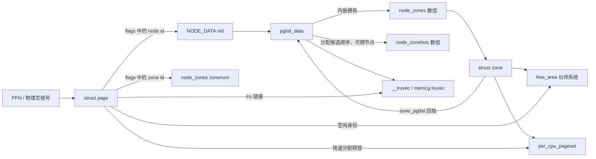

# struct page、struct zone 与 pglist_data 详解

> 源码位置：`include/linux/mm_types.h:80`、`include/linux/mmzone.h:979`、`include/linux/mmzone.h:1478`
> 源码基线：kernel-graph MCP 的 Linux 7.2-rc6 索引
> 三者共同构成 Linux 物理内存的“页帧档案 → 内存域 → NUMA 节点”管理层级。

## 一、大白话总览

### （a）为什么要设计这三个对象？

物理内存本身只是一串可寻址的页帧。内核还必须回答三个不同尺度的问题：

- 这一页现在是空闲、页缓存、匿名内存、复合页尾页，还是设备内存？谁正在引用它？——由 `struct page` 回答。
- 某一类可用于特定地址范围或设备约束的页还有多少？不同 order 的连续空闲块在哪里？水位是否安全？——由 `struct zone` 回答。
- 当前 NUMA 节点有哪些 zone？本地分配失败后按什么顺序回退到其他 zone/节点？谁负责后台回收和压缩？——由 `pglist_data` 回答。

如果没有这三层，分配器只能看到零散 PFN，既无法快速找到满足 DMA/NUMA/连续性要求的页，也无法可靠维护引用、映射、LRU、回收和热插拔状态。

### （b）如果让我自己设计，第一反应应该是什么？

#### 1. 一句话降级

给每个页帧做一张状态卡，把同类页帧装入一个仓库，再把同一 NUMA 节点上的仓库装入一个节点总账。

#### 2. 最小模型

先假设只有一个 NUMA 节点、一个 zone、全是普通 4 KiB 页，没有高端内存、热插拔、memcg、复合页和每 CPU 缓存：

```text
PFN 0 ──> page[0] ┐
PFN 1 ──> page[1] ├──> zone.free_area[] ──> pglist_data.node_zones[]
PFN 2 ──> page[2] ┘
```

最少需要：

- 每页一份状态与引用计数；
- zone 中按连续块大小组织的空闲链表；
- 节点中保存 zone 数组和分配回退顺序；
- 从 `page` 反查所属 `zone`/节点的办法。

正常出口是：分配器从节点候选表选中一个 zone，从其空闲区取出块，更新页状态和统计，然后把 `struct page *` 交给调用者。

#### 3. 核心数据对象

| 对象 | 类比 | 在这件事中的角色 |
|---|---|---|
| `struct page` | 页帧状态卡 | 记录一页当前身份、归属、引用、映射和链表位置；它不是页内数据本身 |
| `struct zone` | 分类仓库 | 管理一组分配约束相同的页，保存伙伴系统、PCP、水位和统计 |
| `pglist_data` / `pg_data_t` | 节点总账 | 表示一个 NUMA 节点，拥有本节点 zone，并保存跨 zone 的候选顺序与回收线程 |
| `free_area[]` | 按尺寸分格的货架 | 每个下标对应一种 order 的伙伴空闲块集合 |
| `zonelist[]` | 取货路线 | 当前节点/分配策略下依次尝试哪些 zone；它可以引用其他节点的 zone |
| `lruvec` | 待回收页账本 | 组织匿名页/文件页的回收状态；memcg 开启时会有更细粒度的 lruvec |

#### 4. 真实复杂度从哪里来？

- **页身份复用**：同一个 `struct page` 可能描述页缓存页、匿名页、伙伴空闲页、PCP 页、page-pool 页、复合页尾页或 ZONE_DEVICE 页，因此主体使用 union。
- **拓扑约束**：DMA 地址限制、zone 类型、NUMA 距离、cpuset 和内存策略共同决定候选 zone。
- **并发与性能**：分配/释放是热点路径，需要 PCP、原子计数、按 zone 锁和 cacheline 分隔。
- **稀疏与动态内存**：物理地址空间可以有洞，还可能热插拔，所以 `spanned`、`present`、`managed` 不能混为一谈。
- **压力处理**：水位不足会触发后台回收、直接回收、压缩，最终可能 OOM。
- **配置差异**：NUMA、SPARSEMEM、MEMCG、COMPACTION、CMA、KMSAN 等配置会增删字段。

#### 5. 如果自己实现，大概步骤

1. 启动时按物理内存范围创建 `pglist_data`，计算节点 PFN 范围。
2. 在每个节点中初始化 `node_zones[]`，设置 zone 的起点、容量、回指、锁和伙伴空闲区。
3. 为每个有效 PFN 初始化 `struct page`，写入 node/zone 归属，清空引用与链表状态。
4. 建立 `node_zonelists[]`，形成“本地优先、允许时远端回退”的候选顺序。
5. 运行期分配时先选 zonelist，再检查 zone 水位，最后从 PCP 或 `free_area[]` 取页。
6. 页面被映射、进入页缓存或 LRU 时，只启用与当前身份相匹配的 union 成员，并同步引用、映射计数和统计。
7. 释放时先撤销上层身份，验证引用/复合页状态，再进入 PCP 或伙伴系统；水位不足时唤醒 `kswapd` 或直接回收。

#### 6. 源码阅读 checklist

- 当前代码操作的是页、zone，还是节点级状态？
- 当前 `page` 属于哪一种身份？正在使用 union 的哪一支？
- 这个计数是“地址范围大小”“真实存在页数”还是“伙伴系统可管理页数”？
- 当前遍历的是节点拥有的 `node_zones[]`，还是可能跨节点的 `zonelist`？
- 读写是否受 `_refcount`、原子操作、`zone->lock`、`lru_lock` 或热插拔锁保护？
- 更新链表时是否同步更新了位图、计数、水位或 vmstat？
- 这是正常快路径、PCP 优化、内存压力分支，还是热插拔/设备内存特殊分支？
- 页面退出一种身份前，是否已经撤销映射、LRU、private 数据和额外引用？

### （c）它们是怎么设计的？

核心思路不是让三个对象互相保存大量指针，而是把物理内存组织成稳定层级：`pglist_data` 内嵌 `node_zones[]`；`zone` 用 `zone_pgdat` 回指节点；`page` 则把 node/zone 编号压进 `flags`，需要时由 `page_zone()` 和 `page_pgdat()`反查。

`struct page` 又采用“公共头 + 身份相关 union”的布局。这样每个物理页都承担得起元数据成本，同时页缓存、伙伴系统、网络 page pool、复合页和设备页可以复用同一片存储。代价是：读任何字段前必须先知道页面身份，不能把 union 成员当成可同时成立的独立字段。

### （d）它们分别处理哪些情况？

**情况一：普通匿名页或页缓存页**

→ 使用 `lru`、`mapping`、`__folio_index`、`private` 等布局。  
→ 原因：这类页面要参与映射查找、LRU 回收和文件/交换私有状态管理。

**情况二：伙伴系统或 PCP 中的空闲页**

→ 同一 union 位置改用 `buddy_list`、`pcp_list` 或 `pcp_llist`，`private` 可承载 order。  
→ 原因：空闲页不再需要页缓存身份，可以把元数据空间让给分配器。

**情况三：复合页尾页、page pool 或 ZONE_DEVICE 页**

→ 分别使用 `compound_info`、page-pool 专用字段或设备页布局。  
→ 原因：这些页的所有权和生命周期不等同于普通 LRU 页。

**情况四：低水位或高阶分配失败**

→ zone 水位、伙伴空闲块和 pgdat 回收状态共同驱动直接回收、`kswapd`、压缩或回退。  
→ 原因：总空闲页够不代表目标 zone、目标 order 或目标 NUMA 策略能满足请求。

**情况五：内存热插拔或稀疏物理地址**

→ 分开维护 `spanned_pages`、`present_pages` 和 `managed_pages`，并使用 resize/span 同步。  
→ 原因：地址范围中的洞、保留页和新上线页会让三个数不同。

## 二、生命周期与控制骨架

这次分析对象是数据结构，本身没有 `if/for/goto` 控制流。下面把 MCP 确认的初始化、分配、回收和释放函数组织成结构体生命周期骨架：

```text
系统启动
│
└─ mm_core_init_early()
   ├─ free_area_init()
   │  ├─ 【遍历内存 PFN 范围】计算节点与 zone 边界
   │  └─ 【逐节点】free_area_init_node()
   │     ├─ calculate_node_totalpages()
   │     │  └─ 区分 node/zone 的 spanned 与 present 页数
   │     └─ free_area_init_core()
   │        ├─ pgdat_init_internals()
   │        │  └─ 初始化等待队列、回收/压缩状态和 __lruvec
   │        └─ zone_init_internals()
   │           └─ 初始化 managed_pages、归属、锁和 PCP
   └─ memmap_init()
      └─ memmap_init_zone_range()
         └─ memmap_init_range()
            └─ 【逐 PFN】__init_single_page()
               └─ 清零 page → 写 node/zone 链接 → 初始化计数与 lru

运行期分配
│
└─ __alloc_pages_noprof()
   └─ __alloc_frozen_pages_noprof()
      ├─ prepare_alloc_pages()：选择 pgdat.node_zonelists[]
      ├─ get_page_from_freelist()
      │  ├─ 【逐 zoneref】检查允许条件与 zone 水位
      │  ├─ [满足] rmqueue() → prep_new_page() → 返回 page
      │  └─ [均不满足] 返回 NULL，进入慢路径
      └─ __alloc_pages_slowpath()
         ├─ 唤醒 kswapd / 尝试直接回收
         ├─ 尝试内存压缩
         └─ [仍失败] 重试、回退、OOM 或返回 NULL

页面释放
│
└─ free_unref_folios()
   ├─ __free_pages_prepare()：撤销身份并检查状态
   ├─ folio_zone() / folio_pgdat()：定位所属 zone/节点
   └─ free_frozen_page_commit()
      ├─ [PCP 可接收] 放入每 CPU 列表
      └─ [需批量回灌] 合并并放回 zone.free_area[]

内存回收
│
├─ [直接回收] try_to_free_pages()
│  └─ do_try_to_free_pages() → shrink_zones() → shrink_node()
│
└─ [后台回收] kswapd()
   └─ balance_pgdat() → kswapd_shrink_node() → shrink_node()
```

## 三、Mermaid 对象关系图



最重要的两个反查函数是：

```c
page_zone(page)
    = &NODE_DATA(page_to_nid(page))->node_zones[page_zonenum(page)];

page_pgdat(page)
    = NODE_DATA(page_to_nid(page));
```

MCP 定位分别为 `include/linux/mm.h:2620` 和 `include/linux/mm.h:2625`。这说明 `page → zone → pgdat` 是编码索引关系，不是 `page` 中直接存着两个裸指针。

## 四、快速定位与宏观地位

### 4.1 快速定位

| 对象 | 源码位置 | 粒度 | 核心职责 |
|---|---|---|---|
| `struct page` | `include/linux/mm_types.h:80` | 单个物理页帧 | 保存身份、归属、引用、映射和复用链表节点 |
| `struct zone` | `include/linux/mmzone.h:979` | 节点内的一类内存域 | 保存伙伴系统、PCP、水位、容量、压缩状态和 zone 统计 |
| `pglist_data` | `include/linux/mmzone.h:1478` | 一个 NUMA 节点 | 拥有 zone，提供 zonelist、节点 LRU、kswapd/kcompactd 和节点统计 |

### 4.2 所属层次

```text
┌──────────────────────────────────────────────┐
│ 用户缺页、文件 I/O、kmalloc、驱动页分配请求  │
└──────────────────────┬───────────────────────┘
                       │ GFP / order / NUMA 策略
┌──────────────────────▼───────────────────────┐
│ pglist_data.node_zonelists[]：决定尝试顺序    │
│ [pglist_data 在这里：节点级组织与回收]        │
└──────────────────────┬───────────────────────┘
                       │ 选择 zoneref
┌──────────────────────▼───────────────────────┐
│ zone：检查水位，访问 PCP / free_area[]        │
│ [struct zone 在这里：内存域级分配账本]        │
└──────────────────────┬───────────────────────┘
                       │ 取出或归还空闲块
┌──────────────────────▼───────────────────────┐
│ page：切换空闲/已分配/LRU/映射等身份          │
│ [struct page 在这里：页帧级状态卡]            │
└──────────────────────┬───────────────────────┘
                       │ page table / cache / slab / driver
┌──────────────────────▼───────────────────────┐
│ CPU MMU、物理内存控制器和实际 RAM             │
└──────────────────────────────────────────────┘
```

### 4.3 真实触发场景

1. **当系统启动建立物理内存模型时**：`start_kernel()` 经 `mm_core_init_early()` 分别进入 `free_area_init()` 初始化 pgdat/zone，并进入 `memmap_init()` 初始化每个 PFN 的页描述符。
2. **当页缓存、页表、slab 或驱动申请物理页时**：`alloc_pages_noprof()`/`folio_alloc_noprof()` 进入 `__alloc_pages_noprof()`，从 pgdat 的 zonelist 选择 zone，再从 PCP/伙伴系统取得 page。
3. **当分配器发现水位不足时**：直接回收从 `try_to_free_pages()` 到 `shrink_node()`；后台回收从节点 `kswapd()` 到同一个 `shrink_node()`，读取 pgdat/zone/LRU 状态。
4. **当页面最后一个引用被释放时**：上层释放路径汇入 `free_unref_folios()`，定位所属 zone，检查并清理 page 状态后归还 PCP 或伙伴系统。

### 4.4 如果它们出错会怎样？

- `page` 的身份或引用计数错误会造成 use-after-free、双重释放、内存泄漏或错误回收仍在映射的页。
- `zone` 的空闲链表、位图和计数不一致，会造成页丢失、同一页重复分配、错误水位判断或高阶分配长期失败。
- `pgdat` 的 zonelist 或节点范围错误，会违反 NUMA/DMA 约束、访问不存在的内存，或让回收线程盯错节点。
- 三者的归属编码不一致时，`page_zone()` 会把页送回错误的伙伴系统，这是直接破坏物理内存分配器的不变量。

## 五、完整调用链路

以下路径均来自本次 kernel-graph 查询；只保留与三个结构体直接相关的主线。

### 5.1 启动期初始化链

```text
start_kernel()                              // init/main.c:982
  └── mm_core_init_early()                  // mm/mm_init.c:2627
        ├── free_area_init()                 // mm/mm_init.c:1761
        │     └── free_area_init_node()      // mm/mm_init.c:1656
        │           ├── calculate_node_totalpages() // mm/mm_init.c:1277
        │           └── free_area_init_core()       // mm/mm_init.c:1535
        │                 ├── pgdat_init_internals() // mm/mm_init.c:1328
        │                 └── zone_init_internals()  // mm/mm_init.c:1345
        └── memmap_init()                    // mm/mm_init.c:940
              └── memmap_init_zone_range()   // mm/mm_init.c:915
                    └── memmap_init_range()  // mm/mm_init.c:847
                          └── __init_single_page() // mm/mm_init.c:595
```

其中 `__init_single_page()` 的关键动作由 MCP 源码片段确认：

```c
mm_zero_struct_page(page);          // 清空复用字段，先建立干净身份
set_page_links(page, zone, nid, pfn); // 把 zone/node/section 编入 flags
init_page_count(page);              // 初始化生命周期引用计数
atomic_set(&page->_mapcount, -1);   // “零个 PTE 映射”使用 -1 编码
INIT_LIST_HEAD(&page->lru);         // 建立未挂入任何列表的自环节点
```

### 5.2 运行期页分配链

```text
alloc_pages_noprof() / folio_alloc_noprof() // include/linux/gfp.h:282/286
  └── __alloc_pages_noprof()                 // mm/page_alloc.c:5466
        └── __alloc_frozen_pages_noprof()    // mm/page_alloc.c:5383
              ├── prepare_alloc_pages()      // mm/page_alloc.c:5091
              │     └── node_zonelist()      // include/linux/gfp.h:195
              ├── get_page_from_freelist()   // mm/page_alloc.c:3799
              │     ├── zone_watermark_fast()// mm/page_alloc.c:3683
              │     ├── rmqueue()            // mm/page_alloc.c:3413
              │     └── prep_new_page()      // mm/page_alloc.c:1876
              └── __alloc_pages_slowpath()   // mm/page_alloc.c:4783
```

这条链中三种对象的分工非常清楚：pgdat 的 zonelist 提供候选顺序，zone 提供水位和空闲块，page 是最终返回并重新赋予身份的对象。

### 5.3 直接回收与后台回收链

```text
直接回收：
try_to_free_pages()                  // mm/vmscan.c:6769
  └── do_try_to_free_pages()         // mm/vmscan.c:6547
        └── shrink_zones()           // mm/vmscan.c:6424
              └── shrink_node()      // mm/vmscan.c:6239
                    └── shrink_lruvec() // mm/vmscan.c:5969

后台回收：
kswapd()                             // mm/vmscan.c:7492
  └── balance_pgdat()                // mm/vmscan.c:7157
        └── kswapd_shrink_node()     // mm/vmscan.c:7084
              └── shrink_node()      // mm/vmscan.c:6239
```

`shrink_node()` 向下查询还确认：它会在传统 LRU 与 multigenerational LRU 路径间分流，按 memcg 获取 `lruvec`，处理 slab shrinker、vmpressure 和回收节流。这里 pgdat 是节点级回收上下文，zone 水位决定压力，page/folio 是被扫描和释放的对象。

### 5.4 批量释放链

```text
free_pages_and_swap_cache()          // mm/swap_state.c:576
  └── folios_put_refs()              // mm/folio.c:979
        └── free_unref_folios()      // mm/page_alloc.c:3010
              ├── __free_pages_prepare()   // mm/page_alloc.c:1316
              ├── folio_pgdat()            // include/linux/mm.h:2630
              ├── folio_zone()             // include/linux/mm.h:2635
              └── free_frozen_page_commit()// mm/page_alloc.c:2844
```

这条路径说明释放并非简单地把地址塞回链表：必须先清理 page 身份和调试/memcg 状态，再按归属 zone 选择 PCP 或伙伴系统，并同步统计。

## 六、逐字段详解：struct page

### 6.1 `flags`：状态位与拓扑编码

| 字段 | 类型 | 含义 | 何时设置/读取 |
|---|---|---|---|
| `flags` | `memdesc_flags_t` | 内含一个 `unsigned long f`。低部通常保存 `PG_*` 页面状态，高部按配置编码 zone、node、section、KASAN tag、last cpupid 等 | `__init_single_page()` 经 `set_page_links()`写拓扑；页锁、dirty、LRU、buddy 等操作原子更新状态位；`page_to_nid()`、`page_zonenum()`读取归属 |

`set_page_links()` 在 `include/linux/mm.h:2870` 依次调用 `set_page_zone()`、`set_page_node()`，需要时再写 section。`set_page_zone()`/`set_page_node()`对 `flags.f` 做掩码更新。这样节省了每页两个指针，但拓扑位和普通状态位共享一个机器字，修改必须严格使用专用 helper。

### 6.2 五个机器字的身份 union

源码明确说 union 提供五个 word，并规定第一个 word 的 bit 0 被 `PageTail()` 使用。其他布局不能随意使用这个 bit，否则普通页会被误判为复合页尾页。

#### 普通页、页缓存页、匿名页与空闲页布局

| 字段 | 类型 | 当前身份下的含义 | 设置与读取时机 |
|---|---|---|---|
| `lru` | `struct list_head` | 页面挂入 active/inactive/unevictable 等 LRU，也可被 page owner 临时当通用链表节点 | 初始化为自环；加入/移出 lruvec 时在 `lru_lock` 保护下修改 |
| `buddy_list` | `struct list_head` | 页面为空闲伙伴块时，挂入相应 order/migratetype 的空闲链表 | 页面进入伙伴系统后使用；分配取出后不再把它当 `lru` 使用 |
| `pcp_list` | `struct list_head` | 页面位于每 CPU page list 时的链表节点 | 小 order 释放进入 PCP、分配从 PCP 取出时使用 |
| `pcp_llist` | `struct llist_node` | 无锁/延迟 PCP 处理所需的单链节点 | 特定快速释放路径使用，与前三种链表身份互斥 |
| `mapping` | `struct address_space *` | 文件页指向 address_space；匿名页会用低位编码表达匿名映射身份 | 页加入页缓存或匿名映射体系时设置；回收、rmap、writeback、fault 路径读取 |
| `__folio_index` | `pgoff_t` | 页面/folio 在 mapping 中的索引 | 加入页缓存或建立匿名 VMA 索引关系时设置，查找和回写时读取 |
| `share` | `unsigned long` | 与 `__folio_index` 复用，供 fsdax 记录 share count | 仅 fsdax 身份使用，不能与普通 index 同时解释 |
| `private` | `unsigned long` | 映射私有数据；常见为 buffer_head、swap entry；Buddy/PCP 身份下还可记录 order | 设置 `PagePrivate`、进入 swapcache、进入伙伴系统等身份转换时写；退出身份前必须清理 |

这里最容易犯的错误是把 `lru`、`buddy_list` 和 `pcp_list` 想成三份链表节点。它们实际覆盖同一片内存：页面在 LRU 上时就不能同时在 buddy/PCP 上。

#### 网络 page-pool 布局

| 字段 | 类型 | 含义 | 生命周期 |
|---|---|---|---|
| `pp_magic` | `unsigned long` | 校验页面是否真的由 page_pool 分配，避免错误回收普通页 | page_pool 接管时写，回收判别时读 |
| `pp` | `struct page_pool *` | 指向拥有该页的网络 page pool | page_pool 生命周期内保持 |
| `_pp_mapping_pad` | `unsigned long` | 占位以保持与普通页布局兼容 | 不承载普通 mapping 语义 |
| `dma_addr` | `unsigned long` | 网络设备 DMA 使用的地址 | DMA 映射建立后写，收发与回收时读 |
| `pp_ref_count` | `atomic_long_t` | page_pool 自己的碎片/复用引用计数 | 网络快速路径原子更新 |

#### 复合页、设备页与 RCU 布局

| 字段 | 类型 | 含义 | 生命周期 |
|---|---|---|---|
| `compound_info` | `unsigned long` | 复合页尾页指向/编码头页信息，bit 0 固定置位供 `PageTail()`识别 | 建立 compound page 时写，拆分或释放时清理 |
| `_unused_pgmap_compound_info` | `void *` | ZONE_DEVICE 布局中为 compound/pgmap 位置保留槽位 | 只按设备页布局解释 |
| `zone_device_data` | `void *` | 设备内存提供者的私有数据 | ZONE_DEVICE 初始化或迁移时设置 |
| `rcu_head` | `struct rcu_head` | 允许在 RCU grace period 后释放/复用页相关对象 | 进入延迟释放路径时临时占用整个 union |

ZONE_DEVICE 注释还说明：设备私有页在迁移期间会沿用普通页布局中对应的 mapping、index、private 位置。因此“字段名相同”并不表示普通 RAM 页与设备页有完全相同的所有权规则。

### 6.3 `page_type` 与 `_mapcount` union

| 字段 | 类型 | 含义 | 不变量 |
|---|---|---|---|
| `page_type` | `unsigned int` | typed folio 的头页类型；类型所有者可临时复用低 16 位 | 清除 page type 前必须把复用的低 16 位恢复为全 1；typed folio 尾页不保存类型 |
| `_mapcount` | `atomic_t` | 非 typed folio 的单页被页表直接映射的次数，使用“实际次数减 1”编码 | 初始化为 `-1` 表示零映射；第一次映射原子加到 0，最后一次撤销原子减回 -1 |

它们复用是因为同一页不会同时按 typed folio 类型字段和普通 rmap mapcount 解释。`_mapcount` 与 `_refcount` 不是同一个概念：前者只描述 PTE 映射，后者描述所有生命周期引用。

### 6.4 生命周期与可选字段

| 字段 | 类型 | 含义 | 设置与读取时机 |
|---|---|---|---|
| `_refcount` | `atomic_t` | 页面总引用计数；源码警告不得直接操作，应使用 page/folio ref helper | `init_page_count()`初始化；`page_ref_inc()`等增加；`page_ref_dec_and_test()`确认最后引用 |
| `memcg_data` | `unsigned long` | `CONFIG_MEMCG` 下关联内存控制组/对象 cgroup 的紧凑编码数据 | charge 时设置，uncharge/回收时读取和清理 |
| `_unused_slab_obj_exts` | `unsigned long` | 未启用 MEMCG、启用 slab object extension 时的布局保留 | 只在对应配置下存在 |
| `virtual` | `void *` | `WANT_PAGE_VIRTUAL` 架构保存动态内核虚拟地址；highmem 未映射时可为 NULL | 初始化低端页时设置，临时映射相关路径读取 |
| `_last_cpupid` | `int` | flags 放不下 last CPU/PID 信息时单独保存，服务 NUMA balancing | 页初始化时 reset，NUMA 访问跟踪时更新 |
| `kmsan_shadow` | `struct page *` | `CONFIG_KMSAN` 下指向该页的初始化状态 shadow | KMSAN 分配/释放与检查路径使用 |
| `kmsan_origin` | `struct page *` | `CONFIG_KMSAN` 下指向未初始化值来源元数据 | KMSAN 报告来源时使用 |

### 6.5 `struct page` 的关键设计决策

1. **为什么不保存 `zone *` 和 `pgdat *`？** 每个物理页都有描述符，哪怕每页多一个指针，总开销也很可观。编码 node/zone id 可通过稳定数组 O(1) 反查。
2. **为什么大量使用 union？** 页面不可能同时是伙伴空闲块、LRU 页、page_pool 页和复合尾页；利用身份互斥压低常驻元数据成本。
3. **为什么 `_mapcount` 从 -1 开始？** 这样第一次建立映射可用 `atomic_inc_and_test()`检测 0→1 的逻辑转换，最后一次撤销也可用“变为负数”检测。
4. **为什么 `_refcount` 必须原子且禁止裸访问？** 页面引用跨 CPU、I/O 和映射路径传播；helper 还承载 trace/debug 语义，绕过它会破坏生命周期诊断。

## 七、逐字段详解：struct zone

### 7.1 水位、保留和分配约束

| 字段 | 类型 | 含义 | 设置与读取时机 |
|---|---|---|---|
| `_watermark[NR_WMARK]` | `unsigned long[]` | zone 的 min/low/high 等水位基准 | 启动和 sysctl 调整时计算；分配快路径、kswapd 与回收路径读取 |
| `watermark_boost` | `unsigned long` | 外部碎片等场景临时抬高回收目标 | 分配器检测碎片压力时调整，水位检查时叠加 |
| `nr_reserved_highatomic` | `unsigned long` | 为高阶原子分配预留的页块规模 | reserve/unreserve highatomic pageblock 时维护 |
| `nr_free_highatomic` | `unsigned long` | 当前 highatomic 迁移类型中的空闲页数 | 页块进入/离开 highatomic 空闲区时更新 |
| `lowmem_reserve[MAX_NR_ZONES]` | `long[]` | 为较低 zone 保留容量，防止可落在高 zone 的请求耗尽稀缺低端内存 | 根据 `lowmem_reserve_ratio`重算；水位判断按请求 classzone 读取 |

`_watermark` 回答“这个 zone 还能不能继续分”，`lowmem_reserve` 回答“即使有空闲页，是否应留给受地址限制的请求”。两者不能合并成一个简单 free-page 阈值。

### 7.2 节点归属与每 CPU 快路径

| 字段 | 类型 | 含义 | 设置与读取时机 |
|---|---|---|---|
| `node` | `int` | `CONFIG_NUMA` 下缓存所属 node id | `zone_set_nid()`在 `zone_init_internals()`中设置；`zone_to_nid()`等读取 |
| `zone_pgdat` | `struct pglist_data *` | 回指拥有该 zone 的节点 | `zone_init_internals()`写为 `NODE_DATA(nid)`；回收、统计和拓扑 helper 高频读取 |
| `per_cpu_pageset` | `struct per_cpu_pages __percpu *` | 每 CPU 页缓存，减少每次 order-0 分配/释放争用 `zone->lock` | pageset 初始化后设置；快速分配释放按当前 CPU 访问 |
| `per_cpu_zonestats` | `struct per_cpu_zonestat __percpu *` | 每 CPU zone 统计，批量折算到全局 | 分配、释放、回收路径更新，vmstat 折叠读取 |
| `pageset_high_min` | `int` | PCP high 的下界 | PCP 参数更新时计算并复制到各 CPU pageset |
| `pageset_high_max` | `int` | PCP high 的上界 | 同上 |
| `pageset_batch` | `int` | PCP 与伙伴系统之间批量搬运的建议规模 | 同上；批量 refill/drain 时读取 |

### 7.3 页块属性、PFN 范围和容量账本

| 字段 | 类型 | 含义 | 不变量/同步 |
|---|---|---|---|
| `pageblock_flags` | `unsigned long *` | 非 SPARSEMEM 配置下保存 pageblock 的 migratetype、skip 等属性 | SPARSEMEM 时改由 `mem_section`保存 |
| `zone_start_pfn` | `unsigned long` | zone 第一个 PFN | 与 `spanned_pages` 一起受 `span_seqlock`保护（启用热插拔时） |
| `managed_pages` | `atomic_long_t` | 真正交给伙伴系统管理、可参与水位计算的页数 | 大致等于 present 减去保留/未管理页；分配器和扫描器用它算阈值 |
| `spanned_pages` | `unsigned long` | `zone_end_pfn - zone_start_pfn`，包含物理地址洞 | 必须满足 `spanned >= present` |
| `present_pages` | `unsigned long` | zone 地址范围内真实存在的物理页数 | 热插拔运行期更新需由 memory hotplug 同步保护 |
| `present_early_pages` | `unsigned long` | 启动早期已经存在的页，不含后来 hotplug 的页 | 仅 `CONFIG_MEMORY_HOTPLUG`存在 |
| `cma_pages` | `unsigned long` | 分配给 MIGRATE_CMA 的 present 页数 | 仅 `CONFIG_CMA`存在 |
| `name` | `const char *` | 可读 zone 名称，如 DMA/Normal/Movable | `zone_init_internals()`从 `zone_names[idx]`设置，日志和 proc 输出读取 |
| `nr_isolate_pageblock` | `unsigned long` | 被隔离 pageblock 数，修正并发 migratetype 读取导致的 free-page 统计问题 | `CONFIG_MEMORY_ISOLATION`下存在，受 `zone->lock`保护 |
| `span_seqlock` | `seqlock_t` | 保护很少写、但分配快路径无 zone lock 读取的 PFN 范围 | 热插拔时写；读者用序列锁检测并发变化 |
| `initialized` | `int` | zone 是否完成初始化 | 初始化完成后置位，热插拔和分配准备路径检查 |

最关键的容量关系是：

```text
spanned_pages = 地址范围长度（含洞）
present_pages = spanned_pages - absent_pages
managed_pages = present_pages - reserved/unmanaged pages

因此：spanned_pages >= present_pages >= managed_pages
```

### 7.4 伙伴系统、锁与延迟释放

| 字段 | 类型 | 含义 | 设置与读取时机 |
|---|---|---|---|
| `_pad1_` | cacheline padding | 把高频写的分配器字段与前面的只读字段隔开 | 编译期布局优化，不承载逻辑状态 |
| `free_area[NR_PAGE_ORDERS]` | `struct free_area[]` | 伙伴系统每个 order 的空闲块集合；内部再按 migratetype 分链表并维护 `nr_free` | 初始化为空；分裂、合并、分配和释放时在 `zone->lock`保护下更新 |
| `unaccepted_pages` | `struct list_head` | 尚未被平台接受、暂不能正常使用的最大 order 页面 | `CONFIG_UNACCEPTED_MEMORY`下存在 |
| `unaccepted_cleanup` | `struct work_struct` | 最后一批 unaccepted 页被接受后的清理工作 | 同上，异步执行外围清理 |
| `flags` | `unsigned long` | zone 级状态位，如回收/拥塞等状态 | 原子位操作更新，分配与回收路径读取 |
| `lock` | `spinlock_t` | 主要保护 `free_area[]` 和与伙伴状态同步的字段 | 伙伴分裂/合并和部分隔离操作持有；PCP 用于减少争用 |
| `trylock_free_pages` | `struct llist_head` | 当前无法取得必要锁时，暂存下次 trylock 成功再释放的页 | 无锁加入，后续成功持锁时批量处理 |

`free_area[]` 不是“一页一个槽”。order 为 n 的条目管理 `2^n` 个连续页组成的块。分配高阶块时向更高 order 找并逐级拆分；释放时检查 buddy 并逐级合并。

### 7.5 压缩、连续性和统计

| 字段 | 类型 | 含义 | 设置与读取时机 |
|---|---|---|---|
| `_pad2_` | cacheline padding | 隔开分配热点与压缩/vmstat 热点 | 只优化 cacheline 竞争 |
| `percpu_drift_mark` | `unsigned long` | 空闲页低于该点时，水位读取要更谨慎地处理 per-CPU 统计漂移 | vmstat/水位参数调整时设置；低水位检查读取 |
| `compact_cached_free_pfn` | `unsigned long` | 压缩空闲页扫描器下次起点 | 压缩后缓存进度，减少重复扫描 |
| `compact_cached_migrate_pfn[ASYNC_AND_SYNC]` | `unsigned long[]` | 异步/同步迁移扫描器的缓存起点 | 对应压缩模式分别更新 |
| `compact_init_migrate_pfn` | `unsigned long` | 本轮压缩初始迁移扫描 PFN | 压缩启动和重置时维护 |
| `compact_init_free_pfn` | `unsigned long` | 本轮压缩初始空闲扫描 PFN | 同上 |
| `compact_considered` | `unsigned int` | 上次失败后已经考虑过多少次压缩 | 延迟压缩策略更新 |
| `compact_defer_shift` | `unsigned int` | 失败后跳过次数的指数退避量 | 连续失败增大，成功后重置/降低 |
| `compact_order_failed` | `int` | 记录失败的最小 order | 判断某 order 是否值得再次压缩时读取 |
| `compact_blockskip_flush` | `bool` | 是否应清理 pageblock 的 migrate-skip 标志 | 压缩/CMA 完成阶段使用 |
| `contiguous` | `bool` | zone 的物理 PFN 范围是否连续 | 初始化/拓扑变化时确定，依赖连续性的路径读取 |
| `_pad3_` | cacheline padding | 隔开前述写热点与统计数组 | 布局优化 |
| `vm_stat[]` | `atomic_long_t[]` | zone 级页状态统计 | 高频变化先走 per-CPU 统计，必要时折叠/读取 |
| `vm_numa_event[]` | `atomic_long_t[]` | zone 级 NUMA 事件统计 | NUMA 分配命中、miss、foreign 等事件更新 |
| `vmemmap_tails[]` | `struct page *[]` | HugeTLB vmemmap 优化下保存尾页描述符相关状态 | 仅对应配置存在 |

### 7.6 `struct zone` 的关键设计决策

1. **为什么既有 PCP 又有 `free_area[]`？** `free_area[]`提供全局可合并性，PCP 用少量局部缓存换取低锁争用；PCP 过高时再批量回灌伙伴系统。
2. **为什么水位不直接等于空闲页数？** 必须给原子请求、低端受限请求和回收进度留余地，还要补偿 per-CPU 统计漂移与外部碎片。
3. **为什么容量要分三套计数？** 地址跨度、真实 RAM 与可被伙伴管理的 RAM 在有洞、固件保留和热插拔时天然不同。
4. **为什么有多个 cacheline padding？** 分配器、压缩器和统计器可能由不同 CPU 高频写；分开能降低伪共享。

## 八、逐字段详解：pglist_data

### 8.1 zone 所有权与分配路线

| 字段 | 类型 | 含义 | 设置与读取时机 |
|---|---|---|---|
| `node_zones[MAX_NR_ZONES]` | `struct zone[]` | 本节点实际拥有的所有 zone 槽位，未必每个都 populated | 节点初始化时逐个设置；`page_zone()`和节点遍历直接索引 |
| `node_zonelists[MAX_ZONELISTS]` | `struct zonelist[]` | 从本节点发起不同类型分配时的候选 zone 引用序列，可包含远端节点 zone | `build_zonelists()`/`build_all_zonelists()`构建；分配准备阶段读取 |
| `nr_zones` | `int` | 本节点 populated zone 的有效数量 | 节点范围初始化/热插拔时更新 |

`node_zones` 表示所有权，`node_zonelists` 表示搜索策略。这是最容易混淆的一对：远端 zone 可以出现在本节点 zonelist 中，但不会因此变成本节点拥有的 zone。

### 8.2 节点内存映射、范围和同步

| 字段 | 类型 | 含义 | 不变量/同步 |
|---|---|---|---|
| `node_mem_map` | `struct page *` | FLATMEM 下本节点线性 `struct page` 数组起点 | SPARSEMEM 不使用此字段 |
| `node_page_ext` | `struct page_ext *` | FLATMEM + PAGE_EXTENSION 下页扩展元数据起点 | 与 node_mem_map 对应 |
| `node_size_lock` | `spinlock_t` | 热插拔或 deferred page init 下保护节点范围、页数、`nr_zones`和 `first_deferred_pfn` | 锁顺序高于 `zone->lock` 和 `zone->span_seqlock` |
| `node_start_pfn` | `unsigned long` | 节点物理地址范围的起始 PFN | 节点初始化/热插拔时设置 |
| `node_present_pages` | `unsigned long` | 节点内真实存在的物理页总数 | 等于各 zone present 页的节点级汇总语义 |
| `node_spanned_pages` | `unsigned long` | 节点 PFN 范围跨度，包含洞 | 必须不小于 node_present_pages |
| `node_id` | `int` | NUMA 节点编号 | 节点建立时设置；`NODE_DATA(nid)`索引体系使用 |

### 8.3 回收节流与 kswapd

| 字段 | 类型 | 含义 | 设置与读取时机 |
|---|---|---|---|
| `kswapd_wait` | `wait_queue_head_t` | 后台回收线程休眠与唤醒队列 | `pgdat_init_internals()`初始化；低水位分配路径唤醒 |
| `pfmemalloc_wait` | `wait_queue_head_t` | 等待保留内存/直接回收条件改善的任务队列 | 初始化时建立，回收节流路径使用 |
| `reclaim_wait[NR_VMSCAN_THROTTLE]` | `wait_queue_head_t[]` | 按不同原因分类的回收节流等待队列 | 初始化循环逐个建立；`reclaim_throttle()`等选择队列等待 |
| `nr_writeback_throttled` | `atomic_t` | 正因 writeback 而被节流的任务数 | 节流进入/退出时原子更新 |
| `nr_reclaim_start` | `unsigned long` | 节流开始时已写回页数的快照 | 用于判断写回是否取得进展 |
| `kswapd_lock` | `struct mutex` | 热插拔配置下保护 kswapd 生命周期 | 启停/热插拔修改 `kswapd`时持有 |
| `kswapd` | `struct task_struct *` | 本节点后台回收线程 | 节点上线时创建并记录，唤醒和状态检查时读取 |
| `kswapd_order` | `int` | 当前唤醒请求希望满足的最高分配 order | 唤醒 kswapd 时提高请求，平衡循环读取 |
| `kswapd_highest_zoneidx` | `enum zone_type` | 当前回收请求允许扫描到的最高 zone 类型 | 唤醒时合并约束，回收时限制范围 |
| `kswapd_failures` | `atomic_t` | 连续“回收为 0”的运行次数 | kswapd 判断 hopeless/清除 hopeless 状态时更新 |

### 8.4 kcompactd、保留页和 NUMA 门槛

| 字段 | 类型 | 含义 | 设置与读取时机 |
|---|---|---|---|
| `kcompactd_max_order` | `int` | 节点后台压缩需要满足的最大 order | 唤醒请求合并，kcompactd 读取 |
| `kcompactd_highest_zoneidx` | `enum zone_type` | 后台压缩允许处理的最高 zone | 同上 |
| `kcompactd_wait` | `wait_queue_head_t` | kcompactd 休眠/唤醒队列 | pgdat 初始化时建立 |
| `kcompactd` | `struct task_struct *` | 本节点后台压缩线程 | 节点上线/下线管理 |
| `proactive_compact_trigger` | `bool` | 是否触发主动压缩 | sysctl/压缩控制路径设置，线程消费后清理 |
| `totalreserve_pages` | `unsigned long` | 本节点不对普通用户分配开放的保留页总量 | 各 zone 保留策略变化时汇总；可用内存估算读取 |
| `min_unmapped_pages` | `unsigned long` | NUMA node reclaim 的未映射页门槛 | NUMA 配置下计算，node reclaim 决策读取 |
| `min_slab_pages` | `unsigned long` | NUMA node reclaim 的 slab 页门槛 | 同上 |

### 8.5 延迟初始化与 NUMA balancing 状态

| 字段 | 类型 | 含义 | 设置与读取时机 |
|---|---|---|---|
| `_pad1_` | cacheline padding | 把回收高频写字段与前部拓扑/线程字段隔开 | 布局优化 |
| `first_deferred_pfn` | `unsigned long` | 大内存机器延迟初始化时，下一个尚未初始化的 PFN | deferred struct page init 推进时更新，受 `node_size_lock`同步 |
| `nbp_rl_start` | `unsigned int` | 当前 NUMA promote rate-limit 周期起点 | NUMA balancing 统计周期更新 |
| `nbp_rl_nr_cand` | `unsigned long` | rate-limit 周期开始时的 promote 候选累计值 | 用差值计算本周期速率 |
| `nbp_threshold` | `unsigned int` | NUMA promote 延迟阈值 | 自适应门槛调整和候选判断读取 |
| `nbp_th_start` | `unsigned int` | 当前阈值调整周期起点 | 周期切换时更新 |
| `nbp_th_nr_cand` | `unsigned long` | 阈值调整周期开始时的候选累计值 | 计算周期内新增候选量 |

### 8.6 节点 LRU、MGLRU、统计和可靠性

| 字段 | 类型 | 含义 | 设置与读取时机 |
|---|---|---|---|
| `__lruvec` | `struct lruvec` | 未启用 memcg 时的节点 LRU；启用 memcg 后应通过 `mem_cgroup_lruvec()`取正确实例 | `pgdat_init_internals()`调用 `lruvec_init()`初始化；回收路径读取 |
| `flags` | `unsigned long` | pgdat 级状态位 | 回收、拥塞或节点状态路径用位操作更新 |
| `mm_walk` | `struct lru_gen_mm_walk` | MGLRU 扫描 mm 的节点级工作状态 | `CONFIG_LRU_GEN`下由代际 LRU 回收使用 |
| `memcg_lru` | `struct lru_gen_memcg` | MGLRU 的 memcg 轮转/组织状态 | 同上 |
| `_pad2_` | cacheline padding | 把回收热点与节点统计隔开 | 布局优化 |
| `per_cpu_nodestats` | `struct per_cpu_nodestat __percpu *` | 每 CPU 节点统计，降低全局原子争用 | 运行期各 CPU 更新，折叠后供监控/决策读取 |
| `vm_stat[NR_VM_NODE_STAT_ITEMS]` | `atomic_long_t[]` | 节点级 VM 统计 | 回收、LRU、NUMA 等路径汇总/读取 |
| `memtier` | `struct memory_tier __rcu *` | NUMA 节点所属 memory tier | 拓扑变化时在 RCU 规则下更新，demotion/分层策略读取 |
| `mf_stats` | `struct memory_failure_stats` | 节点级硬件内存故障统计 | memory failure 处理路径更新 |

### 8.7 `pglist_data` 的关键设计决策

1. **为什么内嵌 `node_zones[]`？** zone 类型数量固定且很小，内嵌数组使 `NODE_DATA(nid)->node_zones[zid]` 成为稳定 O(1) 定位方式，也支持 page 中只编码 id。
2. **为什么 zonelist 要独立存在？** 所有权结构不等于分配策略。搜索顺序会受 NUMA 距离、zone 限制和策略影响，必须能引用多个节点的 zone。
3. **为什么每节点各有 kswapd/kcompactd？** 内存压力和碎片具有节点局部性；每节点线程能在本地水位和迁移约束下工作，避免一个全局线程成为瓶颈。
4. **为什么 `__lruvec` 在 MEMCG 下可能不直接用？** memcg 要把同一节点上的页再按控制组隔离回收，因此节点只是 lruvec 定位的一维，控制组是另一维。

## 九、三者之间必须成立的不变量

| 不变量 | 为什么重要 |
|---|---|
| `page_zone(page)->zone_pgdat == page_pgdat(page)` | 页的 zone 归属和节点归属必须指向同一拓扑，否则释放会进入错误伙伴系统 |
| `page` 同一时刻只能按一种 union 身份解释 | 防止把 LRU 节点当 buddy 节点，造成链表破坏 |
| `_refcount == 0` 是回收到底层分配器的必要条件，但 `_mapcount == -1` 只表示无直接 PTE 映射 | 防止把 mapcount 和总生命周期引用混为一谈 |
| `spanned_pages >= present_pages >= managed_pages` | 分清地址洞、真实 RAM 和伙伴可用 RAM |
| `node_zones[]` 表示拥有关系，`node_zonelists[]`只表示搜索顺序 | 防止把远端 fallback zone 错算为本节点容量 |
| 修改 `zone.free_area[]` 时必须同步维护伙伴链表、order/migratetype 状态和空闲计数 | 任一账本不一致都会造成泄漏或重复分配 |
| `node_size_lock` 的锁层次高于 `zone->lock`/`span_seqlock` | 热插拔改变节点范围时避免锁顺序反转 |

## 十、关键概念补充

### 10.1 PFN、`struct page` 与页内数据不是一回事

PFN 是物理页帧编号；`struct page` 是内核为该页帧维护的元数据；实际 4 KiB（或其他页大小）内容位于 RAM 中。`page_to_pfn()`/`pfn_to_page()`在编号与元数据之间转换，`page_address()`或映射 helper 才处理 CPU 可访问的虚拟地址。

### 10.2 zone 与 zonelist 不是同一层概念

- zone：一个真实的管理对象，拥有伙伴空闲区和水位。
- zonelist：一串 `zoneref`，描述一次分配应按什么顺序尝试哪些 zone。

一个 pgdat 拥有自己的 `node_zones[]`，但它的 zonelist 可以先指向本地 zone，再指向其他节点的兼容 zone。

### 10.3 folio 与 page 的关系

现代内存管理路径大量使用 folio 表示“一组作为整体管理、以头页为核心的页面”，减少把尾页误当独立对象的机会。底层归属仍能通过 `folio_pgdat()`、`folio_zone()`回到本文的 pgdat/zone 层级；释放路径 `free_unref_folios()`也说明 folio 已成为批量页生命周期的重要接口。

### 10.4 锁和原子计数各管什么

- `_refcount`、`_mapcount`：保护单页的并发生命周期/映射计数。
- `zone->lock`：主要保护伙伴系统 `free_area[]` 及相关一致性。
- PCP 自身锁：保护每 CPU 页列表，缩短持有 zone 锁的频率和时间。
- `lruvec->lru_lock`：保护页面在 LRU 集合中的组织。
- `node_size_lock`/`span_seqlock`：保护热插拔导致的节点和 zone 范围变化。

它们不能互相替代，因为保护对象和允许的并发粒度不同。

## 十一、阅读结论

把三者压缩成三句话：

1. `struct page` 回答“这一页是谁、正在做什么、还有谁引用它”；读 union 字段前必须先确定页面身份。
2. `struct zone` 回答“这一类页还能不能分、从哪里分、释放到哪里”；伙伴系统、水位、PCP 和压缩状态都在这一层汇合。
3. `pglist_data` 回答“这个 NUMA 节点拥有哪些 zone、按什么路线找内存、由谁回收和压缩”；它是节点级总控，而不是单纯的 zone 容器。

建议下一步先分析 `__alloc_pages_noprof()`：它会把 `pglist_data.node_zonelists`、`zone._watermark/free_area/per_cpu_pageset` 和最终返回的 `struct page` 在一条真实热路径中串起来。
