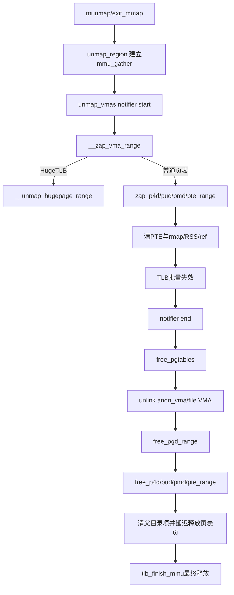

# `unmap_region` 到 `free_pgd_range` 详解

> 源码位置：`mm/vma.c:525`、`mm/memory.c:2292`、`mm/memory.c:2206`、`mm/memory.c:373`、`mm/memory.c:298`  
> 主线：局部 munmap事务先撤销用户叶子映射、rmap和页面引用，完成 MMU notifier/TLB协调，再断开 VMA外部索引并释放已经不再被相邻 VMA使用的页表页。  
> 分析基线：当前 kernel-graph MCP索引；本地 Linux源码工作树为 `v7.3-rc2`。`unmap_region`存在多个同名函数，本文专指 `mm/vma.c` 的用户地址空间实现。

## 一、大白话总览

### （a）为什么要设计这条拆除链？

删除一段虚拟内存不能只从 Maple Tree删掉 VMA。CPU页表、TLB、KVM/IOMMU等二级地址转换、物理页引用、匿名/文件反向映射、RSS统计和各级页表页都可能仍然引用它。

这条链把拆除分成两个主要阶段：

1. `unmap_vmas()` → `__zap_vma_range()`：让地址不再映射数据页，清PTE/huge条目、rmap、RSS和页面引用。
2. `free_pgtables()` → `free_pgd_range()`：VMA从外部rmap索引隐藏后，释放确认没有相邻VMA继续使用的页表层级。

`unmap_region()`用同一个 `mmu_gather`把两阶段包成一笔TLB延迟释放事务。若顺序反了，页表页可能在CPU或设备仍能走访时被释放；若只做第一阶段，数据映射消失但大量空页表和VMA外部索引会泄漏。

### （b）如果让我自己设计

#### 1. 一句话降级

先把门牌指向的房间全部断开并通知所有缓存观察者，再确认整层目录已经无人使用，最后回收空目录本身。

#### 2. 最小模型

```text
VMA [start,end)
  └─ PGD→P4D→PUD→PMD→PTE→folio

unmap:
  1. PTE清空 → TLB失效 → rmap/RSS/ref解除
  2. PTE页空？释放PTE页
  3. PMD/PUD/P4D页空且边界无相邻VMA？逐级释放
  4. VMA从anon_vma/file mapping索引解除
```

输入是 `unmap_desc`描述的VMA集合、实际zap区间和允许释放页表的边界；核心对象是 VMA、页表、folio、`mmu_gather`；正常出口是该地址范围不可达且无悬空页表引用。

#### 3. 核心数据对象

| 对象 | 角色 |
|---|---|
| `struct unmap_desc` | 本次拆除工单：VMA迭代器、首VMA、zap范围、树范围、页表释放边界和锁状态 |
| `struct mmu_gather` | 延迟释放账本：记录失效范围、清过哪些层级、待释放页/页表批次 |
| `struct zap_details` | zap策略：是否unmap、丢marker、OOM reaping、跳过COW、回收PTE表等 |
| `vm_area_struct` | 提供每段映射边界、类型、mm、文件/匿名rmap归属 |
| PTE/PMD/PUD/P4D/PGD | 从叶子映射到目录页；先清内容，再自底向上释放空目录 |
| `folio` | 被解除映射的数据实体；可能需要标脏、删rmap、减引用或进入TLB延迟释放 |
| MMU notifier | 通知KVM、IOMMU等二级映射观察者指定VA区间将失效 |

#### 4. 真实复杂度从哪里来

- 局部munmap可能只切掉VMA的一部分，边界页表仍被两侧VMA共享，不能整页表释放。
- VMA集合可能相邻或仅隔很小空洞，按组释放可避免重复遍历，但必须用floor/ceiling保护邻居。
- 页表项有present、swap、migration、device-private、marker、THP和HugeTLB等形态。
- 清PTE时持PTL，批量释放缓存满、调度请求或特殊页处理可能要求中断并重试。
- CPU TLB与二级MMU可能仍缓存旧映射，物理页和页表页不能过早复用。
- OOM reaper不能睡眠，必须跳过 `uprobe_munmap()`等路径。
- 地址0同时参与“地址空间底部”和无符号回绕表示的顶部，边界比较需要特殊的 `end - 1`规则。

#### 5. 如果自己实现

1. 建立 `mmu_gather`，保存RSS高水位。
2. 对整个unmap范围发出MMU notifier start。
3. 遍历受影响VMA，裁剪每段start/end；处理HugeTLB锁范围。
4. 从PGD向下zap；PTE层清表项、删rmap、改RSS、收集待释放数据页。
5. 必要时先强制TLB flush再释放脏rmap或批次页面；调度后从当前地址继续。
6. notifier end，重置Maple iterator到页表释放所需位置。
7. 先把VMA从anon_vma和文件mapping索引断开。
8. 合并邻近VMA范围，从PTE页向P4D页逐级判断整表为空及不越过floor/ceiling，再清父项并延迟释放页表页。
9. `tlb_finish_mmu()`最终刷新并释放所有批次。

#### 6. 源码阅读 checklist

- 当前是在撤销叶子映射，还是释放页表页？
- `vma_start/vma_end`、`tree_end`与`pg_start/pg_end`分别限制什么？
- 此时二级MMU notifier是否处于start/end区间内？
- 数据页的rmap、RSS、dirty和引用是否在清PTE时同步处理？
- 当前表是否真的覆盖完整边界并且无相邻VMA使用？
- `floor/ceiling`为何不等于zap的start/end？
- PTE页是zap快路径直接回收，还是留给`free_pgtables()`？
- 强制flush发生在释放物理页/页表页之前吗？
- reaping路径是否调用了可能睡眠的hook？

### （c）它是怎么设计的？

核心设计是“**逻辑不可达先于物理回收，叶子先于目录，失效通知包围可见性变化**”。zap阶段负责映射语义，free阶段负责目录内存；`mmu_gather`把表项清除、TLB失效和真正释放解耦，使热路径可以批处理，同时保证旧硬件翻译消失后才复用内存。

### （d）主要情况

| 情况 | 做法 | 原因 |
|---|---|---|
| 普通局部munmap | zap受影响叶子，再释放完整空页表 | 边界目录可能仍服务邻接VMA |
| mm退出 | `exit_mmap()`也调用`unmap_vmas/free_pgtables` | 整个地址空间可批量拆除 |
| HugeTLB VMA | `__unmap_hugepage_range()` | 独立锁、预留和页表格式 |
| OOM reaping | 跳过可能睡眠的uprobe通知 | reaper要求非阻塞推进回收 |
| PTE处理被调度/批次限制打断 | flush、解锁、调度并retry | 避免长时间持PTL及批次溢出 |
| 相邻VMA距离不超过PMD_SIZE | 合并一次`free_pgd_range()` | 两段很可能共享高层目录页 |
| 页表范围碰到floor/ceiling | 保留该层页表页 | 邻接VMA仍可能通过该目录访问 |
| ceiling为0 | 按地址空间顶部解释 | 无符号地址边界的特殊约定 |

## 二、控制流骨架

### 2.1 `unmap_region()`

```text
unmap_region(unmap)
├─ 从first VMA取得mm
├─ tlb_gather_mmu：建立TLB/延迟释放事务
├─ update_hiwater_rss：删除前保存RSS峰值
├─ unmap_vmas：清叶子映射、rmap、页面引用
├─ mas_set(tree_reset)：重置迭代位置
├─ free_pgtables：解除VMA外部索引并释放空页表层级
└─ tlb_finish_mmu：最终flush并释放批次
```

### 2.2 `unmap_vmas()`与`__zap_vma_range()`

```text
unmap_vmas(tlb,unmap)
├─ 构造DROP_MARKER|UNMAP的zap_details
├─ MMU notifier start覆盖整个vma_start..vma_end
├─ 【逐VMA循环】
│  ├─ 裁剪start=max(VMA start,unmap start)
│  ├─ 裁剪end=min(VMA end,unmap end)
│  ├─ hugetlb_zap_begin
│  ├─ __zap_vma_range
│  │  ├─ 范围非法 → WARN（继续防御性处理）
│  │  ├─ 文件VMA且非reaping → uprobe_munmap
│  │  ├─ HugeTLB且无vm_file → return：尚未映射任何页
│  │  ├─ HugeTLB → __unmap_hugepage_range
│  │  └─ 普通页表 → PGD循环 → zap_p4d_range
│  ├─ hugetlb_zap_end
│  └─ mas_find下一VMA；无 → 退出循环
└─ MMU notifier end
```

### 2.3 `free_pgtables()`与`free_pgd_range()`

```text
free_pgtables(tlb,unmap)
├─ 校验vma_end不超过pg_end
├─ tlb_free_vmas：先完成需要的TLB失效
├─ 【逐组VMA】
│  ├─ 记录组起点addr；查next
│  ├─ 当前VMA从anon_vma/file mapping索引解除
│  ├─ 【next起点 <= 当前end + PMD_SIZE】
│  │  ├─ 合并next进组
│  │  ├─ 解除其anon/file索引
│  │  └─ 继续找next
│  ├─ 完成文件VMA批量unlink
│  ├─ free_pgd_range(addr,组end,pg_start,next start或pg_end)
│  └─ vma=next；无 → 退出
└─ return

free_pgd_range(tlb,addr,end,floor,ceiling)
├─ addr向下PMD对齐；若越过floor则抬到下一PMD
│  └─ 加法回绕为0 → return
├─ ceiling向下PMD对齐
│  └─ 非零ceiling对齐成0 → return
├─ end越过ceiling → end缩回一个PMD
├─ 无完整PMD范围 → return
├─ 设置TLB释放粒度PAGE_SIZE
└─ 【PGD循环】
   ├─ 源PGD空/坏 → continue
   ├─ free_p4d_range递归释放下级
   └─ 指针/地址到end → return
```

## 三、Mermaid生命周期图



## 四、宏观定位与调用链

### 4.1 所属层次

```text
munmap/brk收缩/mmap回滚/进程退出
             │
             ▼
VMA事务层：vms_clear_ptes / exit_mmap
             │
             ▼
┌──────────────────────────────────────────────┐
│ [本文主线]                                   │
│ unmap_region()              mm/vma.c:525     │
│ ├─ unmap_vmas()             mm/memory.c:2292 │
│ │  └─ __zap_vma_range()     mm/memory.c:2206 │
│ └─ free_pgtables()          mm/memory.c:373  │
│    └─ free_pgd_range()      mm/memory.c:298  │
└──────────────────────────────────────────────┘
             │
             ├─ rmap/RSS/folio/swap
             ├─ TLB gather/MMU notifier
             └─ 架构页表页释放接口
```

### 4.2 触发场景

1. 用户`munmap()`经`do_vmi_munmap()`、`vms_complete_munmap_vmas()`、`vms_clear_ptes()`进入`unmap_region()`。
2. `brk()`收缩堆区同样经VMA unmap事务清除局部映射。
3. `mmap_region()`建立新映射失败或覆盖旧映射时，经abort/cleanup路径调用`unmap_region()`回滚。
4. 进程最后一个mm用户退出时，`mmput()`→`__mmput()`→`exit_mmap()`直接复用`unmap_vmas()`和`free_pgtables()`拆整个地址空间。

### 4.3 完整执行链

```text
unmap_region                         // mm/vma.c:525
├── tlb_gather_mmu
├── update_hiwater_rss
├── unmap_vmas                       // mm/memory.c:2292
│   ├── mmu_notifier_invalidate_range_start
│   ├── hugetlb_zap_begin/end
│   ├── __zap_vma_range              // mm/memory.c:2206
│   │   ├── uprobe_munmap
│   │   ├── __unmap_hugepage_range
│   │   └── zap_p4d_range
│   │       └── zap_pud_range
│   │           └── zap_pmd_range
│   │               └── zap_pte_range
│   │                   └── do_zap_pte_range
│   └── mmu_notifier_invalidate_range_end
├── free_pgtables                    // mm/memory.c:373
│   ├── unlink_anon_vmas
│   ├── unlink_file_vma_batch_*
│   └── free_pgd_range               // mm/memory.c:298
│       └── free_p4d_range
│           └── free_pud_range
│               └── free_pmd_range
│                   └── free_pte_range
└── tlb_finish_mmu
```

## 五、关键结构体字段

### 5.1 `unmap_desc`

| 字段 | 作用 |
|---|---|
| `mas` | 指向VMA Maple Tree迭代状态，供zap后再次遍历VMA组 |
| `first` | 第一个受影响VMA，也是取得`mm`的锚点 |
| `vma_start/vma_end` | 真正需要清叶子映射的范围 |
| `tree_end` | Maple Tree遍历上限，决定本次包含哪些VMA |
| `tree_reset` | zap后为free阶段重置迭代器的位置 |
| `pg_start/pg_end` | 允许释放页表页的外部边界，保护相邻保留映射 |
| `mm_wr_locked` | 是否持有mm写锁；决定能否启动per-VMA写侧状态 |

### 5.2 `mmu_gather`

| 字段 | 作用 |
|---|---|
| `mm` | 被修改的地址空间 |
| `start/end` | 累计需要TLB失效的范围 |
| `fullmm` | 是否拆除整个地址空间，可影响架构flush策略 |
| `freed_tables` | 已收集页表页，结束前必须保证旧walk不可达 |
| `cleared_ptes/pmds/puds/p4ds` | 记录清过哪些层级，辅助架构选择失效粒度 |
| `delayed_rmap` | rmap释放是否推迟到TLB安全点 |
| `batch_count` | 延迟释放批次数；满时可能强制flush |

### 5.3 `zap_details`

`unmap_vmas()`设置`ZAP_FLAG_DROP_MARKER | ZAP_FLAG_UNMAP`：这是永久解除映射，不仅清普通页，也删除可丢弃marker。`reaping`表示OOM reaper上下文；`skip_cows`、`single_folio`和`reclaim_pt`服务其他复用zap的路径，例如truncate、madvise或定向回收。

## 六、`unmap_region()`逐行详解

`mm = unmap->first->vm_mm`确立唯一地址空间；描述符必须至少包含首VMA。`tlb_gather_mmu()`开启事务并增加flush pending状态。`update_hiwater_rss()`必须在RSS因zap下降前保存历史峰值。

`unmap_vmas()`先让数据映射不可达。之后`mas_set(unmap->mas, unmap->tree_reset)`把被前一阶段推进的Maple迭代器恢复到free阶段起点。`free_pgtables()`解除VMA外部索引并收集页表页。最后`tlb_finish_mmu()`刷新剩余TLB、释放收集的数据页/页表页并关闭pending状态。

这里的顺序是不变量：不能在zap前释放页表，也不能在最终TLB安全点前让页表物理页被复用。

## 七、`unmap_vmas()`逐行详解

### 7.1 一个notifier覆盖整批VMA

函数从`unmap->first`开始，构造`MMU_NOTIFY_UNMAP`范围`[vma_start,vma_end)`，只调用一次start/end。KVM或设备页表可在该窗口阻止新二级映射，并在end后确认整个范围已失效；逐VMA通知会增加开销并暴露更多中间状态。

### 7.2 每个VMA裁剪真实区间

首尾VMA可能仅部分被删除，因此取：

```text
start = max(vma->vm_start, unmap->vma_start)
end   = min(vma->vm_end,   unmap->vma_end)
```

HugeTLB在zap前后需要额外锁和共享PMD范围调整，故由`hugetlb_zap_begin/end()`包围。`__zap_vma_range()`完成具体清除后，使用同一Maple状态`mas_find(tree_end - 1)`取得下一VMA，直到本次树范围结束。

## 八、`__zap_vma_range()`与叶子清除

### 8.1 防御检查和uprobe

`VM_WARN_ON_ONCE()`检查非空区间且完全位于VMA内。文件VMA解除映射可能影响uprobes，正常路径调用`uprobe_munmap()`；OOM reaper不能睡眠，因此显式跳过。

### 8.2 HugeTLB与普通页表

HugeTLB早期映射失败时`vm_file`可能为空，说明还没装任何huge页，直接返回。否则`__unmap_hugepage_range()`负责清huge PTE、dirty、rmap、预留恢复和TLB批次。

普通路径用`tlb_start_vma()`建立架构cache/TLB上下文，从PGD开始按`pgd_addr_end()`分段。空项跳过，坏项清除，有效项进入`zap_p4d_range()`，最终下钻PTE。`tlb_end_vma()`对称结束，并可能兑现该VMA要求的TLB-only flush。

### 8.3 `zap_pte_range()`真正做什么

PTE层先判断当前范围是否覆盖完整PTE表并允许回收，然后锁PTE页、刷新旧的batched TLB、进入lazy MMU。循环调用`do_zap_pte_range()`批量处理具体条目：

- present页：清PTE，按匿名/文件类型扣RSS、删除rmap；脏文件页需传播dirty；页面放入TLB释放批次。
- swap项：减少swap相关映射/计数并扣`MM_SWAPENTS`。
- migration/device/marker：按类型撤销；UNMAP与DROP_MARKER决定marker是否保留。
- 被details规则跳过的条目会阻止整张PTE表回收。

若`need_resched()`、批次容量或特殊处理要求中断，记录当前位置。必须强制flush时，在释放PTL前先`tlb_flush_mmu_tlbonly()`和`tlb_flush_rmaps()`，因为旧CPU翻译或延迟rmap仍可能接触页面；解锁后再`tlb_flush_mmu()`真正释放批次，然后调度并`goto retry`。

### 8.4 当前版本的空PTE页快路径

若范围完整、没有skip且本轮未放锁，`zap_empty_pte_table()`尝试同时取得PMD侧保护并摘除PTE表。若快路径不成立，结束后`zap_pte_table_if_empty()`重新扫描，防止其他线程在PTL释放窗口重新填表。确认空后：

```text
pte_free_tlb()      → 把PTE页加入TLB安全释放批次
mm_dec_nr_ptes()    → 修正mm页表页统计
```

因此PTE页不一定等到`free_pgtables()`才释放；zap阶段可直接回收。更高层目录以及未命中快路径的表仍由后续层级释放逻辑处理。

## 九、`free_pgtables()`逐行详解

### 9.1 为什么先`tlb_free_vmas()`

释放VMA的rmap链和页表层级前，先确保此前清叶子产生的TLB要求已经推进到安全点，避免硬件或延迟rmap仍通过将要断开的元数据定位页面。

### 9.2 先隐藏VMA，再释放页表

每个VMA先在必要时`vma_start_write()`，再`unlink_anon_vmas()`；文件VMA通过batch从`address_space`的`i_mmap`反向树删除。源码注释明确要求：在free pgtables前，必须让rmap与truncate/page-cache路径看不到该VMA。

### 9.3 为什么聚合PMD_SIZE以内的VMA

只要下一VMA起点不超过当前VMA末尾加`PMD_SIZE`，就把它并入本组。一张PTE表覆盖一个PMD区间；距离很近的VMA可能共享同一PTE表或上级目录。如果分别调用释放函数，会重复下降或错误尝试释放仍服务下一VMA的目录。聚合后用组起点/终点一次判断更准确高效。

最终调用：

```text
free_pgd_range(tlb,
               group_start,
               group_end,
               unmap->pg_start,
               next ? next->vm_start : unmap->pg_end)
```

`floor`保护左侧保留映射，`ceiling`保护右侧下一VMA或全局页表上限。

## 十、`free_pgd_range()`逐行详解

### 10.1 为什么顶层先按PMD对齐

释放的最小目录资源是PTE表，它覆盖一个PMD_SIZE范围。`addr &= PMD_MASK`先向下找候选PTE表边界；若该候选跨过`floor`保护区，就抬到下一PMD。类似地，ceiling向下对齐，end若越界则缩回一个PMD。若最后没有完整PMD范围，直接返回。

这是一条重要区别：zap可以清任意页粒度，但释放PTE页要求整个PTE表覆盖范围都不再使用。

### 10.2 “减1比较”与地址0

无符号地址空间中，`ceiling == 0`约定表示顶部，而`addr/floor == 0`表示底部。直接比较0会把顶部误当最小值，所以源码使用`end - 1 > ceiling - 1`。对齐或加法产生0时，还要判断它是合法顶部语义还是发生了相反方向回绕。

### 10.3 自顶向下遍历、自底向上释放

`free_pgd_range()`从PGD定位并按边界调用`free_p4d_range()`。各级helper先遍历下一级；当整个当前表范围位于floor/ceiling内，才清父目录项并用`*_free_tlb()`延迟释放当前表页：

```text
free_pmd_range：free_pte_range → pud_clear → pmd_free_tlb → mm_dec_nr_pmds
free_pud_range：free_pmd_range → p4d_clear → pud_free_tlb → mm_dec_nr_puds
free_p4d_range：free_pud_range → pgd_clear → p4d_free_tlb
```

“先清父项，再把子表交给TLB批次”保证新的页表walk不再进入它；延迟真正释放保证旧walk/TLB也已结束。折叠页表架构上的`*_free_tlb()`会按架构规则退化或no-op。

## 十一、关键设计决策

### 11.1 为什么zap与free分开？

zap处理映射语义：页面dirty、rmap、RSS、swap和marker；free处理目录内存及VMA间隙。二者边界条件和锁不同，混在一起会使局部unmap难以证明不会释放邻居页表。

### 11.2 为什么必须通知MMU notifier？

KVM、IOMMU/SVA和设备页表可能缓存同一用户映射。只清CPU页表会让设备继续访问已释放物理页。notifier start/end让二级映射在页面回收前同步失效。

### 11.3 为什么页/页表放进TLB批次而不立即free？

另一个CPU可能仍持有旧TLB，或硬件页表walk已经读取父项。立即复用物理页会把旧虚拟地址导向无关数据。`mmu_gather`把“逻辑摘除”和“物理复用”隔开。

### 11.4 为什么先unlink rmap索引？

truncate、回收和迁移会从folio或文件mapping反查VMA。如果页表释放后索引仍暴露VMA，这些路径可能走进已不存在的页表；先隐藏可封闭新的反向遍历入口。

### 11.5 为什么边界不能只看unmap start/end？

某级页表页覆盖范围远大于被删区间。左右相邻VMA虽不在zap范围内，却可能共享同一目录页；`pg_start/pg_end`与下一VMA起点共同给出“可物理释放”的边界。

## 十二、与完整页表生命周期的连接

```text
mm_alloc_pgd       建根
  → fault          按需填P4D/PUD/PMD/PTE
  → dup_mmap       fork复制并写保护
  → mprotect       修改VMA与现有PTE权限
  → unmap_region   清叶子 + 释放局部空页表      ← 本文
  → exit_mmap      清整个地址空间
  → mm_free_pgd    释放最终根页表
```

局部unmap通常不释放`mm_struct::pgd`根本身；根页表属于mm生命周期，最后由`mm_free_pgd()`/架构`pgd_free()`处理。

## 十三、最终不变量

完成后应同时成立：

1. `[vma_start,vma_end)`内目标叶子不再建立用户映射。
2. CPU TLB与订阅的二级MMU不再缓存旧翻译。
3. 数据页的RSS、swap计数、rmap、dirty和引用与剩余映射一致。
4. 被删除VMA已从anon_vma和文件mapping反向索引隐藏。
5. 只有完全落在floor/ceiling安全范围内的空页表页才被收集释放。
6. 父目录项先清除，页表页后经TLB安全点真正释放。
7. 左右保留VMA使用的共享页表层级仍然存在。
8. `mmu_gather`、notifier、HugeTLB锁、PTL和VMA写侧状态均对称收尾。

一句话总结：`unmap_vmas()`负责“让映射消失”，`free_pgtables()`负责“让空目录消失”，`unmap_region()`用TLB事务保证两者之间没有硬件可见性漏洞。
