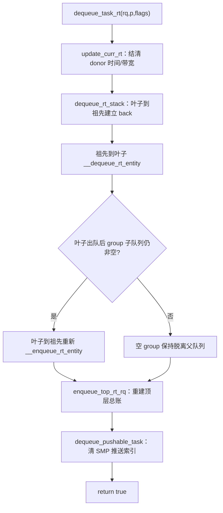
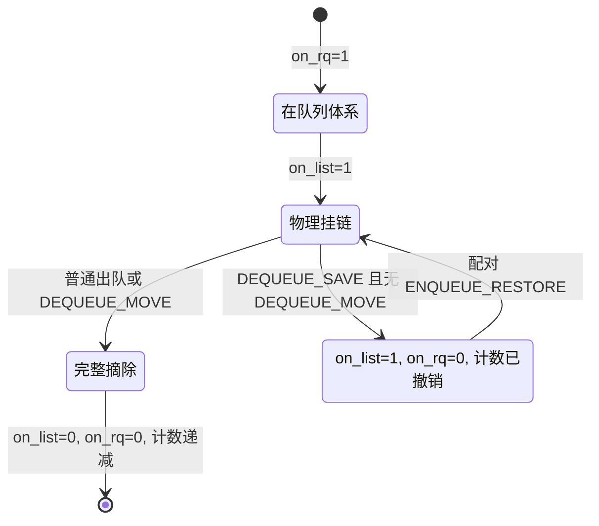

# `dequeue_task_rt()` RT 出队入口详解

> 源码基线：Linux 7.2-rc6（源码树 `E:\work\kernel\linux`）  
> 源码位置：`kernel/sched/rt.c:1455-1465`  
> 关键辅助函数：`update_curr_rt()`（`rt.c:974`）、`dequeue_rt_entity()`（`rt.c:1415`）、`dequeue_rt_stack()`（`rt.c:1383`）、`__dequeue_rt_entity()`（`rt.c:1365`）、`dequeue_pushable_task()`（`rt.c:413`）  
> 一句话职责：在 rq 锁保护下，把一个 RT 任务从本 CPU 的 RT 可运行体系中撤销，同时结清当前执行时间、修正 task-group 层级、优先级位图与计数，并从跨 CPU 推送候选表中删除它。

---

## 一、大白话总览

### （a）为什么要设计它？

一个 RT 任务阻塞、迁移到别的 CPU、改变调度属性或退出可运行状态时，不能只把 `p->rt.run_list` 从一条链表中摘掉。调度器还有多份互相呼应的“账”：优先级位图、每级 FIFO 链表、`rt_nr_running`、最高优先级缓存、task-group 祖先实体、顶层 `rq->nr_running`、SMP pushable 表以及 RT 带宽消耗。

如果只改其中一处，后果不是普通的统计误差，而可能是：已经睡眠的 RT 任务仍被选中、真正可运行的任务消失、最高优先级判断错误、CPU 误以为仍然过载，或者 RT task-group 的祖先继续占着父队列。`dequeue_task_rt()` 就是 RT 调度类对核心调度器作出的承诺：**本次出队会把这些相互依赖的状态一起收干净。**

### （b）如果让我自己设计它，第一反应是什么？

#### 1. 一句话降级

它最朴素的工作是：**先给正在使用柜台的人结清用时，再撤掉一张 RT 候选卡，并同步擦除所有索引和账本。**

#### 2. 最小模型

先忽略 task group、SMP、带宽限制、统计和代理执行，只保留一个 CPU、一张 RT 优先级表：

```text
输入：rq + RT 任务 p

出队前                              出队后
bitmap[prio] = 1                    若该优先级已空：bitmap[prio] = 0
queue[prio]: A <-> p <-> B   --->  queue[prio]: A <-------> B
rt_nr_running = n                    rt_nr_running = n - 1
p->rt.on_rq = 1                     p->rt.on_rq = 0
```

最小实现只需要：从链表删除、必要时清位图、递减计数、清 `on_rq`。调用者得到的出口状态是“该任务不再属于这个 RT 就绪队列”。

#### 3. 核心数据对象

| 对象 | 类比 | 在出队中的角色 |
|---|---|---|
| `task_struct *p` | 任务档案 | 提供调度类、优先级、CPU 亲和性以及内嵌的 `p->rt`、`p->pushable_tasks` |
| `sched_rt_entity` | RT 参赛卡 | `run_list` 是挂钩；`on_rq/on_list` 区分“计入队列体系”和“物理挂在链表” |
| `rt_prio_array` | 按优先级分格的抽屉柜 | `queue[prio]` 保存同优先级 FIFO 队列，`bitmap` 快速指出哪些抽屉非空 |
| `rt_rq` | RT 分账本 | 保存 RT 活跃数组、运行数量、最高优先级、pushable 候选及 task-group 带宽状态 |
| `rq` | CPU 总账本 | 拥有顶层 `rq->rt`、当前执行者 `curr`、时间捐赠者 `donor` 和总可运行数 |
| `flags` | 操作说明单 | 区分睡眠、迁移、保存/恢复、换类等语义，决定是否真移动链表以及是否记睡眠统计 |

#### 4. 真实复杂度从哪里来？

- **层级结构**：开启 `CONFIG_RT_GROUP_SCHED` 后，叶子任务上面还有 group 实体。叶子变化可能改变每层 group 在父队列中的优先级，甚至让整条祖先链消失。
- **双重状态**：`on_rq` 与 `on_list` 不是重复字段。`DEQUEUE_SAVE` 可以只撤销计数语义而暂时保留链表位置，供成对的 restore 操作复用。
- **多份索引**：链表、位图、计数、最高优先级缓存、CPU 优先级视图和 top-level `nr_running` 必须同步。
- **跨 CPU 均衡**：普通 active 队列之外还有 `pushable_tasks`。任务离开本 rq 后，过载位图和“下一个可推送优先级”也要修正。
- **执行时间和带宽**：改变可运行集合前，要先把截至此刻的执行时间记到 `rq->donor`，并可能触发 RT bandwidth 限流。
- **统一类接口**：`sched_class->dequeue_task()` 返回 `bool`。fair 类可能因 delayed dequeue 暂不真正出队；RT 类没有这种延迟语义，所以固定返回 `true`。
- **并发**：本函数没有自己获取 rq 锁，因为调度类回调的调用契约要求调用者已经持有目标 rq 锁；group runtime 账本另有嵌套的 `rt_runtime_lock`。

#### 5. 如果自己实现，大概步骤

1. 在仍持有 rq 锁且时钟已更新的前提下，结算当前 RT donor 的运行时间。
2. 找到 `p->rt`，结束等待/睡眠统计。
3. 沿 `parent` 找到最顶层实体，并用 `back` 临时反向串起层级。
4. 从顶层向叶子撤下旧实体：按 flags 决定是否真摘链表，但总要清 `on_rq`、递减 RT 计数并更新最高优先级。
5. 从叶子向顶层重建：只有仍拥有可运行孩子的 group 才重新挂入父队列。
6. 修正顶层 `rq->nr_running`、`rt_queued`，并通知 cpufreq。
7. 从 `rq->rt.pushable_tasks` 删除任务，更新 `highest_prio.next`；若表空则清 CPU 的 RT overload 标记。
8. 返回 `true`，通知 `block_task()` 等调用者：RT 实体已经真正出队，可以继续把 `p->on_rq` 发布为 0。

#### 6. 源码阅读 checklist

- 这一步是在“结旧账”，还是在“改队列结构”？
- 这是叶子任务状态，还是 task-group 祖先状态？
- `on_rq` 与 `on_list` 为什么可能不同？
- `DEQUEUE_SAVE` 是否要求保留链表位置？`DEQUEUE_MOVE` 是否强制实际移动？
- 删除最后一个同优先级实体后，位图和 `highest_prio.curr` 是否一起变化？
- group 内还有兄弟任务时，为什么祖先实体要重新入队？
- pushable 表空后，为什么还要清 `rto_mask/rto_count`？
- 为什么目标函数始终返回 `true`，调用者会如何消费它？

### （c）它是怎么设计的？

设计者把职责拆成三条相对独立的账：

```text
dequeue_task_rt()
  ├── update_curr_rt()          时间账：先结清当前 donor 的执行时间和 RT bandwidth
  ├── dequeue_rt_entity()       本地队列账：层级实体、位图、链表、计数、顶层 rq
  └── dequeue_pushable_task()   SMP 均衡账：移除跨 CPU 可推送候选和 overload 标记
```

其中最关键的技巧是 **“先整栈撤销，再按剩余内容重建”**。父 group 实体的优先级等于它内部 `rt_rq` 当前最高优先级；如果直接只删叶子，父实体可能仍挂在旧优先级链表。代码先用 `back` 建反向链，从祖先到叶子清掉旧账，再从叶子到祖先把仍非空的 group 重新挂回正确位置，避免逐层做难以验证的局部修补。

### （d）它处理哪几种情况？

```text
情况一：当前 RT 任务主动阻塞（DEQUEUE_SLEEP | DEQUEUE_NOCLOCK）
  → 做：结算运行时间、记录 sleep/block 起点、完整移除实体，返回 true 后由 __block_task() 发布 p->on_rq=0
  → 为什么：任务不再可运行；先结算再摘队列才能保证执行时间和带宽账不丢

情况二：可运行 RT 任务迁移到另一个 CPU（flags 为 0 或带 DEQUEUE_NOCLOCK）
  → 做：从源 rq 完整出队、设置新 CPU，再在目标 rq 入队
  → 为什么：同一任务不能同时出现在两个 CPU 的运行队列和 pushable 索引中

情况三：保存/恢复式重排（DEQUEUE_SAVE 且没有 DEQUEUE_MOVE）
  → 做：保留 run_list 的物理位置，但撤销 on_rq 与计数；随后配对的 enqueue restore 恢复账目
  → 为什么：调度属性修改过程中若实体无需换位置，可避免无意义的 list_del/list_add 和 FIFO 顺序扰动

情况四：开启 RT group scheduling，叶子出队后 group 仍有兄弟任务
  → 做：先摘整条旧祖先链，再把仍非空的 group 实体逐层重新入队
  → 为什么：group 对父队列暴露的优先级可能已经改变，必须按剩余任务重新计算位置

情况五：叶子是 group 中最后一个可运行 RT 任务
  → 做：该 group 的 `rt_nr_running` 变为 0，祖先重建阶段跳过它，空 group 不再出现在父队列
  → 为什么：空 group 不能占据父级优先级位图，也不能让顶层 rq 看起来仍有 RT 工作

情况六：删除 pushable 候选后列表为空
  → 做：把 `highest_prio.next` 设为哨兵 `MAX_RT_PRIO-1`，必要时清 `rto_count/rto_mask` 和 `overloaded`
  → 为什么：其他 CPU 不应继续把本 CPU 当成有可拉取 RT 任务的过载源
```

---

## 二、控制流骨架

```text
dequeue_task_rt(rq, p, flags)
│
├─ rt_se = &p->rt
│
├─ update_curr_rt(rq)
│  ├─ [rq->donor 不是 RT 类] → 无 RT 当前账可结，return
│  ├─ update_curr_common(rq)
│  │  └─ [delta_exec <= 0] → 时钟未前进，return
│  └─ [CONFIG_RT_GROUP_SCHED]
│     ├─ [RT bandwidth 未启用] → 通用运行时间已记完，return
│     └─ 【for_each_sched_rt_entity】逐层记 rt_time
│        └─ [该层 runtime 有上限]
│           ├─ 加 rt_runtime_lock，累加 rt_time
│           ├─ [额度超限] → resched_curr(rq)
│           ├─ 解 rt_runtime_lock
│           └─ [额度超限] → 启动 bandwidth 周期定时器
│
├─ dequeue_rt_entity(rt_se, flags)
│  ├─ update_stats_dequeue_rt()
│  │  ├─ [schedstat 关闭] → return，仅跳过统计
│  │  ├─ [是任务实体且不是 curr] → 结束 wait 统计
│  │  └─ [DEQUEUE_SLEEP 且为任务实体]
│  │     ├─ [TASK_INTERRUPTIBLE] → 记录 sleep_start
│  │     └─ [TASK_UNINTERRUPTIBLE] → 记录 block_start
│  ├─ dequeue_rt_stack(rt_se, flags)
│  │  ├─ 【第一次 for_each】叶子→祖先：写 back，找到 top
│  │  ├─ 保存 top rt_rq 原 rt_nr_running
│  │  ├─ 【第二次 for】祖先→叶子
│  │  │  └─ [on_rt_rq] → __dequeue_rt_entity()
│  │  │     ├─ [move_entity(flags)] → 真正摘链表、必要时清位图、清 on_list
│  │  │     ├─ 清 on_rq
│  │  │     └─ 递减计数并更新最高优先级
│  │  └─ dequeue_top_rt_rq(top, 原数量) → 撤销 rq 总账
│  ├─ 【for_each_sched_rt_entity】叶子→祖先
│  │  └─ [这是 group 实体且其子 rt_rq 仍非空] → 重新入队到父层
│  └─ enqueue_top_rt_rq(&rq->rt)
│     ├─ [已登记 / 被 throttle / 已空] → 对应 return 或不加总账
│     └─ [仍有 RT 实体] → add_nr_running、rt_queued=1、通知 cpufreq
│
├─ dequeue_pushable_task(rq, p)
│  ├─ 从 pushable plist 删除 p
│  ├─ [列表仍非空] → highest_prio.next = 新表头任务优先级
│  └─ [列表已空]
│     ├─ highest_prio.next = MAX_RT_PRIO-1
│     └─ [rq 标记 overloaded] → 清 root-domain overload 计数/位图，再清本 rq 标志
│
└─ return true → RT 类确认已真正完成出队
```

---

## 三、Mermaid 图示



实体状态关系：



---

## 四、快速定位

- **所属子系统**：Linux 调度器的 RT 调度类，服务于 `SCHED_FIFO`/`SCHED_RR`。
- **准确位置**：`kernel/sched/rt.c:1455-1465`。
- **注册位置**：`DEFINE_SCHED_CLASS(rt)` 中 `.dequeue_task = dequeue_task_rt`，位于 `kernel/sched/rt.c:2603`。
- **泛型入口**：`dequeue_task()` 位于 `kernel/sched/core.c:2198-2216`，通过 `p->sched_class->dequeue_task()` 间接分派。
- **核心容器**：`struct sched_rt_entity` 位于 `include/linux/sched.h:623`；`struct rt_prio_array` 位于 `kernel/sched/sched.h:311`；`struct rt_rq` 位于 `kernel/sched/sched.h:840`。
- **返回语义**：RT 类固定返回 `true`，表示没有 delayed-dequeue，实体已经真正退出可运行体系。

---

## 五、宏观地位分析

### （a）所属层次

```text
┌──────────────────────────────────────────────────────────────────┐
│ 外部事件                                                         │
│ 任务等待/退出可运行状态 | CPU affinity 迁移 | RT 过载 push       │
└──────────────────────────────┬───────────────────────────────────┘
                               ▼
┌──────────────────────────────────────────────────────────────────┐
│ 调度器核心                                                       │
│ block_task() / deactivate_task()                                 │
│        └── dequeue_task()                                        │
│              └── p->sched_class->dequeue_task() 多态分派         │
└──────────────────────────────┬───────────────────────────────────┘
                               ▼
┌──────────────────────────────────────────────────────────────────┐
│ [这段代码在这里] RT 调度类                                       │
│ dequeue_task_rt()                                                │
│   ├── update_curr_rt()                                           │
│   ├── dequeue_rt_entity()                                        │
│   └── dequeue_pushable_task()                                    │
└──────────────────────────────┬───────────────────────────────────┘
                               ▼
┌──────────────────────────────────────────────────────────────────┐
│ 底层机制                                                         │
│ rt_prio_array 位图/FIFO 链表 | RT group 层级 | bandwidth         │
│ rq 总账/cpufreq | pushable plist | root-domain overload mask     │
└──────────────────────────────────────────────────────────────────┘
```

### （b）真实触发场景

1. **当 RT 任务主动睡眠或等待锁/事件时**：`__schedule()`（`core.c:7061`）→ `try_to_block_task()`（`core.c:6698`）→ `block_task()`（`core.c:2245`）→ `dequeue_task()`（`core.c:2198`）→ RT 类函数指针 → `dequeue_task_rt()`。`block_task()` 传入 `DEQUEUE_SLEEP | DEQUEUE_NOCLOCK`；只有回调返回 `true` 才调用 `__block_task()`，最终以 release 语义写 `p->on_rq = 0`。
2. **当用户或内核改变 CPU affinity，必须移动一个仍可运行的 RT 任务时**：`__set_cpus_allowed_ptr_locked()`（`core.c:3112`）→ `affine_move_task()`（`core.c:2959`）→ `move_queued_task()`（`core.c:2546`）→ `deactivate_task()`（`core.c:2230`）→ `dequeue_task()` → `dequeue_task_rt()`；随后 `set_task_cpu()` 并在目标 rq `activate_task()`。
3. **当某 CPU RT 过载，push 逻辑把候选任务迁到更合适的 CPU 时**：`push_rt_task()`（`rt.c:1959`）→ `move_queued_task_locked()`（`sched.h:4119`）→ `deactivate_task()` → `dequeue_task()` → `dequeue_task_rt()`；源、目标 rq 锁都已持有，源端完整撤销后才在目标端入队。
4. **当已排队任务改变调度类或优先级时**：核心层 `sched_change_begin()`（`core.c:11192`）在 `ctx->queued` 时调用 `dequeue_task()`，随后 `sched_change_end()`（`core.c:11239`）按成对 flags 重新入队。若改变前属于 RT 类，间接分派到本函数；`DEQUEUE_SAVE/DEQUEUE_MOVE/DEQUEUE_CLASS` 决定是否保留物理链表位置及是否换类。

### （c）它解决什么问题？

`dequeue_task_rt()` 解决的不是“从链表删节点”这一个问题，而是保证下面的不变量同时成立：

```text
某优先级 queue 非空  <=> bitmap 对应位为 1
active 中的实体集合  <=> on_list 状态
计入 RT 可运行体系    <=> on_rq 状态与 rt_nr_running/rr_nr_running
最高优先级缓存        <=> bitmap 中第一个置位
顶层 RT 可运行数      <=> rq->nr_running 中的 RT 贡献
pushable 非空         <=> highest_prio.next 有效；必要时 CPU 标记 overloaded
group 出现在父队列    <=> 它拥有可运行且未被 throttle 的子 rt_rq
```

任一不变量被破坏，都可能让 RT 选择、抢占、限流或迁移作出错误决策。

---

## 六、完整调用链路

### （a）向上：谁调用了它

`call_chain_up(dequeue_task_rt)` 只返回函数自身，这是预期的：调用发生在函数指针上。kernel-graph 的间接调用查询确认 `dequeue_task_rt` 被赋给 `struct sched_class.dequeue_task`（`rt.c:2603`），候选分派点是 `dequeue_task()`（`core.c:2216`）。结合 MCP 验证的直接路径，主要入口如下。

```text
路径 1：RT 任务阻塞
__schedule()                              // kernel/sched/core.c:7061
  └── try_to_block_task()                 // core.c:6698
        └── block_task()                  // core.c:2245
              └── dequeue_task()          // core.c:2198
                    └── p->sched_class->dequeue_task()
                          └── [dequeue_task_rt()]   // kernel/sched/rt.c:1455

路径 2：CPU affinity 导致迁移
__set_cpus_allowed_ptr_locked()            // kernel/sched/core.c:3112
  └── affine_move_task()                   // core.c:2959
        └── move_queued_task()             // core.c:2546
              └── deactivate_task()        // core.c:2230
                    └── dequeue_task()
                          └── sched_class 间接分派
                                └── [dequeue_task_rt()]

路径 3：RT 过载 push 迁移
push_rt_task()                             // kernel/sched/rt.c:1959
  └── move_queued_task_locked()            // kernel/sched/sched.h:4119
        └── deactivate_task()
              └── dequeue_task()
                    └── sched_class 间接分派
                          └── [dequeue_task_rt()]

路径 4：调度属性修改（旧类是 RT 且任务已排队）
sched_change_begin()                       // kernel/sched/core.c:11192
  └── [ctx->queued]
        └── dequeue_task()
              └── sched_class 间接分派
                    └── [dequeue_task_rt()]
```

注意：间接调用查询还给出 `wait_task_inactive()` 和 `switching_from_fair()` 等候选点，但不能因此把它们写成 RT 入口。前者的直接 dequeue 分支只处理 `p->se.sched_delayed`，后者明确属于 fair 类；在那些调用点任务并不会以 RT 类分派到本函数。

### （b）向下：它调用了什么

```text
[dequeue_task_rt()]                         // kernel/sched/rt.c:1455
  ├── update_curr_rt()                      // rt.c:974，结算 donor 执行时间和 RT group bandwidth
  │     ├── update_curr_common()            // fair.c:1977，复用通用 update_se 记执行时间
  │     ├── sched_rt_runtime_exceeded()     // 检查当前层 RT 额度是否耗尽
  │     ├── resched_curr()                  // 超额时请求重新调度
  │     └── do_start_rt_bandwidth()         // 确保补充额度的周期定时器运行
  ├── dequeue_rt_entity()                   // rt.c:1415，实体与层级出队总管
  │     ├── update_stats_dequeue_rt()       // rt.c:1300，结束等待并记录睡眠/阻塞起点
  │     ├── dequeue_rt_stack()              // rt.c:1383，整条祖先链撤销旧账
  │     │     ├── __dequeue_rt_entity()     // rt.c:1365，单层链表/位图/状态/计数原语
  │     │     └── dequeue_top_rt_rq()       // rt.c:1010，撤销顶层 rq 总可运行数
  │     ├── __enqueue_rt_entity()           // 仍非空 group 按新优先级重新挂父层
  │     └── enqueue_top_rt_rq()             // rt.c:1027，重建剩余顶层 RT 总账
  └── dequeue_pushable_task()               // rt.c:413，清 pushable plist 与 overload 状态
        ├── plist_del()
        ├── plist_first_entry()
        └── rt_clear_overload()              // rt.c:363，清 root-domain 过载计数与 CPU 位
```

---

## 七、关键结构与字段

### 1. `struct sched_rt_entity`（`include/linux/sched.h:623`）

```c
struct sched_rt_entity {
	struct list_head        run_list;
	unsigned long           timeout;
	unsigned long           watchdog_stamp;
	unsigned int            time_slice;
	unsigned short          on_rq;
	unsigned short          on_list;

	struct sched_rt_entity *back;
#ifdef CONFIG_RT_GROUP_SCHED
	struct sched_rt_entity *parent;
	struct rt_rq           *rt_rq;
	struct rt_rq           *my_q;
#endif
};
```

| 字段 | 出队相关含义 |
|---|---|
| `run_list` | 实体在 `rt_prio_array.queue[prio]` 中的链表节点；实际移动时由 `__delist_rt_entity()` 删除并重新初始化 |
| `timeout` | RT 运行超时/看门狗相关累计值；本函数不修改，但与该实体生命周期相关 |
| `watchdog_stamp` | RT watchdog 时间戳；本函数不修改 |
| `time_slice` | `SCHED_RR` 剩余时间片；出队不等于重新获得时间片，所以这里不重置 |
| `on_rq` | 实体是否被计入 RT 队列体系；`__dequeue_rt_entity()` 无条件清零 |
| `on_list` | `run_list` 是否真的挂在优先级链表；只有 `move_entity(flags)` 为真时才清零 |
| `back` | 出队期间临时使用的反向指针，把 parent 链倒过来，以便祖先→叶子拆除；不是长期所有权关系 |
| `parent` | 当前实体在 RT task-group 层级中的父实体；`for_each_sched_rt_entity` 沿它向上走 |
| `rt_rq` | 当前实体要挂入的父级 RT runqueue |
| `my_q` | group 实体自己拥有的子 RT runqueue；叶子任务通常没有 `my_q` |

关键区别：`on_rq=0, on_list=1` 是允许的短暂保存态，典型来源是 `DEQUEUE_SAVE` 且没有 `DEQUEUE_MOVE`；因此不能把两个字段合并。

### 2. `struct rt_prio_array`（`kernel/sched/sched.h:311`）

```c
struct rt_prio_array {
	DECLARE_BITMAP(bitmap, MAX_RT_PRIO+1);
	struct list_head queue[MAX_RT_PRIO];
};
```

- `queue[prio]`：同一 RT 优先级实体组成 FIFO 链表；数值越小，实时优先级越高。
- `bitmap`：某级链表非空时对应位置 1。删除某级最后一个实体后必须清位。
- 额外的 delimiter 位让“无任何 RT 实体”也能安全返回哨兵优先级，不必在线性路径中特判整张位图。

### 3. `struct rt_rq`（`kernel/sched/sched.h:840`）

| 字段 | 出队时如何变化 |
|---|---|
| `active` | `__delist_rt_entity()` 修改链表和位图 |
| `rt_nr_running` | `dec_rt_tasks()` 按 `rt_se_nr_running(rt_se)` 递减；group 实体代表的可能不止一个叶子任务 |
| `rr_nr_running` | 同步撤销其中属于 `SCHED_RR` 的数量 |
| `highest_prio.curr` | 若删掉当前最高级实体，由 `sched_find_first_bit()` 重新计算 |
| `highest_prio.next` | 从 pushable plist 新表头更新；表空时写 `MAX_RT_PRIO-1` |
| `overloaded` | pushable 表空且此前过载时清零，并同步 root-domain 标记 |
| `pushable_tasks` | 保存“非当前、允许去多个 CPU”的 RT 迁移候选；目标任务在末尾被删除 |
| `rt_queued` | 表示顶层 RT rq 的运行数是否已计入 `rq->nr_running`；出队栈过程先清、重建后按剩余任务决定是否再置位 |
| `rt_time/rt_runtime/rt_runtime_lock` | group RT bandwidth 的已用额度、获配额度及嵌套锁；`update_curr_rt()` 先更新它们 |
| `rt_throttled` | group 被限流时，顶层重建不会把它当作可运行实体重新登记 |

### 4. `struct rq` 与 `task_struct`

| 字段 | 角色 |
|---|---|
| `rq->donor` | 当前为调度决策贡献优先级/执行预算的任务；7.2-rc6 的 proxy execution 使它可能不同于 `rq->curr` |
| `rq->curr` | CPU 实际正在执行的任务；`update_se()` 把真实运行时间记给它，但 cgroup 时间按 donor 记 |
| `rq->rt` | 本 CPU 顶层 RT runqueue |
| `rq->nr_running` | CPU 所有调度类的总可运行数；由 `dequeue_top_rt_rq()`/`enqueue_top_rt_rq()`批量修正 RT 贡献 |
| `p->rt` | 目标任务内嵌的 RT 实体，本函数首先取得它的地址 |
| `p->pushable_tasks` | 同一任务在 SMP pushable plist 中的节点；与 `p->rt.run_list` 是两套独立索引 |
| `p->on_rq` | 核心层任务状态；不是 `p->rt.on_rq`。阻塞路径在 RT 回调成功后由 `__block_task()`以 release 语义清零 |

---

## 八、逐行与逐层详解

### 1. `dequeue_task_rt()` 本体

```c
static bool dequeue_task_rt(struct rq *rq, struct task_struct *p, int flags)
{
	struct sched_rt_entity *rt_se = &p->rt;

	update_curr_rt(rq);
	dequeue_rt_entity(rt_se, flags);

	dequeue_pushable_task(rq, p);

	return true;
}
```

#### `static bool dequeue_task_rt(...)`

- `static`：只在 `rt.c` 内直接可见，通过 `DEFINE_SCHED_CLASS(rt)` 保存的函数指针对外提供行为。
- `rq`：目标任务当前所属的 CPU runqueue；调用者应持有其 rq 锁。
- `p`：要移出 RT 可运行体系的任务。
- `flags`：核心层传下来的操作语义。
- `bool`：回答“是否真的完成出队”。RT 固定成功；这让 `block_task()` 可以安全继续执行 `__block_task()`。

#### `struct sched_rt_entity *rt_se = &p->rt;`

不分配新对象，直接取得嵌入 `task_struct` 的 RT 调度实体。这样任务身份与调度节点生命周期一致，也避免调度热路径分配内存。

#### `update_curr_rt(rq);`

必须在改变 runnable 集合前结算时间。它结算的是 `rq->donor`，不一定是传入的 `p`：迁移一个非当前候选时，也必须先让当前 RT donor 的账推进到统一时间点；proxy execution 下 donor 与真正运行的 `rq->curr` 还可能不同。

执行逻辑：

1. 若 donor 不属于 RT 类，立即返回。
2. `update_curr_common()` 调用 `update_se()`，以 `rq_clock_task()` 算 `delta_exec`。
3. 真实运行时间记到 `rq->curr`；cgroup CPU 时间记到 donor。
4. 若启用 RT group bandwidth，沿 donor 的 RT 实体祖先链累加每层 `rt_time`。
5. 某层额度超限时 `resched_curr()`，解锁后启动 bandwidth 周期定时器，等待后续补充额度。

这里用 `raw_spin_lock(&rt_rq->rt_runtime_lock)` 而不是 irqsave 版本，因为它嵌套在已经建立好的调度器 rq 锁上下文中；代码需要保护的是 group runtime 账，不应在每一层重复保存/恢复中断状态。

#### `dequeue_rt_entity(rt_se, flags);`

这是核心动作。它不只是删 `p`，还保证 task-group 祖先在父队列中的位置与新状态一致。详见后两节。

#### `dequeue_pushable_task(rq, p);`

active 优先级队列负责“本 CPU 选谁运行”，pushable plist 负责“哪些任务可以搬到其他 CPU”。两者用途不同，所以实体从本 rq 离开时必须分别撤销。

`plist_del()` 对已经初始化但当前未挂入的节点也能保持统一调用路径，因此这里无需重新判断 `p` 是不是当前任务。删除后：

- 表非空：取新表头，把其 `prio` 缓存到 `highest_prio.next`。
- 表为空：写哨兵值；若 rq 曾过载，还要从 root domain 的 `rto_count/rto_mask` 清掉本 CPU。

#### `return true;`

这是 7.2-rc6 相比旧内核的重要接口变化。泛型 `dequeue_task()` 返回调度类回调的结果；`block_task()` 仅在结果为真时把任务核心状态彻底改为 off-rq。RT 没有 EEVDF delayed dequeue，因此执行到这里就一定已完成真正出队。

### 2. `dequeue_rt_entity()`：层级协调器

```c
static void dequeue_rt_entity(struct sched_rt_entity *rt_se, unsigned int flags)
{
	struct rq *rq = rq_of_rt_se(rt_se);

	update_stats_dequeue_rt(rt_rq_of_se(rt_se), rt_se, flags);
	dequeue_rt_stack(rt_se, flags);

	for_each_sched_rt_entity(rt_se) {
		struct rt_rq *rt_rq = group_rt_rq(rt_se);

		if (rt_rq && rt_rq->rt_nr_running)
			__enqueue_rt_entity(rt_se, flags);
	}
	enqueue_top_rt_rq(&rq->rt);
}
```

1. `rq_of_rt_se()` 在拆层级之前缓存顶层 CPU rq，避免实体状态变化后再反推。
2. `update_stats_dequeue_rt()` 只负责 schedstat；关闭统计时快速返回。带 `DEQUEUE_SLEEP` 时，它根据 `p->__state` 分别记录可中断睡眠或不可中断阻塞的开始时刻。
3. `dequeue_rt_stack()` 撤销叶子和祖先的旧位置/旧计数。
4. 第二个 `for_each_sched_rt_entity` 从原始叶子向上遍历。`group_rt_rq(rt_se)` 只有 group 实体才返回自己拥有的子队列；若子队列仍有任务，就把该 group 实体按新的最高优先级重新挂到父层。
5. `enqueue_top_rt_rq()` 根据最终 `rq->rt.rt_nr_running` 重建顶层总账。若为空或被 throttle，不增加 `rq->nr_running`；否则登记全部剩余 RT 叶子数，并触发 cpufreq util 更新。

这里“出队过程中又调用 enqueue”不是把目标任务加回来，而是**修复仍然活着的祖先 group 表示**。

### 3. `dequeue_rt_stack()`：为何先倒链再拆

```c
static void dequeue_rt_stack(struct sched_rt_entity *rt_se, unsigned int flags)
{
	struct sched_rt_entity *back = NULL;
	unsigned int rt_nr_running;

	for_each_sched_rt_entity(rt_se) {
		rt_se->back = back;
		back = rt_se;
	}

	rt_nr_running = rt_rq_of_se(back)->rt_nr_running;

	for (rt_se = back; rt_se; rt_se = rt_se->back) {
		if (on_rt_rq(rt_se))
			__dequeue_rt_entity(rt_se, flags);
	}

	dequeue_top_rt_rq(rt_rq_of_se(back), rt_nr_running);
}
```

- 第一个循环沿 `parent` 从叶子走向顶层，同时令每个节点的 `back` 指向刚经过的下层，最终 `back` 指向最顶层实体。
- 保存顶层 `rt_nr_running`，因为逐层 `dec_rt_tasks()` 后该数会改变；`dequeue_top_rt_rq()` 需要知道本次撤销前曾给 `rq->nr_running` 贡献多少。
- 第二个循环沿临时 `back` 从顶层走回叶子。先摘父再改子，避免父仍以旧优先级暴露给更上层。
- `on_rt_rq()` 为假就跳过，避免对已经脱离队列体系的祖先重复减账。
- 最后一次性撤销顶层 RT 对 CPU 总可运行数的贡献，再由外层根据剩余状态重建。

这种“全撤销再重建”多做了一些操作，但比在多层祖先上猜测哪些优先级、计数和 throttle 状态发生变化更可靠，也更容易维持不变量。

### 4. `__dequeue_rt_entity()`：单层出队原语

```c
static void __dequeue_rt_entity(struct sched_rt_entity *rt_se,
				unsigned int flags)
{
	struct rt_rq *rt_rq = rt_rq_of_se(rt_se);
	struct rt_prio_array *array = &rt_rq->active;

	if (move_entity(flags)) {
		WARN_ON_ONCE(!rt_se->on_list);
		__delist_rt_entity(rt_se, array);
	}
	rt_se->on_rq = 0;

	dec_rt_tasks(rt_se, rt_rq);
}
```

`move_entity(flags)` 的规则是：

```c
if ((flags & (DEQUEUE_SAVE | DEQUEUE_MOVE)) == DEQUEUE_SAVE)
	return false;
return true;
```

也就是说，只有“SAVE 且不 MOVE”才保留物理链表；其他出队都实际摘链。

- `WARN_ON_ONCE(!rt_se->on_list)`：要求实际移动时实体确实挂在链表上。若违反，继续操作会破坏链表，所以用一次性告警暴露状态机 bug。
- `__delist_rt_entity()`：`list_del_init()` 摘节点；若该优先级链表变空则清位图；最后清 `on_list`。
- `rt_se->on_rq = 0`：无论是否物理移动，都撤销逻辑在队状态。
- `dec_rt_tasks()`：按实体代表的叶子数递减 `rt_nr_running/rr_nr_running`，更新最高优先级、SMP cpupri 和 group bandwidth 相关状态。

### 5. 顶层总账为何要先减后加

`dequeue_top_rt_rq()` 先检查 `rt_queued`。若此前未登记则直接返回；否则用保存的 `count` 调用 `sub_nr_running()`，再清 `rt_queued`。

随后 `enqueue_top_rt_rq()`：

- 已登记：直接返回，防止重复加账；
- 被 throttle：不登记；
- `rt_nr_running > 0`：按剩余 RT 叶子数调用 `add_nr_running()`，置 `rt_queued=1`；
- 无论是否有剩余任务，最后调用 `cpufreq_update_util()`，让调频侧看到新的调度负载状态。

因此这不是简单的 `rq->nr_running--`。group 实体可代表多个任务，而且层级重建后剩余数量可能与出队前不同，批量撤销/重建更准确。

### 6. `flags` 对照表

| 标志 | 本路径中的意义 |
|---|---|
| `DEQUEUE_SLEEP` | 告诉统计逻辑这是睡眠/阻塞，记录 `sleep_start` 或 `block_start` |
| `DEQUEUE_SAVE` | 与后续 restore 配对；若没有 `DEQUEUE_MOVE`，`move_entity()` 保留链表位置 |
| `DEQUEUE_MOVE` | 即使同时 SAVE，也强制实际移动实体 |
| `DEQUEUE_NOCLOCK` | 泛型 `dequeue_task()` 不再更新 rq clock；表示调用者此前已经更新，目标函数不直接检查它 |
| `DEQUEUE_MIGRATING` | 与迁移语义配对，本函数本体不直接分支 |
| `DEQUEUE_DELAYED` | 用于支持 delayed dequeue 的类；RT 自身不延迟并固定返回 `true` |
| `DEQUEUE_CLASS` | 调度类切换的成对标志，主要由核心层 change begin/end 使用 |
| `DEQUEUE_SPECIAL` | 特殊任务状态提示，RT 本体不直接分支 |
| `DEQUEUE_THROTTLE` | 限流相关提示，RT 本体不直接分支；实际可运行性还由 `rt_rq_throttled()`决定 |

---

## 九、关键设计决策：为什么不采用更简单方案

### 1. 为什么不直接 `list_del(&p->rt.run_list)`？

链表只是可运行状态的一种表示。位图、计数、最高优先级、group 祖先、顶层总账、pushable 与 overload 都会随之失效。直接删节点会让调度器的快速查询读到互相矛盾的数据。

### 2. 为什么先 `update_curr_rt()` 再出队？

队列成员变化和带宽限流判断必须建立在同一个时间截面上。先删再记账可能让刚执行的时间归不到正确 donor/group，或者让超额 group 暂时逃过 throttle。

### 3. 为什么祖先要全部摘下再重新挂？

group 实体在父队列的优先级取决于子队列的最高优先级。删除一个叶子后，任意祖先的代表优先级都可能变化。全撤销/重建把复杂的增量修补转化为简单、可验证的单层原语组合。

### 4. 为什么分 `on_rq` 和 `on_list`？

为了支持 SAVE/RESTORE：逻辑计数可以暂时撤销，而 FIFO 链表位置保持不动。只有一个状态位就无法表达这种中间态，只能无条件摘挂并扰动同优先级顺序。

### 5. 为什么 target 固定返回 `true`？

返回值属于跨调度类的统一协议，而不是 RT 算法本身的失败概率。fair 类为了 delayed dequeue 可以暂不真正删除实体；RT 类没有这项机制，因此明确告诉核心层“已经完成”，让阻塞状态发布继续进行。

### 6. 为什么 pushable 单独维护？

active 队列按 RT 执行优先级服务本地选取；pushable plist 只收录可以跨 CPU 移动且当前未执行的候选。若复用同一容器，选取规则、成员条件和锁内更新都更复杂，且无法快速判断 CPU 是否过载。

---

## 十、理解本函数必须掌握的概念

### 1. 调度类函数指针分派

核心层不知道任务属于 fair、RT 还是 deadline，只调用：

```c
p->sched_class->dequeue_task(rq, p, flags);
```

`DEFINE_SCHED_CLASS(rt)` 把该槽位绑定到 `dequeue_task_rt()`。因此普通直接调用图看不到上游，需要结合 `struct sched_class` 字段赋值和间接调用点确认。

### 2. RT 优先级数组

RT 优先级范围固定，使用“位图 + 每优先级 FIFO 链表”可以快速找到第一个非空优先级。出队必须保持链表是否为空与位图位严格一致。

### 3. RT task-group 实体化

一个 group 在父队列中也表现为 `sched_rt_entity`；它的 `my_q` 管内部任务，`rt_rq` 指向自己要挂入的父队列。这样同一套单层入队/出队原语既能处理任务，也能处理 group，但叶子变化需要祖先重建。

### 4. `rq->curr` 与 `rq->donor`

在传统路径中两者通常相同；7.2-rc6 的 proxy execution 允许一个任务实际运行，却由另一个阻塞任务捐赠调度上下文。`update_curr_rt()`先检查 donor 的调度类，通用 `update_se()`再把真实执行时间记给 running task，并把 cgroup 时间记给 donor。这就是代码不再简单读取 `rq->curr->rt` 的原因。

### 5. release/acquire 的 off-rq 发布

RT 类回调只处理类内部实体；任务级 `p->on_rq=0` 由 `__block_task()`通过 `smp_store_release()`发布。唤醒侧在观察到 off-rq 后以匹配的 acquire/control dependency 继续迁移和重新入队，避免任务同时被旧 rq 和唤醒 CPU 操作。

---

## 十一、总结

```text
dequeue_task_rt 的本质
  = 先结算当前 RT donor
  + 撤销叶子及祖先旧队列状态
  + 按剩余任务重建非空 group
  + 修正顶层 CPU 总账
  + 删除 SMP pushable/overload 索引
  + 向核心层确认“已真正出队”
```

读这段代码时最值得记住三点：

1. `dequeue_rt_entity()` 中的重新 enqueue 是重建祖先 group，不是把目标任务加回来。
2. `on_rq` 表示逻辑计账，`on_list` 表示物理挂链；SAVE/RESTORE 使二者必须分开。
3. `return true` 是 7.2-rc6 调度类统一 delayed-dequeue 协议的一部分；对 RT 来说，它表示出队没有延期。
