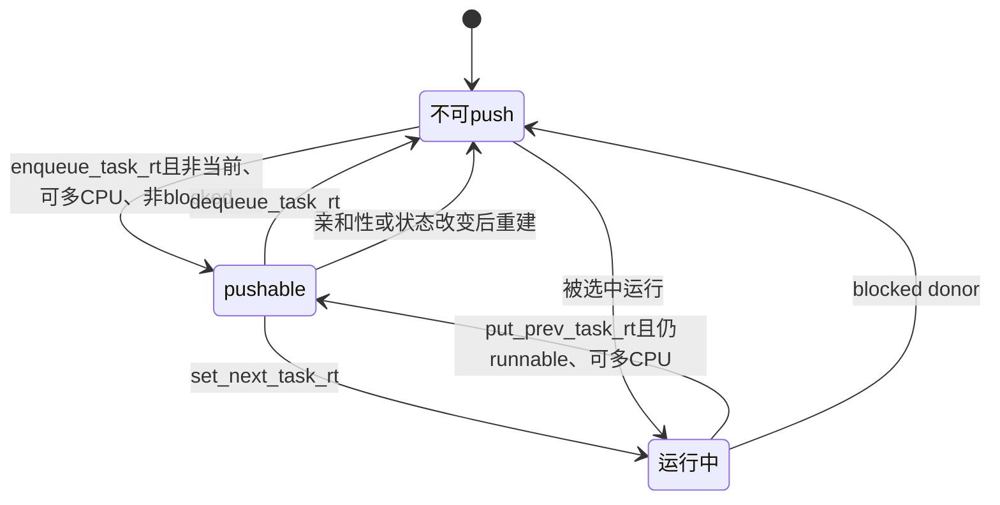

# `enqueue_pushable_task()` / `dequeue_pushable_task()` RT pushable plist 详解

> 源码基线：Linux 7.2-rc6，源码树 `E:\work\kernel\linux`  
> 源码位置：`enqueue_pushable_task()`：`kernel/sched/rt.c:397-411`；`dequeue_pushable_task()`：`kernel/sched/rt.c:413-430`  
> 一句话职责：维护本 CPU上“可由 RT SMP 均衡推往其他 CPU”的优先级有序候选表，同时维护最高候选缓存和 root-domain overload索引。

---

## 一、大白话总览

### （a）为什么另建 pushable 表？

`rt_rq->active`回答“本 CPU有哪些可运行 RT实体”；它不能直接回答“哪些任务现在可以迁走”。active中还可能包含：

- 当前正在运行的任务；
- CPU亲和性只有一个 CPU的任务；
- proxy execution下被 mutex阻塞的 donor；
- task-group代表实体而不是可直接迁移的叶子任务。

因此 RT调度器额外维护 `rq->rt.pushable_tasks`，提前筛出可迁移叶子任务，并按优先级排列，让 push路径不必扫描整个 active数组。

### （b）如果让我自己设计

#### 1. 一句话降级

它们维护一张按紧急程度排列的“可外派员工名单”：具备迁移条件时登记，开始运行、阻塞或出队时撤销。

#### 2. 最小模型

```text
CPU0 active:       current(A), B, C
允许CPU:           A={0,1}, B={0,1}, C={0}

pushable_tasks:    B
                  （A正在运行不能推；C无其他允许CPU）

CPU0选中B运行 → dequeue_pushable_task(B)
CPU0放回A     → enqueue_pushable_task(A)
```

输入是当前 `rq`和叶子 `task_struct`；出口是 plist成员资格、`highest_prio.next`和 root-domain overload状态同步。

#### 3. 核心数据对象

| 对象 | 角色 |
|---|---|
| `p->pushable_tasks` | 嵌入任务的 `plist_node`，避免迁移热路径动态分配 |
| `p->prio` | plist排序键；数值越小的 RT任务越紧急 |
| `rq->rt.pushable_tasks` | 当前 CPU的可迁移 RT任务优先级表 |
| `rq->rt.highest_prio.next` | 表头优先级缓存，空表为99 |
| `rq->rt.overloaded` | 本 CPU是否已登记为存在 pushable RT工作 |
| `rq->rd->rto_mask` | root-domain中所有 RT overloaded CPU的位图 |
| `rq->rd->rto_count` | 快速判断是否值得扫描 `rto_mask`的原子计数 |

#### 4. 真实复杂度来源

- plist既要按优先级排序，又要支持同优先级多个任务。
- 任务优先级可能在临时拆下再恢复时变化，因此入表前要删除旧节点并重新初始化排序键。
- 当前任务与 donor在 proxy execution下可能不同，消费者仍要防御性检查 `on_cpu/current_donor`。
- overload信息跨 CPU无大锁读取，需要 mask、count和内存屏障顺序。
- push过程可能释放 rq锁，候选状态会变化，因此 `pick_next_pushable_task()`与 `push_rt_task()`仍需复核。
- migration-disabled任务可能暂时留在表中，消费者跳过或通过 stopper处理。

#### 5. 如果自己实现

1. 仅在任务 runnable、非当前 donor、未 blocked且允许多个 CPU时入表。
2. 删除可能存在的旧节点，按当前 `p->prio`重建并有序插入。
3. 更新最高候选缓存。
4. 表从无候选变成有候选时，把 CPU加入 root-domain overload集合。
5. 任务出队或开始运行时删除节点。
6. 删除后若仍非空，从表头重建最高候选缓存。
7. 删除后为空，恢复 sentinel并从 overload集合撤销 CPU。

#### 6. 阅读 checklist

- active、pushable和当前运行身份分别表达什么？
- 为什么入队第一步是 `plist_del()`而不是直接 add？
- 为什么排序键使用 `p->prio`，而不是用户态 `rt_priority`？
- `highest_prio.next`为何可以直接取 plist首节点？
- `overloaded`何时从0变1、从1变0？
- mask与原子count的更新为什么有特定顺序？
- 既然入口已经过滤，消费者为什么还检查 `on_cpu`和 migration-disabled？

### （c）设计思路

`pushable_tasks`是从主运行队列派生出的物化索引：牺牲在状态边界上维护一份额外结构，换取 SMP均衡时快速定位高优先级迁移候选。任务把 plist节点内嵌在 `task_struct`里，不需要分配内存。

### （d）主要情况

| 情况 | 做法 |
|---|---|
| runnable、非当前、可多CPU、非blocked | 加入 pushable plist |
| 任务开始运行 | set_next路径删除，保证运行者不可push |
| 任务从RT rq出队 | dequeue路径无条件删除 |
| 旧任务被抢占且仍可迁移 | put_prev路径重新加入 |
| 删除后仍有候选 | 从plist首项更新 `highest_prio.next` |
| 删除后为空 | `next=99`，清除root-domain overload登记 |

---

## 二、控制流骨架

### 2.1 enqueue

```text
enqueue_pushable_task(rq, p)
│
├─ 删除p可能存在的旧plist节点
├─ 用当前p->prio重新初始化节点
├─ 有序加入rq->rt.pushable_tasks
├─ [p比highest_prio.next更紧急]
│    └─ 更新最高候选缓存
└─ [rq尚未标记overloaded]
     ├─ root-domain rto_mask/count登记CPU
     └─ rq->rt.overloaded = 1
```

### 2.2 dequeue

```text
dequeue_pushable_task(rq, p)
│
├─ 删除p的plist节点
├─ [表仍非空]
│    └─ 取plist首任务，刷新highest_prio.next
└─ [表已空]
     ├─ highest_prio.next = 99
     └─ [此前overloaded]
          ├─ root-domain rto_count/mask撤销CPU
          └─ rq->rt.overloaded = 0
```

---

## 三、Mermaid：pushable资格生命周期



---

## 四、宏观定位与触发场景

```text
RT runnable主队列
  ├── enqueue_task_rt()
  │     └── [enqueue_pushable_task()]
  ├── put_prev_task_rt()
  │     └── [enqueue_pushable_task()]
  ├── dequeue_task_rt()
  │     └── [dequeue_pushable_task()]
  └── set_next_task_rt()
        └── [dequeue_pushable_task()]

派生索引的消费者
  └── push_rt_tasks()
        └── push_rt_task()
              └── pick_next_pushable_task()
```

具体触发场景：

1. 当一个RT任务唤醒并入队，且不是当前任务、允许多个 CPU时，`enqueue_task_rt()`将它加入 pushable表。
2. 当旧RT任务被抢占但仍 runnable，`put_prev_task_rt()`恢复其 pushable资格。
3. 当RT任务被选中运行，`set_next_task_rt()`无条件把它从表中删除。
4. 当RT任务阻塞、退出或迁移出当前 rq，`dequeue_task_rt()`无条件删除节点。

如果该索引漏删，正在运行或已离队的任务可能被 push；如果漏加，CPU会保留本可迁走的 RT工作，造成其他 CPU空闲而本 CPU拥塞。

---

## 五、完整调用链

### 5.1 向上

```text
任务唤醒/激活
  └── enqueue_task_rt()                    // rt.c:1435
        └── enqueue_pushable_task()         // rt.c:397

旧RT donor离开运行位置
  └── put_prev_task_rt()                   // rt.c:1728
        └── enqueue_pushable_task()

任务阻塞/退出/迁移
  └── dequeue_task_rt()                    // rt.c:1455
        └── dequeue_pushable_task()         // rt.c:413

RT任务取得运行身份
  └── set_next_task_rt()                   // rt.c:1657
        └── dequeue_pushable_task()
```

### 5.2 向下

```text
enqueue_pushable_task()
  ├── plist_del()
  ├── plist_node_init()
  ├── plist_add()
  └── rt_set_overload()
        ├── cpumask_set_cpu(rto_mask)
        ├── smp_wmb()
        └── atomic_inc(rto_count)

dequeue_pushable_task()
  ├── plist_del()
  ├── has_pushable_tasks()
  ├── plist_first_entry()
  └── rt_clear_overload()
        ├── atomic_dec(rto_count)
        └── cpumask_clear_cpu(rto_mask)
```

---

## 六、结构与不变量

`struct plist_node`包含排序优先级和两组链表节点：

| 字段 | 含义 |
|---|---|
| `prio` | 排序键，RT中取 `p->prio` |
| `prio_list` | 不同优先级代表节点之间的链 |
| `node_list` | 包含同优先级所有节点的总链 |

关键不变量：

```text
运行中的RT任务不在pushable_tasks
pushable任务必须仍在本rq、属于RT、允许多CPU
plist首个可用项代表最高优先级候选（内核prio数值最小）
pushable表为空 ⇔ highest_prio.next为99且本rq不应标记overloaded
```

`pick_next_pushable_task()`还以 `BUG_ON`验证：候选属于当前 CPU、不是 current/donor、允许多 CPU、仍 queued且属于 RT。由于真正 push可能释放 rq锁，消费者不能只盲信入口时的状态。

---

## 七、逐行详解

### 7.1 `enqueue_pushable_task()`

```c
plist_del(&p->pushable_tasks, &rq->rt.pushable_tasks);
plist_node_init(&p->pushable_tasks, p->prio);
plist_add(&p->pushable_tasks, &rq->rt.pushable_tasks);
```

先删再初始化不是多余操作。任务可能因调度属性改变被临时拆下再恢复，其内嵌节点可能带着旧 `prio`排序键。删除旧位置并按当前有效优先级重建，保证 plist顺序正确，也使调用具有幂等性。

```c
if (p->prio < rq->rt.highest_prio.next)
	rq->rt.highest_prio.next = p->prio;
```

增加元素只可能让最优值保持或变得更小，因此无需扫描整个表。

```c
if (!rq->rt.overloaded) {
	rt_set_overload(rq);
	rq->rt.overloaded = 1;
}
```

局部布尔值避免重复增加 root-domain `rto_count`。`rt_set_overload()`只对 online rq生效：

```text
先 set rto_mask中的CPU位
再 smp_wmb
最后 atomic_inc(rto_count)
```

远端 pull逻辑通常先看 count决定是否扫描 mask。该顺序保证它看到非零 count后，mask位已经可见。

### 7.2 `dequeue_pushable_task()`

```c
plist_del(&p->pushable_tasks, &rq->rt.pushable_tasks);
```

调用者可以无条件删除；plist节点初始化为空链后，删除空节点不会把主表破坏。这简化了 `dequeue_task_rt()`和 `set_next_task_rt()`的状态分支。

```c
if (has_pushable_tasks(rq)) {
	p = plist_first_entry(...);
	rq->rt.highest_prio.next = p->prio;
}
```

删除可能正好移走最高候选，所以从有序表首项重建缓存。这里复用了形参变量 `p`保存新表头，只是局部指针改写，不影响原任务。

```c
else {
	rq->rt.highest_prio.next = MAX_RT_PRIO-1;
```

99在 `cpupri`语义中表示 NORMAL/无普通RT候选；它是缓存 sentinel，不是位图 delimiter 100。

```c
	if (rq->rt.overloaded) {
		rt_clear_overload(rq);
		rq->rt.overloaded = 0;
	}
```

只有表彻底为空才撤销 overload。clear侧先 `atomic_dec(rto_count)`再清 mask；源码明确说明此方向顺序不重要，因为并发读取即使短暂做了额外扫描也只是性能损耗，后续状态会收敛。

---

## 八、为什么 plist之后还要过滤？

`pick_next_pushable_task()`遍历时跳过：

```c
if (!task_on_cpu(rq, i) && !is_migration_disabled(i))
```

这是因为 pushable成员资格表达的是较稳定的基本条件，而 `on_cpu`和 migration-disabled可能在迁移/调度边界发生短暂变化。把所有短期状态都通过频繁摘挂维护，成本和竞态更高；消费者做最后复核更稳健。

若找到候选，后续 `push_rt_task()`仍会在可能释放锁后重新调用 `pick_next_pushable_task()`确认候选没有迁走、没有被替换。

---

## 九、总结

```text
active                回答：谁在本CPU可运行
pushable_tasks        回答：谁适合作为RT跨CPU迁移候选
highest_prio.next     回答：最紧急的pushable候选是多少级
rto_mask/rto_count    回答：root-domain哪些CPU值得被pull扫描
```

`enqueue_pushable_task()`负责“重建节点、插入排序表、登记 overload”；`dequeue_pushable_task()`负责“删除节点、重算表头、空表时撤销 overload”。真正正确性来自它们与 enqueue/dequeue/put/set四个状态边界的配对调用。
