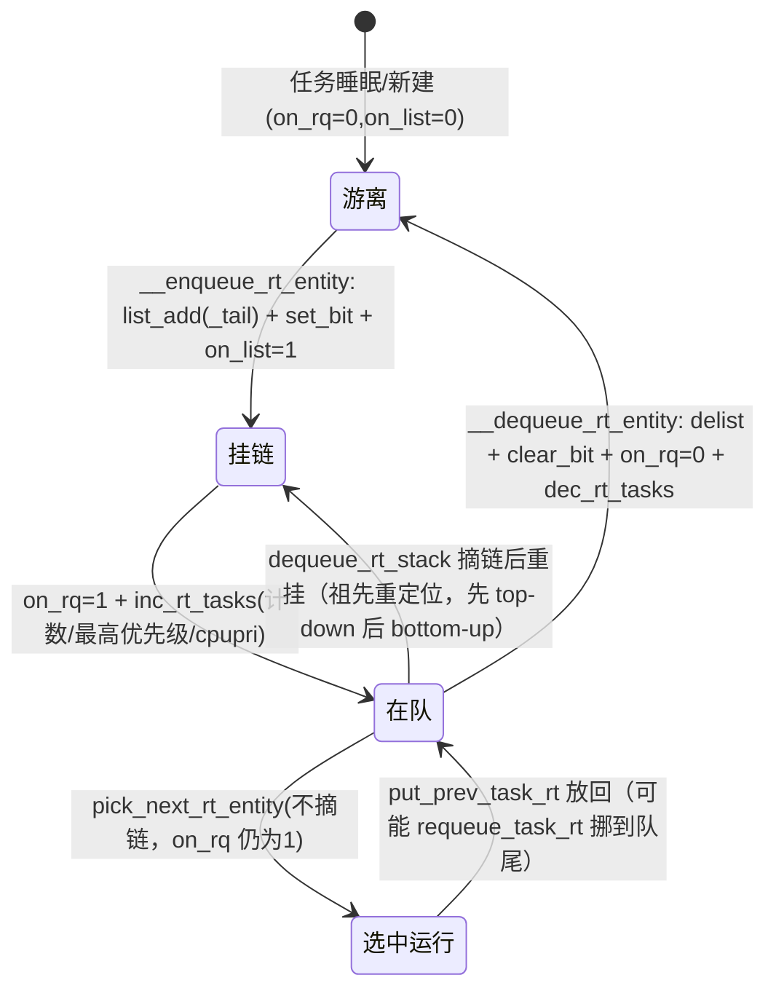
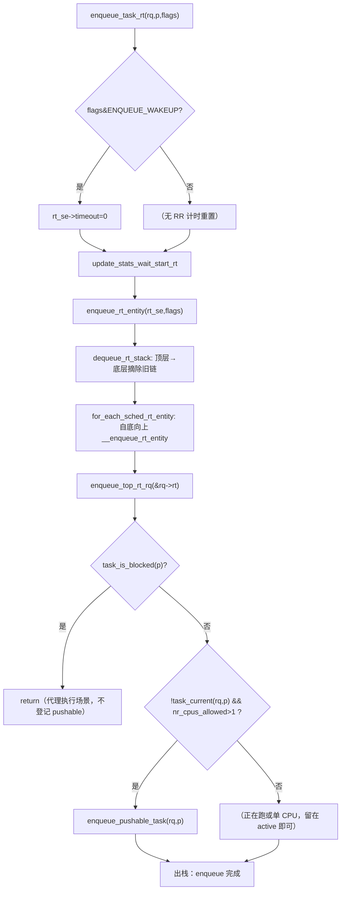

# RT 入队路径详解：enqueue_task_rt → enqueue_rt_entity → __enqueue_rt_entity（挂入 rt_prio_array）+ pushable 维护

> 源码位置（Linux 7.2-rc6，`E:\work\kernel\linux`）：
> - `enqueue_task_rt()`：`kernel/sched/rt.c:1435-1453`（类入口，末尾含 pushable 维护）
> - `enqueue_rt_entity()`：`kernel/sched/rt.c:1403-1413`（实体级入队，逐层自底向上）
> - `__enqueue_rt_entity()`：`kernel/sched/rt.c:1331-1363`（真正把 run_list 挂进 `rt_prio_array` 的单级原语）
> - `struct rt_prio_array`：`kernel/sched/sched.h:311-314`；`struct rt_rq`：`kernel/sched/sched.h:840-867`；`struct sched_rt_entity`：`include/linux/sched.h:623-639`
> - 泛型分发：`enqueue_task()` `kernel/sched/core.c:2172-2193`
>
> 一句话职责：把一个 RT（FIFO/RR）任务从"就绪"登记进本 CPU 的按优先级组织的可运行队列 `rt_prio_array`，逐层维护 task group 实体、顶层 `rq->rt` 计数与 cpupri，并在需要时把它登记为"可被推送到其他 CPU"的 pushable 候选。

---

## 一、大白话总览 + 设计模型

### （a）为什么要设计它？

RT 任务被唤醒（等的事件到了）、被新建、或被换到 RT 策略后，它必须"有个地方待着"，让调度器每次切换时能**按优先级瞬间挑出应该上 CPU 的那个**。如果没有这套入队逻辑，RT 任务的实时性无法保证：最坏情况是 O(n) 扫描、或者任务"丢失"在队列之外。

反向看动机：RT 调度类承诺"最高优先级任务总在运行（除非被更高优先级抢占）"。这个承诺要求（1）入队 O(1)；（2）同级任务按 FIFO/RR 轮转；（3）出队/入队前后计数器、位图、最高优先级缓存**严格一致**——任何一处不同步都会让 `pick_next_rt_entity()` 挑错人，或让 push/pull 迁移逻辑误判，RT 任务就会错过截止时间（对 RT 是硬错误，不是性能问题）。

### （b）如果让你自己设计它，第一反应应该是什么？

1. **一句话降级**：这就是"把一张就绪参赛卡放进按号码分格的抽屉，并同步更新墙上的'最高号'看板"，外加告诉别的 CPU"我这里有多余的好卡可以领走"。

2. **最小模型**：
   - 输入：任务 `p`（带着 `p->prio`）、所在 `rq`、标志 `flags`。
   - 核心数据：每个 CPU 一个 100 格的"抽屉柜"（`rt_prio_array`：位图 + 100 条链表）。
   - 出口状态：任务的 `run_list` 挂在 `queue[prio]` 上、对应位图位置位、`rt_rq` 计数 +1、最高优先级缓存更新。

   ```
   入队前                                入队后
   p(prio=80) ──游离──┐            rt_prio_array
                       │  list_add_tail(queue[80])
                       ▼
    bitmap: [.. bit80 ..] ← __set_bit       bitmap bit80 = 1
    queue[80]: HEAD ⇄ p.run_list ⇄ HEAD      ← 挂链表
    rt_rq.rt_nr_running: n → n+1
   ```

3. **核心数据对象**：

   | 对象 | 角色类比 | 在这件事里的角色 |
   |---|---|---|
   | `sched_rt_entity.run_list` | 参赛卡上的挂环 | 让实体能挂进某优先级链表；`on_list=1` 表示已挂上 |
   | `rt_prio_array` | 100 格抽屉柜 | 每格一条链表放同一优先级的所有就绪 RT 实体；位图是"哪格非空"的速查表 |
   | `rt_rq.active/rt_nr_running/highest_prio.curr` | 每 CPU 的账本 | 抽屉柜本体 + 人数 + 当前最高优先级缓存 |
   | `p->prio`（或 group `my_q->highest_prio.curr`） | 参赛号 | `rt_se_prio()`：决定挂进第几格 |
   | `rt_rq.pushable_tasks` + `p->pushable_tasks`（plist） | "可外派名单" | 另一张表：记录可以被推到别的 CPU 的 RT 任务（按优先级排序） |
   | `sched_rt_entity.{on_rq,on_list,parent,my_q,back}` | 状态位与族谱 | `on_rq`=在队列体系中（含已被选中跑），`on_list`=链表上真实挂着；`parent/my_q` 组成 group 层级；`back` 是出栈用的临时链 |

4. **真实复杂度从哪里来**：
   - **层级结构**（CONFIG_RT_GROUP_SCHED）：任务属于 task_group；一个 CPU 上 group 们串成"实体树"。叶子实体挂进自己 group 的 `my_q`，group 实体又作为一张卡挂进父级……顶层挂在 `&rq->rt.active`。**上层实体该挂第几格，取决于它内部最高优先级成员**——所以增删成员会引发祖先重排队。
   - **双轨登记**：活跃数组（本 CPU 选择用）+ pushable plist（跨 CPU 推送用）是两张表，必须同步维护。
   - **标志状态机**：同一函数族要处理唤醒（WAKEUP）、恢复（RESTORE/SAVE 不搬动）、搬家（MOVE/CLASS）、队头插（ENQUEUE_HEAD）等语义。
   - **并发/锁**：全程持 rq 锁（raw_spinlock），SMP 上还要维护 cpupri 全局视图（`inc/dec_rt_prio_smp`）、overload 位图/计数（`rto_mask`/`rto_count`），有内存屏障要求。
   - **外围副作用**：顶层入队要 `add_nr_running()`、`cpufreq_update_util()` 踢调频；组实体要 `start_rt_bandwidth()`（启动带宽记账定时器）。
   - **统计（schedstat）**：仅在 `schedstat_enabled()` 时记录 wait/sleep 时间，避免热路径开销。

5. **如果自己实现，大概步骤**：
   - 正常路径（任务级、非 group）：算优先级 → 决定队头还是队尾 → `list_add(_tail)` → 置位图位 → `on_list=1`、`on_rq=1` → `rt_nr_running++`、RR 计数 → 更新最高优先级缓存 → 顶层记账（`enqueue_top_rt_rq`）→ （若可迁移且非当前运行任务）pushable 登记。
   - 特殊分支：唤醒时清 timeout（RR 时间片从头计）；`ENQUEUE_HEAD` 时插队头；PI 提升/换类时**先整体出栈再自底向上入栈**，保证祖先按新优先级落位；group 被 throttle 或已空时**不入队**（若是它之前挂着则摘掉）。
   - 需同步维护：链表、位图、`on_list`/`on_rq`、`rt_nr_running`/`rr_nr_running`、`highest_prio.{curr,next}`、`rt_queued`、overload 标志、cpupri、pushable plist。
   - 外围副作用：`enqueue_top_rt_rq()` 的 `add_nr_running` + cpufreq 通知；唤醒后的抢占判断由核心层 `wakeup_preempt()` 做（RT 类有自己的 `wakeup_preempt_rt`）；需要时 `resched_curr()`。

6. **源码阅读 checklist**（带着这些问题读下文代码）：
   - 这个 `if` 是"标志语义分流"（WAKEUP/HEAD/RESTORE）还是"group 空/被 throttle 的特判"？
   - 链表操作与计数/位图是否成对？（`list_add ↔ list_del`、`__set_bit ↔ __clear_bit`、`inc_rt_tasks ↔ dec_rt_tasks`）
   - `on_rq` 与 `on_list` 谁先置、谁后清？为什么分两个状态位？
   - 为什么 `enqueue_rt_entity` 一进来先调 `dequeue_rt_stack`（先出后进）？
   - 谁负责在入队后触发抢占/推送？（本函数内 vs 核心层 vs balance callback）
   - schedstat 代码块为什么被 `schedstat_enabled()` 门控？

### （c）它是怎么设计的？

核心思路一句话：**优先级域只有 100 个，用"位图 + 每优先级一条 FIFO 链表"换取 O(1) 入队与 O(1) 选队首**（`sched_find_first_bit(bitmap)` 一次找到最高非空优先级）；同优先级内保持 FIFO（RR 依赖它轮转）。在此基础上把"一个任务入队"分解成三层职责：

- `__enqueue_rt_entity()`：**单级原语**——只负责把一个实体挂进"它所属的那个 rt_rq 的 active 数组"对应链表，并做位图/状态/计数，不含层级遍历；
- `enqueue_rt_entity()`：**层级协调器**——先 `dequeue_rt_stack()` 把祖先链整体摘下（保证"移动/优先级变化"幂等），再用 `for_each_sched_rt_entity` 自底向上逐级调原语，最后 `enqueue_top_rt_rq()` 做顶层记账；
- `enqueue_task_rt()`：**类入口**——处理类语义（唤醒清 timeout、schedstat），调实体入队，最后单独做 **pushable 维护**。

与公平调度（CFS 用红黑树按 vruntime）不同：RT 不需要"按时间公平"，只需要"绝对优先级 + 同优先轮转"，所以链表+位图是它最合适的容器。注意 pushable 与 active 是**两套容器并存**：active 链表决定"本 CPU 上谁先跑"（FIFO）；pushable plist 只服务"把多余 RT 任务推给空闲/低优 CPU"，二者理由不同，所以需要两张表。

### （d）它处理哪几种情况？

```
情况一：普通就绪入队（无 ENQUEUE_HEAD/无特殊标志）
  → 做：list_add_tail 挂到 queue[prio] 队尾、置位图、计数、更新最高优先级
  → 为什么：同优先级 FIFO，保证公平与 RR 轮转基准；唤醒场景通常尾插即可

情况二：flags 带 ENQUEUE_HEAD（PI 提升/优先级上调后的重入队，rt_mutex_setprio 路径）
  → 做：list_add 插到 queue[prio] 队头
  → 为什么：该任务正在（或刚从）高优先级提升过来，应排在同优级老成员之前，
            否则会被自己的"同级"插队，PI 优先级继承就白提了

情况三：ENQUEUE_WAKEUP（唤醒路径 ttwu_do_activate）
  → 做：enqueue_task_rt 里清 rt_se->timeout；stats 走 sleeper 分支
  → 为什么：RR 任务醒来重新拥有完整时间片；统计上这是一次"睡醒"

情况四：task group 层级（CONFIG_RT_GROUP_SCHED），组实体入队
  → 做：若组被 throttle 或组内无人（group_rq 空），则不上挂（已在挂则 __delist_rt_entity 摘掉）；
        否则自底向上逐级入队，顶层实体挂进 &rq->rt.active
  → 为什么：空/被限流的组不应占用父级队列与带宽；上层实体按组内最高优先级落位

情况五：任务刚被入队且满足"非当前运行 && nr_cpus_allowed>1"
  → 做：enqueue_pushable_task(rq,p) 登记进 pushable plist（+overload 标记）
  → 为什么：它没占着当前 CPU、又有别处可去，具备被 push/pull 的条件；单 CPU 或正在跑的不该被推走
```

---

## 二、控制流骨架

### `enqueue_task_rt(rq, p, flags)`（rt.c:1435）

```
enqueue_task_rt(rq, p, flags)
│  rt_se = &p->rt
│
├─ [flags & ENQUEUE_WAKEUP]        // 唤醒场景
│     → rt_se->timeout = 0          // RR 时间片/看门狗计时清零
│
├─ check_schedstat_required()       // 若 schedstat 被 proc 打开则开账本
├─ update_stats_wait_start_rt(...)  // 记录 wait_start（仅任务实体；开关门控）
│
├─ enqueue_rt_entity(rt_se, flags)  // ★ 实体级分层入队（见下）
│
├─ [task_is_blocked(p)]             // CONFIG_SCHED_PROXY_EXEC：p 阻塞在代理执行上
│     → return                       // 阻塞任务不登记 pushable（由 donor 代跑）
│
└─ [ !task_current(rq,p) && p->nr_cpus_allowed > 1 ]   // 非本 CPU 当前任务且可迁移
      → enqueue_pushable_task(rq, p)  // ★ pushable 维护：plist + highest_prio.next + overload
```

### `enqueue_rt_entity(rt_se, flags)`（rt.c:1403）

```
enqueue_rt_entity(rt_se, flags)
│
├─ update_stats_enqueue_rt(...)         // 仅统计：ENQUEUE_WAKEUP→记录 sleep 段
│
├─ dequeue_rt_stack(rt_se, flags)       // ★ 先整体"出栈"（顶层→底层，仅摘已在队者）
│     └─ 沿 parent 链走到顶，沿途记 back；再从顶到底 __dequeue_rt_entity()
│        （未在队上的实体自动跳过）→ 最后 dequeue_top_rt_rq(顶层rt_rq, 旧nr_running)
│
├─ 【for 循环 for_each_sched_rt_entity(rt_se)】 // 自底向上逐级（任务→组→…→顶层）
│     └─ __enqueue_rt_entity(rt_se, flags)      // ★ 单级原语（见下）
│
└─ enqueue_top_rt_rq(&rq->rt)           // 顶层记账：rt_queued=1、add_nr_running、cpufreq 通知
```

### `__enqueue_rt_entity(rt_se, flags)`（rt.c:1331）——真正的"挂链表"

```
__enqueue_rt_entity(rt_se, flags)
│  rt_rq   = rt_rq_of_se(rt_se)        // 实体"所属"的 rt_rq（该往哪个 active 里挂）
│  array   = &rt_rq->active            // 目标抽屉柜
│  group_rq= group_rt_rq(rt_se)        // 若 rt_se 是组实体 → my_q（它自己管的队列）
│  queue   = array->queue + rt_se_prio(rt_se)   // 按优先级定格（指针运算！）
│
├─ [group_rq 且 (组被 throttle 或 组内 rt_nr_running==0)]   // 组实体的守卫
│     ├─ [rt_se->on_list]              // 若以前挂着（组刚空/被限流）
│     │     → __delist_rt_entity(rt_se, array)   // 摘链 + 清位图 + on_list=0
│     └─ return                        // 空/限流组：不进父级队列
│
├─ [move_entity(flags)]                // 仅 "SAVE 且 !MOVE"（纯状态恢复）时跳过链表操作
│     ├─ WARN_ON_ONCE(rt_se->on_list)  // 防御：真在链表上还来入队 = bug
│     ├─ [flags & ENQUEUE_HEAD]
│     │     → list_add(&rt_se->run_list, queue)      // 队头（PI 提升场景）
│     └─ 否则
│           → list_add_tail(&rt_se->run_list, queue) // 队尾（FIFO 常规路径）
│     ├─ __set_bit(rt_se_prio(rt_se), array->bitmap) // 位图置位：这一格非空
│     └─ rt_se->on_list = 1
│
├─ rt_se->on_rq = 1                    // ★ 注意：无论是否 move_entity 都置
│
└─ inc_rt_tasks(rt_se, rt_rq)          // 人数/账本/cpupri/带宽（见逐行）
```

---

## Mermaid 图示

字段生命周期（一次完整入队，`on_rq`/`on_list`/链表/位图的变化）：



主执行路径：



---

## 三、快速定位

- **子系统**：内核调度器（kernel/sched）的 **RT 调度类**（SCHED_FIFO/SCHED_RR），文件 `kernel/sched/rt.c`，与 CFS（fair.c）/DL（deadline.c）并列，通过 `DEFINE_SCHED_CLASS(rt)`（rt.c:2601）注册到 `sched_class` 方法表。
- **核心职责一句话**：把 RT 就绪任务登记进本 CPU 的"优先级位图 + 100 条 FIFO 链表"（`rt_prio_array`），逐级维护 task-group 祖先实体、顶层 `rq->rt` 账本与 cpupri，并登记可推送的 pushable 候选。
- **对象属于谁**：`rt_prio_array` 嵌在 `rt_rq`（每 CPU 一份，`rq->rt`）；`sched_rt_entity` 嵌在 `task_struct.rt`（每任务一份）或属于 task_group（每 CPU 一个组实体 `tg->rt_se[cpu]`）。

---

## 四、宏观地位分析

### （a）所属层次

```
用户态：sched_setscheduler()/sched_setattr()/fork()/等待事件完成
  │
  ▼
核心层泛型入口（kernel/sched/core.c）
  ├─ try_to_wake_up() → ttwu_do_activate() ─┐
  ├─ wake_up_new_task()                     ├─→ activate_task() → enqueue_task()
  ├─ move_queued_task()（迁移）              │         │（ENQUEUE_WAKEUP/INITIAL/0…）
  └─ sched_change_begin/end()（换类/改优先级）┘         ▼
                                         p->sched_class->enqueue_task()   ← 多态分发
                                              │
                                              ▼
        [ 这段代码在这里：enqueue_task_rt() → enqueue_rt_entity() → __enqueue_rt_entity() ]
              │
              ▼ 底层依赖
   rt_prio_array(位图+链表) / rt_rq 账本 / cpupri(SMP) / rto_mask 推送标记 /
   task_group 层级(my_q/parent) / schedstat / cpufreq_update_util
```

### （b）触发场景

1. **事件等待完成（唤醒）**：RT 任务 sleep 在 mutex/信号量/waitqueue 上，事件到达 → `try_to_wake_up()` → `ttwu_do_activate()`（core.c:3804）以 `ENQUEUE_WAKEUP|ENQUEUE_NOCLOCK` 调 `activate_task()`（core.c:3824）→ `enqueue_task_rt`。这是最频繁的路径，`rt_se->timeout` 被清零。
2. **新任务出生**：`kernel_thread()`/`fork()` → `wake_up_new_task()` 以 `ENQUEUE_NOCLOCK|ENQUEUE_INITIAL` 调 `activate_task()`（core.c:4963）。
3. **换到 RT 策略 / 优先级改变 / PI 提升**：`sched_setscheduler()`/`rt_mutex_setprio()` 走 `CLASS(sched_change)`（sched.h:4207）→ `sched_change_begin()` 出队记录（core.c:11192）→ `sched_change_end()` 重入队（core.c:11239→11255 调 `enqueue_task`）。RT 优先级上调时置 `ENQUEUE_HEAD`（core.c:7717、syscalls.c:697），使被提升任务插到新优先级队列**队头**。
4. **跨 CPU 迁移**：affinity 变化 → `move_queued_task()`（core.c:2546）目标 CPU 上 `activate_task(rq, p, 0)`（core.c:2560）。

### （c）解决什么问题 / 如果出错会怎样

- 没入队 = RT 任务"丢了"：即使它最高优先级，调度器也永远不选它 → 硬实时任务饿死。
- 入错格（优先级算错/祖先不同步）= `pick_next` 选到低优先级任务，RT 可调度性被破坏，且同优先级 FIFO 顺序错乱影响公平。
- 计数器/位图/`highest_prio.curr` 不一致 = `dec_rt_prio` 时用位图重算出的最高优先级是错的 → 该抢占时不抢占、cpupri 误导其它 CPU 的 push/pull。
- pushable 维护缺失 = 该 CPU 的 RT 任务永远不会被推给空闲 CPU（`rto_mask` 无人置位，pull 无从发生），RT 任务聚集在忙 CPU 上延迟。
- 所以本文件内所有"先摘链、后挂链""先置 on_rq、后记数"等顺序，本质都是为**不变量**服务：链表内容 ⇔ 位图 ⇔ 计数 ⇔ 最高优先级缓存四者必须时刻一致。

---

## 五、完整调用链路

### （a）向上：谁调用了 enqueue_task_rt

```
（泛型分发链，证据见 core.c + sched.h）
事件源：事件完成唤醒 / fork / setscheduler / affinity 迁移
  ├─ try_to_wake_up()                        // kernel/sched/core.c
  │     └─ ttwu_do_activate(rq,p,WF_*...)
  │           └─ activate_task(rq,p, ENQUEUE_WAKEUP|ENQUEUE_NOCLOCK …)   // core.c:3824
  ├─ wake_up_new_task()
  │     └─ activate_task(rq,p, ENQUEUE_NOCLOCK|ENQUEUE_INITIAL)          // core.c:4963
  ├─ move_queued_task()                      // 迁移（stopper 停旧 CPU 后）
  │     └─ activate_task(rq,p, 0)                                        // core.c:2560
  └─ sched_change_end(ctx)                   // 换类/改优先级收尾（rt_mutex_setprio 等）
        └─ enqueue_task(rq,p, ctx->flags)    // core.c:11255（可能含 ENQUEUE_CLASS/ENQUEUE_HEAD）
              │
              ▼
        enqueue_task(rq, p, flags)           // core.c:2172（泛型：时钟/uclamp/psi…）
              │
              ▼
        p->sched_class->enqueue_task(rq,p,flags)   // core.c:2184 多态分发
              │  （rt_sched_class.enqueue_task = enqueue_task_rt，rt.c:2602）
              ▼
        [enqueue_task_rt(rq, p, flags)]      // rt.c:1435  ← 本次分析对象
```

DB 佐证（`find_indirect_callers enqueue_task_rt` → `.enqueue_task` 字段赋值于 rt.c:2602；候选 `->enqueue_task()` 调用点：core.c:2184 / 2224 / 3876 / 11255）。

### （b）向下：它调用了什么

```
enqueue_task_rt(rq,p,flags)                     // rt.c:1435
  ├─ update_stats_wait_start_rt()               // rt.c:1233：schedstat 记录 wait_start（门控）
  ├─ enqueue_rt_entity(rt_se, flags)            // rt.c:1403
  │     ├─ update_stats_enqueue_rt()            // rt.c:1271：WAKEUP→sleep 统计段
  │     ├─ dequeue_rt_stack(rt_se, flags)       // rt.c:1383：祖先链先出栈
  │     │     ├─ for_each_sched_rt_entity + back 链  // 走到顶层（rt.c:1388）
  │     │     └─ __dequeue_rt_entity(rt_se,flags)    // rt.c:1365（含 __delist_rt_entity）
  │     ├─ 【for_each_sched_rt_entity】__enqueue_rt_entity(rt_se, flags)  // rt.c:1331
  │     │     ├─ rt_rq_of_se/group_rt_rq/rt_se_prio   // rt.c:185/519/958
  │     │     ├─ __delist_rt_entity()           // rt.c:1212（组空/限流时摘链）
  │     │     ├─ list_add(_tail)(&rt_se->run_list, queue)  + __set_bit   // 挂链+位图
  │     │     └─ inc_rt_tasks()                 // rt.c:1174
  │     │           ├─ inc_rt_prio()            // rt.c:1079 → highest_prio.curr
  │     │           ├─ inc_rt_prio_smp()        // rt.c:1049 → cpupri_set（仅顶层 rq）
  │     │           └─ inc_rt_group()           // rt.c:1119 → rt_nr_boosted + 启动带宽
  │     └─ enqueue_top_rt_rq(&rq->rt)           // rt.c:1027：rt_queued/add_nr_running/cpufreq
  ├─ enqueue_pushable_task(rq, p)               // rt.c:397（非当前运行且可迁移时）
  │     ├─ plist_del/plist_node_init/plist_add  // rq->rt.pushable_tasks（按 prio 有序）
  │     ├─ 更新 rq->rt.highest_prio.next
  │     └─ rt_set_overload(rq)                  // rto_mask 置位 + rto_count++（SMP 拉取信号）
```

---

## 六、逐行详解

### 6.1 关键结构体与字段

```c
struct sched_rt_entity {                    // include/linux/sched.h:623；每任务或每组一个
	struct list_head	run_list;    // 挂环：进 rt_prio_array 某优先级的链表用
	unsigned long		timeout;     // RR 到期计点：task_tick_rt 里递减；唤醒时清零
	unsigned long		watchdog_stamp;  //（RT 组带宽相关的时间戳）
	unsigned int		time_slice;  // RR 时间片剩余量（RUN_TIMESLICE）
	unsigned short		on_rq;       // 状态位：该实体"在运行队列体系内"（含正被选为运行）
	unsigned short		on_list;     // 状态位：run_list 此刻真实挂在某条链表上
	struct sched_rt_entity	*back;       // 出栈遍历用的临时"下一层"指针（dequeue_rt_stack）
#ifdef CONFIG_RT_GROUP_SCHED
	struct sched_rt_entity	*parent;     // 父实体（往上一级队列）
	struct rt_rq		*rt_rq;      // 我"属于"哪个 rt_rq（入队挂它的 active）
	struct rt_rq		*my_q;       // 我是组实体时"我管辖"的 rt_rq（成员任务所在队列）
#endif
} __randomize_layout;
```

```c
struct rt_prio_array {                      // kernel/sched/sched.h:311
	DECLARE_BITMAP(bitmap, MAX_RT_PRIO+1);  // 100+1 位（多 1 位作哨兵）；
	                                        // bit[i]=1 ⇔ queue[i] 非空
	struct list_head queue[MAX_RT_PRIO];    // 每优先级一条循环双向链表（MAX_RT_PRIO=100）
};
```

```c
struct rt_rq {                              // kernel/sched/sched.h:840
	struct rt_prio_array	active;        // ★ 本 CPU 的 RT 抽屉柜
	unsigned int		rt_nr_running; // 本 rt_rq 就绪任务数（含组内聚合）
	unsigned int		rr_nr_running; // 其中 SCHED_RR 数量（决定轮转粒度）
	struct { int curr; int next; } highest_prio;  // curr=队里最高；next=pushable 里最高
	bool			overloaded;    // 本 CPU 是否标记为"有可推 RT"
	struct plist_head	pushable_tasks; // 可被 push 的任务（按 p->prio 升序）
	int			rt_queued;     // 顶层账本位：rq->rt 是否已算入 rq->nr_running
#ifdef CONFIG_RT_GROUP_SCHED
	int			rt_throttled;  // 组被带宽限制
	u64			rt_time/rt_runtime; …  // 组带宽消耗/配额
	… rt_rq->rq … // 回指顶层 rq
#endif
};
```

`task_struct` 侧（include/linux/sched.h:881）：`struct sched_rt_entity rt;`——普通任务的 RT 实体就嵌在这里；`:968`：`struct plist_node pushable_tasks;`——pushable 表用的"别针"。

### 6.2 `__enqueue_rt_entity()`：单级原语（真正挂链表）

```c
static void __enqueue_rt_entity(struct sched_rt_entity *rt_se, unsigned int flags)
{                                             // rt.c:1331
	struct rt_rq *rt_rq = rt_rq_of_se(rt_se);   // 该实体所属队列（要挂进谁的 active）
	struct rt_prio_array *array = &rt_rq->active;
	struct rt_rq *group_rq = group_rt_rq(rt_se); // 组实体才有 my_q；任务实体为 NULL
	struct list_head *queue = array->queue + rt_se_prio(rt_se);
	                                          // 指针运算定位到第 prio 格链表
	// ★ 组实体守卫：组被 throttle 或组内已无人 → 本实体不进父级队列
	if (group_rq && (rt_rq_throttled(group_rq) || !group_rq->rt_nr_running)) {
		if (rt_se->on_list)                 // 若此前还挂着（组刚空/刚被限流）
			__delist_rt_entity(rt_se, array); // 摘链、必要时清位图、on_list=0
		return;                              // 之后仍会置 on_rq？不——直接返回，
		                                     // 调用者随后 enqueue_top_rt_rq 兜底记账
	}
	if (move_entity(flags)) {                // 默认 true；仅“纯 SAVE(ENQUEUE_RESTORE)且无 MOVE”
		                                     // 时 false —— 状态恢复型出入队不动链表
		WARN_ON_ONCE(rt_se->on_list);        // 已在链表上又来入队 → 双重入队 bug
		if (flags & ENQUEUE_HEAD)            // PI 提升等：插队头
			list_add(&rt_se->run_list, queue);
		else                                 // 常规：尾插 = 同优先级 FIFO
			list_add_tail(&rt_se->run_list, queue);
		__set_bit(rt_se_prio(rt_se), array->bitmap);  // 该格非空标记
		rt_se->on_list = 1;
	}
	rt_se->on_rq = 1;                        // 无论是否 move_entity 都置：
	                                         // “体系内”标记与“真实挂链”分离的两状态位设计
	inc_rt_tasks(rt_se, rt_rq);              // 计数 + 最高优先级缓存 + cpupri + 组带宽
}
```

逐句要点：
- `queue = array->queue + rt_se_prio(rt_se)`：`rt_se_prio()`（rt.c:958）任务取 `p->prio`（**含 PI 提升后的数值**），组实体取其 `my_q->highest_prio.curr`（组内最高优先级）——这正解释了"上层实体该挂第几格取决于组内最高成员"。
- `inc_rt_tasks`（rt.c:1174）内部：`rt_nr_running += rt_se_nr_running()`（任务=1，组=组内人数）、`rr_nr_running += ...`；`inc_rt_prio`（rt.c:1079）仅在 `prio < highest_prio.curr` 时更新缓存；`inc_rt_prio_smp`（rt.c:1049）只在"顶层 rq 的 rt_rq"且 CPU online 时 `cpupri_set()`（供其它 CPU 的 cpupri 查找）；`inc_rt_group`（rt.c:1119）处理 boost 计数与 `start_rt_bandwidth()`（若组有配额，激活周期定时器开始记账）。
- `on_rq` 与 `on_list` 为什么分开：**`on_rq` 表示"在调度可见状态中"**（选中运行中的任务 `on_rq` 仍为 1，保证不会重复入队、可被去重/迁移逻辑识别）；**`on_list` 表示"run_list 此刻真实挂着"**。pick 任务时**不摘链**（只把 `rq->curr` 指过去），所以运行中的 RT 任务依然挂在链表上，`on_list=1` 且 `on_rq=1`；被唤醒但尚未入队的任务 `on_rq=0`。SMP/迁移与 PI 场景需要区分"被选运行但仍占队"与"游离"，两状态位缺一不可。
- `__delist_rt_entity`（rt.c:1212）：`list_del_init` 后检查该优先级链表是否已空，空则 `__clear_bit` 清位图，再 `on_list=0`——**位图与链表成对维护**的典范。

### 6.3 `enqueue_rt_entity()` 与 `dequeue_rt_stack()`：层级协调与"先出后进"

```c
static void enqueue_rt_entity(struct sched_rt_entity *rt_se, unsigned int flags)
{                                             // rt.c:1403
	struct rq *rq = rq_of_rt_se(rt_se);
	update_stats_enqueue_rt(rt_rq_of_se(rt_se), rt_se, flags);   // 统计（仅 WAKEUP 分支有动作）
	dequeue_rt_stack(rt_se, flags);           // ① 先摘：把“已在队上的祖先链”整体取下
	for_each_sched_rt_entity(rt_se)           // ② 再挂：自底向上逐级（任务→…→顶层）
		__enqueue_rt_entity(rt_se, flags);
	enqueue_top_rt_rq(&rq->rt);               // ③ 顶层记账
}
```

```c
static void dequeue_rt_stack(struct sched_rt_entity *rt_se, unsigned int flags)
{                                             // rt.c:1383 —— 注释：“上层实体的优先级依赖下层，
	struct sched_rt_entity *back = NULL;      //   因此必须 top-down 移除”
	for_each_sched_rt_entity(rt_se) {         // 沿 parent 链走到顶，边走边记 back（临时出栈链）
		rt_se->back = back;
		back = rt_se;
	}
	rt_nr_running = rt_rq_of_se(back)->rt_nr_running;   // 记顶层人数，供 dequeue_top_rt_rq
	for (rt_se = back; rt_se; rt_se = rt_se->back) {    // 从顶到底逐个摘
		if (on_rt_rq(rt_se))                            // 只摘“确实在队”的
			__dequeue_rt_entity(rt_se, flags);
	}
	dequeue_top_rt_rq(rt_rq_of_se(back), rt_nr_running); // 顶层 rq->rt 账本归位
}
```

为什么"入队前先出队"：把一个新成员放进组，可能改变**组实体在父队列中的位置**（组内最高优先级变了），甚至让原先空的组第一次有成员。若直接挂链，祖先仍挂在旧的优先级格子上 → 链表重复/位图错乱。所以正确姿势是：**先把已在队上的整条祖先链 top-down 摘干净（摘除时组内状态还没变，父级定位准确），再自底向上重新挂（此时每级的 rt_se_prio 都是最新的）**，全程幂等。摘除顺序必须 top-down 的原因：**组实体的优先级取自已摘除的下级成员**——若先摘子级，父级再摘时就不知道当初挂在哪格了（rt.c:1379 注释直白说明）。`dequeue_rt_stack` 同时把 `rt_se->back` 串成临时链，供第二次循环反向使用（不改变真实 parent 指针）。

`enqueue_top_rt_rq`（rt.c:1027）：若 `rq->rt.rt_queued` 已为 1 则直接返回（避免重复计数）；被 throttle 返回；否则有运行任务时 `add_nr_running(rq, rt_nr_running)` 并置 `rt_queued=1`；最后 `cpufreq_update_util(rq,0)` 踢调频。它**不决定选谁**，只负责把"顶层 rt_rq 是否参与调度"这一个账本和 CPU 频率联动。

### 6.4 `enqueue_task_rt()`：类入口与 pushable 维护

```c
static void
enqueue_task_rt(struct rq *rq, struct task_struct *p, int flags)   // rt.c:1435
{
	struct sched_rt_entity *rt_se = &p->rt;

	if (flags & ENQUEUE_WAKEUP)              // 唤醒：RR/FIFO 时间片状态复位
		rt_se->timeout = 0;                  //（task_tick_rt 用 timeout 做 RR 轮转判定）

	check_schedstat_required();              // 若 /proc 开启 schedstat 首次调用时开账
	update_stats_wait_start_rt(rt_rq_of_se(rt_se), rt_se);   // 记 wait_start（非任务/关闭则空转）

	enqueue_rt_entity(rt_se, flags);         // ★ 分层入队（6.2/6.3）

	if (task_is_blocked(p))                  // CONFIG_SCHED_PROXY_EXEC 下 p 阻塞在代理执行：
		return;                              //   由 rq->donor 代跑，不登记 pushable
	                                         // （非代理配置此函数恒 false，rt.c/sched.h:2465）

	if (!task_current(rq, p) && p->nr_cpus_allowed > 1)   // 不是当前执行者，且可在多 CPU 跑
		enqueue_pushable_task(rq, p);        // ★ pushable 维护（见下）
}
```

pushable 维护本体：

```c
static void enqueue_pushable_task(struct rq *rq, struct task_struct *p)   // rt.c:397
{
	plist_del(&p->pushable_tasks, &rq->rt.pushable_tasks);   // 先摘干净（幂等前提）
	plist_node_init(&p->pushable_tasks, p->prio);            // 用 p->prio 做排序键
	plist_add(&p->pushable_tasks, &rq->rt.pushable_tasks);   // 升序插入（prio 小=高优在前）

	/* Update the highest prio pushable task */
	if (p->prio < rq->rt.highest_prio.next)                  // 刷新缓存：最好推的是谁
		rq->rt.highest_prio.next = p->prio;

	if (!rq->rt.overloaded) {                                // 本 CPU 首次出现可推 RT：
		rt_set_overload(rq);    // rto_mask 置位 + smp_wmb + atomic_inc(rto_count)
		rq->rt.overloaded = 1; // ← 别的 CPU 的空闲/低优路径据此知道自己"值得来 pull"
	}
}
```

要点：
- 为什么单独一张 plist 而不是复用 active 链表：active 链表是**按优先级 FIFO**（服务于本 CPU 的选择顺序，且运行时任务不摘链）；pushable 只需要"这个 CPU 上有哪些高优 RT 可以被运走"，优先级排序即可，且要求**快速取到最高者**（`plist_first_entry`，dequeue_pushable_task rt.c:419 正是这样重算 `highest_prio.next`）。用途不同 → 结构不同 → 同一个任务同时挂在两张表上（`run_list` 与 `pushable_tasks` 是两个独立节点字段）。
- `highest_prio` 一分为二的原因：`curr` 是 active 数组的最高（含正在运行者，决定抢占/优先级体现）；`next` 是 pushable 里的最高（决定 push 时的首选、以及 dec 时是否需要广播给别的 CPU）。
- overload 标记（`rto_mask` + `rto_count`，SMP）：由**正在空闲的 CPU** 的 `pull_rt_task()` 消费。RT 没有 CFS 那种周期负载均衡，全靠"入队时标记 + 低优/空闲时主动 pull + push 回调"。内存序上 `rt_set_overload` 先置 mask 再 `smp_wmb()` 再递增计数（rt.c:344-361），保证 pull 侧看到 count>0 时 mask 一定已就绪。
- 真正的"推"动作（`push_rt_tasks`）不在本函数里：它由 `rt_queue_push_tasks()`（rt.c:384）排队成 balance callback，在调度路径（put_prev/pick 之后）延迟执行；入队侧只负责**登记 + 打标**。

### 6.5 关键设计决策专题

| 问题 | 为什么这样设计 |
|---|---|
| 为什么链表 + 位图，不用红黑树 | 优先级域固定 100 级：位图找最高非空格 = `sched_find_first_bit` O(1)，链表尾插 = O(1)。RT 不需要"按量排序"的树，只需要"最高 + FIFO"；RR 轮转就靠把队头挪到队尾（`requeue_task_rt`）。 |
| 为什么有 `enqueue_task_rt` / `enqueue_rt_entity` / `__enqueue_rt_entity` 三层 | 任务级语义（timeout/统计/pushable）与层级协调（先出后进、顶层记账）与单级原子动作（挂链+位图+计数）分离，组调度与无组调度共享同一套单级原语，只是 `for_each_sched_rt_entity` 展开次数不同（无组时恰好一次，宏 rt.c:913）。 |
| 为什么入队前要 `dequeue_rt_stack` | 组实体在父队列的落点取决于组内最高优先级；增删成员会让祖先"该挪格"。先 top-down 摘净再 bottom-up 重挂 = 幂等、不产生重复节点、祖先优先级取最新值。摘除必须 top-down：父级定位依赖未动的子级状态（rt.c:1379 注释）。 |
| 为什么 `on_rq`/`on_list` 分两个位 | pick 时任务不摘链仍占链表（`on_list=1`），但 `on_rq` 还表示"被调度体系接纳"；唤醒入队前 `on_rq=0,on_list=0`，SAVE/RESTORE 类操作需"状态在队但链表不搬"。两个位让去重、迁移、恢复逻辑都无需猜链表状态。 |
| 为什么 `move_entity(flags)` 为假时仍走 `on_rq=1`+`inc_rt_tasks` | `DEQUEUE_SAVE/ENQUEUE_RESTORE`（纯状态恢复、不搬家）场景下，成对的 `__dequeue/__enqueue` 需要把计数器/状态翻转一遍再翻回来，以维持"操作期间状态确定"，但**不挪链表位置**（rt.c:1199-1210 注释：'Change run_list location unless SAVE && !MOVE'）。 |
| 为什么 pushable 要在 `enqueue_task_rt` 尾部单独维护，而不是并入 `enqueue_rt_entity` | pushable 是**任务级（task_struct.pushable_tasks）**概念，组实体没有；且是否可推取决于 `task_current`/`nr_cpus_allowed`/`task_is_blocked` 等任务属性，与"挂进哪个 active"无关。分层放让 `enqueue_rt_entity` 保持纯"本 CPU 就绪容器"职责。 |
| 为什么 schedstat 要 `check_schedstat_required()` + `schedstat_enabled()` 双门控 | 热路径上每任务每次入队都记账代价大；只有用户显式开启 schedstat 才真正开始写字段，默认零开销。 |
| 为什么唤醒清 `rt_se->timeout` | RR 轮转由 `task_tick_rt` 递减 timeout 触发。睡眠期间不消耗轮转计时，醒来应重新计满一个 RR 周期，否则任务会因"陈旧的 timeout"过早被换下。 |

---

## 七、关键概念补充

1. **`container_of` 反推**：`rt_task_of(rt_se)`（rt.c:171）用 `container_of(rt_se, struct task_struct, rt)` 从嵌入的 `sched_rt_entity` 找到 `task_struct`——内核里"小结构嵌在大结构里，需要时反推"的标准模式。`rt_entity_is_task` 用 `!rt_se->my_q` 判定（有 my_q 的必是组实体）。
2. **位图 + `sched_find_first_bit`**：`DECLARE_BITMAP(bitmap, MAX_RT_PRIO+1)`；入队 `__set_bit(prio, …)`、队列空 `__clear_bit`；挑选最高优先级 = 找第一个置位位（`dec_rt_prio` rt.c:1106 在最高者出队后用它重算 `highest_prio.curr`）。第 100 位（MAX_RT_PRIO 位）作哨兵避免 find_first_bit 扫空。
3. **plist（priority-sorted list）**：`rq->rt.pushable_tasks` 是 plist；`p->pushable_tasks` 是 `plist_node`（含 prio 排序键，task_struct:968）。plist 维护了"按 prio 有序的链表 + 每优先级首节点索引"，让"取最高可推任务"为 O(1)。
4. **task_group 层级实体（CONFIG_RT_GROUP_SCHED）**：每 CPU 每个 group 有一个 `tg->rt_se[cpu]` 组实体与 `tg->rt_rq[cpu]` 队列；`init_tg_rt_entry`（rt.c:226）把组实体的 `rt_rq` 指向父级队列、`my_q` 指向自己的队列、`parent` 指向父组实体。任务入队沿 `p->rt.parent` 链逐级上挂；组实体是否上挂由其 `my_q` 的人数/throttle 决定（6.2 的守卫）。
5. **`sched_change_begin/end` + `CLASS(sched_change)`**（sched.h:4195-4212, core.c:11192/11239）：换策略/改优先级时，用 RAII 守卫保证"先记录并出队、改完再入队"，入队标志里可能出现 `ENQUEUE_CLASS`（跨类切换）或 `ENQUEUE_HEAD`（RT 优先级上调，core.c:7717）。
6. **PREEMPT 之后的抢占**：本文件只负责"放进队列 + 记账 + pushable 打标"。唤醒抢不抢当前任务，由核心层在 `activate_task` 之后调 `wakeup_preempt()` 走 RT 类的 `wakeup_preempt_rt`（rt.c:2606）；这符合调度器"入队与抢占分离"的分层。

---

## 八、与对称出队路径的关系（速查）

| 入队 | 出队 | 备注 |
|---|---|---|
| `enqueue_task_rt` (rt.c:1435) | `dequeue_task_rt` (rt.c:1455) | 类级入口；出队侧还要 `update_curr_rt` |
| `enqueue_rt_entity` (rt.c:1403) | `dequeue_rt_entity` (rt.c:1415) | 出队后若组仍有成员会**重挂上层**（rt.c:1426），维持"有成员必在队"不变量 |
| `__enqueue_rt_entity` (rt.c:1331) | `__dequeue_rt_entity` (rt.c:1365) | 单级原语对；`list_add ↔ __delist_rt_entity`、`set_bit ↔ clear_bit`、`inc ↔ dec_rt_tasks` |
| `enqueue_pushable_task` (rt.c:397) | `dequeue_pushable_task` (rt.c:413) | 入队侧登记，出队侧（dequeue_task_rt rt.c:1462、put_prev_task_rt rt.c:1746）摘除 |

---

## 附：版本与待验证点

- 本分析基于 Linux 7.2-rc6 本地源码（`E:\work\kernel\linux`），与 kernel-graph 图库 `linux7.2rc6.db` 一致（函数行号经 DB 与源码双重核对）。
- 该版本引入了 `CONFIG_SCHED_PROXY_EXEC`（`rq->donor`、`task_is_blocked`/`blocked_on`）与 `sched_change_begin/end` 重构，与 6.6/6.1x 的经典实现相比，`enqueue_task_rt` 末尾多了一次 `task_is_blocked(p)` 早退分支——老版本对照时注意此差异。
- 间接调用（`.enqueue_task = enqueue_task_rt` rt.c:2602 → `p->sched_class->enqueue_task()` core.c:2184）为函数指针分发，调用点由 kernel-graph `find_indirect_callers` 给出并经源码人工核对。
- 遗留开放问题：`rq->donor`（proxy exec）路径下 RT 任务入队与被代跑者（donor）状态的关系，以及 `task_is_blocked` 分支在 CONFIG_SCHED_PROXY_EXEC 下的完整语义，待 CONFIG_SCHED_PROXY_EXEC 专项分析时深入。
