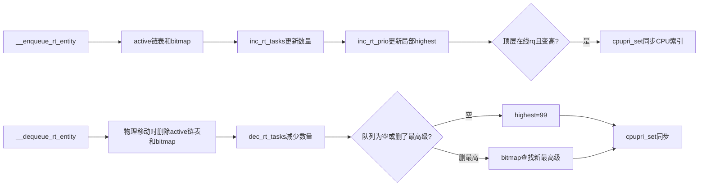

# `inc_rt_prio()` / `dec_rt_prio()` RT 最高优先级缓存维护详解

> 源码基线：Linux 7.2-rc6，源码树 `E:\work\kernel\linux`  
> 源码位置：`inc_rt_prio()`：`kernel/sched/rt.c:1079-1088`；`dec_rt_prio()`：`kernel/sched/rt.c:1090-1115`  
> 一句话职责：维护 `rt_rq->highest_prio.curr`这个“本 RT 队列最高有效优先级”缓存，并在顶层队列变化时同步 root-domain `cpupri`索引。

---

## 一、大白话总览

### （a）先纠正“优先级计数”这个说法

`inc_rt_prio()`名字容易让人以为它在给某个优先级的计数器加一，但函数里没有任何计数器。真正的数量更新发生在外层：

```c
rt_rq->rt_nr_running += rt_se_nr_running(rt_se);
rt_rq->rr_nr_running += rt_se_rr_nr_running(rt_se);
inc_rt_prio(rt_rq, prio);
```

因此更准确地说：

```text
inc/dec_rt_tasks() 维护数量
inc/dec_rt_prio()  维护最高优先级缓存与SMP CPU优先级索引
```

### （b）如果让我自己设计

#### 1. 一句话降级

它们维护一张“本队列最紧急任务是多少级”的便签：加入更紧急实体时直接改小；移走最紧急实体时扫描位图重算。

#### 2. 最小模型

```text
当前 highest = 20

加入 prio=10 → min(20,10)=10
加入 prio=30 → 仍为10
移走 prio=30 → 仍为10
移走 prio=10 → 从bitmap找下一位，例如20
队列变空      → sentinel 99
```

输入是 `rt_rq`和发生增减的实体有效优先级；输出体现在缓存与 `cpupri`中，没有函数返回值。

#### 3. 核心数据对象

| 对象 | 角色 |
|---|---|
| `rt_rq->active.bitmap` | 真实非空优先级目录；删除最高实体时用它重算 |
| `rt_rq->highest_prio.curr` | 热路径缓存，数值越小代表越高优先级 |
| `rt_rq->rt_nr_running` | 该层包含的 runnable叶子任务数，由外层先更新 |
| `sched_rt_entity` | 可能代表一个任务，也可能代表整个子 RT group |
| `rq->rd->cpupri` | root-domain中“各 CPU当前最高优先级”的反向查找索引 |
| `MAX_RT_PRIO-1` | 99；顶层没有普通 RT任务时映射为 `CPUPRI_NORMAL` |

#### 4. 真实复杂度来源

- 内核优先级数值越小越高，比较方向与口语“优先级越高数字越大”相反。
- group实体的有效优先级来自子 `rt_rq->highest_prio.curr`，会随子队列变化。
- `rt_nr_running`对 group实体可能一次增减多个叶子任务，不是实体数。
- 增加时可 O(1)取最小值；删除最高项时不知道次高是谁，必须查询位图。
- 只有顶层 `rq->rt`能代表整颗 CPU，子 group队列不能直接写全局 `cpupri`。
- `cpupri`被其他 CPU并发读取，需要位图、计数和内存屏障协作。

#### 5. 如果自己实现

1. enqueue先把实体挂入 active、设置 bitmap，再增加 `rt_nr_running`。
2. 保存旧 `highest_prio.curr`。
3. 新优先级更高时直接更新缓存。
4. 若是在线 CPU的顶层 RT rq且缓存真的提高，同步 `cpupri`。
5. 物理移动实体的 dequeue先从 active移除并更新 bitmap，再减少运行数；`DEQUEUE_SAVE`一类临时操作可以保留链表位置，由匹配的 re-enqueue恢复账本。
6. 队列为空就写 sentinel；非空且删除的是原最高优先级，查 bitmap重算。
7. 顶层在线 rq的缓存发生变化时同步 `cpupri`。

#### 6. 阅读 checklist

- 调用 `inc/dec_rt_prio()`前，数量和 bitmap分别处于什么状态？
- `prio < prev_prio`为何表示出现了更高优先级？
- 删除非最高实体为何不用重算？
- `WARN_ON(prio < prev_prio)`在防御什么不变量破坏？
- 为什么空队列是 99，而位图搜索的 delimiter是100？
- 为什么子 group的最高优先级不能直接更新 root-domain `cpupri`？

### （c）设计思路

这是典型的“权威结构 + 热路径缓存”设计：active bitmap是事实来源，`highest_prio.curr`是便于调度和跨 CPU查询的缓存。增加时利用单调性快速更新；只有删除当前最优项时才回到位图重算。

### （d）主要情况

| 操作/条件 | 动作 |
|---|---|
| 加入的 `prio < prev_prio` | 缓存改成新 prio，并可能同步 cpupri |
| 加入的 prio不更高 | 缓存不变，cpupri也不变 |
| 删除后仍有任务，且删的是原最高级 | `sched_find_first_bit()`重算 |
| 删除后仍有任务，但删的不是最高级 | 缓存保持 |
| 删除后为空 | 缓存设为99，顶层 CPU映射为 NORMAL |
| 子 group `rt_rq` | 更新局部缓存，不直接更新全局 cpupri |

---

## 二、控制流骨架

### 2.1 `inc_rt_prio()`

```text
保存 prev_prio
│
├─ [新 prio 数值更小]
│    └─ highest_prio.curr = prio
│
└─ inc_rt_prio_smp()
     ├─ [不是顶层rt_rq] return
     ├─ [CPU离线]跳过
     └─ [优先级确实提高] cpupri_set()
```

### 2.2 `dec_rt_prio()`

```text
保存 prev_prio
│
├─ [删除后 rt_nr_running > 0]
│    ├─ [prio < prev_prio] WARN_ON：缓存不变量已损坏
│    └─ [删除的是原最高优先级]
│         └─ 从active.bitmap寻找新的第一个置位
│
├─ [删除后队列为空]
│    └─ highest_prio.curr = 99
│
└─ dec_rt_prio_smp()
     └─ 顶层在线rq且缓存改变时更新cpupri
```

---

## 三、Mermaid：权威位图、缓存与 cpupri



---

## 四、宏观定位与调用链

```text
enqueue_task_rt()
  └── enqueue_rt_entity()
        └── __enqueue_rt_entity()              // rt.c:1331
              └── inc_rt_tasks()               // rt.c:1174
                    └── inc_rt_prio()           // rt.c:1079
                          └── inc_rt_prio_smp()
                                └── cpupri_set()

dequeue_task_rt()
  └── dequeue_rt_entity()/dequeue_rt_stack()
        └── __dequeue_rt_entity()               // rt.c:1365
              └── dec_rt_tasks()                // rt.c:1187
                    └── dec_rt_prio()            // rt.c:1090
                          ├── sched_find_first_bit()
                          └── dec_rt_prio_smp()
                                └── cpupri_set()
```

此外，RT group被节流/解除节流时也会沿 `sched_rt_rq_dequeue/enqueue()`重建父层实体，最终触发同一套缓存维护。

如果缓存错误，本地 pick和 group实体优先级判断会得到错误结果；若 `cpupri`不同步，RT push/pull可能选错目标 CPU或错失迁移机会。

---

## 五、关键上下文：数量在外层维护

```c
static inline void inc_rt_tasks(struct sched_rt_entity *rt_se,
				struct rt_rq *rt_rq)
{
	int prio = rt_se_prio(rt_se);

	WARN_ON(!rt_prio(prio));
	rt_rq->rt_nr_running += rt_se_nr_running(rt_se);
	rt_rq->rr_nr_running += rt_se_rr_nr_running(rt_se);
	inc_rt_prio(rt_rq, prio);
	inc_rt_group(rt_se, rt_rq);
}
```

`rt_se_nr_running()`对叶子任务返回1；对 group实体返回子 `group_rq->rt_nr_running`。所以 `rt_nr_running`统计的是这一层代表的叶子 runnable总量，而不是链表节点数。

dequeue侧先减数量，再调用 `dec_rt_prio()`：

```c
rt_rq->rt_nr_running -= rt_se_nr_running(rt_se);
rt_rq->rr_nr_running -= rt_se_rr_nr_running(rt_se);
dec_rt_prio(rt_rq, rt_se_prio(rt_se));
```

这正是 `dec_rt_prio()`能直接用 `rt_nr_running == 0`判断“删除后为空”的原因。

---

## 六、逐行详解

### 6.1 `inc_rt_prio()`

```c
int prev_prio = rt_rq->highest_prio.curr;
```

保存旧值既用于比较，也传给 SMP helper判断是否真的发生了 CPU最高优先级变化。

```c
if (prio < prev_prio)
	rt_rq->highest_prio.curr = prio;
```

内核 RT优先级数值越小越紧急。enqueue只能让“最高优先级”保持或变高，不可能变低，所以 O(1)取较小值即可。

```c
inc_rt_prio_smp(rt_rq, prio, prev_prio);
```

SMP helper只允许顶层 `&rq->rt`更新 root-domain索引：

```c
if (CONFIG_RT_GROUP_SCHED && &rq->rt != rt_rq)
	return;
if (rq->online && prio < prev_prio)
	cpupri_set(..., prio);
```

子 group只代表 CPU整体 RT树的一部分，不能覆盖整个 CPU的最高优先级。

### 6.2 `dec_rt_prio()`

```c
int prev_prio = rt_rq->highest_prio.curr;

if (rt_rq->rt_nr_running) {
```

这里看到的是外层已经减完后的数量。

```c
	WARN_ON(prio < prev_prio);
```

如果正在删除的实体比缓存记录的最高优先级还高，说明缓存早已漏掉一个更紧急实体，链表/位图/缓存不变量出现错误。警告后仍继续尽量恢复状态。

```c
	if (prio == prev_prio) {
		struct rt_prio_array *array = &rt_rq->active;
		rt_rq->highest_prio.curr =
			sched_find_first_bit(array->bitmap);
	}
```

删除非最高级不会改变最高级。只有删掉原最高级时，才查询 active bitmap。普通物理出队已经由 `__delist_rt_entity()`更新 bitmap，因此第一个置位就是数值最小、优先级最高的剩余队列。若 `move_entity(flags)`为假，源码有意保留 `on_list`和 bitmap位置，用于紧接着的匹配 re-enqueue；这段临时不一致只存在于 rq锁保护的调度属性修改事务中。

```c
} else {
	rt_rq->highest_prio.curr = MAX_RT_PRIO-1;
}
```

普通用户 RT优先级1..99映射为内核98..0；99因此可表示“没有普通 RT工作”，在 `cpupri.convert_prio()`中映射为 `CPUPRI_NORMAL`。位图另有第100位 delimiter，服务于无分支位搜索，两者用途不同。

```c
dec_rt_prio_smp(rt_rq, prio, prev_prio);
```

顶层、在线且缓存确实改变时才调用 `cpupri_set()`。删除同优先级的一个实体但仍有同级实体时，bitmap重算结果不变，因此不产生全局写入。

---

## 七、`cpupri_set()`为何需要内存屏障

`cpupri`用每优先级 CPU mask加计数器支持跨 CPU快速查询。更新到新优先级时先加入新桶，再移出旧桶，避免查询者在中间瞬间完全看不到该 CPU：

```text
新桶：set mask → write barrier → count++
                         ↓
旧桶：count-- → barrier → clear mask
```

这允许无全局大锁的并发近似查询。结果可能短暂保守，但不能因为更新顺序让可用 CPU无故消失；后续 pull/push会修正竞态。

---

## 八、总结

```text
inc_rt_prio：新实体可能更优 → O(1)更新最小值
dec_rt_prio：删除最高项后不知道次优 → bitmap重算
inc/dec_rt_prio_smp：只把顶层CPU视图同步到root-domain cpupri
```

它维护的不是“某优先级有几个任务”，而是**局部最高优先级缓存，以及用于全局迁移决策的 CPU优先级索引**。
