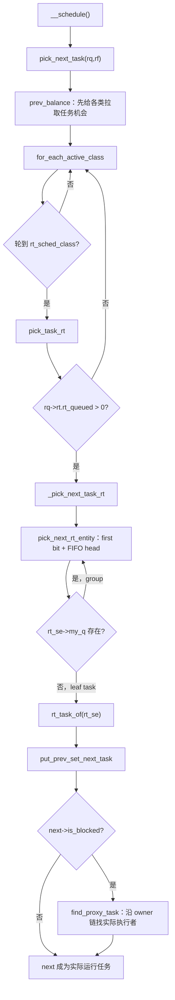

# RT 选任务路径详解：`pick_task_rt()` → `_pick_next_task_rt()` → `pick_next_rt_entity()`

> 源码基线：Linux 7.2-rc6，源码树 `E:\work\kernel\linux`  
> 源码位置：`pick_task_rt()`：`kernel/sched/rt.c:1716-1726`；`_pick_next_task_rt()`：`kernel/sched/rt.c:1701-1714`；`pick_next_rt_entity()`：`kernel/sched/rt.c:1683-1699`  
> 泛型入口：`__schedule()`：`kernel/sched/core.c:7103`；`pick_next_task()`：`kernel/sched/core.c:6236/6712`；`__pick_next_task()`：`kernel/sched/core.c:6144`  
> 一句话职责：核心调度器轮到 RT 调度类时，先判断本 CPU 是否存在可运行 RT 工作，再沿 task-group 层级逐层选择“最高优先级队列的队头实体”，最终把叶子 `sched_rt_entity` 还原成 `task_struct`。

这三个函数属于同一条不可拆开的选择链，因此合并在一个文档中：

```text
pick_task_rt()             调度类边界：RT 有任务吗？
  └── _pick_next_task_rt() 层级下钻：group → group → task
        └── pick_next_rt_entity() 单层选择：位图找最高优先级，FIFO 链表取队头
```

---

## 一、大白话总览

### （a）为什么要设计这条选择链？

CPU 每次调度都要回答两个问题：

1. 在 stop、deadline、RT、fair、ext、idle 等调度类中，哪个类拥有当前最高优先级的候选？
2. 如果轮到 RT 类，在可能存在 task-group 层级的 RT 队列中，最终应该运行哪个具体任务？

RT 的规则不是比较 vruntime，也不是比较绝对 deadline，而是：**数值最小的 RT 内核优先级最高；同优先级内取 FIFO 队头。** 如果开启 RT group scheduling，每一层队列里既可能挂叶子任务，也可能挂代表一个子 group 的实体。因此“一次找位图”只能选出当前层的最佳实体，若它是 group，还要进入其子 `rt_rq` 继续选。

如果没有这条路径，或者位图、链表、group 代表优先级之间失去一致性，调度器可能让低优先级 RT 任务先运行、破坏同优先级 FIFO/RR 顺序、钻进空 group，甚至把一个 group 实体错误地当作 `task_struct` 使用。

### （b）如果让我自己设计它，第一反应是什么？

#### 1. 一句话降级

这条路径就是：**先确认 RT 柜台有人，再从最高优先级抽屉取第一张卡；如果拿到的是子柜台入口，就继续进去取，直到拿到真正的任务卡。**

#### 2. 最小模型

先忽略调度类层级、task group、SMP、core scheduling、proxy execution 和锁，只考虑一个 `rt_rq`：

```text
输入：rt_rq

bitmap:  0 0 1 0 0 1 ...
               ↑
         第一个置位 idx=2

queue[2]: HEAD <-> A <-> B <-> HEAD
                    ↑
             取 queue->next，即 A

输出：A 对应的 task_struct
```

因为内核 RT 优先级“数值越小越高”，位图中第一个置位正好就是最高优先级。链表头的下一个节点是该优先级最先应运行的实体。

#### 3. 核心数据对象

| 对象 | 类比 | 在选择中的角色 |
|---|---|---|
| `rq->rt` / `struct rt_rq` | 本 CPU 的 RT 总柜台 | 最外层选择从这里开始；`rt_queued` 提供快速“是否有可选 RT 工作”判断 |
| `rt_prio_array.active` | 100 格优先级抽屉柜 | 位图定位最高非空抽屉，`queue[idx]` 保存该优先级的 FIFO 实体 |
| `sched_rt_entity` | 候选卡 | 可能代表一个任务，也可能代表一个 RT task group |
| `rt_se->my_q` | 卡片背后的子柜台 | 非空表示当前实体是 group，需要进入其子 `rt_rq` 继续选择 |
| `rt_se->run_list` | 卡片在抽屉中的挂钩 | `list_entry()`用它从链表节点反推出完整 RT 实体 |
| `task_struct` | 最终任务档案 | 下钻到叶子后，用 `container_of(rt_se, task_struct, rt)`还原并返回 |
| `sched_class.pick_task` | 各类统一竞选接口 | 核心按类优先级遍历；RT 回调返回任务或 `NULL` |

#### 4. 真实复杂度从哪里来？

- **调度类优先级**：RT 只在 stop、deadline 没有返回候选后才有机会；RT 返回 `NULL` 后，核心继续 fair/ext/idle。
- **task-group 层级**：选到 group 实体不能直接运行，必须进入 `my_q`，重复位图和 FIFO 选择。
- **队列不变量**：`rt_queued`、`rt_nr_running`、bitmap、queue 和 group 实体必须由 enqueue/dequeue/throttle 路径提前维护一致；pick 热路径不重新校验所有账本。
- **运行队列锁**：选择发生在 rq 锁内，因此位图和链表可使用非原子操作；不能为了“保险”在内部再加一把锁。
- **负载均衡**：RT pull 可能释放并重新获取 rq 锁，所以放在 `balance_rt()`，由核心的 `prev_balance()`在正式 pick 前调用，而不是塞进短小的 `pick_task_rt()`。
- **core scheduling**：启用 SMT core cookie 后，本地 RT 最优候选仍可能因 cookie 不匹配而被替换成匹配任务或 idle。
- **proxy execution**：pick 链可能选出一个被 mutex 阻塞但仍留在 rq 上的 RT donor；`__schedule()`随后再沿 owner 链决定实际运行者。

#### 5. 如果自己实现，大概步骤

1. 核心层先完成上一调度类的 balance，让高优先级类有机会从别的 CPU 拉入任务。
2. 按调度类优先级调用各自 `pick_task()`；轮到 RT 时检查 `rq->rt.rt_queued`。
3. 从 `&rq->rt` 开始，在当前层位图中找第一个置位。
4. 验证下标不是 delimiter，验证位图指向的链表确实非空。
5. 取同优先级 FIFO 链表的队头 `sched_rt_entity`。
6. 若实体拥有 `my_q`，把当前队列换成该子队列并继续循环。
7. 若没有 `my_q`，确认它是叶子任务实体，用 `container_of()`还原 `task_struct`。
8. 核心层消费结果：调用 `put_prev_set_next_task()`；若是 blocked donor，再交给 `find_proxy_task()`寻找实际 owner。
9. `set_next_task_rt()`记录执行起点、结束等待统计，并从 pushable 表移除正在运行的任务。

#### 6. 源码阅读 checklist

- “最高优先级”是数值最大还是最小？
- bitmap 的 delimiter 位为什么不会成为合法结果？
- 位图置位但链表为空意味着什么不变量被破坏？
- 当前 `rt_se` 是 task 还是 group，代码在哪里区分？
- 循环为什么保证最终能落到叶子，而不是无限下钻？
- throttled group 为什么无需在 pick 循环里再次检查？
- `pick_task_rt()` 为什么接收 `rq_flags *rf` 却不使用？
- 返回候选后是否立即从 active 队列删除？
- 返回的 task 一定是实际 `rq->curr` 吗，还是可能只是 proxy donor？

### （c）它是怎么设计的？

设计者把“选择 RT 任务”拆成三个粒度：

- `pick_next_rt_entity()`只懂一个 `rt_rq`：位图找优先级，链表取队头。
- `_pick_next_task_rt()`只懂层级：反复调用单层选择，并用 `group_rt_rq()`判断是否继续进入子队列。
- `pick_task_rt()`只懂调度类协议：快速判断 RT 类是否 runnable，返回任务或 `NULL`。

这种拆分让单层选择完全不关心 task group，让层级遍历不关心位图实现，让核心调度器不关心 RT 内部结构。复杂状态由入队、出队、限流路径提前维护，pick 路径只读取稳定索引，因此保持极短。

### （d）它处理哪几种情况？

```text
情况一：本 CPU 没有可调度的 RT 工作
  → 做：pick_task_rt() 返回 NULL
  → 为什么：核心应继续询问 fair/ext/idle 等更低调度类

情况二：没有 RT group，或当前最高实体就是叶子任务
  → 做：一次 pick_next_rt_entity() 后 group_rt_rq() 返回 NULL，直接 rt_task_of()
  → 为什么：已经取得具体任务，无需额外层级遍历

情况三：当前最高实体代表 RT task group
  → 做：进入 rt_se->my_q，继续从子队列选择最高优先级队头
  → 为什么：group 实体只是父队列中的代表，不能被 CPU 直接执行

情况四：bitmap 的第一个置位是 delimiter（idx >= MAX_RT_PRIO）
  → 做：BUG_ON，内核报告不可恢复的队列不变量错误
  → 为什么：调用者声称 RT runnable，但 active 中没有合法优先级实体

情况五：bitmap 说某优先级非空，但对应 queue 为空
  → 做：WARN_ON_ONCE 并返回 NULL，逐层传播到 pick_task_rt
  → 为什么：这说明位图/链表不同步；先告警，同时避免对空链表执行 list_entry

情况六：选出的 RT 任务是 proxy-exec blocked donor
  → 做：pick 链仍返回它；__schedule() 设置 rq->donor 后调用 find_proxy_task()
  → 为什么：RT 优先级属于 donor，真正 CPU 执行权沿 mutex owner 链传递

情况七：启用 core scheduling 且 RT 候选 cookie 不匹配 SMT 兄弟
  → 做：核心层寻找匹配 cookie 的候选，找不到则让线程 idle
  → 为什么：同一物理核兄弟线程必须满足 core-cookie 隔离约束
```

---

## 二、控制流骨架

### 1. `pick_task_rt()`

```text
pick_task_rt(rq, rf)
│
├─ [!sched_rt_runnable(rq)]
│    └─ 做：return NULL
│           原因：rq->rt.rt_queued == 0，交给更低调度类
│
├─ p = _pick_next_task_rt(rq)
│
└─ return p
     ├─ 正常：具体 RT task
     └─ 异常防御：下层检测到位图/链表不一致时可能为 NULL
```

### 2. `_pick_next_task_rt()`

```text
_pick_next_task_rt(rq)
│
├─ rt_rq = &rq->rt
│
├─ 【do-while 循环：至少执行一次】
│    ├─ rt_se = pick_next_rt_entity(rt_rq)
│    ├─ [rt_se == NULL]
│    │    └─ 做：return NULL
│    │           原因：当前层位图/链表不一致，不能继续下钻
│    ├─ rt_rq = group_rt_rq(rt_se)
│    ├─ [rt_rq != NULL]
│    │    └─ 做：当前实体是 group，continue 进入子队列
│    └─ [rt_rq == NULL]
│         └─ 做：当前实体是叶子，退出循环
│
└─ return rt_task_of(rt_se)
     └─ 从内嵌 p->rt 反推出 task_struct
```

### 3. `pick_next_rt_entity()`

```text
pick_next_rt_entity(rt_rq)
│
├─ array = &rt_rq->active
├─ idx = sched_find_first_bit(array->bitmap)
│
├─ [idx >= MAX_RT_PRIO]
│    └─ BUG_ON：只命中 delimiter，说明 runnable/active 不一致
│
├─ queue = &array->queue[idx]
│
├─ [queue 为空]
│    └─ WARN_ON_ONCE → return NULL
│       原因：bitmap 置位但链表为空，避免空链表 container_of
│
├─ next = list_entry(queue->next, sched_rt_entity, run_list)
│    └─ 取该优先级 FIFO 队头实体
│
└─ return next
```

### 4. 核心调度器外围

```text
__pick_next_task(rq, rf)
│
├─ [纯 fair 快路径成立]
│    ├─ pick_task_fair()
│    ├─ [RETRY_TASK] → goto restart
│    └─ 选 fair/idle，put_prev_set_next_task() → return
│
└─ restart:
     ├─ prev_balance(rq, rf)
     │    └─ 【按活动调度类遍历 balance】
     │         └─ 某类确认本级或更高级已有 runnable → break
     └─ 【for_each_active_class】stop → dl → rt → fair → ext → idle
          ├─ p = class->pick_task(rq, rf)
          ├─ [p == RETRY_TASK] → goto restart
          ├─ [p != NULL] → put_prev_set_next_task() → return p
          └─ [p == NULL] → continue，询问下一调度类

最终若所有类都返回 NULL
└─ BUG：idle 类本应永远有任务
```

---

## 三、Mermaid 图示



对象层级：

```mermaid
flowchart LR
    RQ["rq->rt 顶层 rt_rq"] --> A["active.bitmap + queue[]"]
    A --> G1["group sched_rt_entity"]
    G1 --> Q1["my_q: group 子 rt_rq"]
    Q1 --> A1["子 active.bitmap + queue[]"]
    A1 --> G2["更深 group 实体"]
    G2 --> Q2["my_q"]
    Q2 --> T["task sched_rt_entity"]
    T --> P["container_of → task_struct"]
```



---

## 四、快速定位

- **子系统**：`kernel/sched` 调度器 RT 调度类，服务 `SCHED_FIFO` 和 `SCHED_RR`。
- **类回调**：`pick_task_rt()`，`kernel/sched/rt.c:1716`。
- **层级循环**：`_pick_next_task_rt()`，`kernel/sched/rt.c:1701`。
- **单层最高优先级选择**：`pick_next_rt_entity()`，`kernel/sched/rt.c:1683`。
- **回调注册**：`DEFINE_SCHED_CLASS(rt)` 的 `.pick_task = pick_task_rt`，`kernel/sched/rt.c:2609`。
- **核心间接调用点**：`__pick_next_task()` 中 `class->pick_task(rq, rf)`，`kernel/sched/core.c:6181`；core-scheduling 辅助 `pick_task()` 中同类调用位于 `core.c:6224`。
- **关键结构**：`rt_prio_array`：`kernel/sched/sched.h:311`；`rt_rq`：`sched.h:864`；`sched_rt_entity`：`include/linux/sched.h:621`；`sched_class`：`sched.h:2624`。

---

## 五、宏观地位分析

### （a）所属层次

```text
┌──────────────────────────────────────────────────────────────────────┐
│ 调度触发                                                             │
│ 主动 schedule / 抢占 / 中断返回 / RT mutex 慢路径 / idle 调度       │
└──────────────────────────────┬───────────────────────────────────────┘
                               ▼
┌──────────────────────────────────────────────────────────────────────┐
│ __schedule()                                                         │
│ 持 rq 锁，更新时钟，处理 prev 状态，调用 pick_next_task()            │
└──────────────────────────────┬───────────────────────────────────────┘
                               ▼
┌──────────────────────────────────────────────────────────────────────┐
│ 核心类选择                                                           │
│ __pick_next_task()/pick_task()                                       │
│ stop → deadline → RT → fair → ext → idle                            │
└──────────────────────────────┬───────────────────────────────────────┘
                               ▼
┌──────────────────────────────────────────────────────────────────────┐
│ [这组代码在这里]                                                     │
│ pick_task_rt() → _pick_next_task_rt() → pick_next_rt_entity()        │
└──────────────────────────────┬───────────────────────────────────────┘
                               ▼
┌──────────────────────────────────────────────────────────────────────┐
│ RT 数据层                                                            │
│ rt_queued → rt_prio_array.bitmap → queue[idx] → group my_q → task   │
└──────────────────────────────┬───────────────────────────────────────┘
                               ▼
┌──────────────────────────────────────────────────────────────────────┐
│ 结果消费                                                             │
│ put_prev_set_next_task() / set_next_task_rt() / proxy owner 解析     │
│ 最终由 context_switch() 更新 rq->curr                                │
└──────────────────────────────────────────────────────────────────────┘
```

### （b）真实触发场景

1. **当任务主动调用 `schedule()` 等待事件时**：`schedule()` → `__schedule_loop()` → `__schedule()`（`core.c:7103`）→ `pick_next_task()` → 调度类遍历 → `pick_task_rt()`。如果 rq 上存在比 fair 更高的 RT 候选，RT 路径返回它。
2. **当高优先级 RT 任务唤醒并设置 need-resched，随后发生抢占调度时**：`preempt_schedule()` → `preempt_schedule_common()` → `__schedule()` → `pick_next_task()` → `pick_task_rt()`。选择链通过位图直接找到最高 RT 优先级，无需遍历所有任务。
3. **当中断退出发现需要抢占时**：`preempt_schedule_irq()` → `__schedule()` → `pick_next_task()` → RT 回调。此时 rq 锁和中断状态由核心建立，RT pick 内不再单独加锁。
4. **当 PREEMPT_RT 锁慢路径需要调度时**：`schedule_rtlock()` 或 `rt_mutex_schedule()` → `__schedule()` → `pick_next_task()` → `pick_task_rt()`；若选出的 donor 本身被 mutex 阻塞，proxy-exec 再沿 owner 链寻找实际执行任务。

### （c）解决什么问题？

这条链用三层 O(1)/O(层级深度) 查询代替全 rq 扫描：

```text
调度类选择：按固定类优先级顺序，类数固定
单层 RT 选择：固定大小位图 + FIFO 表头，O(1)
group 下钻：O(RT task-group 深度)
```

它保证：

- stop/deadline 优先于 RT，RT 优先于 fair/ext/idle；
- RT 内部严格选择数值最小的优先级；
- 同优先级遵循链表队头顺序；
- task group 只作为层级代表，最终返回可执行的叶子任务；
- 选择热路径不扫描所有 RT 任务。

---

## 六、完整调用链路

### （a）向上：从调度事件到 RT pick

`pick_task_rt()`通过 `sched_class.pick_task` 间接调用，因此普通 `call_chain_up(pick_task_rt)`只返回函数本身。kernel-graph 的间接调用查询确认了注册点 `rt.c:2609`，并给出 `__pick_next_task()`、`pick_task()`和 core-scheduling `pick_next_task()`中的函数指针调用点。

```text
普通调度路径
schedule()/preempt_schedule()/preempt_schedule_irq()/schedule_rtlock()
  └── __schedule()                              // kernel/sched/core.c:7103
        └── pick_next_task()                    // core.c:6236 或 6712
              └── __pick_next_task()            // core.c:6144
                    ├── prev_balance()
                    └── for_each_active_class
                          └── class->pick_task(rq, rf)
                                └── [pick_task_rt()]       // rt.c:1716
                                      └── [_pick_next_task_rt()] // rt.c:1701
                                            └── [pick_next_rt_entity()] // rt.c:1683

启用 core scheduling 的路径
__schedule()
  └── pick_next_task()                          // core.c:6236
        ├── [未启用 core] → __pick_next_task()
        ├── [无 cookie 快路径] → pick_task()    // core.c:6216
        │                           └── class->pick_task()
        │                                 └── [pick_task_rt()]
        └── [需要 SMT 同步]
              └── 对每个 sibling rq 调用 pick_task()
                    └── class->pick_task()
                          └── [pick_task_rt()]
```

### （b）向下：RT 三层执行链

```text
[pick_task_rt()]                                // kernel/sched/rt.c:1716
  ├── sched_rt_runnable()                       // sched.h:2888，读取 rq->rt.rt_queued
  └── _pick_next_task_rt()                      // rt.c:1701
        ├── pick_next_rt_entity()               // rt.c:1683，每一层调用一次
        │     ├── sched_find_first_bit()         // asm-generic/bitops/sched.h:13
        │     │     └── __ffs()                  // 找机器字中最低置位
        │     ├── BUG_ON(idx >= MAX_RT_PRIO)     // 捕捉空 active/哨兵命中
        │     ├── WARN_ON_ONCE(list_empty())     // 捕捉 bitmap/queue 不一致
        │     └── list_entry(queue->next, ..., run_list)
        ├── group_rt_rq()                       // 有 group 时返回 rt_se->my_q，否则 NULL
        └── rt_task_of()                        // container_of(rt_se, task_struct, rt)
```

选择结果的后续消费：

```text
pick_task_rt() 返回 p
  └── put_prev_set_next_task(rq, rq->donor, p)  // sched.h:2797
        ├── prev_class->put_prev_task()
        └── p->sched_class->set_next_task()
              └── set_next_task_rt()            // rt.c:1657
                    ├── 记录 exec_start
                    ├── 结束 wait 统计
                    ├── dequeue_pushable_task()  // 正在运行者不能被 push
                    └── 必要时排队 RT push balance

随后 __schedule()
  ├── rq_set_donor(rq, p)
  ├── [p->is_blocked] → find_proxy_task()        // core.c:6912
  └── context_switch() 最终设置实际 rq->curr
```

---

## 七、关键结构与字段

### 1. `struct rt_prio_array`

```c
struct rt_prio_array {
	DECLARE_BITMAP(bitmap, MAX_RT_PRIO+1);
	struct list_head queue[MAX_RT_PRIO];
};
```

| 字段 | 谁写 | 谁读 | 不变量 |
|---|---|---|---|
| `bitmap` | RT enqueue/delist/init | `pick_next_rt_entity()` | 合法优先级 `i` 置位，当且仅当 `queue[i]` 非空；`MAX_RT_PRIO` delimiter 永远置位 |
| `queue[i]` | `__enqueue_rt_entity()`、`__delist_rt_entity()`、requeue | `pick_next_rt_entity()` | `queue[i].next` 是该优先级下一位应运行实体 |

`MAX_RT_PRIO` 为 100；合法内核 RT 优先级是 0..99，数值越小优先级越高。

### 2. `struct rt_rq`

| 字段 | 选择路径中的角色 |
|---|---|
| `active` | 当前层的位图和优先级 FIFO 队列 |
| `rt_nr_running` | 当前 rt_rq 包含的可运行 RT 叶子数量，主要由维护路径使用 |
| `highest_prio.curr` | 当前最高 RT 优先级缓存；group 实体通过它决定自己在父队列的优先级 |
| `rt_queued` | 顶层是否作为可运行 RT 工作登记到 CPU rq；`sched_rt_runnable()`只读它 |
| `rt_throttled` | RT bandwidth 限流状态；被 throttle 的队列不会被登记/挂到可选择路径 |
| `pushable_tasks` | 跨 CPU 均衡候选，与本地 pick 使用的 `active` 是两套容器 |

`sched_rt_runnable()`不是检查 `rt_nr_running`：

```c
return rq->rt.rt_queued > 0;
```

因为“存在 RT 实体”和“当前允许调度 RT 实体”不同。顶层可能因 bandwidth throttle 而拥有任务却不能参与选择；`rt_queued`已经把数量和 throttle 结果折叠成一个快速门控状态。

### 3. `struct sched_rt_entity`

| 字段 | 选择路径中的意义 |
|---|---|
| `run_list` | 链接到当前层 `queue[prio]`；`list_entry()`由它反推实体 |
| `on_rq/on_list` | 由维护路径保证实体逻辑在队且物理挂链；pick 只消费该不变量 |
| `parent` | 入队/出队沿祖先方向维护层级；pick 不沿 parent 向上走 |
| `my_q` | pick 向下钻的唯一入口；非 NULL 表示 group，NULL 表示叶子 task |
| `rt_rq` | 该实体挂入的父级 rt_rq；选择过程不需要它，因为当前 rt_rq 已明确 |

### 4. `struct sched_class`

```c
struct task_struct *(*pick_task)(struct rq *rq, struct rq_flags *rf);
```

`pick_task_rt()`遵守统一 ABI。`rf` 在 RT pick 本体中没有使用，但不能从签名删除：fair/ext 等类可能在选择或 balance 过程中需要 rq lock pin/unpin 状态，核心必须以同一接口调用所有类。

### 5. `struct rq`

| 字段 | 作用 |
|---|---|
| `rq->rt` | RT 顶层选择起点 |
| `rq->__lock` | 保护选择期间 bitmap、链表、实体和 runnable 状态的一致快照 |
| `rq->donor` | 当前提供调度优先级的任务；proxy execution 下可能不同于 `rq->curr` |
| `rq->curr` | 实际正在 CPU 上执行的任务 |
| `rq->nr_running` / `rq->cfs.h_nr_queued` | 核心用于判断是否可以走“纯 fair”选择快路径 |
| `rq->dl_server` | 每次核心 pick 前清零，由 deadline server 路径按需设置；RT pick 不使用 |

---

## 八、逐行详解

### 1. `pick_next_rt_entity()`：单层选择原语

```c
static struct sched_rt_entity *pick_next_rt_entity(struct rt_rq *rt_rq)
{
	struct rt_prio_array *array = &rt_rq->active;
	struct sched_rt_entity *next = NULL;
	struct list_head *queue;
	int idx;

	idx = sched_find_first_bit(array->bitmap);
	BUG_ON(idx >= MAX_RT_PRIO);

	queue = array->queue + idx;
	if (WARN_ON_ONCE(list_empty(queue)))
		return NULL;
	next = list_entry(queue->next, struct sched_rt_entity, run_list);

	return next;
}
```

#### `array = &rt_rq->active`

固定本次单层选择的数据源。无论 `rt_rq` 是 CPU 顶层还是某 task-group 的子队列，都使用相同的 `rt_prio_array` 算法。

#### `next = NULL`

为异常防御路径准备。正常情况下，只要调用者保证当前 `rt_rq` 可选，函数一定返回实体。

#### `idx = sched_find_first_bit(array->bitmap)`

不是泛化的任意长度 bitmap 扫描，而是针对调度优先级位图优化的固定机器字检查：64 位系统检查两个 word，32 位系统最多检查四个 word，然后对第一个非零 word 使用 `__ffs()`。

因为位号和内核优先级同向，并且数值越小越高，所以“最低置位”就是“最高优先级”。复杂度与任务数量无关。

#### `BUG_ON(idx >= MAX_RT_PRIO)`

`init_rt_rq()`会清空 0..99 位，再永久设置 bit 100 作为 delimiter。因此 bitmap 永远能让 `sched_find_first_bit()`找到某一位：

```text
有任务：返回 0..99 中第一个置位
无任务：返回 delimiter 100
```

调用 pick 时若只找到 100，说明上层 `rt_queued`或 group 实体声称该队列可运行，但实际 active 已空。这是内部不变量破坏，不能当成普通“没任务”，所以使用 `BUG_ON`。

#### `queue = array->queue + idx`

等价于 `&array->queue[idx]`。此时 idx 已由 BUG_ON 保证落在 0..99，不会访问 delimiter 对应的不存在链表。

#### `WARN_ON_ONCE(list_empty(queue))`

这是第二层一致性检查：bitmap 对应位已置位，但链表却为空。与 delimiter 情况不同，它通常意味着具体优先级的 set/clear-bit 与 list add/del 没有同步。

使用 `WARN_ON_ONCE`避免持续刷屏，并返回 `NULL`阻止下一句对空链表头做 `container_of`。

#### `list_entry(queue->next, ..., run_list)`

`queue->next`是同优先级 FIFO 队头的 `run_list`。`list_entry()`通过成员偏移还原整个 `sched_rt_entity`。

这里没有从链表删除实体：**pick 只选择，不出队。** RT 当前任务仍属于 active 队列；真正开始运行时，`set_next_task_rt()`只把它从 pushable 表移除。

### 2. `_pick_next_task_rt()`：沿 group 层级下钻

```c
static struct task_struct *_pick_next_task_rt(struct rq *rq)
{
	struct sched_rt_entity *rt_se;
	struct rt_rq *rt_rq  = &rq->rt;

	do {
		rt_se = pick_next_rt_entity(rt_rq);
		if (unlikely(!rt_se))
			return NULL;
		rt_rq = group_rt_rq(rt_se);
	} while (rt_rq);

	return rt_task_of(rt_se);
}
```

#### `rt_rq = &rq->rt`

总是从 CPU 顶层 RT 队列开始，不能直接从某个 task group 开始，否则会绕过父级之间的优先级竞争和 bandwidth 可运行状态。

#### `do { ... } while (rt_rq)`

使用 do-while 是因为顶层至少要选一次。每轮完成两个动作：

1. 从当前层选最高优先级 FIFO 队头实体；
2. 问该实体是否拥有子 `rt_rq`。

开启 `CONFIG_RT_GROUP_SCHED` 时：

```c
return rt_se->my_q;
```

关闭时：

```c
return NULL;
```

所以非 group 配置天然只循环一次，不需要在主逻辑中散布 `#ifdef`。

#### `if (unlikely(!rt_se)) return NULL`

正常不变量下不应发生；它只承接 `pick_next_rt_entity()`发现 bitmap/queue 不一致后的防御性返回。标记 `unlikely`让正常下钻保持直线热路径。

#### 为什么 group 下钻能选到全局正确的 RT 任务？

每个 group 实体在父队列中的优先级，由 `rt_se_prio()`返回其子 `rt_rq->highest_prio.curr`。enqueue/dequeue 在子队列最高优先级变化时会摘下并重挂祖先。因此：

```text
父层选出的最佳 group
  = 所有同层 group 中，内部最高 RT 优先级最好的 group

进入该 group 再选
  = 该 group 内最高优先级、FIFO 最靠前的实体
```

逐层保持这个不变量，最终叶子就是当前层级约束下正确的 RT 候选。

#### `return rt_task_of(rt_se)`

循环退出意味着 `group_rt_rq(rt_se) == NULL`，正常情况下它必须是叶子任务实体。开启 group 调度时，`rt_task_of()`先用 `WARN_ON_ONCE(!rt_entity_is_task(rt_se))`验证，再执行：

```c
container_of(rt_se, struct task_struct, rt)
```

这依赖 `sched_rt_entity rt`直接内嵌在 `task_struct` 中，不需要哈希表、映射表或额外指针。

### 3. `pick_task_rt()`：调度类回调

```c
static struct task_struct *pick_task_rt(struct rq *rq, struct rq_flags *rf)
{
	struct task_struct *p;

	if (!sched_rt_runnable(rq))
		return NULL;

	p = _pick_next_task_rt(rq);

	return p;
}
```

#### `if (!sched_rt_runnable(rq)) return NULL`

快速读取 `rq->rt.rt_queued`。返回 `NULL`不是错误，而是调度类协议中的“RT 本轮没有候选”，核心会继续遍历更低类。

它不直接检查 bitmap 或 `rt_nr_running`，因为维护路径已经综合处理了：

- 有无 RT 叶子任务；
- RT group 是否为空；
- 顶层是否被 bandwidth throttle；
- 顶层数量是否已计入 `rq->nr_running`。

#### `_pick_next_task_rt(rq)`

将类级判断转换成 RT 内部层级选择。函数名前导下划线表示内部 helper，不是另一个 sched-class 回调。

#### 为什么 `rf` 没被使用？

RT 的选择阶段纯读 rq 锁保护的数据，不需要释放 rq 锁去拉任务。需要跨 CPU 的 `pull_rt_task()`位于 `balance_rt()`：核心 `__pick_next_task()`在正式 class pick 前调用 `prev_balance()`，后者允许 `.balance`回调通过 `rq_unpin_lock()/rq_repin_lock()`安全地临时释放和恢复锁。

因此职责顺序是：

```text
balance_rt()：有必要就从别的 CPU 拉任务
      ↓
pick_task_rt()：只从当前稳定 rq 中选择
```

### 4. 核心层如何给 RT 机会

调度类对象由链接脚本按地址顺序排列：

```text
stop → deadline → rt → fair → ext → idle
```

`for_each_active_class()`从最高类向最低类遍历。前面的类一旦返回非 NULL，RT 就不会被调用；RT 返回候选后，fair/ext/idle 不再被询问。

`__pick_next_task()`还有纯 fair 快路径，但其条件要求：

```text
donor 不高于 fair
并且 rq->nr_running == rq->cfs.h_nr_queued
```

只要 rq 上存在已登记的 RT 任务，所有 runnable 就不可能全属于 CFS，这个快路径不成立，代码会进入完整 class 遍历。

### 5. 选择之后：`set_next_task_rt()`

选中并不等于从 active 队列删除。核心调用 `put_prev_set_next_task()`，不同任务时：

```text
prev->sched_class->put_prev_task()
next->sched_class->set_next_task()
```

RT 的 `set_next_task_rt()`：

- 把 `p->se.exec_start`设为当前 rq task clock；
- 若实体仍在 RT rq，结束它的等待统计；
- 无条件从 pushable plist 删除它，因为正在运行的任务不能被普通 push 候选逻辑搬走；
- 若这是一次真正的新 RT class 上机，更新 RT PELT 并排队后续 push balance。

---

## 九、边界条件与关键设计决策

### 1. 为什么不缓存 `highest_prio.curr`后直接取队列？

`highest_prio.curr`主要服务抢占、group 代表优先级和 SMP 判断；pick 使用 bitmap 作为队列内容的直接索引真相。位图搜索固定只有少量机器字，成本稳定，同时能通过 delimiter 检测“声称 runnable 但 active 为空”的严重错误。

### 2. 为什么同优先级取 `queue->next`？

RT 优先级只决定不同级别之间的顺序；同级顺序由 enqueue/requeue 维护。普通入队通常放队尾，SCHED_RR 时间片耗尽时也会轮转到尾部，特殊提升路径可以放队头。pick 只取表头，避免在选择时重新解释每个任务的历史。

### 3. 为什么 `BUG_ON`后还需要 `WARN_ON_ONCE`？

它们检查不同错误：

| 检查 | 表示的问题 |
|---|---|
| `idx >= MAX_RT_PRIO` | 没有任何合法优先级置位，只找到了 delimiter |
| `list_empty(queue)` | 某个合法优先级位已经置位，但对应链表为空 |

前者表示整个可运行判断失真；后者是局部 bitmap/list 不一致，代码还能通过返回 NULL 避免进一步内存破坏。

### 4. 为什么 pick 不检查 `on_rq/on_list`？

这些检查属于修改路径。rq 锁保证 pick 看到稳定快照；若每次选择再遍历验证每个实体，会把热路径从“索引查询”退化成“索引审计”。位图 delimiter、链表非空和 `rt_task_of()`告警已经覆盖关键结构边界。

### 5. 为什么不在循环里检查 throttle？

被 throttle 的 group 不应出现在父级 active 队列；顶层被 throttle 时 `rt_queued`不会置位。限流路径负责摘除/恢复 group 实体，因此 pick 只沿当前可见实体下钻。若在每层重复检查，会增加热路径成本并形成两套可运行性真相。

### 6. “最高优先级实体”有哪些边界？

它不是无条件的全系统最高任务，而是：

```text
当前 CPU
当前可运行、未被 RT bandwidth 隐藏的实体
当前 task-group 层级约束下
当前调度类已经轮到 RT 后
core-cookie 约束尚未做最终过滤前
的最高 RT 优先级 FIFO 队头
```

### 7. core scheduling 会推翻 RT 本地选择吗？

可能。`pick_task_rt()`先给出每个 sibling rq 的本地最佳候选；核心再选出最大优先级候选的 cookie，并要求 SMT 兄弟选择相同 cookie。某个 CPU 的 RT 候选若 cookie 不匹配，核心会尝试 `sched_core_find()`，找不到匹配任务就选择 idle。这是安全隔离约束覆盖本地调度最优性的情况。

### 8. proxy execution 下返回的是谁？

`enqueue_task_rt()`对 blocked proxy task 的特殊之处是：实体仍通过 `enqueue_rt_entity()`挂入 active，保持 `on_rq/on_list`和 RT 优先级可见，但不加入 pushable plist。

因此本条 pick 链完全可能选中它：

```text
pick_task_rt() 返回 blocked RT task
        ↓
__schedule(): rq_set_donor(rq, next)
        ↓
[next->is_blocked]
        ↓
find_proxy_task(rq, donor, rf)
        ↓
沿 blocked_on / mutex owner 链找到实际可运行 owner
        ↓
donor 保留 RT 调度优先级，owner 成为实际执行者 rq->curr
```

若 owner 不在当前 rq、正在迁移或链发生并发变化，`find_proxy_task()`会选择迁移、临时 idle 或返回 NULL，让 `__schedule()`回到 `pick_again`。所以 `_pick_next_task_rt()`只负责“选调度权 donor”，不负责解析 mutex owner 链。

---

## 十、关键概念补充

### 1. delimiter bit

`init_rt_rq()`初始化 100 条合法优先级链表，并额外设置 bit 100：

```text
bitmap[0..99] = 0
bitmap[100]   = 1  // delimiter
```

这样 `sched_find_first_bit()`不需要先判断整张位图是否为零；无任务时自然返回 100，再由 `BUG_ON`验证调用不变量。

### 2. 数值优先级反向

Linux 内核 `p->prio`中，数值越小优先级越高：

```text
prio 0   ：最高 RT 优先级
...
prio 99  ：最低 RT 优先级
prio 100+：普通 fair/batch 范围
```

所以 `__ffs()`找最低置位，语义上正是找最高优先级。

### 3. `container_of()`

`task_struct`内嵌：

```c
struct sched_rt_entity rt;
```

已知 `&p->rt`后，可通过 `offsetof(task_struct, rt)`反向计算 `p`。这让 runqueue 只操作通用 RT 实体，同时叶子处零分配、零查表地恢复任务对象。

### 4. 维护路径与查询路径分离

RT 入队/出队路径承担复杂维护：链表、位图、最高优先级、group 祖先、throttle 和顶层 `rt_queued`。pick 路径因此能压缩成：

```text
读 rt_queued → 找 first bit → 取 list head → 沿 my_q 下钻
```

这是典型的“写路径多做工作，换取读热路径稳定 O(1)”设计。

### 5. donor 与 curr

- `rq->donor`：谁提供调度优先级和调度类语义。
- `rq->curr`：谁真正占用 CPU 执行。

普通情况下二者相同；proxy execution 下 RT pick 选 donor，核心层再解析实际 curr。这也是 7.2-rc6 阅读调度代码时不能再把“pick 返回值”和“最终执行者”永远画等号的原因。

---

## 十一、与 RT 入队、出队路径的闭环

```text
enqueue_task_rt()
  └── __enqueue_rt_entity()
        ├── list_add/list_add_tail 到 queue[prio]
        ├── __set_bit(prio, bitmap)
        ├── on_list/on_rq = 1
        └── 更新 highest_prio 与 rt_queued
                    │
                    ▼
pick_task_rt()
  └── _pick_next_task_rt()
        └── pick_next_rt_entity()
              ├── first bit 找 prio
              └── queue[prio].next 取实体
                    │
                    ▼
set_next_task_rt()
  ├── 记录 exec_start
  └── 从 pushable 删除，但实体仍留在 active
                    │
                    ▼
dequeue_task_rt()
  └── __dequeue_rt_entity()
        ├── list_del_init
        ├── 最后一个实体时 clear_bit
        ├── on_list/on_rq = 0
        └── 修正 highest_prio 与 rt_queued
```

选择正确性不是 pick 函数单独创造的，而是 enqueue/dequeue 始终维护以下契约的结果：

```text
rt_queued 可选
  ⇒ 顶层 active 至少有一个合法置位
  ⇒ first bit 对应链表非空
  ⇒ 队头实体若为 group，其 my_q 也有合法候选
  ⇒ 反复下钻最终到达 task 实体
```

---

## 十二、总结

```text
pick_task_rt()
  解决“RT 类现在有没有候选”

_pick_next_task_rt()
  解决“候选经过多少层 group 才落到叶子任务”

pick_next_rt_entity()
  解决“当前这一层哪个实体优先级最高、同级最靠前”
```

最值得记住的六点：

1. `sched_find_first_bit()`找最低置位，因为 RT 内核优先级数值越小越高。
2. bit 100 是 delimiter，只为保证位搜索始终有结果；pick 命中它就是内部 bug。
3. `queue[idx].next`体现同优先级 FIFO/RR 顺序，pick 本身不移动链表。
4. `group_rt_rq(rt_se)`非 NULL 就进入 `my_q`继续下钻，NULL 才能 `rt_task_of()`。
5. `pick_task_rt()`不做 pull；跨 CPU 平衡已由此前的 `prev_balance()`/`balance_rt()`处理。
6. proxy execution 下，RT pick 返回值可能先成为 donor，最终 `rq->curr`由 `find_proxy_task()`沿 mutex owner 链决定。
