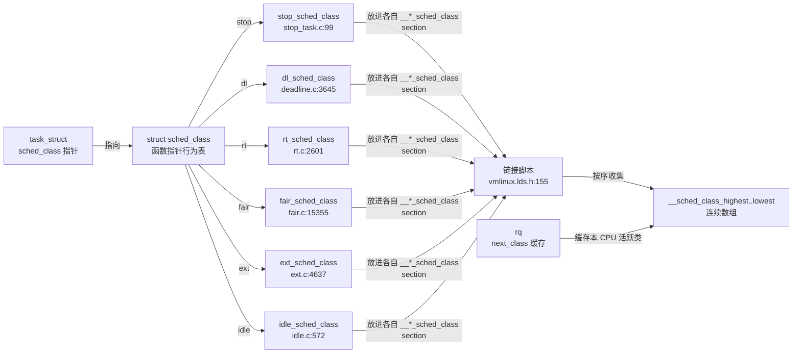
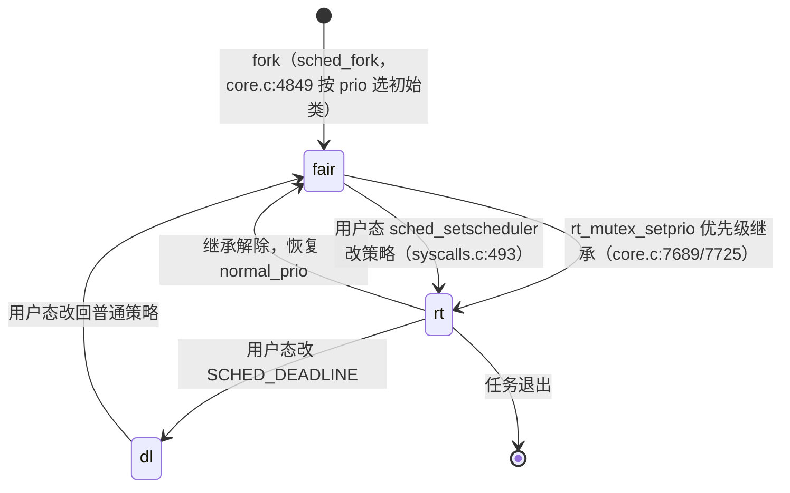

# sched_class 详解 —— C 语言版"抽象基类"：用函数指针结构体解耦调度算法

> 源码位置：`kernel/sched/sched.h:2585`（结构体定义）、`kernel/sched/sched.h:2783`（DEFINE_SCHED_CLASS 宏）、`include/asm-generic/vmlinux.lds.h:155`（链接脚本收集）
> 核心一句话：`sched_class` 是一张"调度行为表"（C 语言的虚函数表），内核只认这张表，不认具体算法；CFS / RT / DL / Stop / Ext / Idle 六种调度算法各自填表，谁跑谁由 `task_struct->sched_class` 这一个指针决定。

---

## 一、大白话总览 + 设计模型

### （a）为什么要设计它？

Linux 调度器要同时支撑好几种"玩法"完全不同的任务：

- **CFS**：大家轮流用 CPU，讲究公平，用一个红黑树按 vruntime 排队；
- **RT**：实时任务，谁优先级高谁先跑，用一个 100 级链表数组排队；
- **DL**：有硬截止时间的任务，按 deadline 排序；
- **Stop**：CPU 热插拔、迁移的专用最高优先级任务；
- **Idle**：CPU 闲着时跑的空任务。

如果没有 `sched_class`，调度核心（`__schedule` / `try_to_wake_up` / `sched_tick`）就得写一堆 `if (policy == SCHED_FIFO) {...} else if (policy == SCHED_DEADLINE) {...} else ...` 的分支，每加一种调度算法就要改调度核心的每一处入口，代码会像藤蔓一样缠死。

更糟的是：**同一个任务可以临时变换身份**（见下文优先级继承），用 if-else 硬编码根本没法表达"一个任务运行到一半换一种调度算法"。

### （b）如果让你自己设计它，第一反应应该是什么？

**1. 一句话降级**
调度器要给各种"任务类型"提供统一动作（入队、选人、时间片、抢占判断……），但每种类型的动作细节都不同。最朴素的方案是：**给每种任务类型填一张"行为表"，调度核心只认这张表，永远通过表去调动作**。

**2. 最小模型**

输入：一个要入队/要挑选/到时间片的任务；核心数据：任务身上挂的"行为表指针"；出口：队列状态更新，或挑出下一个该跑的任务。

```
       任务(tast_struct)
         │  sched_class 指针 ──────► 行为表(struct sched_class)
                                      ├─ enqueue_task 入队方法
        调度核心                        ├─ dequeue_task 出队方法
   __schedule ──► "从行为表找 pick" ──► ├─ pick_task    选下一个方法
         ▲                             ├─ task_tick    时间片方法
         └─────────────────────────────┴─ ... 其它方法
```

调度核心想做什么，就 `行为表->方法()` 调一下，具体是哪种算法它根本不知道。

**3. 核心数据对象**

| 对象 | 角色类比 | 在这件事里扮演的角色 |
|------|---------|---------------------|
| `struct sched_class`（sched.h:2585） | **行为表 / 角色卡** | 把"一种调度算法"抽象成约 28 个函数指针，每种算法填一张表 |
| `task_struct.sched_class`（sched.h:887） | **任务身上的角色戳** | 指向该任务当前所属调度类的行为表，是"运行时多态"的载体 |
| `rq->next_class`（sched.h:1228） | **本 CPU 当前活跃角色的缓存** | 记录本 CPU 下一个该用哪种算法选人，避免每次比较全部任务 |
| `__sched_class_highest[]` ~ `__sched_class_lowest[]` | **全体角色按优先级排好的名单** | 链接脚本按 stop>dl>rt>fair>ext>idle 顺序排列的全局表，决定遍历顺序 |
| `DEFINE_SCHED_CLASS(name)`（sched.h:2783） | **注册仪式** | 把一张行为表登记进全局名单的宏 |

**4. 真实复杂度从哪里来**

- **并发/锁**：每个回调上方都注释了它要求的持锁条件（`rq->lock`、`p->pi_lock` 等），因为调度器是高度并发的。
- **性能优化**：光会"遍历全表选人"还不够，`__pick_next_task` 有快路径（全 CFS 直接调 `pick_task_fair`），`rq->next_class` 缓存避免重复判断。
- **运行期换身份**：优先级继承（`rt_mutex_setprio`）可以把一个普通任务临时"升类"到 RT，跑完再降回来——只改一个指针。
- **核心调度（sched_core）**：`CONFIG_SCHED_CORE` 下同一组任务要跨两个 rq 协同选人，`pick_task` 接口专门为此设计。
- **可扩展性**：`sched_ext`（ext.c）允许用 eBPF 在运行时动态替换调度策略，作为第 5 个类插进来。
- **特殊配置**：`CONFIG_UCLAMP_TASK`、`CONFIG_FAIR_GROUP_SCHED` 给行为表加可选字段。

**5. 如果自己实现，大概步骤**

正常路径：
1. 定义一个行为表结构体，列出所有动作的签名（入队/出队/选人/时间片/抢占……）；
2. 每种任务类型实现一张表，填上自己版本的动作；
3. 任务创建时（`sched_fork`）根据优先级/策略，把 `task->sched_class` 指向对应表；
4. 调度核心所有入口统一调 `task->sched_class->动作(...)`。

特殊分支：
- 策略改变（`__sched_setscheduler`）或优先级被继承（`rt_mutex_setprio`）时，要先把任务从旧类出队，换 `sched_class` 指针，再按新类入队（`DEQUEUE_CLASS` 标志驱动）；
- 新增一种调度算法时，写一个 `xxx.c`，填表，改链接脚本把它的 section 插到合适优先级位置。

要同步维护的：行为表里的计数、任务的 `sched_class` 指针、`rq->next_class` 缓存、全局的 `__sched_class_*` 表（编译期）。

外围副作用：唤醒（`wakeup_preempt`）、重调度标记（`resched_curr`）、负载均衡（`balance`）、CPU 上线/下线（`rq_online`/`rq_offline`）、NUMA 迁移（`migrate_task_rq`）。

**6. 源码阅读 checklist**

读后面的字段定义和调用点时，带着这几个问题：
- 这个回调在哪个入口被调？持什么锁？（每个回调上方的注释）
- 六种调度类各自实现了哪些回调、哪些没实现（置 NULL）？
- 什么时候会换 `sched_class` 指针？换的时候为什么必须出队/入队？
- `rq->next_class` 缓存为什么能省掉比较？
- 为什么优先级比较能退化成指针大小比较？

### （c）它是怎么设计的？

核心设计思路是 **"把调度算法当成一组可插拔的插件，用一张函数指针表做统一接口"**，并且把插件的**优先级排序完全交给链接器**：

1. **行为表 = C 的虚函数表**：`struct sched_class` 全部是函数指针，相当于 C++ 的 vtable。
2. **每个任务持有一个指向自己行为表的指针**（`task->sched_class`），相当于 C++ 对象里的 `vptr`。
3. **实例注册靠 ELF section + 链接脚本**：`DEFINE_SCHED_CLASS(rt)` 宏生成 `rt_sched_class` 并放入名为 `__rt_sched_class` 的特殊 ELF section。链接脚本把这些 section 按优先级顺序排成连续数组：
   ```
   __sched_class_highest = .;
   *(__stop_sched_class)     // 最高优先级
   *(__dl_sched_class)
   *(__rt_sched_class)
   *(__fair_sched_class)
   *(__ext_sched_class)
   *(__idle_sched_class)
   __sched_class_lowest = .;
   ```
   于是"六种算法的优先级顺序"在编译期就固定了，而且**新增调度类不用改任何核心代码**，只需填表 + 在链接脚本插一行。
4. **优先级比较退化成指针比较**：因为数组连续、按序排列，地址小的优先级高，所以 `sched_class_above(a,b) = (a < b)` 直接用指针比大小。

### （d）它处理哪几种情况，每种情况分别做什么？

`struct sched_class` 本身没有"执行路径"，它是一张表。执行路径发生在**使用它的调用点**上。以最典型的三个调用点为例：

```
情况一：任务入队/出队（enqueue_task / dequeue_task，core.c:2172 / 2198）
  → 做：p->sched_class->enqueue_task(rq, p, flags)
  → 为什么：入队动作因算法而异（CFS 插红黑树、RT 挂优先级链表、DL 按 deadline 插树）
           —— 调度核心不知道也不关心，只负责转发，前后包裹 uclamp/psi 等通用统计

情况二：挑选下一个任务（__pick_next_task，core.c:6123）
  → 做：for_each_active_class(class) 从高优先级类往下遍历，调 class->pick_task(rq, rf)，
        第一个非空即选中
  → 为什么：必须保证高优先级算法有任务就先满足它；idle 类总返回任务，所以循环必有结果

情况三：唤醒抢占（wakeup_preempt，core.c:2283）
  → 做：若被唤醒任务所属类 == rq->next_class，调该类的 wakeup_preempt；
        若被唤醒任务所属类优先级更高，调当前 next_class 的 wakeup_preempt 再 resched_curr
  → 为什么：让每种算法自己判断"我该不该抢现在跑的这个任务"（CFS 看 vruntime 差、
           RT 看优先级、DL 看 deadline），抢不抢的规则属于算法自己
```

---

## 二、控制流骨架

### 骨架 1：`__pick_next_task()`（core.c:6123）—— 调度类的核心遍历

```
__pick_next_task(rq, rf)
│
├─ rq->dl_server = NULL                       // 清 DL server 缓存
│
├─ [scx_enabled()]                            // sched_ext 生效时
│     └─ goto restart                         // 走通用路径（不信任快路径）
│
├─ 【优化快路径】!sched_class_above(donor->sched_class, &fair) 且 nr_running == cfs 队列数
│     ├─ p = pick_task_fair(rq, rf)           // 全是 CFS 任务，直接调 CFS 选人
│     │     ├─ [p == RETRY_TASK] → goto restart
│     │     └─ [!p] → p = pick_task_idle(rq, rf)   // fair 空则 fallback 到 idle
│     └─ put_prev_set_next_task(rq, donor, p) // 换人：调 put_prev/set_next 钩子
│           → return p
│
├─ restart:
│   ├─ prev_balance(rq, rf)                   // 选人前先做负载均衡（可能迁移任务）
│   │
│   └─ 【for_each_active_class(class)】从 __sched_class_highest 向下遍历
│         ├─ p = class->pick_task(rq, rf)     // 调每张行为表的选人方法
│         │     ├─ [p == RETRY_TASK] → goto restart   // 类要求重来（如 sched_core 需重新平衡）
│         │     ├─ [p 非空] → put_prev_set_next_task(rq, donor, p); return p
│         │     └─ [p 为空] → 继续下一个类     // 该类没有可运行任务
│         └─ 循环结束 → BUG()                  // idle 类必须总能选到任务
```

### 骨架 2：`wakeup_preempt()`（core.c:2283）—— 唤醒时的"跨类抢占裁决"

```
wakeup_preempt(rq, p, flags)          // p = 被唤醒任务, rq->next_class = 当前活跃类缓存
│
├─ [p->sched_class == rq->next_class]           // 同一类：交给该类自己判断
│     └─ rq->next_class->wakeup_preempt(rq, p, flags)
│
├─ [sched_class_above(p->sched_class, rq->next_class)]  // 更高优先级类醒来了
│     ├─ rq->next_class->wakeup_preempt(rq, p, flags)   // 先让旧类收尾判断
│     ├─ resched_curr(rq)                    // 必然要重调度
│     └─ rq->next_class = p->sched_class     // 更新活跃类缓存
│
└─ [都不满足] → 什么都不做                    // 唤醒一个低类任务，不必打断当前
```

---

## 三、Mermaid 图示

### 图 1：对象关系 —— 行为表、任务、全局名单



### 图 2：任务在调度类之间"换身份"（运行时多态绑定的极致）



---

## 四、快速定位

- **所属子系统**：内核进程调度器（kernel/sched），是所有调度算法（CFS/RT/DL/Stop/Ext/Idle）共同依赖的"接口层"。
- **核心职责一句话**：用一张函数指针表把"调度算法"抽象成可插拔插件，让调度核心（`__schedule` / `try_to_wake_up` / `sched_tick` / `sched_setscheduler`）只依赖接口、不依赖具体实现。
- **源码位置**：`kernel/sched/sched.h:2585`（结构体）、`kernel/sched/sched.h:2783`（DEFINE_SCHED_CLASS 宏）、`include/asm-generic/vmlinux.lds.h:155`（收集 section）、六个实例定义在 `stop_task.c` / `deadline.c` / `rt.c` / `fair.c` / `ext.c` / `idle.c`。

---

## 五、宏观地位分析

### （a）所属层次

```
       用户态 / 内核其它子系统（syscalls：sched_setscheduler / sched_setattr / nice）
                    │
                    ▼
   ┌────────────────────────────────────────────┐
   │  调度核心（不依赖具体算法）                   │
   │  __schedule → pick_next_task → __pick_next_task │
   │  try_to_wake_up → wakeup_preempt            │
   │  sched_tick → task_tick                     │
   │  enqueue_task / dequeue_task                │
   └────────────────────────────────────────────┘
                    │ 统一通过 task->sched_class->xxx() 间接调用
                    ▼
   ┌────────────────────────────────────────────┐
   │  [struct sched_class —— 本分析对象，行为表]   │
   │  函数指针分发表 + 全局名单 + 优先级排序        │
   └────────────────────────────────────────────┘
       ┌─────────┬──────────┬─────────┬────────┬────────┬────────┐
       ▼         ▼          ▼         ▼        ▼        ▼
    stop_task  deadline.c   rt.c     fair.c   ext.c   idle.c
    (stop)     (dl)         (rt)     (cfs)    (ext)   (idle)
       各自依赖：红黑树 / 优先级链表 / PELT 负载 / plist / eBPF 调度器 / 空跑
```

### （b）触发场景

1. **当进程让出 CPU 或时钟中断到来**（`schedule` → `__schedule` → `pick_next_task` → `__pick_next_task` core.c:6123）：`__pick_next_task` 遍历 `__sched_class_highest` 起的所有调度类，依次调 `class->pick_task`，选出下一个任务，再调 `put_prev_set_next_task`（sched.h:2758）完成新旧任务的钩子交接。

2. **当唤醒一个睡眠任务**（`try_to_wake_up` → `ttwu_do_activate` → `enqueue_task` core.c:2172 + `wakeup_preempt` core.c:2283）：`enqueue_task` 把任务交给它所属类的入队方法；`wakeup_preempt` 比较被唤醒任务的类与 `rq->next_class`，决定是否 `resched_curr` 抢占当前任务。

3. **当用户态修改调度策略/优先级**（`sched_setscheduler` → `__sched_setscheduler` syscalls.c:493）：算出 `next_class = __setscheduler_class(policy, prio)`（core.c:7572），若与旧类不同，任务先出旧类、换 `sched_class` 指针、再入新类。

4. **当 RT 互斥锁发生优先级继承**（`rt_mutex_setprio` core.c:7627）：持锁任务的 effective prio 被提升，可能从 `fair_sched_class` 临时变成 `rt_sched_class`（core.c:7689/7725），解锁后恢复——这是"运行期换类"最典型的例子。

5. **当 CPU 上线/下线或启动系统**：`sched_cpu_starting` 等路径调用 `rq_online_rt` / `rq_offline_rt` 等钩子，各调度类借此调整 push/pull 与负载状态。

### （c）解决什么问题

如果没有 `sched_class`（或它有 bug）：

- **无法扩展**：每加一种调度算法，调度核心的每个入口都要新增分支，维护成本爆炸；sched_ext 想用 eBPF 动态替换策略更是无从谈起。
- **无法表达运行时换身份**：优先级继承要求任务临时从 CFS 转成 RT，用硬编码 if-else 无法在运行中切换。
- **无法做核心调度**：`sched_core` 需要每个类提供 `pick_task` 这种"纯挑选不改状态"的接口来跨 rq 协同，没有统一接口实现不了。
- **bug 后果**：若某类的 `pick_task` 返回错误、或 `__pick_next_task` 快路径的条件判断失误（比如本有 RT 任务却走了 CFS 快路径），会导致高优先级任务被饿死或调度顺序错误——内核为此用 `sched_class_above` 严查 prev 类不得高于 fair，并用 `BUG()` 兜底 idle 必须选到人。

---

## 六、完整调用链路

### （a）向上：谁在使用这张行为表（入口链）

```
① 进程切换
   schedule() 显式让出 / 抢占 → __schedule() core.c:7061
     └── pick_next_task()            // core.c（__schedule:7149 调用）
           └── __pick_next_task() core.c:6123
                 └── class->pick_task()  ★遍历所有调度类
                 └── put_prev_set_next_task() sched.h:2758
                       ├── prev->sched_class->put_prev_task()
                       └── next->sched_class->set_next_task()

② 唤醒睡眠任务
   try_to_wake_up() core.c:4251
     └── ttwu_do_activate() core.c:3804
           ├── enqueue_task() core.c:2172 ──► p->sched_class->enqueue_task()
           └── wakeup_preempt() core.c:2283 ──► rq->next_class->wakeup_preempt()

③ 时钟周期调度
   时钟中断 → scheduler_tick → sched_tick() core.c:5762
     └── donor->sched_class->task_tick(rq, donor, 0)   ★当前任务的类决定时间片规则

④ 修改调度策略 / 优先级继承
   sched_setscheduler() syscalls.c:758 → __sched_setscheduler() syscalls.c:493
     └── next_class = __setscheduler_class(policy, prio) core.c:7572
           └── p->sched_class = next_class              ★切换任务所属类

   rt_mutex 优先级继承 → rt_mutex_setprio() core.c:7627
     └── prev_class = p->sched_class; next_class = __setscheduler_class(...)
           └── p->sched_class = next_class              ★临时升类再降回

⑤ 进程创建
   fork → sched_fork() core.c:4803
     └── 按 rt_prio / scx / fair 设初始 sched_class core.c:4849-4857
```

### （b）向下：一个调度类实例里面有什么（以 rt_sched_class 为例，rt.c:2601）

```
DEFINE_SCHED_CLASS(rt) = {
  .enqueue_task    = enqueue_task_rt,      // rt.c:1435
  .dequeue_task    = dequeue_task_rt,      // rt.c:1455
  .yield_task      = yield_task_rt,        // rt.c:1496
  .wakeup_preempt  = wakeup_preempt_rt,    // rt.c:1625
  .pick_task       = pick_task_rt,         // rt.c:1715
  .put_prev_task   = put_prev_task_rt,     // rt.c:1727
  .set_next_task   = set_next_task_rt,     // rt.c:1656
  .balance         = balance_rt,           // rt.c:1599  ← pull/push 均衡
  .select_task_rq  = select_task_rq_rt,    // rt.c:1503
  .rq_online       = rq_online_rt,         // rt.c:2387
  .rq_offline      = rq_offline_rt,        // rt.c:2398
  .task_woken      = task_woken_rt,        // rt.c:2373  ← 唤醒后触发 push
  .find_lock_rq    = find_lock_lowest_rq,  // rt.c:1896  ← push 找目标 CPU
  .task_tick       = task_tick_rt,         // rt.c:2540  ← RR 时间片
  .get_rr_interval = get_rr_interval_rt,   // rt.c:2574
  .switched_to     = switched_to_rt,       // rt.c:2442
  .prio_changed    = prio_changed_rt,      // rt.c:2470
  .update_curr     = update_curr_rt,       // rt.c:974
  ...
}
```

对比 fair_sched_class（fair.c:15355）会填不同的实现：`enqueue_task_fair`（插红黑树）、`pick_task_fair`、`task_tick_fair`、`select_task_rq_fair`……**接口相同、实现各异**，这正是 OOP 中"重写虚方法"。

---

## 七、逐字段详解

### 7.1 `struct sched_class`（sched.h:2585）全字段

| 字段 | 类型/签名 | 何时被调用（持锁） | 作用 |
|------|----------|--------------------|------|
| `uclamp_enabled`（可选） | `int` | 编译期 | `CONFIG_UCLAMP_TASK` 下标记该类是否参与 util clamp |
| `enqueue_task` | `void (rq, p, flags)` | 入队路径（rq->lock） | 把任务放进本算法的就绪队列 |
| `dequeue_task` | `bool (rq, p, flags)` | 出队路径（rq->lock） | 从队列取出，返回值表示是否真正出队 |
| `yield_task` | `void (rq)` | `do_sched_yield` | 任务主动让出 CPU 时本算法的处理（CFS 重排、RT 排队尾） |
| `yield_to_task` | `bool (rq, p)` | `yield_to` | 让出给指定任务（对照 `yield_task` 的"让给谁"） |
| `wakeup_preempt` | `void (rq, p, flags)` | 唤醒路径 | 本算法判断"唤醒的任务该不该抢当前任务" |
| `balance` | `int (rq, rf)` | `pick_next_task` 前 | 选人前的负载均衡入口（RT 拉取、fair 均衡） |
| `pick_task` | `task_struct *(rq, rf)` | `__pick_next_task` | **纯挑选**：只看不排，返回下一个候选；`RETRY_TASK` 表示需重来 |
| `put_prev_task` | `void (rq, p, next)` | `__schedule` | 前一个任务退场时本算法的收尾（统计、出队） |
| `set_next_task` | `void (rq, p, first)` | `__schedule` | 下一个任务上场时本算法的初始化 |
| `select_task_rq` | `int (p, task_cpu, flags)` | 唤醒/迁移（p->pi_lock） | 选目标 CPU（CFS 的负载感知、RT 的 push 目标） |
| `migrate_task_rq` | `void (p, new_cpu)` | 迁移时 | 任务换 CPU 时本算法的记账/迁移处理 |
| `task_woken` | `void (this_rq, task)` | `ttwu` 后 | 任务被唤醒后本算法的动作（RT 触发 push） |
| `set_cpus_allowed` | `void (p, ctx)` | `do_set_cpus_allowed` | 改 CPU 亲和性时本算法的处理 |
| `rq_online` / `rq_offline` | `void (rq)` | CPU 上下线 | 调度类感知 CPU 状态变化（RT 的 push/pull 启用） |
| `find_lock_rq` | `rq *(p, rq)` | `push_cpu_stop` | 跨 CPU 推任务时找一个可接收的目标 rq（RT/DL 特有） |
| `task_tick` | `void (rq, p, queued)` | `sched_tick` | 每 tick 推进（CFS 更新 vruntime、RR 递减时间片） |
| `task_fork` | `void (p)` | `sched_cgroup_fork` | fork 时本算法的初始化钩子 |
| `task_dead` | `void (p)` | `finish_task_switch` | 任务死亡时回收本算法的资源 |
| `switching_from` / `switched_from` | `void (rq, task)` | 调度类切换时 | 离开本类前后的两段清理（`switching_from` 后任务还在旧类队列） |
| `switching_to` / `switched_to` | `void (rq, task)` | 调度类切换时 | 进入本类前后的两段初始化 |
| `get_prio` | `u64 (rq, task)` | 代理执行（proxy exec） | 返回任务当前优先级数值（跨类比较用） |
| `prio_changed` | `void (rq, task, oldprio)` | 优先级改变 | 本算法的优先级变化处理 |
| `reweight_task` | `void (rq, task, lw)` | `set_load_weight` | 权重（nice 值）改变时的本算法处理 |
| `get_rr_interval` | `unsigned int (rq, task)` | `sched_rr_get_interval` | 返回 RR 时间片长度（用于用户态查询） |
| `update_curr` | `void (rq)` | `task_sched_runtime` 等 | 更新当前任务的运行时间/虚拟时钟 |
| `task_change_group`（可选） | `void (p)` | 组调度切换 | `CONFIG_FAIR_GROUP_SCHED` 下改 cgroup 时处理 |
| `task_is_throttled`（可选） | `int (p, cpu)` | 核心调度 pick | `CONFIG_SCHED_CORE` 下判断任务是否被限流 |

**结构体设计要点**：全部字段都是函数指针，没有任何数据成员——它是个纯"行为接口"。内嵌注释直接写明每个回调的**持锁条件**，这是并发正确性的文档化约束。

### 7.2 关键宏与机制

```c
// sched.h:2783 —— 注册宏：生成实例并放进专属 ELF section
#define DEFINE_SCHED_CLASS(name) \
const struct sched_class name##_sched_class \
	__aligned(__alignof__(struct sched_class)) \
	__section("__" #name "_sched_class")
```
- 对 `rt` 展开为：`const struct sched_class rt_sched_class`，放在 section `__rt_sched_class`。
- **`const`**：行为表是只读的，放 .rodata 类区域，天然防篡改。
- **`__section`**：让实例脱离普通数据段，被链接脚本单独收集。

```c
// sched.h:2817 / 2823 —— 遍历宏
#define for_each_class(class) \
	for_class_range(class, __sched_class_highest, __sched_class_lowest)
#define for_each_active_class(class) \
	for_active_class_range(class, __sched_class_highest, __sched_class_lowest)
```
- `for_each_class` 直接按指针递增遍历连续数组。
- `for_each_active_class` 用 `next_active_class()` 跳过当前不可用（如被 sched_ext 禁用）的类。

```c
// sched.h:2826 —— 优先级比较 = 指针比较
#define sched_class_above(_a, _b)  ((_a) < (_b))
```
- 依赖链接脚本的排列顺序：`__sched_class_highest` 地址最小（stop），`__sched_class_lowest` 地址最大（idle）。

```c
// core.c:7572 —— 策略+优先级 → 调度类（运行时多态绑定）
const struct sched_class *__setscheduler_class(int policy, int prio)
{
	if (dl_prio(prio))  return &dl_sched_class;
	if (rt_prio(prio))  return &rt_sched_class;
#ifdef CONFIG_SCHED_CLASS_EXT
	if (task_should_scx(policy))  return &ext_sched_class;
#endif
	return &fair_sched_class;
}
```
- 一个任务从"普通"变成"RT"，本质上就是把 `task->sched_class` 从 `&fair_sched_class` 换成 `&rt_sched_class`——一个指针赋值，整个调度行为跟着变。

### 7.3 调度类切换的完整动作（以 rt_mutex_setprio 为例，core.c:7627）

```
prev_class = p->sched_class;                          // 记旧类
next_class = __setscheduler_class(p->policy, prio);   // 算新类
if (prev_class != next_class)
	queue_flag |= DEQUEUE_CLASS;                  // 标记需要跨类出/入队
scoped_guard (sched_change, p, queue_flag) {
	...                                            // sched_change 保护块内
	p->sched_class = next_class;                   // ★ 换类 = 换指针（core.c:7725）
	p->prio = prio;
}
```
- 必须在锁内完成，且 `sched_change` guard 负责在换类前按 `DEQUEUE_CLASS` 决定是否从旧队列出队、换类后按新类重新入队，保证**任何时刻任务都在"正确的队列"里**。

---

## 八、关键概念补充

### 8.1 ELF section 收集 + 链接脚本：让编译器替你"注册"

`__schedule` 需要"从高到低遍历所有调度类"，但调度类分布在 6 个 .c 文件里，彼此不知道对方。解法是：

1. `DEFINE_SCHED_CLASS` 把每个实例放进独立的 section（`__stop_sched_class`、`__dl_sched_class`、…）；
2. `vmlinux.lds.h:155-162` 在链接时把这些 section 按优先级顺序拼成一段连续内存，头尾打上 `__sched_class_highest` / `__sched_class_lowest` 标签；
3. 于是 `for_each_class` 就变成了一次普通的指针扫描。

这是内核里常用的"编译期注册表"手法（类似 `__initcall`、`notifier` 的 section 收集），好处是**零初始化代码、天然只读、顺序由链接脚本集中控制**。

### 8.2 `RETRY_TASK` 与 `pick_task` 的"纯函数"设计

`__pick_next_task` 要求 `class->pick_task` 是**纯挑选**（不改队列状态），以便 sched_core 在持有两个 rq 锁时安全协同。若某个类发现需要先做均衡/迁移才能继续，就返回 `RETRY_TASK`，主循环 `goto restart` 重新来一遍。这与"先 `balance` 再 pick"的流程设计配套。

### 8.3 `rq->next_class` 缓存：省掉每次比较

`wakeup_preempt` 里"唤醒任务所属类 vs 当前活跃类"的比较，若每次遍历所有任务会太慢。`rq->next_class`（sched.h:1228）缓存了本 CPU 下一次应优先用的调度类，比较退化成一个指针相等/大小判断；当高优先级类出现时（如 RT 任务醒来），`wakeup_preempt` 顺便更新缓存（core.c:2293）。

### 8.4 六种调度类与调度策略的对应

| 调度类 | 实例 | 策略（policy） | 优先级范围 |
|--------|------|----------------|-----------|
| stop | `stop_sched_class`（stop_task.c:99） | 内部专用 | 最高 |
| dl | `dl_sched_class`（deadline.c:3645） | SCHED_DEADLINE | 次高 |
| rt | `rt_sched_class`（rt.c:2601） | SCHED_FIFO / SCHED_RR | 0-99 |
| fair | `fair_sched_class`（fair.c:15355） | SCHED_NORMAL / SCHED_BATCH / SCHED_IDLE | 100-139（nice） |
| ext | `ext_sched_class`（ext.c:4637） | SCHED_EXT（CONFIG_SCHED_CLASS_EXT） | 由 eBPF 决定 |
| idle | `idle_sched_class`（idle.c:572） | 内部专用（CPU 空转） | 最低 |

---

## 九、实战：如何新增一个调度类（通用步骤模板）

`struct sched_class` 命中"类型描述符"框架信号：它是典型"填好结构体再注册"的模式，且新增类不改任何核心代码。假设我要写一个实验性的 `sched_my` 调度类，步骤如下。

**第 1 步：填行为表（核心）**
新建 `kernel/sched/my.c`，实现必备回调，其余可为 NULL（核心会跳过）：

```c
#include "sched.h"

static void enqueue_task_my(struct rq *rq, struct task_struct *p, int flags) { /* 挂我自己的队列 */ }
static void dequeue_task_my(struct rq *rq, struct task_struct *p, int flags) { /* 摘出 */ }
static struct task_struct *pick_task_my(struct rq *rq, struct rq_flags *rf)   { /* 返回候选 */ }
static void put_prev_task_my(struct rq *rq, struct task_struct *p,
                             struct task_struct *next) { /* 收尾 */ }
static void set_next_task_my(struct rq *rq, struct task_struct *p, bool first) { /* 上场 */ }

DEFINE_SCHED_CLASS(my) = {          // 对应本文 7.2 节的注册宏
	.enqueue_task   = enqueue_task_my,
	.dequeue_task   = dequeue_task_my,
	.pick_task      = pick_task_my,
	.put_prev_task  = put_prev_task_my,
	.set_next_task  = set_next_task_my,
};
```

**第 2 步：登记进全局名单（决定优先级位置）**
在 `include/asm-generic/vmlinux.lds.h:155-162` 的调度类列表里插一行，例如放在 fair 与 idle 之间（低于 fair 但高于 idle）：

```text
	*(__my_sched_class)     ← 新增
	*(__idle_sched_class)
```

**第 3 步：让任务能进入这个类（绑定）**
- 加一个 policy 与 prio 的判定，仿照 `__setscheduler_class`（core.c:7572）在 `dl/rt/scx` 判断之后加 `if (my_policy(policy)) return &my_sched_class;`；
- 仿照 `sched_fork`（core.c:4849）给新任务设初始类；
- 若提供 `task_tick` / `wakeup_preempt` / `select_task_rq`，调度核心（`sched_tick` core.c:5762、`wakeup_preempt` core.c:2283、`select_task_rq`）会自动分发。

**第 4 步（可选）负载均衡钩子**：实现 `balance` + `find_lock_rq` + `task_woken`，参考 RT 的 push/pull（见 `learn/sched/sched_read_guide.md` 分类四的 `push_rt_task` / `pull_rt_task`）。

**顺序小结**：

```
DEFINE_SCHED_CLASS(my) 填表 ──► 链接脚本插一行排优先级 ──► __setscheduler_class / sched_fork 绑任务
     └──（可选）balance / task_tick 等钩子让核心自动调用 ──► 编译后自动进入 for_each_class 遍历
```

---

## 十、OOP 思想对照总结

| C++/OOP 概念 | sched_class 里的对应 | 源码位置 |
|--------------|----------------------|----------|
| 抽象基类 / 接口 | `struct sched_class`（纯函数指针结构体） | sched.h:2585 |
| 虚函数表（vtable） | 结构体里的每个函数指针字段 | sched.h:2585-2734 |
| 对象（实例） | `task_struct`，持有 `sched_class` 指针 | sched.h:887 |
| 对象内的 vptr | `task->sched_class` | include/linux/sched.h:887 |
| 派生类 / 实现 | `stop/dl/rt/fair/ext/idle_sched_class` 六张表 | 六个 .c 文件 |
| 重写虚方法 | 各表对同一字段填不同实现（如 `task_tick` 有 fair/rt/dl 版本） | fair.c/rt.c/deadline.c |
| 构造时绑定 | `sched_fork` 按 prio 设初始类 | core.c:4849-4857 |
| 运行时多态（改 vptr） | `__sched_setscheduler` / `rt_mutex_setprio` 换 `sched_class` 指针 | syscalls.c:493 / core.c:7627 |
| 虚方法调用 | 核心统一 `task->sched_class->xxx()` 间接调用 | core.c:2172/2283/5762 |
| 编译期注册表 / 排序 | ELF section + 链接脚本生成 `__sched_class_highest..lowest` | sched.h:2783 / vmlinux.lds.h:155 |
| 模板方法模式 | `__pick_next_task` 固定流程调用各类的 pick | core.c:6123 |

**本质**：Linux 用 C 语言实现了一套"接口 + 实现"的机制。调度核心只跟 `sched_class` 这张表打交道，新增算法、切换算法、甚至用 eBPF 运行时注入算法，都只是换一张表或换一个指针。这种解耦让调度器这个内核最复杂的子系统保持了可维护性和可扩展性——代价是每处"虚方法调用"都是一次间接跳转，且跨类比较要小心顺序（这就是 `sched_class_above` 用指针大小而非字符串/ID 的原因）。

---

## 待验证 / 开放问题

- `__schedule`（core.c:7061）中 `try_to_block_task` / `sched_proxy_exec` / `rq_set_donor` 是 7.2-rc6 的 proxy-exec（代理执行）新机制，`sched_class` 的 `get_prio` 字段与之配套，细节待进一步分析。
- `next_active_class` 的"active"判定逻辑（sched_ext 动态禁用某类时如何跳过）未深入，可后续追查。
- 各调度类实例定义行号来自 `Grep DEFINE_SCHED_CLASS` 结果；`ext_sched_class` 仅在 `CONFIG_SCHED_CLASS_EXT` 下编译。
