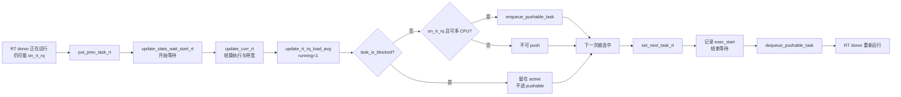

# RT 运行态交接详解：`put_prev_task_rt()` 与 `set_next_task_rt()`

> 源码基线：Linux 7.2-rc6，源码树 `E:\work\kernel\linux`  
> 源码位置：`set_next_task_rt()`：`kernel/sched/rt.c:1657-1681`；`put_prev_task_rt()`：`kernel/sched/rt.c:1728-1748`  
> 泛型接口：`kernel/sched/sched.h:2776-2810`；调度类注册：`kernel/sched/rt.c:2602-2611`  
> 一句话职责：旧 RT donor 离开运行位置时结算执行账、恢复等待/迁移资格；新 RT donor 占据运行位置时建立新时间基准、结束等待并撤销迁移资格。

这两个函数是一对强关联的 `sched_class` 回调，因此合并分析：

```text
旧 donor：put_prev_task_rt()       新 donor：set_next_task_rt()
          结算已运行时间                     记录新 exec_start
          开始等待统计                       结束等待统计
          更新 RT PELT                       必要时更新 RT PELT
          恢复 pushable 资格                 删除 pushable 资格
```

最重要的前置结论：**RT 当前任务通常仍留在 `rt_rq->active` 中。** 所以这里的“put prev / set next”不是普通意义上的“重新入队 / 从队列删除”，而是运行身份及其附属账本的交接。

---

## 一、大白话总览

### （a）为什么要设计这一对回调？

核心调度器选出下一个任务后，不能只改 `rq->curr`。旧任务已经运行了多久、新任务从何时开始计时、谁正在等待、谁可以被推到别的 CPU、RT 带宽是否已经耗尽，这些账都必须在切换边界上同步。

如果没有 `put_prev_task_rt()`：

- 旧任务最后一段运行时间可能漏记，`sum_exec_runtime` 和 RT bandwidth 失真；
- 仍可运行的旧任务不会重新成为等待者和 pushable 候选；
- RT PELT 不能在“刚结束运行”的准确时刻推进。

如果没有 `set_next_task_rt()`：

- 新任务缺少本轮运行的起点，下一次执行时间差无法正确计算；
- 已经运行的任务仍可能被 SMP push 逻辑当成可迁移候选；
- 等待统计可能把实际运行时间继续算成等待时间。

### （b）如果让我自己设计它，第一反应是什么？

#### 1. 一句话降级

这对函数就是一次值班交接：**旧值班员先结清工时并重新进入候班名单，新值班员登记上岗时间并从可调走名单撤下。**

#### 2. 最小模型

先忽略 SMP、RT bandwidth、PELT、task group、proxy execution 和统计开关，只保留两个时间点：

```text
时刻 t0                         时刻 t1                         时刻 t2
set_next(old)                   调度切换                        put_prev(new)
old.exec_start = t0             old → new                       结算 t2-new.exec_start
                               new.exec_start = t1
```

最小输入和输出是：

```text
输入：rq、旧任务 prev、新任务 next
核心数据：任务的执行起点、是否仍可运行、当前运行身份
交接结果：prev 的本轮运行账结清；next 获得新的计时起点
```

#### 3. 核心数据对象

| 对象/字段 | 类比 | 在交接中的角色 |
|---|---|---|
| `rq->donor` | 调度资格的持有人 | 普通调度时等同当前任务；proxy execution 时可能与 `rq->curr` 不同，RT 类记账围绕 donor 展开 |
| `p->se.exec_start` | 上岗打卡时间 | 虽然任务属于 RT 类，通用执行时间记账仍复用 `sched_entity` 中的时间戳 |
| `p->rt.on_rq` | 候选资格标志 | 表示 RT 实体仍在 RT 运行队列；运行并不必然令它离队 |
| `rq->avg_rt` | CPU 的 RT 活跃度账本 | 由 PELT 按时间衰减，反映该 CPU 最近是否在运行 RT 工作 |
| `p->pushable_tasks` | 可外派名单卡片 | 只允许非当前、可迁移、可运行且未被 proxy mutex 阻塞的 RT 任务进入 |
| `rq->rt.pushable_tasks` | 本 CPU 的 RT 外派候选表 | 按优先级组织，供 `push_rt_tasks()` 等 SMP 均衡逻辑使用 |
| `rt_rq->rt_time/runtime` | RT 配额账 | `update_curr_rt()`把本轮执行时间计入各层 RT group，必要时触发节流和重调度 |

#### 4. 真实复杂度从哪里来？

- **运行者不等于队列唯一成员**：RT 当前实体仍可挂在 `active.queue[prio]`，因此运行状态和 `on_rq` 是两个维度。
- **两套“当前任务”语义**：启用 proxy execution 后，`rq->donor` 提供调度策略和优先级，`rq->curr` 才是实际执行锁持有者。
- **SMP 迁移约束**：当前正在执行的任务不能同时由 push 路径迁移，交接时必须维护 `pushable_tasks`。
- **层级 RT 带宽**：旧 donor 的执行时间可能要沿 `sched_rt_entity` 父链计入多个 `rt_rq`。
- **时间信号不同**：执行时间使用 `rq_clock_task()`；RT PELT 使用 `rq_clock_pelt()`，二者服务于不同账本。
- **两种调用语境**：既有真正选中新任务的切换，也有调度属性修改时对同一运行任务做“拆下—修改—装回”。
- **外部锁约束**：回调自身不获取 `rq->lock`，调用者必须已经持有它，并已更新 rq 时钟。

#### 5. 如果自己实现，大概步骤

旧任务退出运行位置：

1. 若它仍在 RT 队列，开始记录“又在等 CPU”。
2. 用当前 rq 时钟减去 `exec_start`，结算本轮执行时间。
3. 把已运行区间计入 RT PELT；若启用 group bandwidth，再计入每层配额。
4. 若它是 proxy execution 下的被阻塞 donor，停止，不允许 push。
5. 若仍可运行且允许多个 CPU，把它加入 pushable 优先级表。

新任务进入运行位置：

1. 记录本轮 `exec_start`。
2. 若它仍在 RT 队列，结束等待统计。
3. 无条件从 pushable 表删除，保证运行者不能同时被迁移。
4. 若这是真正的一次选择交接（`first=true`），补齐跨调度类的 RT PELT 边界。
5. 若本 CPU 仍有其他 pushable RT 任务，挂入延迟 balance callback。

同步维护的不变量是：

```text
正在运行的 RT donor ∉ rq->rt.pushable_tasks

非阻塞 && on_rt_rq && nr_cpus_allowed > 1 的旧 RT donor
    → put_prev 后可以进入 rq->rt.pushable_tasks

每次退出前先结算旧 exec_start；每次进入时建立新 exec_start
```

#### 6. 源码阅读 checklist

- 这句是在切换“运行身份”，还是改变 `active` 队列成员资格？
- 统计的是刚刚结束的区间，还是即将开始的区间？
- `on_rt_rq()`为何只保护等待统计，不控制全部逻辑？
- `first` 是“任务第一次运行”，还是“这次调用来自真正的 pick 交接”？
- 为什么 PELT 在 put 时传 `running=1`，跨类 set 时却传 `running=0`？
- 为什么 blocked donor 必须在加入 pushable 表之前返回？
- 为什么 `nr_cpus_allowed == 1` 的任务不能成为 push 候选？
- 哪些动作立即完成，哪些只是登记 balance callback 延后执行？

### （c）它是怎么设计的？

设计者把所有调度类共同的切换协议放在核心层：核心通过 `sched_class.put_prev_task` 和 `sched_class.set_next_task` 做动态分派；各调度类只维护自己的账本。

RT 实现又把职责分成三类：

1. **时间边界**：`update_curr_rt()`关闭旧运行区间，`p->se.exec_start`打开新区间。
2. **状态统计**：等待统计与 RT PELT 在边界处切换。
3. **SMP 可迁移性**：旧任务恢复 pushable，新任务撤销 pushable；真正的 push 延后到 balance callback。

这样 pick 逻辑只负责“选谁”，这对回调负责“选中前后各项状态如何闭合”。

### （d）它处理哪些情况？

| 情况 | 触发条件 | 做法 | 原因 |
|---|---|---|---|
| 真正从 `prev` 切到 `next` | `next != prev`，核心以 `first=true` 调用 | put 旧任务，再 set 新任务，并处理 RT PELT/均衡 | 这是完整的运行权交接 |
| 仍是同一候选 | `next == prev` | `put_prev_set_next_task()`直接返回，两边都不调用 | 没有运行身份变化，不应制造虚假等待区间 |
| 运行任务属性被修改 | `sched_change_begin/end()`，set 包装器传 `first=false` | 暂时 put，修改/重入队后再 set；跳过首次选择副作用 | 恢复同一运行任务，不是一次新 pick |
| 从非 RT 类切入 RT | `first=true` 且旧 donor 类不是 RT | `set_next_task_rt()`以 `running=0`更新 RT PELT | 先把此前“RT 未运行”的时间推进到切换点 |
| RT 切到 RT | 旧 donor 也是 RT | put 已以 `running=1`推进 RT PELT；set 不重复推进 | 防止同一时间边界重复记账 |
| 旧 RT 仍可运行且可迁移 | `on_rt_rq && nr_cpus_allowed > 1` | 加入 pushable 表 | 它不再占 CPU，可被推往其他 CPU |
| 旧 donor 被 mutex 阻塞 | `task_is_blocked(p)` | 完成计时/PELT后直接返回 | proxy donor 留在 active 供捐赠优先级，但不能作为普通迁移候选 |
| 新任务开始运行 | 不论 `first` 值 | 更新 `exec_start`、结束等待、删除 pushable | 这些是运行身份的基本不变量 |

---

## 二、控制流骨架

### 2.1 `put_prev_task_rt()`

```text
put_prev_task_rt(rq, p, next)
│
├─ [p->rt 仍在 RT rq]
│    └─ 开始等待统计
│
├─ 结算 p 刚结束的执行区间，并处理 RT bandwidth
│
├─ 以 running=1 推进 rq->avg_rt
│
├─ [p 是 proxy execution 下的 blocked donor]
│    └─ 直接 return：不把阻塞 donor 加入可迁移表
│
├─ [p 仍在 RT rq 且允许在多个 CPU 上运行]
│    └─ 加入 rq->rt.pushable_tasks
│
└─ 函数结束：旧任务的运行账已闭合，必要时恢复迁移资格
```

`next` 参数在当前 RT 实现中没有使用。统一回调仍保留它，使其他调度类或未来实现能够依据接任者优化交接。

### 2.2 `set_next_task_rt()`

```text
set_next_task_rt(rq, p, first)
│
├─ 写入 p->se.exec_start，建立新运行区间起点
│
├─ [p->rt 仍在 RT rq]
│    └─ 结束等待统计
│
├─ 从 rq->rt.pushable_tasks 删除 p
│
├─ [first == false]
│    └─ 直接 return：这是恢复同一运行任务，跳过首次选择副作用
│
├─ [旧 donor 的调度类不是 RT]
│    └─ 以 running=0 推进 RT PELT 到切换点
│
└─ 若存在 pushable RT 任务，登记 push_rt_tasks balance callback
```

两个函数都没有循环和 `goto`。两个早退各自保护一个特殊不变量：blocked donor 不可 push；非首次 set 不重复触发类切换副作用。

---

## 三、Mermaid：运行身份、队列身份与 pushable 身份



图中三种身份不要混为一谈：

```text
on_rt_rq             是否属于 RT active 调度集合
rq->donor / rq->curr 是否拥有调度资格 / 实际占用 CPU
pushable_tasks        是否可由 RT SMP 均衡迁往别的 CPU
```

---

## 四、快速定位与宏观地位

### 4.1 快速定位

- 所属子系统：核心调度器 → RT 调度类 → 上下文切换边界与 SMP 负载均衡。
- `put_prev_task_rt()`注册到 `rt_sched_class.put_prev_task`。
- `set_next_task_rt()`注册到 `rt_sched_class.set_next_task`。
- 两者由泛型调度器间接调用，普通 `call_chain_up()`只看到函数自身；kernel-graph 的 indirect caller 查询确认了函数指针字段及调用点。
- 调用时核心已持有 `rq->lock`；`sched_class`定义中的锁注释明确列出 `__schedule: rq->lock`。
- 这对函数主要改变时间统计、PELT、RT bandwidth 与 pushable 表，不负责选择任务，也不负责把普通 RT 实体从 `active` 入队/出队。

### 4.2 所属层次

```text
┌──────────────────────────────────────────────────────────────┐
│ 外部事件：阻塞、唤醒抢占、时间片/优先级变化、主动 schedule   │
└──────────────────────────────┬───────────────────────────────┘
                               ▼
┌──────────────────────────────────────────────────────────────┐
│ __schedule()：锁定 rq、更新时间、选择 next                    │
└──────────────────────────────┬───────────────────────────────┘
                               ▼
┌──────────────────────────────────────────────────────────────┐
│ pick_next_task()/__pick_next_task()                           │
│ pick_task_rt() 选任务 → put_prev_set_next_task() 做交接       │
└──────────────────────────────┬───────────────────────────────┘
                               ▼
┌──────────────────────────────────────────────────────────────┐
│ [本文代码]                                                    │
│ put_prev_task_rt() ←→ set_next_task_rt()                      │
└──────────────┬──────────────────┬────────────────────────────┘
               ▼                  ▼
┌──────────────────────┐  ┌────────────────────────────────────┐
│ 执行时间/RT bandwidth│  │ schedstats / RT PELT / pushable    │
└──────────────────────┘  └────────────────┬───────────────────┘
                                           ▼
                          ┌────────────────────────────────────┐
                          │ balance callback → push_rt_tasks() │
                          └────────────────────────────────────┘
```

### 4.3 具体触发场景

1. **当 RT 任务被更高优先级任务抢占时**：时钟中断或唤醒路径设置重调度标志，随后进入 `preempt_schedule*()` → `__schedule()` → `pick_next_task()` → `put_prev_set_next_task()`，旧 RT donor 执行 put，新任务执行其所属类的 set。
2. **当 RT 任务主动阻塞或调用 `schedule()`时**：`schedule()` → `__schedule_loop()` → `__schedule()`。若旧任务已真正从 rq 移除，`on_rt_rq()`为假，因此不会开始等待统计或加入 pushable 表，但运行时间仍必须结算。
3. **当用户通过 `sched_setscheduler` / `sched_setattr`修改正在运行任务的策略或优先级时**：`__sched_setscheduler()`中的 `scoped_guard(sched_change, ...)`展开为 `sched_change_begin()` / `sched_change_end()`；运行任务先经 put 暂时退出类语义，修改后以 `set_next_task(..., false)`恢复。
4. **当 proxy execution 改变 donor 与实际执行者关系时**：`__schedule()`或 `proxy_reset_donor()`可能显式调用 put/set。blocked RT donor 保留在 active 中，但 put 的早退阻止它进入普通 pushable 表。

### 4.4 它解决什么问题？

这两个回调把四个必须一致的维度绑定在一个锁保护的切换边界：

| 维度 | 交接错误的后果 |
|---|---|
| 执行时间 | 调度统计、CPU 时间与带宽消耗漏算或重复算 |
| 等待时间 | 运行时间被算成等待，或真正等待区间丢失 |
| RT PELT | CPU RT 利用率信号在边界处不连续，影响容量/能耗相关判断 |
| pushable 表 | 正在运行或被阻塞的 donor 被并发迁移，或可迁移任务永远无法被 push |

---

## 五、完整调用链路

### 5.1 正常调度入口

kernel-graph 对 `put_prev_set_next_task()`的向上链确认了以下主要入口：

```text
schedule()/schedule_rtlock()/rt_mutex_schedule()
preempt_schedule()/preempt_schedule_irq()
schedule_idle()
do_task_dead()
  └── __schedule()                                  // kernel/sched/core.c:7103
        └── pick_next_task()
              └── __pick_next_task()                // kernel/sched/core.c:6144
                    ├── class->pick_task()
                    │     └── pick_task_rt()         // 若轮到 RT 类
                    └── put_prev_set_next_task()     // kernel/sched/sched.h:2797
                          ├── prev->sched_class->put_prev_task(..., next)
                          │     └── put_prev_task_rt() // prev 是 RT 时
                          └── next->sched_class->set_next_task(..., true)
                                └── set_next_task_rt() // next 是 RT 时
```

`__pick_next_task()`有两处调用 `put_prev_set_next_task()`：纯 fair 快路径在 `core.c:6173`，调度类遍历通路在 `core.c:6185`。RT 任务走后者。

### 5.2 `next == prev`为什么两边都不调用？

```c
if (next == prev)
	return;

prev->sched_class->put_prev_task(rq, prev, next);
next->sched_class->set_next_task(rq, next, true);
```

同一 donor 继续运行时，原有 `exec_start`仍然有效；强行 put/set 会人为制造一个零长度等待区间，还可能无意义地修改 pushable 表和安排 balance callback。

### 5.3 调度属性改变入口

```text
sched_setscheduler()/sched_setattr()                 // kernel/sched/syscalls.c
  └── __sched_setscheduler()                         // kernel/sched/syscalls.c:493
        └── scoped_guard(sched_change, p, flags)
              ├── sched_change_begin()               // kernel/sched/core.c:11251
              │     └── put_prev_task(rq, p)
              │           └── put_prev_task_rt(rq, p, NULL)
              ├── 修改 policy/prio/sched_class，必要时重新入队
              └── sched_change_end()                 // kernel/sched/core.c:11298
                    └── set_next_task(rq, p)
                          └── set_next_task_rt(rq, p, false)
```

这里 `first=false`非常关键：同一个运行任务只是为了安全修改调度属性而暂时执行 put/set 协议，不应被当成 `pick_next_task()`刚刚选中的新 donor。

### 5.4 proxy execution 补偿入口

```text
__schedule()                                         // core.c:7193-7224
  ├── rq_set_donor(rq, next)
  ├── [next 被阻塞] find_proxy_task() 找实际 owner
  └── [donor 未变但 curr 已变]
        ├── donor->sched_class->put_prev_task(rq, donor, donor)
        └── donor->sched_class->set_next_task(rq, donor, true)

proxy_reset_donor()                                  // core.c:3764
  ├── put_prev_set_next_task(rq, rq->donor, rq->curr)
  ├── rq_set_donor(rq, rq->curr)
  └── resched_curr(rq)
```

这说明在 7.2-rc6 中，分析这两个回调时不能把 `p`一律描述成物理上的 `rq->curr`；更准确的说法是：它是进行调度类记账的 donor，在非 proxy 情况下才与当前执行任务重合。

### 5.5 `set_next_task_rt()`向下调用

```text
set_next_task_rt()
  ├── rq_clock_task()                  // 取得任务运行时钟
  ├── on_rt_rq()                       // 读取 rt_se->on_rq
  ├── update_stats_wait_end_rt()       // 结束 schedstats 等待区间
  ├── dequeue_pushable_task()          // 删除迁移候选并更新 highest_prio.next/overload
  ├── rq_clock_pelt()                  // 取得 PELT 时钟
  ├── update_rt_rq_load_avg()          // 推进 rq->avg_rt
  └── rt_queue_push_tasks()            // 必要时登记 push_rt_tasks balance callback
```

### 5.6 `put_prev_task_rt()`向下调用

```text
put_prev_task_rt()
  ├── on_rt_rq()
  ├── update_stats_wait_start_rt()     // 开始 schedstats 等待区间
  ├── update_curr_rt()                 // 结算执行时间和层级 RT bandwidth
  │     ├── update_curr_common()
  │     ├── sched_rt_runtime_exceeded()
  │     ├── resched_curr()
  │     └── do_start_rt_bandwidth()
  ├── rq_clock_pelt()
  ├── update_rt_rq_load_avg()          // 以 running=1 推进 RT PELT
  ├── task_is_blocked()                // proxy execution 特殊状态
  └── enqueue_pushable_task()          // 加入 plist 并维护 overload
```

---

## 六、关键结构与字段

### 6.1 `struct sched_rt_entity`

kernel-graph 定位于 `include/linux/sched.h:621`：

| 字段 | 作用 | 与本文关系 |
|---|---|---|
| `run_list` | 挂入 `rt_prio_array.queue[prio]` | 说明运行 RT 实体仍可能留在 active 链表 |
| `timeout` / `watchdog_stamp` | RT 运行超时/看门狗相关状态 | 本文不直接修改，但依赖正确的运行时间边界 |
| `time_slice` | `SCHED_RR`剩余时间片 | put/set 不重置它，真正轮转由 tick/yield 路径处理 |
| `on_rq` | 实体是否属于 RT rq | 控制等待统计，以及 put 时能否成为 pushable |
| `on_list` | 是否实际挂在当前层链表 | 与 `on_rq`共同描述层级实体的队列状态，本文不直接写 |
| `back` | enqueue/dequeue 层级遍历辅助链 | 本文不使用 |
| `parent` / `my_q` / `rt_rq`（相关配置下） | RT group 层级关系 | `update_curr_rt()`沿实体层级累计 bandwidth |

### 6.2 `struct rq`与 `struct rt_rq`

| 字段 | 含义 | 谁在本文读写 |
|---|---|---|
| `rq->donor` | 当前调度资格捐赠者 | `update_curr_rt()`读取其调度类和 `rt`实体；核心在交接外围设置 |
| `rq->curr` | 实际在 CPU 上执行的任务 | 本文函数不直接读写；proxy execution 时可能不同于 donor |
| `rq->clock_task` | 排除部分非任务时间的运行时钟 | `rq_clock_task()`读取，用来写 `exec_start`和结算执行时间 |
| `rq->clock_pelt` | PELT 时间轴 | `rq_clock_pelt()`读取，推进 `avg_rt` |
| `rq->avg_rt` | RT 类的 `sched_avg` | `update_rt_rq_load_avg()`更新 |
| `rq->rt.pushable_tasks` | 按优先级排列的可迁移 RT 任务表 | set 删除，put 条件加入 |
| `rq->rt.highest_prio.next` | 最高优先级 pushable 任务的优先级缓存 | enqueue/dequeue pushable helper 更新 |
| `rq->rt.overloaded` | 此 CPU 是否进入 RT overload 集合 | pushable 表由空变非空或清空时维护 |
| `rt_rq->rt_time` | 当前周期已消耗的 RT 时间 | `update_curr_rt()`增加 |
| `rt_rq->rt_runtime` | 分配给该层 RT rq 的运行额度 | 与 `rt_time`比较决定是否节流 |
| `rt_rq->rt_runtime_lock` | 保护 bandwidth 运行时间账 | 在外层 rq 锁内嵌套获取 |

### 6.3 `task_struct`相关字段

| 字段 | 含义 | 不变量 |
|---|---|---|
| `p->sched_class` | 当前调度类 | 决定函数指针分派，也用于识别是否从非 RT 类切入 |
| `p->se.exec_start` | 本轮运行起点 | set 写，下一次 `update_curr_common()`消费 |
| `p->rt` | 内嵌 RT 调度实体 | 无需分配，可直接用 `&p->rt`取得 |
| `p->prio` | 内核有效优先级 | 初始化 pushable plist 节点并决定排列顺序 |
| `p->nr_cpus_allowed` | 允许 CPU 数量 | 大于 1 才有迁移到其他 CPU 的可能 |
| `p->pushable_tasks` | 任务在 RT pushable plist 中的节点 | set 删除，put 条件加入 |
| `p->blocked_on` | proxy execution 下等待的 mutex | 非空时 `task_is_blocked()`为真，不加入 pushable 表 |

---

## 七、`set_next_task_rt()`逐行详解

原始代码：

```c
static inline void set_next_task_rt(struct rq *rq, struct task_struct *p, bool first)
{
	struct sched_rt_entity *rt_se = &p->rt;
	struct rt_rq *rt_rq = &rq->rt;

	p->se.exec_start = rq_clock_task(rq);
	if (on_rt_rq(&p->rt))
		update_stats_wait_end_rt(rt_rq, rt_se);

	/* The running task is never eligible for pushing */
	dequeue_pushable_task(rq, p);

	if (!first)
		return;

	if (rq->donor->sched_class != &rt_sched_class)
		update_rt_rq_load_avg(rq_clock_pelt(rq), rq, 0);

	rt_queue_push_tasks(rq);
}
```

### 7.1 函数签名

```c
static inline void set_next_task_rt(struct rq *rq,
                                    struct task_struct *p,
                                    bool first)
```

- `rq`：当前 CPU 的运行队列，调用期间已持有它的锁。
- `p`：即将承担 RT 调度类运行身份的 donor；通常也是 next/curr。
- `first`：不是“该任务生命周期中第一次运行”。`true`表示来自一次真正的选择交接或等价补偿，需要执行首次 set 的外围副作用；`false`表示属性修改后恢复同一运行任务。
- 返回 `void`：它不决定是否能运行，只维护已由核心确定的结果。

### 7.2 取得嵌入实体与顶层 RT rq

```c
struct sched_rt_entity *rt_se = &p->rt;
struct rt_rq *rt_rq = &rq->rt;
```

`p->rt`是任务自带的 RT 实体，不需要 `container_of()`。`rq->rt`是这个 CPU 顶层 RT 运行队列；等待统计 helper 能在启用 group scheduling 时进一步找到正确统计对象。

### 7.3 打开新的运行时间区间

```c
p->se.exec_start = rq_clock_task(rq);
```

即使是 RT 任务，通用执行时间核算仍复用 `p->se.exec_start`。下一次 `update_curr_common(rq)`会用当前 `rq_clock_task()`减去它，得到本轮 `delta_exec`。

这里必须先建立边界。否则下一次 put/tick 可能把上一次运行残留时间重复计入。

### 7.4 结束等待统计

```c
if (on_rt_rq(&p->rt))
	update_stats_wait_end_rt(rt_rq, rt_se);
```

`on_rt_rq()`只是返回 `rt_se->on_rq`。条件成立表示任务是从可运行 RT 集合中被选中的，此前处于“在队列上等 CPU”阶段，现在要结束等待区间。

若任务并不在 rq 上，例如特殊恢复路径，就不能凭空关闭一个等待区间。`update_stats_wait_end_rt()`自身还会检查 `schedstat_enabled()`；统计关闭时几乎为空操作。

### 7.5 无条件撤销 pushable 资格

```c
dequeue_pushable_task(rq, p);
```

源码注释给出核心不变量：正在运行的任务永远不能被 push。helper 不只删除 `p->pushable_tasks`，还会：

- 若表仍非空，用首节点刷新 `rq->rt.highest_prio.next`；
- 若表变空，把该缓存设为 `MAX_RT_PRIO - 1`；
- 若 CPU 曾标记 overloaded，调用 `rt_clear_overload()`并清零标志。

之所以不在这里直接执行迁移，是因为当前任务正在占用该 CPU，迁移需要更复杂的双 rq 锁和 CPU 选择流程。

### 7.6 `first=false`早退

```c
if (!first)
	return;
```

早退之前仍完成三项基础动作：新 exec 起点、等待结束、禁止 push。早退只跳过“真正 pick 新 donor”才需要的 PELT 边界和 balance callback。

典型来源是：

```c
static inline void set_next_task(struct rq *rq, struct task_struct *next)
{
	next->sched_class->set_next_task(rq, next, false);
}
```

`sched_change_end()`使用该包装器恢复正在运行且属性刚被修改的任务。

### 7.7 跨调度类时补齐 RT PELT 空闲区间

```c
if (rq->donor->sched_class != &rt_sched_class)
	update_rt_rq_load_avg(rq_clock_pelt(rq), rq, 0);
```

`update_rt_rq_load_avg(now, rq, running)`会把从上次更新时间到 `now`的区间按 `running`状态推进到 `rq->avg_rt`。

- 旧 donor 不是 RT：这段刚结束的历史区间中 RT 没有运行，所以传 `0`。
- 旧 donor 是 RT：它的 `put_prev_task_rt()`已经以 `running=1`推进到同一切换边界，此处不能重复更新。

注意调用顺序：`put_prev_set_next_task()`调用 set 时核心尚未把 donor 更新成 next，因此这里的 `rq->donor`仍代表旧 donor，正好可用于判断旧区间属于哪个类。

### 7.8 安排后续 RT push

```c
rt_queue_push_tasks(rq);
```

helper 先检查 `has_pushable_tasks(rq)`；为空就返回。非空时通过 `queue_balance_callback()`登记 `push_rt_tasks`，而不是在 set 回调里立即迁移。

延后执行的价值是：当前仍处于核心选任务和 rq 锁临界区，先完成本地运行身份交接，再在统一 balance callback 阶段处理可能涉及其他 CPU 的迁移，锁关系更清晰。

---

## 八、`put_prev_task_rt()`逐行详解

原始代码：

```c
static void put_prev_task_rt(struct rq *rq, struct task_struct *p,
                             struct task_struct *next)
{
	struct sched_rt_entity *rt_se = &p->rt;
	struct rt_rq *rt_rq = &rq->rt;

	if (on_rt_rq(&p->rt))
		update_stats_wait_start_rt(rt_rq, rt_se);

	update_curr_rt(rq);

	update_rt_rq_load_avg(rq_clock_pelt(rq), rq, 1);

	if (task_is_blocked(p))
		return;

	if (on_rt_rq(&p->rt) && p->nr_cpus_allowed > 1)
		enqueue_pushable_task(rq, p);
}
```

### 8.1 函数签名

```c
static void put_prev_task_rt(struct rq *rq,
                             struct task_struct *p,
                             struct task_struct *next)
```

- `p`：退出 RT 运行身份的旧 donor。
- `next`：核心选出的接任 donor；RT 当前实现未使用，因此 `sched_change_begin()`可传 `NULL`。
- “put”不是 `enqueue_task_rt()`的同义词：它不会把 `p->rt.run_list`重新插入 active，因为仍 runnable 的当前 RT 实体本来就留在那里。

### 8.2 重新打开等待区间

```c
if (on_rt_rq(&p->rt))
	update_stats_wait_start_rt(rt_rq, rt_se);
```

只有旧任务仍属于可运行 RT 集合，离开 CPU 后才是在“等待再次运行”。若它因睡眠/退出已被 `dequeue_task_rt()`移除，`on_rq`为假，此后不是 runnable wait，不能计等待时间。

顺序上先标记等待起点，再结算执行时间不会造成冲突：两者读取不同的时间账本，且都在同一个 rq 锁临界区中取当前时钟边界。

### 8.3 结算旧 donor 的执行时间与带宽

```c
update_curr_rt(rq);
```

其关键路径是：

```c
donor = rq->donor;
if (donor->sched_class != &rt_sched_class)
	return;

delta_exec = update_curr_common(rq);
if (delta_exec <= 0)
	return;
```

`update_curr_common()`根据 `exec_start`结算通用执行时间。启用 `CONFIG_RT_GROUP_SCHED`与 RT bandwidth 后，`update_curr_rt()`还会沿 `for_each_sched_rt_entity(rt_se)`逐层：

1. 找到实体所属 `rt_rq`；
2. 若额度不是 `RUNTIME_INF`，获取 `rt_runtime_lock`；
3. 执行 `rt_rq->rt_time += delta_exec`；
4. 检查 `sched_rt_runtime_exceeded()`；
5. 若超额，`resched_curr(rq)`，解锁后启动 bandwidth 周期定时器。

这解释了为什么 put 不能只维护链表：它是旧运行区间最后一个可靠的结账点。

### 8.4 以 `running=1`推进 RT PELT

```c
update_rt_rq_load_avg(rq_clock_pelt(rq), rq, 1);
```

这里已经进入 put，为什么仍传 `1`？因为 PELT 更新描述的是**从上一次更新时间到当前调用时刻的刚刚过去区间**。这段时间旧 RT donor 一直在运行，所以必须按 running 记账；它不是在预测 put 之后的状态。

### 8.5 blocked donor 早退

```c
if (task_is_blocked(p))
	return;
```

`task_is_blocked()`在 proxy execution 未启用时恒为 false；启用时检查 `p->blocked_on`。

这类 RT donor可能因为等待 mutex 而无法亲自执行，但仍保留在 active rq 中，向锁 owner捐赠调度资格。它不能加入普通 pushable 表，否则 RT push 逻辑可能绕开 owner 链迁移一个并不能独立运行的 donor，破坏 proxy execution 的关系。

早退放在 `update_curr_rt()`与 PELT之后，说明“是否 blocked”只影响迁移资格，不免除已经发生的运行/捐赠区间记账。

### 8.6 条件恢复 pushable 资格

```c
if (on_rt_rq(&p->rt) && p->nr_cpus_allowed > 1)
	enqueue_pushable_task(rq, p);
```

两个条件缺一不可：

- `on_rt_rq`：任务仍 runnable；已出队任务没有可迁移的执行需求。
- `nr_cpus_allowed > 1`：至少存在另一个允许 CPU；单 CPU 亲和性任务无处可推。

`enqueue_pushable_task()`先删除可能存在的旧 plist 节点，再按当前 `p->prio`重新初始化和加入。这种“删后重建”同时适配优先级刚变化的场景。随后更新 `highest_prio.next`，并在必要时通过 `rt_set_overload()`把当前 CPU加入 root-domain 的 RT overload 集合。

---

## 九、关键设计决策

### 9.1 为什么 RT 当前任务留在 active 队列？

RT 的 `active`队列表达“可运行实体及同优先级顺序”，运行身份由核心另外维护。让当前任务继续留队有两个好处：继续运行无需反复出队/入队；同优先级 FIFO/RR 的头部关系由专门的轮转路径改变。

代价是必须另设 `pushable_tasks`并明确排除当前运行者。本文两个回调正是维护这条派生不变量的边界。

### 9.2 为什么先 put 再 set？

因为同一切换时刻首先是旧区间的终点，其次才是新区间的起点：

```text
旧 exec_start ────── running=旧类 ────── 切换点 ────── running=新类 ──▶
                    put 关闭旧区间       set 打开新区间
```

反过来会使 `rq->donor`、PELT运行状态和执行时间基准在边界上含糊，尤其无法正确判断“刚结束的区间是否属于 RT”。

### 9.3 为什么 `first`只控制后半段？

无论新任务来自真正 pick，还是属性修改后的恢复，只要它承担运行身份，就必须设置 `exec_start`、结束等待并从 pushable 删除。只有“进入新的选择结果”才需要处理跨类 PELT边界和安排剩余 RT 任务的 push。因此早退位于这三项基本操作之后。

### 9.4 为什么 push 使用单独 plist，而不扫描 active？

`active`包含当前运行者、不可迁移任务，以及 proxy blocked donor。每次均衡都扫描所有优先级链表成本更高，还要重复过滤。维护一个按优先级排序的派生表，可以快速找到最高优先级可迁移候选；代价是在 enqueue/dequeue/put/set 边界严格同步。

### 9.5 为什么不在 `set_next_task_rt()`中立即 push？

实际 push 可能选择目标 CPU、获取多个 rq 锁或触发 stopper 协作。set 回调位于本地 pick 临界路径，立即执行会扩大锁区并增加锁顺序复杂度。`queue_balance_callback()`把动作延后到核心允许的平衡阶段，同时保证同一 callback 不被重复排队。

### 9.6 为什么回调不自行加 `rq->lock`？

选择、put、set 和相关字段更新必须是一个不可分割事务。若每个回调自行解锁/加锁，中间就可能被唤醒、迁移和优先级变化观察到半完成状态。统一由核心持锁既缩短代码，也建立一致的锁顺序；`rq_clock_task()`和 `rq_clock_pelt()`内部还带有持锁/时钟已更新断言。

---

## 十、容易混淆的概念

### 10.1 `put_prev_task_rt()`、`dequeue_task_rt()`不是一回事

| 函数 | 语义 | 是否仍 runnable | 是否维护 active 队列 |
|---|---|---|---|
| `put_prev_task_rt()` | 不再占据 RT 运行身份 | 可能是 | 通常不改变 active 成员资格 |
| `dequeue_task_rt()` | 从 RT 可运行集合撤销实体 | 否，或暂时为属性修改拆下 | 会更新层级队列、位图和计数 |

调度切换时，如果旧任务只是被抢占，它仍 runnable，只调用 put 即可；如果它睡眠，核心会先走 deactivate/dequeue，再在交接时调用 put 结清运行账。

### 10.2 `schedstats`等待统计与 PELT不是同一件事

- `update_stats_wait_start/end_rt()`面向任务/实体的可观测等待时间，受 `schedstat_enabled()`控制。
- `update_rt_rq_load_avg()`面向 CPU rq 的衰减平均信号，更新 `rq->avg_rt`。
- `update_curr_rt()`面向当前 donor 的精确执行时间与 RT bandwidth。

三者都在切换边界出现，但回答的是三个不同问题：等了多久、CPU最近有多忙、实际运行/消耗了多久。

### 10.3 `first`的准确含义

可用调用点反推：

| 调用点 | 传值 | 含义 |
|---|---:|---|
| `put_prev_set_next_task()` | `true` | 核心 pick 后完成一次真正交接 |
| `__schedule()`的 proxy 补偿 | `true` | donor虽相同但实际 curr 变化，需要补做运行边界副作用 |
| `set_next_task()`包装器 | `false` | `sched_change_end()`恢复同一运行任务 |

因此不要把它解释成“第一次调度到这个 task”，也不要简单等同于 `prev != next`；它描述的是**本次 set 调用是否承担一轮选择交接的首次设置职责**。

### 10.4 `rq->donor`与 `rq->curr`

普通内核路径中二者通常相同。proxy execution允许被 mutex阻塞的高优先级任务作为 donor，而真正运行其锁 owner：

```text
donor：决定采用哪个调度类、优先级和运行资格
curr ：真正获得 CPU、执行指令的任务
```

Linux 7.2-rc6 的 `update_curr_rt()`明确读取 `rq->donor`，所以本文以“RT donor 的运行态交接”表述比单纯说“curr 切换”更准确。

---

## 十一、把它们与前后 RT 生命周期串起来

```text
任务变为 runnable
  └── enqueue_task_rt()
        ├── 进入层级 rt_rq / active 位图链表
        └── 非当前且可迁移时可能进入 pushable

核心选择 RT 候选
  └── pick_task_rt()
        └── _pick_next_task_rt()
              └── pick_next_rt_entity()

运行身份交接
  └── put_prev_set_next_task()
        ├── put_prev_task_rt(prev)
        │     ├── 结算执行/带宽/PELT
        │     └── 必要时恢复 pushable
        └── set_next_task_rt(next, true)
              ├── 建立 exec_start、结束等待
              ├── 删除 pushable
              └── 安排其他候选的后续 push

任务真正阻塞/退出
  └── dequeue_task_rt()
        └── 从 active、层级计数及 pushable 等结构撤销
```

这个顺序也解释了两个看似反常的现象：

1. pick 只返回任务，不负责把它从 active 删除；set 专门撤销它的 pushable 资格。
2. put 不负责重新插入 active；它只把仍 active 的旧任务恢复成“等待且可被迁移”的非运行候选。

---

## 十二、总结

`put_prev_task_rt()`和 `set_next_task_rt()`不是简单的“旧任务入队、新任务出队”，而是 RT 调度类在运行权边界上的成对记账协议：

```text
put_prev_task_rt
  = 开始等待
  + 关闭旧执行时间区间
  + 结算 RT bandwidth
  + 以 running=1 推进 RT PELT
  + 条件恢复 pushable 资格

set_next_task_rt
  = 打开新执行时间区间
  + 结束等待
  + 无条件撤销 pushable 资格
  + first 时补齐跨类 PELT边界
  + 延后安排其他 RT 任务的 push
```

掌握这对函数时应牢牢记住四条不变量：

1. **运行中的 RT 实体仍可能 `on_rt_rq`，但绝不能在 `pushable_tasks`中。**
2. **put 结算的是刚刚过去的运行区间，因此 PELT传 `running=1`。**
3. **set 的 `first`不是任务第一次运行，而是本次是否承担真正 pick 交接的首次设置职责。**
4. **在 proxy execution 内核中，回调参数更准确地代表 donor，不一定等于物理 `rq->curr`。**
