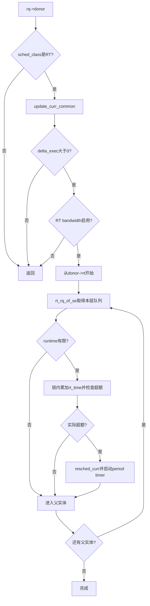

# `update_curr_rt()` RT 运行时间与带宽记账详解

> 源码基线：Linux 7.2-rc6，源码树 `E:\work\kernel\linux`  
> 源码位置：`kernel/sched/rt.c:974-1008`  
> 一句话职责：先结算当前 RT donor 的精确执行时间，再把同一段时间沿 RT task-group 层级计入带宽账，发现超额时节流并请求重新调度。

---

## 一、大白话总览

### （a）为什么需要它？

RT 任务从 `exec_start`之后到底运行了多久，不能只等任务退出时再统计。调度 tick、出队和切换旧任务时都需要及时“结账”，否则任务 CPU 时间、cgroup CPU 时间以及 RT bandwidth 都会漏算。

RT bandwidth 的目的可以先理解为：**在一个周期中限制 RT 工作最多占用多少 CPU 时间，为非 RT 工作保留生存空间。** 如果没有这层检查，一个失控的 `SCHED_FIFO`任务可能永久占据 CPU。

### （b）如果让我自己设计

#### 1. 一句话降级

`update_curr_rt()`就是给当前 RT donor 打一次阶段性工时单，并逐级把这笔工时记到它所属组织的配额账上。

#### 2. 最小模型

```text
donor.exec_start = 100
rq_clock_task     = 130
delta_exec        = 30

任务执行账 += 30
RT 配额已用 += 30
若 已用 > 配额 → 标记节流 + 请求重新选择任务
```

输入是已锁定的 `rq`；出口没有返回值，但任务运行统计、`rt_rq->rt_time`、节流状态和 `need_resched`可能发生变化。

#### 3. 核心数据对象

| 对象 | 角色 |
|---|---|
| `rq->donor` | 本次由哪个任务提供调度策略与优先级；proxy execution 下不一定等于 `rq->curr` |
| `donor->se.exec_start` | 本轮运行区间的起点，由通用 `update_se()`消费并重置 |
| `sched_rt_entity`父链 | 把叶子 donor 连接到各层 RT task group |
| `rt_rq->rt_time` | 当前周期已经消费的 RT 时间 |
| `rt_rq->rt_runtime` | 当前 `rt_rq`获配的运行额度，`RUNTIME_INF`表示无限 |
| `rt_rq->rt_runtime_lock` | 在外层 rq 锁内保护该层运行额度与消费账 |
| `rt_bandwidth.rt_period_timer` | 周期性补充/重置 RT 运行额度的高精度定时器 |

#### 4. 真实复杂度来源

- proxy execution 使记账对象是 `donor`而不一定是物理 `curr`。
- 精确任务时间和 RT bandwidth 是两层账：前者总要更新，后者受配置和 sysctl 控制。
- RT group 具有父子层级，同一段 `delta_exec`必须计入每一层额度。
- runtime 可以无限、可以大于等于 period，也可能通过 SMP runtime sharing 获得补充。
- PI boost 任务不能被零配额 group 永久饿死，所以“标记 throttled”和“实际不可运行”并非完全相同。
- `rt_rq->rt_runtime_lock`与 `rt_bandwidth->rt_runtime_lock`是不同锁，启动定时器放在前者解锁后。

#### 5. 如果自己实现

1. 验证当前 donor 确实属于 RT 类。
2. 用通用时间函数结算 `delta_exec`；无正向时间就结束。
3. 若未启用 RT bandwidth，只保留通用执行统计并结束。
4. 沿 `sched_rt_entity`父链遍历各级 `rt_rq`。
5. 对有限额度的每一级加锁、累加 `rt_time`、检查是否超额。
6. 超额且实际需要节流时，把对应 group 从可调度层级撤下，并设置当前 CPU 重调度。
7. 解开每级运行时锁后，确保周期 hrtimer 已启动，以便未来补充额度。

#### 6. 阅读 checklist

- 第一个早退是否会漏掉通用任务运行时间？
- 为什么 `update_curr_common()`位于 bandwidth 开关之前？
- `delta_exec <= 0`是错误还是允许出现的重复更新？
- 为什么同一份 `delta_exec`要沿父链重复累加？
- `RUNTIME_INF`、`runtime >= period`和零 runtime分别意味着什么？
- 哪把锁保护 `rt_time`，哪把锁保护 period timer？
- 超额为什么既要节流，又要 `resched_curr()`？

### （c）设计思路

它采用“通用精确记账在前，RT策略记账在后”的分层设计。`update_curr_common()`复用所有调度类共享的执行时间基础设施；RT 私有部分只处理 group bandwidth。这样关闭 bandwidth 时，任务 CPU 时间仍然正确。

### （d）主要情况

| 条件 | 动作 | 原因 |
|---|---|---|
| donor 不是 RT | 立即返回 | 不能把非 RT 区间计入 RT 类 |
| `delta_exec <= 0` | 返回 | 没有新时间需要计账 |
| bandwidth 未启用 | 保留通用执行统计后返回 | sysctl允许 RT 不限时运行 |
| 某层 runtime 无限 | 跳过该层锁和超额检查 | 没有额度上限 |
| 有限且未超额 | 累加后继续父层 | 正常消耗预算 |
| 超额且可实际节流 | 撤下 RT rq、请求重调度、启动周期定时器 | 当前任务不能继续占用 RT 额度 |
| 零额度但因 boost 获得运行 | 清零异常累计，不真正饿死 boost 链 | 避免优先级继承死锁 |

---

## 二、控制流骨架

```text
update_curr_rt(rq)
│
├─ 取得 rq->donor
├─ [donor 不是 RT 类]
│    └─ return：当前区间不属于 RT
│
├─ update_curr_common()结算精确执行时间
├─ [delta_exec <= 0]
│    └─ return：没有新增运行时间
│
├─ [未编译 CONFIG_RT_GROUP_SCHED]
│    └─ 函数结束：只保留通用执行统计
│
├─ [RT bandwidth关闭]
│    └─ return：不进行配额核算
│
├─ 【遍历 donor 的每一级 sched_rt_entity】
│    ├─ 找到该实体所属 rt_rq
│    ├─ [runtime == RUNTIME_INF]
│    │    └─ 跳过该层，继续循环
│    └─ [有限 runtime]
│         ├─ 锁住 rt_rq->rt_runtime_lock
│         ├─ rt_time += delta_exec
│         ├─ 检查并可能执行 runtime sharing / throttling
│         ├─ [实际超额] resched_curr(rq)
│         ├─ 解锁
│         └─ [实际超额]启动该 group 的 period hrtimer
│
└─ 所有层级的本轮带宽账完成
```

---

## 三、Mermaid：一段运行时间如何记到层级配额



---

## 四、宏观定位与触发场景

```text
调度时钟 / 阻塞出队 / 上下文切换
  └── RT 调度类入口
        ├── task_tick_rt()
        ├── dequeue_task_rt()
        └── put_prev_task_rt()
              └── [update_curr_rt()]
                    ├── update_curr_common()：精确任务时间
                    └── sched_rt_runtime_exceeded()：RT配额与节流
```

具体场景：

1. 当调度 tick 到来时，`task_tick_rt()`先调用它结算截至本 tick 的运行时间，再处理 watchdog 和 RR 时间片。
2. 当 RT 任务睡眠、退出或因属性修改而出队时，`dequeue_task_rt()`在改变队列状态前先结清当前区间。
3. 当核心把 RT donor 放回时，`put_prev_task_rt()`调用它关闭旧运行区间。
4. 当其他代码通过 `sched_class.update_curr`查询当前任务运行时间时，`rt_sched_class.update_curr`也注册为该函数；kernel-graph确认注册点为 `rt.c:2629`。

如果该函数漏记或重复记账，会造成任务 CPU 时间、cgroup CPU 时间和 RT quota同时失真；严重时 RT group不会按期节流，或者被过早节流。

---

## 五、完整调用链

### 5.1 向上

```text
调度 tick
  └── task_tick_rt()                    // kernel/sched/rt.c:2541
        └── update_curr_rt()

任务阻塞/退出/调度属性变更
  └── dequeue_task_rt()                 // kernel/sched/rt.c:1455
        └── update_curr_rt()

运行权交接
  └── put_prev_task_rt()                // kernel/sched/rt.c:1728
        └── update_curr_rt()
```

### 5.2 向下

```text
update_curr_rt()
  ├── update_curr_common()
  │     └── update_se(rq, &rq->donor->se)
  ├── rt_bandwidth_enabled()
  ├── rt_rq_of_se()
  ├── sched_rt_runtime()
  ├── raw_spin_lock(rt_runtime_lock)
  ├── sched_rt_runtime_exceeded()
  │     ├── balance_runtime()
  │     ├── rt_rq_throttled()
  │     └── sched_rt_rq_dequeue()
  ├── resched_curr()
  ├── raw_spin_unlock(rt_runtime_lock)
  └── do_start_rt_bandwidth()
        └── hrtimer_start_expires()
```

---

## 六、逐行详解

```c
static void update_curr_rt(struct rq *rq)
{
	struct task_struct *donor = rq->donor;
	s64 delta_exec;
```

这里故意使用 `rq->donor`。普通路径 donor 等于 curr；proxy execution 下，高优先级阻塞者提供调度资格，锁 owner可能是实际 `rq->curr`。

```c
	if (donor->sched_class != &rt_sched_class)
		return;
```

这是类别边界保护。调度核心和 proxy路径可能在 donor切换附近调用更新函数，必须确认刚结束的区间确实按 RT 类记账。

```c
	delta_exec = update_curr_common(rq);
	if (unlikely(delta_exec <= 0))
		return;
```

Linux 7.2-rc6 中 `update_curr_common()`是：

```c
return update_se(rq, &rq->donor->se);
```

`update_se()`使用 `rq_clock_task()`结算 `exec_start`以来的时间，并更新运行统计、group CPU time、mm/cgroup账。`delta_exec <= 0`常见于同一时钟点的重复更新或时钟未推进，不值得进入昂贵的层级锁循环。

```c
#ifdef CONFIG_RT_GROUP_SCHED
	struct sched_rt_entity *rt_se = &donor->rt;

	if (!rt_bandwidth_enabled())
		return;
```

注意通用时间已经在开关判断前更新。`rt_bandwidth_enabled()`检查 `sysctl_sched_rt_runtime >= 0`；负值表示关闭限制。

```c
	for_each_sched_rt_entity(rt_se) {
		struct rt_rq *rt_rq = rt_rq_of_se(rt_se);
		int exceeded;
```

叶子任务消耗的时间同时属于其直接 task group、父 group，直到顶层，因此每层都要记同一个 `delta_exec`。这不是重复计算，而是分层预算的包含关系。

```c
		if (sched_rt_runtime(rt_rq) != RUNTIME_INF) {
			raw_spin_lock(&rt_rq->rt_runtime_lock);
			rt_rq->rt_time += delta_exec;
```

无限额度无需加锁和检查。有限额度必须在 `rt_runtime_lock`内累加；该 raw spinlock按结构注释嵌套在已经持有的 rq 锁里面。

```c
			exceeded = sched_rt_runtime_exceeded(rt_rq);
			if (exceeded)
				resched_curr(rq);
```

检查函数可能先尝试从其他 CPU平衡 runtime，再判断 `rt_time > runtime`。如果该层实际被节流，它会从上层可选结构撤下并返回 1。当前 donor已不再具有继续运行资格，所以必须设置重调度标志。

`rt_rq_throttled()`实际返回：

```c
rt_rq->rt_throttled && !rt_rq->rt_nr_boosted
```

即存在 PI boost实体时，即使账面超额，也不会让锁依赖链被节流到无法前进。

```c
			raw_spin_unlock(&rt_rq->rt_runtime_lock);
			if (exceeded)
				do_start_rt_bandwidth(sched_rt_bandwidth(rt_rq));
```

先释放每 CPU/每 group rq 的运行时锁，再获取 `rt_bandwidth`自己的锁启动 hrtimer，避免不必要的双锁嵌套。定时器负责推进下个周期并补充可运行额度。

---

## 七、关键设计决策

1. **为何用 `>`而不是 `>=`判超额**：`rt_time == runtime`仍表示精确用完；只有继续超过才进入超额处理，具体边界由 tick/调度事件推进。
2. **为何 `runtime >= period`不节流**：额度覆盖整个周期或更多，相当于没有为非 RT工作保留时间。
3. **为何先尝试 `balance_runtime()`**：启用 RT runtime sharing时，其他 CPU可能有未使用额度；先借额度比立即节流更充分利用系统。
4. **为何超额后还启动 timer**：节流只解决当前周期，period hrtimer负责未来解除节流；没有补充事件，任务会永久停住。
5. **为何本函数不更新 RT PELT**：精确执行时间和衰减平均是不同账本，调用者 `task_tick_rt()`、`put_prev_task_rt()`在合适边界单独调用 `update_rt_rq_load_avg()`。

---

## 八、总结

```text
update_curr_rt
  = 通用精确执行时间结算
  + RT group逐层配额扣账
  + 超额时撤销可运行资格
  + 请求重新调度
  + 确保周期补充定时器运行
```

最关键的顺序是不变的：**先无条件结算通用执行时间，再按配置决定是否做 RT bandwidth；每层锁内判断节流，锁外启动该层 bandwidth timer。**

